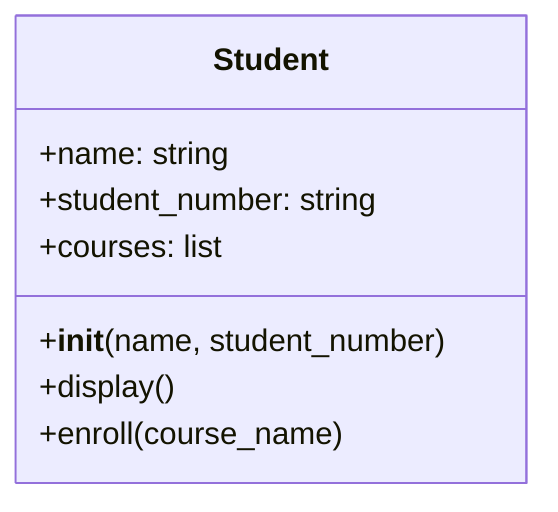
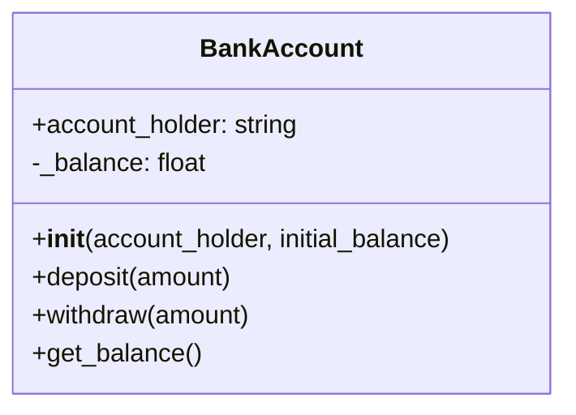
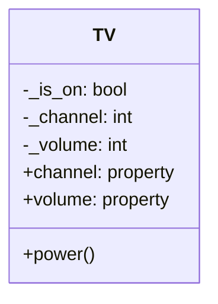
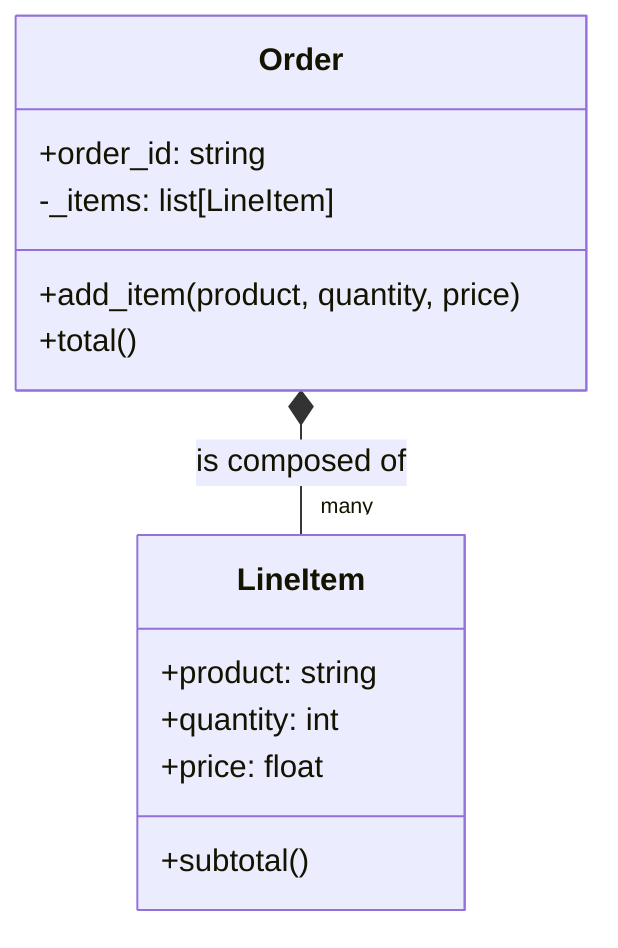
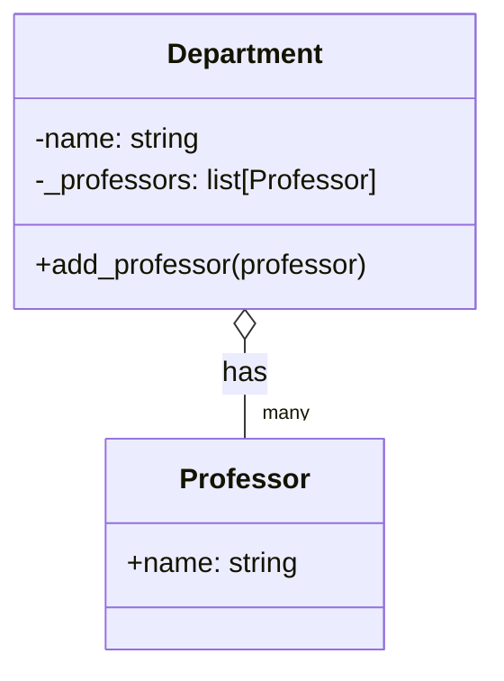
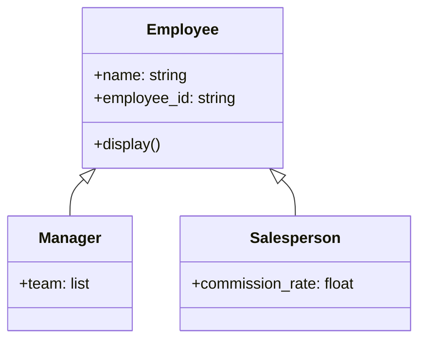
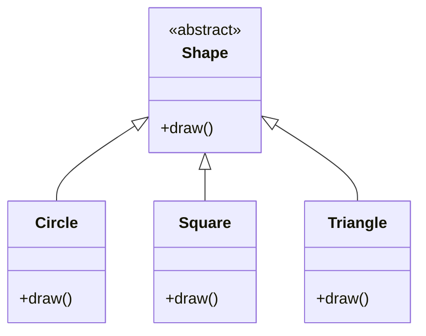
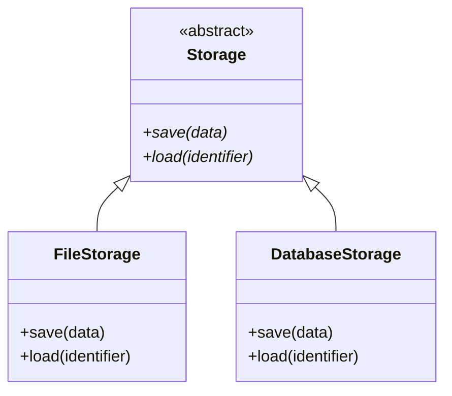

# Introduction to Object-Oriented Programming in Python

This document provides an overview of Object-Oriented Programming (OOP) in Python.

---

## 1. Introduction to Object-Oriented Programming

Object-Oriented Programming is a programming paradigm centered around the
concept of "objects". These objects can contain data in the form of fields
(often known as attributes or properties) and code in the form of procedures
(often known as methods).

### Why Use Object-Oriented Programming?

Procedural programming, which is a list of instructions for the computer to
follow in a sequence. While effective for this approach can becoume difficult to
manage as applications grow in size and complexity. When data and functions are
loosely connected and a change in one part of the program can have unintended
consequences in another with managing there interaction.

Object-Oriented Programming was developed to address these challenges. Its has a
number of goals:

1.  **Managing Complexity**: OOP helps manage the complexity of large software
    systems by breaking them down into smaller, self-contained, and manageable
    pieces (objects). Each object has its own data and behaviors, making the
    overall system easier to understand and maintain.

2.  **Making Code Reusable (Don't Repeat Yourself - DRY)**: Inheritance and
    composition allow developers to reuse existing code instead of writing it
    from scratch. You can create a general class and then create more
    specialized versions of it, saving time and reducing the chance of errors.

3.  **Improving Code Maintainability and Scalability**: Because code is
    organized into logical objects, it's easier to find and fix bugs. When you
    need to add new features, you can often add new objects or extend existing
    ones without disturbing the parts of the system that already work, making
    the software easier to scale.

4.  **Modeling the Real World**: OOP allows developers to model real-world
    entities and their interactions in an intuitive way. Whether you're building
    a banking application (`Customer`, `Account`), a game (`Player`, `Enemy`),
    or a simulation, thinking in terms of objects makes the design process more
    natural.

5.  **Data Protection**: Encapsulation helps protect data from unintended
    modification by restricting object attribute and method access.

In essence, OOP provides a structured approach to programming that aims to
produce organized, reusable, and maintainable code.

### Fundamental OOP Concepts

- **Modelization**: Describing an object by its essential characteristics for a
  specific context.
- **Encapsulation**: Bundling data and methods that operate on the data within a
  single unit (a class) and restricting access to some of the object's
  components.
- **Abstraction**: Hiding complex implementation details and showing only the
  necessary features of an object.
- **Inheritance**: A mechanism for creating new classes that reuse, extend, and
  modify the behavior defined in other classes.
- **Polymorphism**: The ability of an object to take on many forms, allowing a
  single interface to represent different underlying forms (data types).

---

## 2. Classes and Objects in Python

### What are Classes and Objects?

#### Class

A blueprint or template for creating objects. It defines a set of attributes and
methods that the created objects will have. For example, the blueprint of a car
is a class.

#### Object (or Instance)

A specific "thing" created from a class. If `Car` is a class, a specific 2023
red Toyota Camry is an object. It has its own state (it's red, has a specific
VIN) but shares the behavior of all cars (it can drive, brake, etc.).

### Why?

Without classes, you'd manage related data and functions separately. Imagine
tracking multiple students using separate lists for names, IDs, and grades. This
is cumbersome and error-prone. Classes bundle a student's data (`name`, `id`)
and the functions that work on that data (`calculate_gpa`, `enroll_in_course`)
into a single, neat `Student` unit. This makes code more organized, reusable,
and easier to reason about.

### Use Case: A `Student` Class

A `Student` class models a real-world entity by grouping studeent data
(attributes) and behaviors (methods).

```python
class Student:
  # The __init__ method is the initializer, called after a new object is created.
  def __init__(self, name, student_number):
    # 'self' refers to the current instance of the class.
    # Attributes are assigned using self.attribute_name
    self.name = name
    self.student_number = student_number
    self.courses = []

  # A method to display the student's information.
  def display(self):
    print(f"Name: {self.name}, ID: {self.student_number}")

  def enroll(self, course_name):
    self.courses.append(course_name)
    print(f"{self.name} has enrolled in {course_name}.")

# Creating objects (instances) of the Student class
john = Student("John Doe", "A01234567")
bob = Student("Bobby", "A4432890")

# Calling instance methods
john.display()
john.enroll("ACIT 2515")
```



### The `self` Parameter

The `self` parameter is a reference to the current instance of the class and is
used to access variables that belong to the object of that class. It is the
first parameter of any method in a class, but you don't pass it when you call
the method; Python does it for you.

### Class Methods and Static Methods

In addition to instance methods (which operate on a specific instance), Python supports **class methods** and **static methods**.

#### Class Methods

##### What?

A class method is a method that is bound to the class, not the instance of the class. It receives the class itself as the first parameter (conventionally named `cls`) rather than an instance.

Class methods are defined using the `@classmethod` decorator.

##### Why?

Class methods are useful for:
- **Factory methods**: Alternative constructors that create instances in different ways
- **Accessing/modifying class state**: Working with class-level attributes shared by all instances
- **Organizing utility functions**: Functions that belong to the class conceptually but don't need instance data

##### Use Case: Alternative Constructors

A common use case is providing multiple ways to create objects:

```python
class Date:
    def __init__(self, year, month, day):
        self.year = year
        self.month = month
        self.day = day
    
    @classmethod
    def from_string(cls, date_string):
        """Create a Date from a string in format 'YYYY-MM-DD'"""
        year, month, day = map(int, date_string.split('-'))
        return cls(year, month, day)
    
    @classmethod
    def today(cls):
        """Create a Date for today (simplified example)"""
        import datetime
        today = datetime.date.today()
        return cls(today.year, today.month, today.day)
    
    def __str__(self):
        return f"{self.year}-{self.month:02d}-{self.day:02d}"

# Using the regular constructor
date1 = Date(2024, 3, 15)
print(date1)  # 2024-03-15

# Using a class method factory
date2 = Date.from_string("2024-03-15")
print(date2)  # 2024-03-15

# Using another class method factory
date3 = Date.today()
print(date3)  # Current date
```

##### Use Case: Managing Class-Level Data

Class methods can access and modify class attributes:

```python
class Student:
    # Class attribute - shared by all instances
    total_students = 0
    
    def __init__(self, name, student_number):
        self.name = name
        self.student_number = student_number
        # Increment the class attribute
        Student.total_students += 1
    
    @classmethod
    def get_total_students(cls):
        """Return the total number of students created"""
        return cls.total_students
    
    @classmethod
    def reset_count(cls):
        """Reset the student count (e.g., for a new semester)"""
        cls.total_students = 0

# Create students
student1 = Student("Alice", "A001")
student2 = Student("Bob", "A002")
student3 = Student("Charlie", "A003")

# Access class-level information through class method
print(f"Total students: {Student.get_total_students()}")  # Total students: 3

# Reset count
Student.reset_count()
print(f"Total students: {Student.get_total_students()}")  # Total students: 0
```

#### Static Methods

##### What?

A static method is a method that belongs to a class but doesn't access any class or instance-specific data. It doesn't receive `self` or `cls` as the first parameter.

Static methods are defined using the `@staticmethod` decorator.

##### Why?

Static methods are useful for:
- **Utility functions**: Functions that are related to the class conceptually but don't need access to class or instance data
- **Grouping related functionality**: Keeping helper functions within the class namespace
- **Avoiding global functions**: When a function logically belongs to a class

##### Use Case: Utility Functions

```python
class Temperature:
    def __init__(self, celsius):
        self.celsius = celsius
    
    @staticmethod
    def celsius_to_fahrenheit(celsius):
        """Convert Celsius to Fahrenheit"""
        return (celsius * 9/5) + 32
    
    @staticmethod
    def fahrenheit_to_celsius(fahrenheit):
        """Convert Fahrenheit to Celsius"""
        return (fahrenheit - 32) * 5/9
    
    def to_fahrenheit(self):
        """Get this temperature in Fahrenheit"""
        return Temperature.celsius_to_fahrenheit(self.celsius)

# Using static methods without creating an instance
print(Temperature.celsius_to_fahrenheit(100))  # 212.0
print(Temperature.fahrenheit_to_celsius(32))   # 0.0

# Using with an instance
temp = Temperature(25)
print(f"{temp.celsius}°C = {temp.to_fahrenheit()}°F")  # 25°C = 77.0°F
```

##### Use Case: Validation Functions

```python
class User:
    def __init__(self, username, email):
        if not User.is_valid_email(email):
            raise ValueError("Invalid email address")
        self.username = username
        self.email = email
    
    @staticmethod
    def is_valid_email(email):
        """Check if email format is valid (simplified)"""
        return '@' in email and '.' in email.split('@')[1]
    
    @staticmethod
    def is_valid_username(username):
        """Check if username meets requirements"""
        return len(username) >= 3 and username.isalnum()

# Use static methods for validation before creating an instance
email = "user@example.com"
if User.is_valid_email(email):
    user = User("john_doe", email)
    print(f"User created: {user.username}")
```

#### Comparison: Instance vs. Class vs. Static Methods

```python
class MyClass:
    class_attribute = "I'm a class attribute"
    
    def instance_method(self):
        """
        Instance method - has access to the instance (self)
        Can access and modify instance and class attributes
        """
        return f"Instance method called, I can access {self.class_attribute}"
    
    @classmethod
    def class_method(cls):
        """
        Class method - has access to the class (cls)
        Can access and modify class attributes, but not instance attributes
        """
        return f"Class method called, I can access {cls.class_attribute}"
    
    @staticmethod
    def static_method():
        """
        Static method - has no access to class or instance
        A utility function that belongs to the class namespace
        """
        return "Static method called, I'm just a utility function"

# Instance method requires an instance
obj = MyClass()
print(obj.instance_method())

# Class method can be called on the class or instance
print(MyClass.class_method())
print(obj.class_method())

# Static method can be called on the class or instance
print(MyClass.static_method())
print(obj.static_method())
```

| Method Type | First Parameter | Access to Instance | Access to Class | Common Use Cases |
|-------------|----------------|-------------------|-----------------|------------------|
| Instance | `self` | Yes | Yes | Operating on instance data |
| Class | `cls` | No | Yes | Factory methods, class-level operations |
| Static | None | No | No | Utility functions, validation |

#### When to Use Each Type

##### Use instance methods (default) when:
- You need to access or modify instance-specific data
- The method operates on the object's state
- Most methods should be instance methods

#### Use class methods when:
- Creating alternative constructors (factory methods)
- Accessing or modifying class-level state
- You need to work with the class itself, not a specific instance

#### Use static methods when:
- The function is related to the class but doesn't need access to class or instance data
- You want to group utility functions with the class for organization
- The function could be a module-level function but conceptually belongs to the class

### Dunder Methods (Magic Methods)

#### What are Dunder Methods?

Dunder methods (short for "double underscore" methods, also called magic methods or special methods) are methods with names that start and end with double underscores, like `__init__`, `__str__`, and `__repr__`. These methods are special because Python automatically calls them in specific situations.

**Common characteristics:**
- Named with leading and trailing double underscores: `__method__`
- Called automatically by Python in response to specific operations
- Allow you to define how objects behave with built-in Python operations
- Should not be called directly (use `str(obj)` instead of `obj.__str__()`)

**Why use dunder methods?**
- Make your objects behave like built-in types
- Enable natural syntax (e.g., `+` operator, `len()`, string conversion)
- Provide a consistent interface for your objects
- Integrate seamlessly with Python's language features

#### `__str__()` - User-Friendly String Representation

##### What?

The `__str__()` method defines how an object should be converted to a string for display to end users. It's called automatically when you use `str(obj)` or `print(obj)`.

##### Why?

Without `__str__()`, printing an object shows its memory location, which isn't helpful:
```python
<__main__.Student object at 0x7f9a8c0b4a90>
```

With `__str__()`, you control what users see:
```python
Student: John Doe (A01234567)
```

##### Use Case: Readable Object Display

```python
class Student:
    def __init__(self, name, student_number):
        self.name = name
        self.student_number = student_number
        self.courses = []
    
    def __str__(self):
        """Return user-friendly string representation"""
        return f"Student: {self.name} ({self.student_number})"
    
    def enroll(self, course_name):
        self.courses.append(course_name)

# Create a student
student = Student("Alice Johnson", "A01234567")

# __str__() is called automatically by print()
print(student)  # Output: Student: Alice Johnson (A01234567)

# Also called by str()
message = f"Enrolled: {str(student)}"
print(message)  # Output: Enrolled: Student: Alice Johnson (A01234567)
```

##### Use Case: Detailed Multi-line Display

```python
class Book:
    def __init__(self, title, author, year):
        self.title = title
        self.author = author
        self.year = year
        self.is_checked_out = False
    
    def __str__(self):
        """Return detailed, readable format"""
        status = "Checked Out" if self.is_checked_out else "Available"
        return f'"{self.title}" by {self.author} ({self.year}) - {status}'

book = Book("1984", "George Orwell", 1949)
print(book)
# Output: "1984" by George Orwell (1949) - Available
```

#### `__repr__()` - Developer-Friendly String Representation

##### What?

The `__repr__()` method defines an "official" string representation of an object, intended for developers and debugging. It's called by `repr(obj)` and when you inspect an object in an interactive Python session.

##### Why?

`__repr__()` should provide enough information to recreate the object or understand its state during debugging. The goal is to be unambiguous and informative for developers.

**Best practice:** `__repr__()` should ideally return a string that looks like valid Python code to recreate the object.

##### Use Case: Debugging and Development

```python
class Point:
    def __init__(self, x, y):
        self.x = x
        self.y = y
    
    def __repr__(self):
        """Return unambiguous representation for developers"""
        return f"Point(x={self.x}, y={self.y})"
    
    def __str__(self):
        """Return user-friendly representation"""
        return f"({self.x}, {self.y})"

point = Point(3, 4)

# __str__() is used by print() - user-friendly
print(point)           # Output: (3, 4)

# __repr__() is used in interactive sessions - developer-friendly
repr(point)            # Output: 'Point(x=3, y=4)'

# __repr__() is used in containers
points = [Point(1, 2), Point(3, 4)]
print(points)          # Output: [Point(x=1, y=2), Point(x=3, y=4)]
```

##### Use Case: Recreatable Object Representation

```python
class Date:
    def __init__(self, year, month, day):
        self.year = year
        self.month = month
        self.day = day
    
    def __repr__(self):
        """Return a string that could create this object"""
        return f"Date({self.year}, {self.month}, {self.day})"
    
    def __str__(self):
        """Return human-readable format"""
        return f"{self.year}-{self.month:02d}-{self.day:02d}"

date = Date(2024, 3, 15)

print(str(date))    # Output: 2024-03-15 (user-friendly)
print(repr(date))   # Output: Date(2024, 3, 15) (can be used to recreate)

# You could literally use repr() output to recreate the object:
# new_date = eval(repr(date))  # Creates: Date(2024, 3, 15)
```

#### `__str__()` vs `__repr__()`: Key Differences

| Aspect | `__str__()` | `__repr__()` |
|--------|-------------|--------------|
| Purpose | User-friendly display | Developer-friendly debugging |
| Audience | End users | Developers |
| Calledby* | `str()`, `print()`, f-strings | `repr()`, interactive prompt, containers |
| Goal | Readability | Unambiguity |
| Format | Human-readable | Valid Python code (ideally) |
| Fallback | Uses `__repr__()` if not defined | Must be defined or inherited |

##### Fallback Behavior

If `__str__()` is not defined, Python falls back to `__repr__()`:

```python
class Product:
    def __init__(self, name, price):
        self.name = name
        self.price = price
    
    def __repr__(self):
        return f"Product('{self.name}', {self.price})"
    # No __str__() defined

product = Product("Laptop", 999.99)

print(product)       # Output: Product('Laptop', 999.99)
                     # Uses __repr__() since __str__() is not defined
```

##### When to Define Both

```python
class Employee:
    def __init__(self, name, emp_id, salary):
        self.name = name
        self.emp_id = emp_id
        self.salary = salary
    
    def __str__(self):
        """For general display - hide sensitive info"""
        return f"{self.name} (ID: {self.emp_id})"
    
    def __repr__(self):
        """For debugging - show all details"""
        return f"Employee(name='{self.name}', emp_id='{self.emp_id}', salary={self.salary})"

emp = Employee("Jane Smith", "E12345", 75000)

# User-facing output
print(f"Employee: {emp}")  # Employee: Jane Smith (ID: E12345)

# Debugging output
print(repr(emp))  # Employee(name='Jane Smith', emp_id='E12345', salary=75000)

# In a list (uses repr)
employees = [emp]
print(employees)  # [Employee(name='Jane Smith', emp_id='E12345', salary=75000)]
```

#### Other Common Dunder Methods

While `__str__()` and `__repr__()` are essential for object display, Python provides many other dunder methods for different purposes:

##### Comparison Methods

- `__eq__(self, other)` - Define behavior for `==`
- `__lt__(self, other)` - Define behavior for `<`
- `__le__(self, other)` - Define behavior for `<=`
- `__gt__(self, other)` - Define behavior for `>`
- `__ge__(self, other)` - Define behavior for `>=`

##### Arithmetic Operations

- `__add__(self, other)` - Define behavior for `+`
- `__sub__(self, other)` - Define behavior for `-`
- `__mul__(self, other)` - Define behavior for `*`
- `__truediv__(self, other)` - Define behavior for `/`

##### Container Methods

- `__len__(self)` - Define behavior for `len()`
- `__getitem__(self, key)` - Define behavior for `obj[key]`
- `__setitem__(self, key, value)` - Define behavior for `obj[key] = value`
- `__contains__(self, item)` - Define behavior for `in` operator

##### Example: Comparison and Arithmetic

```python
class Money:
    def __init__(self, amount, currency="USD"):
        self.amount = amount
        self.currency = currency
    
    def __str__(self):
        return f"${self.amount:.2f} {self.currency}"
    
    def __repr__(self):
        return f"Money({self.amount}, '{self.currency}')"
    
    def __eq__(self, other):
        """Define equality comparison"""
        return self.amount == other.amount and self.currency == other.currency
    
    def __lt__(self, other):
        """Define less-than comparison"""
        if self.currency != other.currency:
            raise ValueError("Cannot compare different currencies")
        return self.amount < other.amount
    
    def __add__(self, other):
        """Define addition"""
        if self.currency != other.currency:
            raise ValueError("Cannot add different currencies")
        return Money(self.amount + other.amount, self.currency)

# Using the dunder methods
price1 = Money(19.99)
price2 = Money(29.99)

print(price1)              # $19.99 USD
print(price1 == price2)    # False (__eq__)
print(price1 < price2)     # True (__lt__)

total = price1 + price2    # __add__
print(total)               # $49.98 USD
```

#### Best Practices for Dunder Methods

1. Always implement `__repr__()` - It's your debugging friend
2. Implement__str__()` when appropriate** - For user-facing output
3. Make__repr__()` unambiguous** - Ideally shows how to recreate the object
4. Keep__str__()` readable** - Focus on what users need to see
5. Don't call dunder methods directly - Use `str(obj)`, not `obj.__str__()`
6. Return strings from string methods - `__str__()` and `__repr__()` must return strings
7. Test your dunder methods - Ensure they work as expected

---

## 3. Encapsulation

### What?

Encapsulation is the bundling of data (attributes) and the methods that operate
on that data into a single unit (a class). It also involves restricting direct
access to an object's internal state. 

#### Name Mangling with Double Underscore (`__`)

In Python, access to data members and methods is restricted by a naming 
convention, indicated by a leading underscore (`_`) on an attribute name.

```python
class MyClass:
    def __init__(self):
        self.public = "Public attribute"
        self._protected = "Protected attribute"

obj = MyClass()
print(obj.public)      # Accessible
print(obj._protected)  # Also accessible, but signals "internal use only"
```

Python also supports a stronger form of name privacy through **name mangling**.
When an attribute or method name starts with double underscores (`__`) but
doesn't end with double underscores, Python automatically transforms the name by
prefixing it with `_ClassName`. This makes it harder to accidentally access or
override these attributes from outside the class or in subclasses.

For example, in a class named `MyClass`, an attribute `__private_var` becomes
`_MyClass__private_var`. While this is not true privacy (you can still access it
if you know the mangled name), it serves as a strong signal that the attribute
is intended for internal use only and helps prevent naming conflicts in
inheritance hierarchies.

```python
class MyClass:
    def __init__(self):
        self.__private = "Private attribute (name mangled)"

obj = MyClass()
# print(obj.__private)  # AttributeError
print(obj._MyClass__private)  # Accesses the mangled name
```

#### When to Use Protected vs. Private

##### Use Single Underscore (`_`) for Protected Members

In most cases, use single underscore for protected members:
- Indicates the attribute is intended for internal use within the class and its subclasses
- Allows subclasses to access and override these attributes if needed
- Follows the Pythonic philosophy of "we're all consenting adults here"
- This is the conventional approach recommended by [PEP 8](https://peps.python.org/pep-0008/#method-names-and-instance-variables)

##### Use Double Underscore (`__`) for Private Members

Use double underscore for private members in specific cases:
- When you need to prevent name conflicts in complex inheritance hierarchies
- When you want to strongly discourage access or override from subclasses
- For attributes that are truly implementation details that should never be touched externally
- Use sparingly, as it can make debugging and testing more difficult

##### In Practice

Single underscore is preferred for most scenarios. Double underscore 
is rarely needed and should only be used when you have a specific reason to prevent 
attribute name conflicts in subclasses. Most Python developers rely on the single 
underscore convention and trust other programmers to respect the "internal use" signal.


### Why?

Encapsulation protects an object's data from accidental or unauthorized
modification from the outside. It ensures data integrity by forcing access
through methods, which can perform validation or logic. This reduces system
complexity and increases robustness, as the internal representation of an object
can be changed without affecting other parts of the system.

### Use Case: `BankAccount`

A `BankAccount` is the common example. You don't want external code to be able
to arbitrarily change the account balance. All changes should go through
`deposit` and `withdraw` methods, which can enforce rules (e.g., you can't
withdraw more money than you have).

```python
class BankAccount:
    def __init__(self, account_holder, initial_balance=0):
        self.account_holder = account_holder
        # _balance is "protected" by naming convention:
        self._balance = initial_balance

    def deposit(self, amount):
        if amount > 0:
            self._balance += amount
            print(f"Deposited ${amount}. New balance: ${self._balance}")
        else:
            print("Deposit amount must be positive.")

    def withdraw(self, amount):
        if 0 < amount <= self._balance:
            self._balance -= amount
            print(f"Withdrew ${amount}. New balance: ${self._balance}")
        else:
            print("Invalid withdrawal amount or insufficient funds.")

    def get_balance(self):
        return self._balance

# --- Usage ---
my_account = BankAccount("John Doe", 100)
# You can't (and shouldn't) do this:
# my_account._balance = 1000000
my_account.deposit(50)
my_account.withdraw(200) # Prints error
my_account.withdraw(30)
print(f"Final balance for {my_account.account_holder} is ${my_account.get_balance()}")
```



#### Further Refinement: Using Properties

A more "Pythonic" way to provide access to the balance is to use the `@property`
decorator. This turns a method into a "getter" that can be accessed like an
attribute, making the code cleaner while still preventing direct modification.

##### How `@property` works

The `@property` decorator transforms a method into a read-only attribute. When
you access `my_account.balance`, Python automatically calls the `balance()`
method for you and returns its result. This provides a clean, attribute-style
access syntax (`my_account.balance`) instead of a method call
(`my_account.get_balance()`), while still encapsulating the internal `_balance`
attribute.

##### Implementation

Here is the refined `BankAccount` class:

```python
class BankAccount:
    def __init__(self, account_holder, initial_balance=0):
        self.account_holder = account_holder
        self._balance = initial_balance

    @property
    def balance(self):
        """The 'getter' for the balance attribute."""
        return self._balance

    def deposit(self, amount):
        if amount > 0:
            self._balance += amount
            print(f"Deposited ${amount}. New balance: ${self._balance}")
        else:
            print("Deposit amount must be positive.")

    def withdraw(self, amount):
        if 0 < amount <= self._balance:
            self._balance -= amount
            print(f"Withdrew ${amount}. New balance: ${self._balance}")
        else:
            print("Invalid withdrawal amount or insufficient funds.")

# --- Usage with @property ---
my_account = BankAccount("Jane Doe", 500)

# Access the balance like an attribute
print(f"Initial balance for {my_account.account_holder} is ${my_account.balance}")

# You cannot set it directly, which protects the data
# my_account.balance = 10000 # This would raise an AttributeError

my_account.deposit(100)
print(f"Final balance is ${my_account.balance}")
```

---

## 4. Abstraction

### What?

Abstraction means hiding complex implementation details and exposing only the
essential features of an object. It's about simplifying a complex system by
modeling classes appropriate to the problem and providing a simple, high-level
interface.

### Why?

Abstraction helps manage complexity. The user of an object doesn't need to know
_how_ it works internally, only _how_ to interact with it through its public
interface. This makes code easier to use and maintain. If the internal
implementation changes, the code that uses the object doesn't need to change, as
long as the public interface remains the same.

### Use Case: A TV Remote

Think of a TV remote. You interact with it through a simple interface of buttons
(`power`, `volume_up`, `change_channel`). You don't need to know the complex
electronics inside that handle infrared signals or frequency modulation. The
complexity is abstracted away.

We can refine this further using properties and setters to make the interaction
more natural while still hiding the internal logic.

##### How `@property` and `@*.setter` work for Abstraction

The `@property` decorator lets you present a method as a simple attribute,
abstracting away the fact that code is being executed. The corresponding
`@<property_name>.setter` decorator allows you to control what happens when a
user tries to assign a value to that attribute. This is the essence of
abstraction: providing a simple interface (`tv.channel = 5`) while hiding the
complex validation and state changes that happen behind the scenes
(`is the TV on?`, `is the channel valid?`).

```python
class TV:
    def __init__(self):
        self._is_on = False
        self._channel = 1
        self._volume = 10

    @property
    def channel(self):
        """The getter for the channel."""
        return self._channel

    @channel.setter
    def channel(self, new_channel):
        """The setter for the channel, containing the abstraction logic."""
        if self._is_on and new_channel > 0:
            self._channel = new_channel
            print(f"Channel changed to {self._channel}.")
        elif not self._is_on:
            print("Cannot change channel, the TV is off.")
        else:
            print("Invalid channel number.")

    @property
    def volume(self):
        """The getter for the volume."""
        return self._volume

    @volume.setter
    def volume(self, new_volume):
        """The setter for the volume, with validation."""
        if self._is_on and 0 <= new_volume <= 100:
            self._volume = new_volume
            print(f"Volume set to {self._volume}")
        elif not self._is_on:
            print("Cannot change volume, the TV is off.")
        else:
            print("Volume must be between 0 and 100.")

    # Public interface methods
    def power(self):
        self._is_on = not self._is_on
        print(f"TV is now {'On' if self._is_on else 'Off'}.")

# The user only interacts with the simple interface.
my_tv = TV()
my_tv.power()

# These simple assignments abstract away the internal checks.
my_tv.channel = 5
my_tv.volume = 20

print(f"Channel is {my_tv.channel}, Volume is {my_tv.volume}")

my_tv.power()
# The setter's logic prevents these changes.
my_tv.channel = 20 # Prints "Cannot change channel, the TV is off."
my_tv.volume = 30   # Prints "Cannot change volume, the TV is off."

# The internal state (_is_on, _channel, _volume) remains hidden.
```



---

## 5. Object Relationships

Classes can be related to each other in several ways. The most common
relationships are composition, aggregation, and inheritance.

### Composition ("has-a" strong relationship)

#### What?

Composition models a strong "part-of" relationship. The contained object (the
"part") is created and managed by the container object and cannot exist
independently. If the container is destroyed, the part is also destroyed.

#### Why?

It allows you to build complex objects out of simpler ones. It represents a
whole-part hierarchy where the parts are essential to the existence of the
whole.

### Use Case: Order and Line Items

An `Order` is composed of `LineItem`s. The line items are created when products
are added to the order and exist only as part of that order. When the order is
deleted, all its line items are deleted with it.

```python
class LineItem:
    def __init__(self, product, quantity, price):
        self.product = product
        self.quantity = quantity
        self.price = price
    
    def subtotal(self):
        return self.quantity * self.price

class Order:
    def __init__(self, order_id):
        self.order_id = order_id
        self._items = []  # LineItems are created and owned by Order
    
    def add_item(self, product, quantity, price):
        # LineItem is created internally - it doesn't exist outside the Order
        item = LineItem(product, quantity, price)
        self._items.append(item)
    
    def total(self):
        return sum(item.subtotal() for item in self._items)

# Usage
order = Order("ORD-001")
order.add_item("Laptop", 1, 999.99)
order.add_item("Mouse", 2, 29.99)
print(f"Order total: ${order.total():.2f}")

# When order is deleted, all LineItems are destroyed with it
del order  # Both order and its line items are gone
```



### Aggregation ("has-a" weak relationship)

#### What?

Aggregation is a weaker "has-a" relationship where the contained object can
exist independently of the container. The container holds a reference to an
external object.

#### Why?

It models a relationship where one object uses another, but they are not
dependent on each other for existence. This is useful for representing
associations between objects that are created and managed separately.

### Use Case: University Department

A `Department` in a university has `Professor`s. The `Department` doesn't create
the professors, it just keeps a list of them. If the department is closed, the
professors still exist and can join another department.

```python
class Professor:
    def __init__(self, name):
        self.name = name

class Department:
    def __init__(self, name):
        self.name = name
        self._professors = []

    def add_professor(self, professor):
        self._professors.append(professor)
        print(f"{professor.name} has joined the {self.name} department.")

# Professors are created independently.
prof_smith = Professor("Dr. Smith")
prof_jones = Professor("Dr. Jones")

# The department is created.
comp_sci = Department("Computer Science")

# The department aggregates the professors.
comp_sci.add_professor(prof_smith)
comp_sci.add_professor(prof_jones)
# If the comp_sci object is deleted, prof_smith and prof_jones still exist.
```



### Summary: Composition vs. Aggregation

| Feature      | Composition                                       | Aggregation                                               |
| ------------ | ------------------------------------------------- | --------------------------------------------------------- |
| Relationship | Strong "part-of" / exclusive ownership            | Weak "has-a" / shared ownership possible                  |
| Lifecycle    | Dependent (contained object dies with container)  | Independent (contained object can outlive container)      |
| Creation     | Contained object often created _within_ container | Contained object often created _externally_ and passed in |

---

## 6. Inheritance ("is-a" relationship)

### What?

Inheritance models an "is-a" relationship, where a subclass (or child class)
inherits attributes and methods from a superclass (or parent class).

### Why?

Inheritance is a cornerstone of code reuse. It allows you to create a general
class and then create more specialized classes that build upon the general one,
inheriting its functionality without rewriting it. This establishes a clear
hierarchy and reduces redundant code.

### Use Case: Different types of `Employee`s in a company.

All employees have a `name` and `id`. However, a `Manager` might have a list of
subordinates, and a `Salesperson` might have a commission rate. They are all
employees, but with specialized attributes and behaviors.

```python
class Employee:
    def __init__(self, name, employee_id):
        self.name = name
        self.employee_id = employee_id

    def display(self):
        return f"ID: {self.employee_id}, Name: {self.name}"

# Manager inherits from Employee
class Manager(Employee):
    def __init__(self, name, employee_id, team):
        # Call the parent's init
        super().__init__(name, employee_id)
        self.team = team

# Salesperson inherits from Employee
class Salesperson(Employee):
    def __init__(self, name, employee_id, commission_rate):
        super().__init__(name, employee_id)
        self.commission_rate = commission_rate

manager = Manager("Jane Doe", "M01", ["Sales", "Support"])
sales = Salesperson("John Smith", "S01", 0.05)

print(manager.display()) # Inherited method
print(sales.display())   # Inherited method
```



---

## 7. Polymorphism

### What?

Polymorphism, from the Greek for "many forms," is the ability of an object to
take on many forms. In practice, it means that you can have a single interface
(like a method name) that behaves differently depending on the object it's
called on.

### Why:

Polymorphism allows for flexibility and extensibility. You can write code that
works with a general type (like `Animal`) without needing to know the specific
subtype (`Dog`, `Cat`). You can add new subtypes that follow the same interface,
and your existing code will work with them without any changes.

### Use Case: Drawing different shapes

You can have a list of `Shape` objects, which could contain `Circle`s,
`Square`s, and `Triangle`s. Each shape has a `draw()` method. When you iterate
through the list and call `draw()` on each object, the correct drawing behavior
for that specific shape is executed.

```python
class Shape:
    def draw(self):
        raise NotImplementedError("Subclasses must implement this method")

class Circle(Shape):
    def draw(self):
        print("Drawing a circle: O")

class Square(Shape):
    def draw(self):
        print("Drawing a square: []")

class Triangle(Shape):
    def draw(self):
        print("Drawing a triangle: /\\")

# Polymorphism in action
shapes = [Circle(), Square(), Triangle(), Circle()]

for shape in shapes:
    # We don't care what kind of shape it is.
    # We just call draw() and the correct method is executed.
    shape.draw()
```



---

## 8. Abstract Base Classes (ABCs)

### What?

An Abstract Base Class (ABC) is a class that cannot be instantiated. Its purpose
is to define an interface that its subclasses must implement. Methods in an ABC
that must be implemented by subclasses are called abstract methods.

### Why?

ABCs enforce a contract. They guarantee that any subclass of the ABC will have a
certain set of methods, which is crucial for polymorphism. They make it clear
what is expected of a class that fits into a certain role in your application
architecture.

### Use Case: A `Storage` interface.

You might have different ways to store data (`DatabaseStorage`, `FileStorage`,
`CloudStorage`). You can define an abstract `Storage` class with `save()` and
`load()` methods. This ensures that any storage implementation you create will
have these essential methods, and the rest of your application can use them
interchangeably.

```python
from abc import ABC, abstractmethod

class Storage(ABC):
    @abstractmethod
    def save(self, data):
        """Save data to the storage."""
        pass

    @abstractmethod
    def load(self, identifier):
        """Load data from the storage."""
        pass

class FileStorage(Storage):
    def save(self, data):
        print(f"Saving data to a file...")
        # In a real implementation, you'd write to a file here.

    def load(self, identifier):
        print(f"Loading data from file: {identifier}")
        return "data_from_file"

class DatabaseStorage(Storage):
    def save(self, data):
        print("Saving data to the database...")

    def load(self, identifier):
        print(f"Loading data from database with ID: {identifier}")
        return "data_from_db"

# You cannot create an instance of an abstract class:
# storage = Storage() # This would raise a TypeError

# You can use the concrete implementations
file_handler = FileStorage()
db_handler = DatabaseStorage()

file_handler.save("some data")
```


