# UML Class Diagrams for Python Developers

## Overview

Unified Modeling Language (UML) class diagrams are visual representations of the structure of a system, showing classes, their attributes, methods, and the relationships between them. For Python developers, UML diagrams serve as blueprints for object-oriented design and help communicate system architecture.

UML is just a common language: standards vary by team/project, but the core concepts remain consistent.

## Why UML for Python?

- **Design Before Code**: Plan your class structure before implementation
- **Communication**: Share design concepts with team members
- **Documentation**: Visual documentation that's easier to understand than code comments
- **Refactoring**: Identify design issues and improvement opportunities
- **Encapsulation and Abstraction**: Visualize class interfaces and relationships

## Basic Elements of UML Class Diagrams

### 1. Classes

A class is represented as a rectangle divided into three sections:

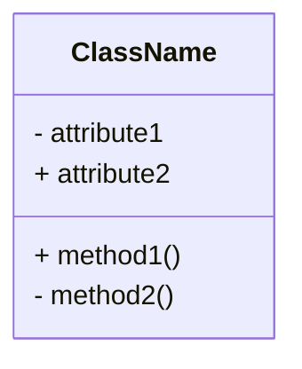

### Required Items in a Class Diagram

The class diagram shows:
- The name of the class
- The attributes and their types
- The methods, with:
  - The parameters and their types
  - The return value and its type

Note: In this course, class diagrams will usually only show the public interface, not the private members.

### 2. Visibility Modifiers

| Symbol | Visibility | Python Equivalent |
|--------|------------|-------------------|
| `+`    | Public     | `attribute` |
| `-`    | Private    | `_attribute` or `__attribute` |
| `#`    | Protected  | `_attribute` |
| `~`    | Package    | Not directly applicable |

### 3. Data Types

Include data types after the attribute name:

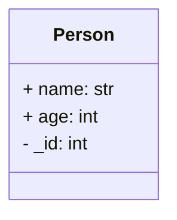

## Example: Car Class

Let's look at a complete example using Mermaid notation:

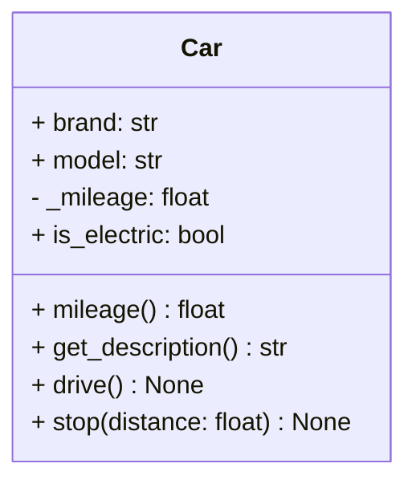


## Python-Specific Considerations

### 1. Python's Privacy Model

Python doesn't have true private attributes, so UML visibility is more about convention:

```python
class Person:
    def __init__(self, name: str, age: int):
        self.name = name        # Public (+)
        self._age = age         # Protected (#)
        self.__id = 123         # Private (-)
```

The convention in Python is to use `_name` for a private variable called `name`. In UML, you use a `-` for private attributes, and `+` for public attributes.

### 2. Properties

The `@property` decorator can be confusing: it "looks like" an attribute, but works through methods. It is generally located in the methods section of the class diagram.

Python properties can be represented as attributes with stereotypes:

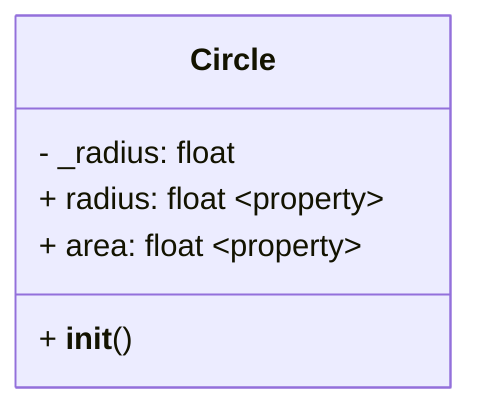

### 3. Class Methods and Static Methods

Use stereotypes to indicate special method types:

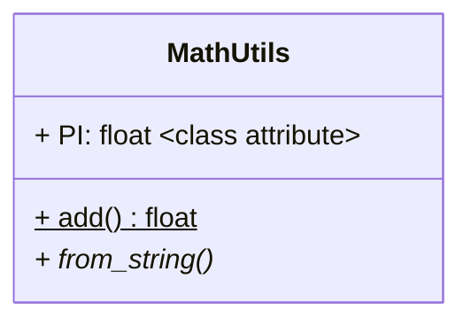

## Objects and Relationships

Objects do not exist by themselves. Like their real-life representations, they exist in a context. Objects interact with each other and are linked by relationships.

### Examples of Relationships
- Between two persons A and B:
  - A _is married_ to B
  - A _is the father_ of B
  - A _is the boss_ of B
- Between a hand and a finger:
  - A hand _has_ five fingers
  - A finger _belongs to_ a hand

## Relationships in UML

Relationships are represented by lines connecting two classes. Sometimes, the _nature_ of the relationship is expressed in the diagram. There are different types of relationships:

### 1. Association

A basic "uses" relationship:

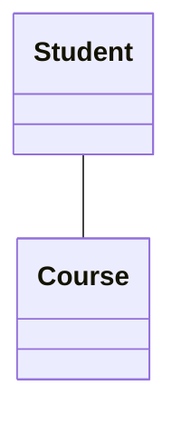

Python implementation:
```python
class Student:
    def __init__(self):
        self.courses = []
    
    def enroll(self, course):
        self.courses.append(course)
```

### 2. Aggregation (Has-a)

A "whole-part" relationship where parts can exist independently. Aggregation is when two objects are related, but can "exist" independently of each other.

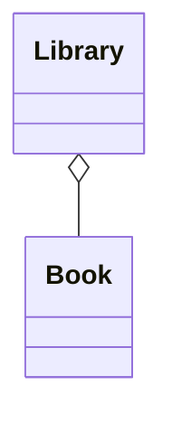

Example: A library "system" is made of a book and a library. If the library is destroyed, the book may still exist and vice versa.

Python implementation:
```python
class Library:
    def __init__(self):
        self.books = []
    
    def add_book(self, book):
        self.books.append(book)

class Book:
    def __init__(self, title):
        self.title = title
```

### 3. Composition (Part-of)

A stronger "whole-part" relationship where parts cannot exist without the whole. Composition is when one object cannot exist without the other.

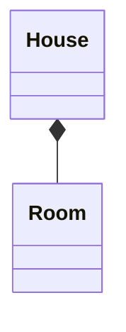

Example: A house is made of rooms. If the house is destroyed, the the rooms do not exist anymore.

Python implementation:
```python
class House:
    def __init__(self):
        self.rooms = [Room("Living Room"), Room("Bedroom")]

class Room:
    def __init__(self, name):
        self.name = name
```

### 4. Inheritance (Is-a) - Extension

Represented with an arrow pointing to the parent class:

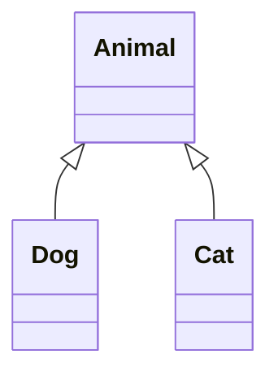

Python implementation:
```python
class Animal:
    def __init__(self, name):
        self.name = name
    
    def speak(self):
        pass

class Dog(Animal):
    def speak(self):
        return f"{self.name} says Woof!"

class Cat(Animal):
    def speak(self):
        return f"{self.name} says Meow!"
```

## Complete Relationship Example: Car System

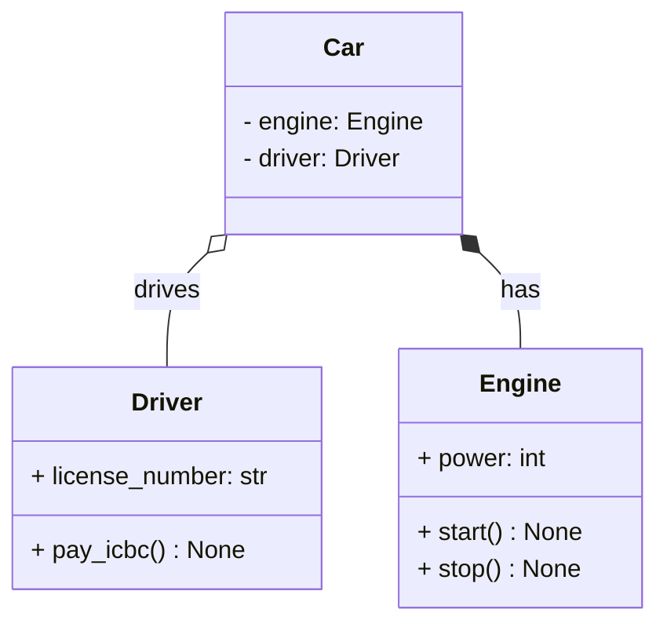


Notice the difference between aggregation (`o--`) and composition (`*--`) in the class diagram.

## Multiplicity

Indicates how many instances of one class relate to instances of another:

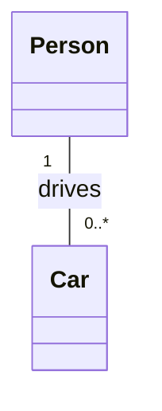

Common multiplicity notations:
- `1` - Exactly one
- `0..1` - Zero or one
- `0..*` or `*` - Zero or more
- `1..*` - One or more
- `2..5` - Between 2 and 5

## Abstract Classes and Interfaces

### Abstract Classes

Use italics or `<<abstract>>` stereotype:

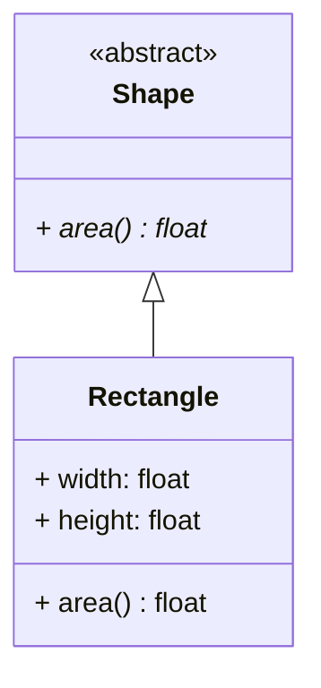

Python implementation:
```python
from abc import ABC, abstractmethod

class Shape(ABC):
    @abstractmethod
    def area(self) -> float:
        pass

class Rectangle(Shape):
    def __init__(self, width: float, height: float):
        self.width = width
        self.height = height
    
    def area(self) -> float:
        return self.width * self.height
```

### Interfaces (Protocols in Python)

See [ABCs and Protocols](https://jellis18.github.io/post/2022-01-11-abc-vs-protocol/) and [Python Protocols: Leveraging Structural Subtyping](https://realpython.com/python-protocol/) for elaboration.

Use `<<interface>>` stereotype:

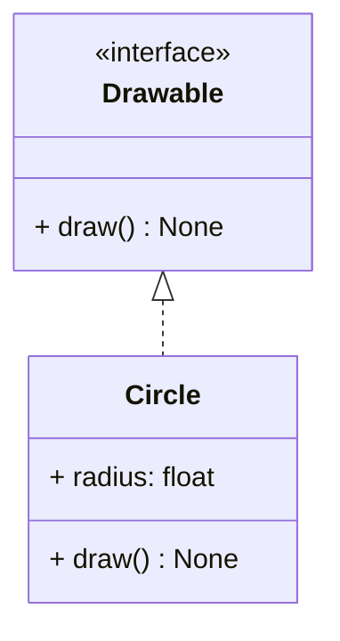

## Complete Example: Banking System

Let's design a simple banking system:

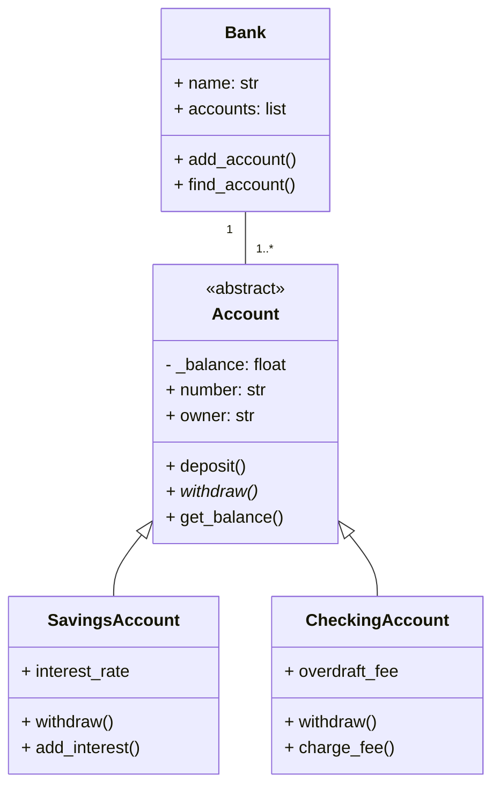

Python implementation:
```python
from abc import ABC, abstractmethod
from typing import List

class Account(ABC):
    def __init__(self, number: str, owner: str, initial_balance: float = 0):
        self.number = number
        self.owner = owner
        self._balance = initial_balance
    
    def deposit(self, amount: float) -> None:
        if amount > 0:
            self._balance += amount
    
    @abstractmethod
    def withdraw(self, amount: float) -> bool:
        pass
    
    def get_balance(self) -> float:
        return self._balance

class SavingsAccount(Account):
    def __init__(self, number: str, owner: str, initial_balance: float = 0, 
                 interest_rate: float = 0.01):
        super().__init__(number, owner, initial_balance)
        self.interest_rate = interest_rate
    
    def withdraw(self, amount: float) -> bool:
        if amount > 0 and amount <= self._balance:
            self._balance -= amount
            return True
        return False
    
    def add_interest(self) -> None:
        self._balance += self._balance * self.interest_rate

class CheckingAccount(Account):
    def __init__(self, number: str, owner: str, initial_balance: float = 0,
                 overdraft_fee: float = 25.0):
        super().__init__(number, owner, initial_balance)
        self.overdraft_fee = overdraft_fee
    
    def withdraw(self, amount: float) -> bool:
        if amount > 0:
            self._balance -= amount
            if self._balance < 0:
                self.charge_fee()
            return True
        return False
    
    def charge_fee(self) -> None:
        self._balance -= self.overdraft_fee

class Bank:
    def __init__(self, name: str):
        self.name = name
        self.accounts: List[Account] = []
    
    def add_account(self, account: Account) -> None:
        self.accounts.append(account)
    
    def find_account(self, number: str) -> Account:
        for account in self.accounts:
            if account.number == number:
                return account
        return None
```

## Tools for Creating UML Diagrams

### Free Tools
- [**Mermaid**](https://mermaid.ai/open-source/intro/index.html) JS Based diagrams is the tool that will used in this class
- [**PlantUML**](https://plantuml.com/): Text-based UML diagrams - more featureful alternative to Mermaid

### IDE Extensions
- [**Mermaid Extension**](https://marketplace.visualstudio.com/items?itemName=MermaidChart.vscode-mermaid-chart)

### Python Libraries
- [**pyreverse**](https://pylint.readthedocs.io/en/latest/additional_tools/pyreverse/index.html): Part of pylint, creates UML diagrams from python code
- [**pylint**](https://pylint.readthedocs.io/en/latest/index.html): Static Code Analyzer that contains `pyreverse`

## Best Practices

1. **Start Simple**: Begin with core classes and add details incrementally
2. **Focus on Important Relationships**: Don't show every possible connection
3. **Use Consistent Naming**: Follow Python naming conventions
5. **Keep It Readable**: Don't overcrowd diagrams
6. **Update Regularly**: Keep diagrams in sync with code changes using `pyreverse`

## Common Pitfalls

1. **Over-Engineering**: Don't create diagrams for simple scripts
2. **Too Much Detail**: Not every attribute/method needs to be shown
3. **Ignoring Python Conventions**: Remember Python's approach to privacy
4. **Static Diagrams**: UML should evolve with your code
5. **Perfect First Time**: Iterate and refine your designs

## Conclusion

UML class diagrams are powerful tools for Python developers to design, communicate, and document object-oriented systems. While Python's dynamic nature means some UML concepts don't translate directly, the core principles of modeling classes, relationships, and system structure remain invaluable for creating maintainable, well-designed software.

Remember: UML is a tool to help you think about and communicate your design—it should serve your development process, not constrain it.
