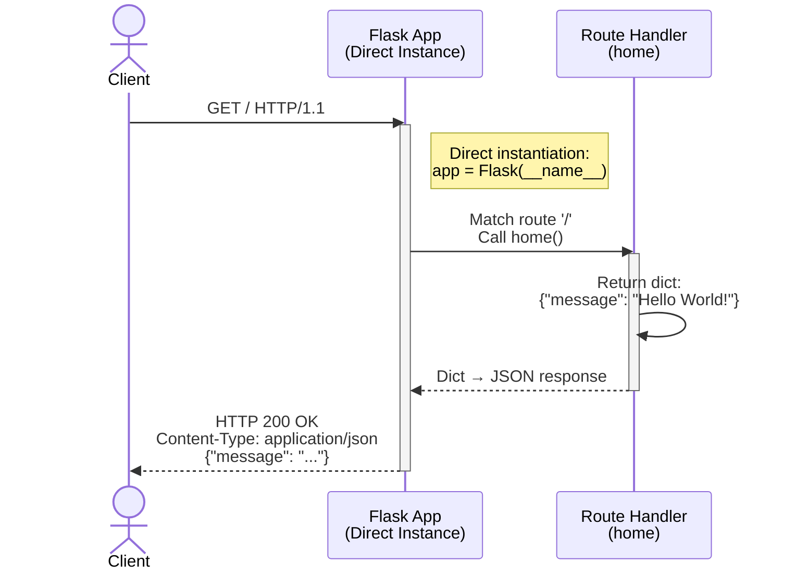
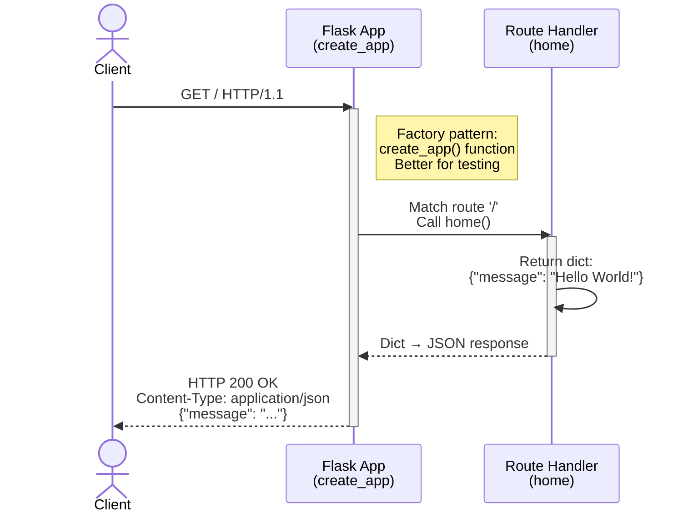
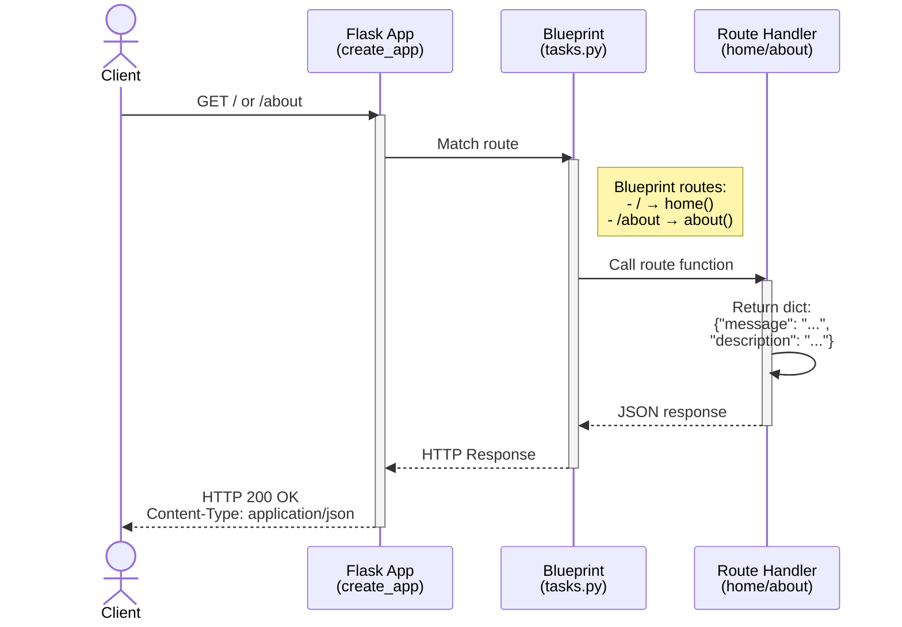
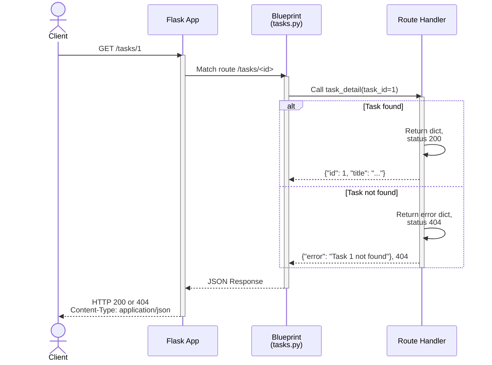
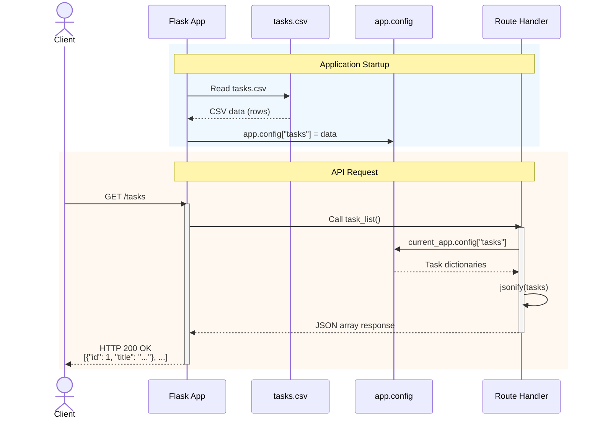
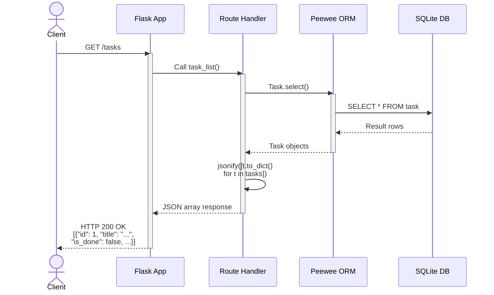
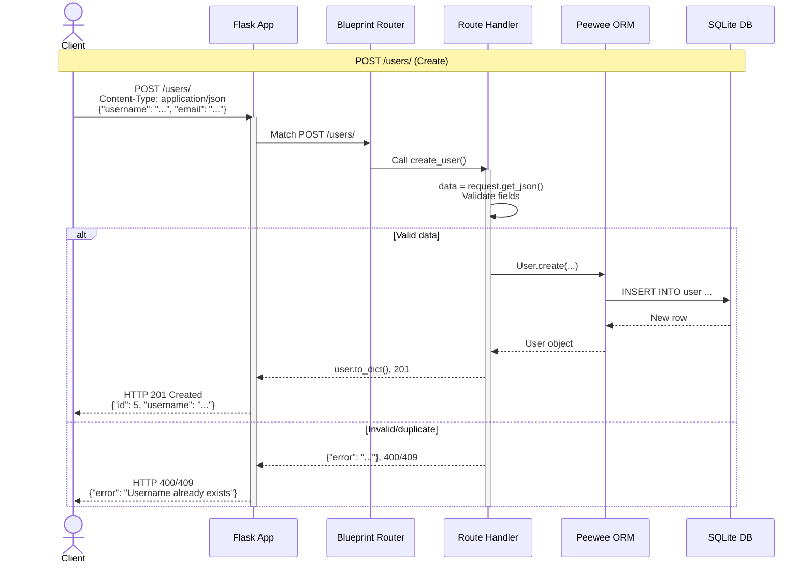
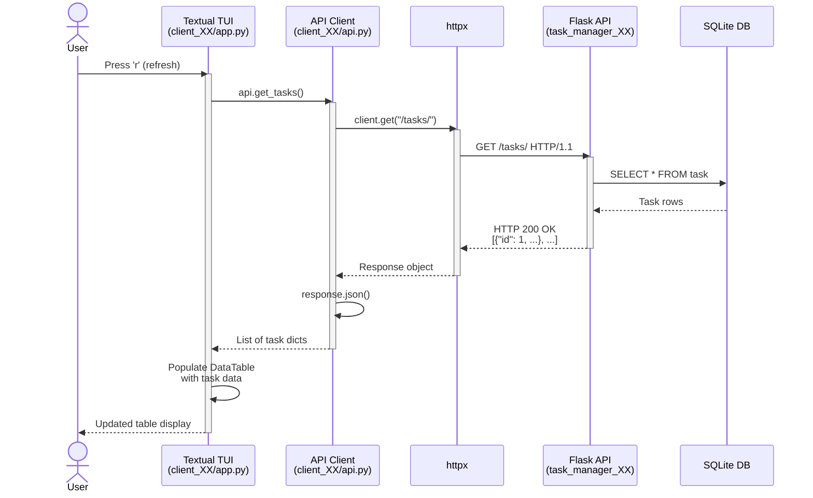

# Flask JSON API Demo — Task Manager Series

## Overview

A progressive series of Flask applications for learning how to build a
**JSON API** (a web service that sends and receives data as JSON over HTTP)
and consume it from a Python client. Each version introduces new concepts,
building from a minimal Flask app to a full **CRUD** (Create, Read, Update,
Delete) API with a relational database and a **TUI** (Terminal User
Interface) client.

### Learning Path

Study the applications in order. From version 05 onward, each API server
is paired with a TUI client so you work both sides of the relationship:

1. **task_manager_00** — Minimal Flask app, returns a JSON dict
2. **task_manager_01** — Application factory pattern (`create_app()`)
3. **task_manager_02** — Blueprints for route organization
4. **task_manager_03** — Status codes, error handling, `jsonify()`
5. **task_manager_04** — Serving CSV data as JSON
6. **task_manager_05 + client_05** — ORM-backed API + read-only TUI
7. **task_manager_06 + client_06** — Multi-table relations + tabbed TUI with filtering
8. **task_manager_07 + client_07** — Full CRUD API + TUI with create/edit/delete

### Technology Stack

| Tool | Purpose |
|------|---------|
| Python ≥ 3.14 | Programming language |
| Flask | Web framework for building the JSON API |
| Peewee | Lightweight **ORM** (Object-Relational Mapper) |
| SQLite | Embedded relational database (no server needed) |
| Textual | TUI framework for building terminal interfaces |
| httpx | HTTP client library for Python |
| uv | Package installer and dependency manager |

### Project Layout

Each `task_manager_XX/` package contains an `app.py` with a `create_app()`
factory function. Versions 05+ add `models.py`, `database.py`, and
`manage_db.py` for database support. Version 07 organizes routes into a
`routes/` directory with separate Blueprint modules.

Each `client_XX/` package contains `api.py` (HTTP client class wrapping
httpx) and `app.py` (Textual TUI application).

Entry scripts: `run_04.py`–`run_07.py` (servers),
`run_client_05.py`–`run_client_07.py` (clients).

---

# Application Progression

## task_manager_00 — Minimal Flask App

The simplest possible Flask app: one route returning a dict, which Flask
automatically serializes to JSON. Uses direct instantiation
(`app = Flask(__name__)`).

#### Running

```bash
python task_manager_00/app.py
curl http://localhost:8080/
```

#### Flask CLI

**PowerShell:**

```powershell
$env:FLASK_APP="task_manager_00"; $env:FLASK_DEBUG="1"; uv run flask run --host=localhost --port=8080
```

**Linux / Mac:**

```bash
FLASK_APP=task_manager_00 FLASK_DEBUG=1 uv run flask run --host localhost --port 8080
```

#### Debugging in VS Code

Use the **"Flask CLI: task_manager_00"** launch configuration. This
starts the Flask development server under the debugger with `FLASK_APP`
and `FLASK_DEBUG` set automatically.

#### Request Flow



## task_manager_01 — Application Factory

Same behaviour as 00, restructured using the **application factory
pattern**: a `create_app()` function that builds and returns the app.
This makes testing and configuration easier.

#### Running

```bash
python task_manager_01/app.py
curl http://localhost:8080/
```

#### Flask CLI

**PowerShell:**

```powershell
$env:FLASK_APP="task_manager_01"; $env:FLASK_DEBUG="1"; uv run flask run --host=localhost --port=8080
```

**Linux / Mac:**

```bash
FLASK_APP=task_manager_01 FLASK_DEBUG=1 uv run flask run --host localhost --port 8080
```

#### Debugging in VS Code

Use the **"Flask CLI: task_manager_01"** launch configuration.

#### Request Flow



## task_manager_02 — Blueprints

Introduces **Blueprints** — Flask's mechanism for grouping related routes
into separate modules. Task routes move from `app.py` into their own
`tasks.py` module.

#### Running

```bash
python task_manager_02/app.py
curl http://localhost:8080/
curl http://localhost:8080/about
```

#### Flask CLI

**PowerShell:**

```powershell
$env:FLASK_APP="task_manager_02"; $env:FLASK_DEBUG="1"; uv run flask run --host=localhost --port=8080
```

**Linux / Mac:**

```bash
FLASK_APP=task_manager_02 FLASK_DEBUG=1 uv run flask run --host localhost --port 8080
```

#### Debugging in VS Code

Use the **"Flask CLI: task_manager_02"** launch configuration.

#### Request Flow



## task_manager_03 — Status Codes and Error Handling

Adds `jsonify()` for serializing lists, HTTP status codes (200, 404),
and JSON error responses. Dynamic routes like `/tasks/<id>` return a
404 when a resource is not found.

#### Running

```bash
python task_manager_03/app.py
curl http://localhost:8080/tasks/1      # 200 OK
curl http://localhost:8080/tasks/999    # 404 Not Found
```

#### Flask CLI

**PowerShell:**

```powershell
$env:FLASK_APP="task_manager_03"; $env:FLASK_DEBUG="1"; uv run flask run --host=localhost --port=8080
```

**Linux / Mac:**

```bash
FLASK_APP=task_manager_03 FLASK_DEBUG=1 uv run flask run --host localhost --port 8080
```

#### Debugging in VS Code

Use the **"Flask CLI: task_manager_03"** launch configuration.

#### Request Flow



## task_manager_04 — CSV Data as JSON

Loads task data from a CSV file at startup, converts rows to
dictionaries, and serves them through JSON API endpoints. Data is stored
in `app.config` so all routes can access it.

#### Running

```bash
uv run python run_04.py
curl http://localhost:8080/tasks
curl http://localhost:8080/tasks/1
```

#### Flask CLI

**PowerShell:**

```powershell
$env:FLASK_APP="task_manager_04"; $env:FLASK_DEBUG="1"; uv run flask run --host=localhost --port=8080
```

**Linux / Mac:**

```bash
FLASK_APP=task_manager_04 FLASK_DEBUG=1 uv run flask run --host localhost --port 8080
```

#### Debugging in VS Code

Use the **"Run: task_manager_04"** launch configuration, which runs
`run_04.py` under the debugger.

#### Request Flow



## task_manager_05 + client_05

First database-backed version, paired with the simplest TUI client. This
is where the API becomes a real data service and we consume it from a
separate application for the first time.

### task_manager_05 — ORM-Backed JSON API

Uses Peewee ORM with SQLite for persistence. Each model has a
`to_dict()` method for JSON serialization.

#### Setup

```bash
python task_manager_05/manage_db.py     # Create and seed the database
```

#### Running

```bash
uv run python run_05.py                 # Start the server
curl http://localhost:8080/tasks
curl http://localhost:8080/tasks/1
```

#### Flask CLI

**PowerShell:**

```powershell
$env:FLASK_APP="task_manager_05"; $env:FLASK_DEBUG="1"; uv run flask run --host=localhost --port=8080
```

**Linux / Mac:**

```bash
FLASK_APP=task_manager_05 FLASK_DEBUG=1 uv run flask run --host localhost --port 8080
```

#### Debugging in VS Code

Use the **"Run: task_manager_05"** launch configuration, which runs
`run_05.py` under the debugger.

#### Request Flow



### client_05 — Simple Read-Only TUI

A single `DataTable` displaying tasks. Uses httpx to call the API.

- Key bindings: `r` (refresh), `q` (quit)

```bash
uv run python run_05.py            # Terminal 1: API server
uv run python run_client_05.py     # Terminal 2: TUI client
```

## task_manager_06 + client_06

Multi-table relational database with a read-only API, paired with a
tabbed TUI client.

### task_manager_06 — Multi-Table Read-Only API

Normalized schema with four tables: Users, Tasks, Tags, and a TaskTag
junction table. Demonstrates one-to-many (User→Tasks) and many-to-many
(Tasks↔Tags) relationships.

| Endpoint | Description |
|----------|-------------|
| `GET /` | API stats (counts) |
| `GET /users`, `/users/<id>` | Users and their tasks |
| `GET /tasks` | All tasks with assignee and tags |
| `GET /tasks/pending` | Pending tasks only |
| `GET /tasks/completed` | Completed tasks only |
| `GET /tags`, `/tags/<id>` | Tags with task counts |

#### Setup

```bash
python task_manager_06/manage_db.py     # Create and seed the database
```

#### Running

```bash
uv run python run_06.py                 # Start the server
curl http://localhost:8080/users
curl http://localhost:8080/tasks
```

#### Flask CLI

**PowerShell:**

```powershell
$env:FLASK_APP="task_manager_06"; $env:FLASK_DEBUG="1"; uv run flask run --host=localhost --port=8080
```

**Linux / Mac:**

```bash
FLASK_APP=task_manager_06 FLASK_DEBUG=1 uv run flask run --host localhost --port 8080
```

#### Debugging in VS Code

Use the **"Run: task_manager_06"** launch configuration, which runs
`run_06.py` under the debugger.

### client_06 — Read-Only Multi-Table TUI

Adds tabbed views (Users / Tasks / Tags) and task filtering.

- Key bindings: `r` (refresh), `a` (all tasks), `p` (pending),
  `f` (completed), `q` (quit)

```bash
uv run python run_06.py            # Terminal 1: API server
uv run python run_client_06.py     # Terminal 2: TUI client
```

## task_manager_07 + client_07

Full CRUD API with create, read, update, and delete operations, paired
with a TUI client that uses modal forms.

### task_manager_07 — Full CRUD API

Extends task_manager_06 with write operations. Routes are organized into
separate Blueprint modules under `routes/`. Uses `request.get_json()` to
parse incoming JSON request bodies and returns appropriate HTTP status
codes (201 Created, 400 Bad Request, 404 Not Found, 409 Conflict).

#### Setup

```bash
python task_manager_07/manage_db.py     # Create and seed the database
```

#### Running

```bash
uv run python run_07.py                 # Start the server
```

#### Flask CLI

**PowerShell:**

```powershell
$env:FLASK_APP="task_manager_07"; $env:FLASK_DEBUG="1"; uv run flask run --host=localhost --port=8080
```

**Linux / Mac:**

```bash
FLASK_APP=task_manager_07 FLASK_DEBUG=1 uv run flask run --host localhost --port 8080
```

#### Debugging in VS Code

Use the **"Run: task_manager_07"** launch configuration, which runs
`run_07.py` under the debugger.

### API Endpoints

| Method | URL                  | Description            |
| ------ | -------------------- | ---------------------- |
| GET    | `/`                  | API stats              |
| GET    | `/users/`            | List all users         |
| GET    | `/users/<id>`        | Get user details       |
| POST   | `/users/`            | Create user            |
| PUT    | `/users/<id>`        | Update user            |
| DELETE | `/users/<id>`        | Delete user            |
| GET    | `/tasks/`            | List all tasks         |
| GET    | `/tasks/<id>`        | Get task details       |
| POST   | `/tasks/`            | Create task            |
| PUT    | `/tasks/<id>`        | Update task            |
| POST   | `/tasks/<id>/toggle` | Toggle task completion |
| DELETE | `/tasks/<id>`        | Delete task            |
| GET    | `/tags/`             | List all tags          |
| GET    | `/tags/<id>`         | Get tag details        |
| POST   | `/tags/`             | Create tag             |
| PUT    | `/tags/<id>`         | Update tag             |
| DELETE | `/tags/<id>`         | Delete tag             |

### Example curl Commands

```bash
# List all users
curl http://localhost:8080/users/

# Create a new user
curl -X POST http://localhost:8080/users/ \
  -H "Content-Type: application/json" \
  -d '{"username": "Smith, John", "email": "john@example.com"}'

# Update a user
curl -X PUT http://localhost:8080/users/1 \
  -H "Content-Type: application/json" \
  -d '{"username": "Smith, Jonathan", "email": "jonathan@example.com"}'

# Delete a user
curl -X DELETE http://localhost:8080/users/1

# Create a task with tags
curl -X POST http://localhost:8080/tasks/ \
  -H "Content-Type: application/json" \
  -d '{"title": "New task", "assignee_id": 2, "details": "Task details", "tag_ids": [1, 3]}'

# Toggle task completion
curl -X POST http://localhost:8080/tasks/1/toggle
```

### task_manager_07: CRUD Request Flow



### client_07 — Full CRUD TUI

Adds create, edit, and delete via modal form screens.

- Key bindings: `c` (create), `e` (edit), `d` (delete), `t` (toggle),
  `r` (refresh), `q` (quit)

```bash
uv run python run_07.py            # Terminal 1: API server
uv run python run_client_07.py     # Terminal 2: TUI client
```

---

## TUI Client Summary

### Client Progression

| Feature              | client_05 | client_06 | client_07 |
| -------------------- | :-------: | :-------: | :-------: |
| DataTable display    |    Yes    |    Yes    |    Yes    |
| TabbedContent (tabs) |           |    Yes    |    Yes    |
| Task filtering       |           |    Yes    |           |
| Create (POST)        |           |           |    Yes    |
| Edit (PUT)           |           |           |    Yes    |
| Delete (DELETE)      |           |           |    Yes    |
| Toggle task status   |           |           |    Yes    |
| Modal screens        |           |           |    Yes    |

### Design Note: Synchronous API Calls

The TUI clients make **synchronous** (blocking) HTTP calls directly in
event handlers. This is a deliberate simplification — the API server
runs on localhost, so requests complete in milliseconds and the UI stays
responsive. In production, you would use Textual's worker API
(`@work(thread=True)`) to avoid blocking during slower network requests.

### Client-Server Request Flow



---

# Quick Reference

## Initial Setup

```bash
uv sync                                    # Install dependencies
uv run python task_manager_05/manage_db.py  # Seed database for 05
uv run python task_manager_06/manage_db.py  # Seed database for 06
uv run python task_manager_07/manage_db.py  # Seed database for 07
```

## Testing with curl

```bash
curl http://localhost:8080/                                          # GET
curl -s http://localhost:8080/users/ | python -m json.tool           # Pretty-print
curl -X POST http://localhost:8080/users/ \
  -H "Content-Type: application/json" \
  -d '{"username": "Test User", "email": "test@example.com"}'         # POST
```

## VS Code Debugging

The `.vscode/launch.json` file provides debug configurations for every
version. Open the **Run and Debug** panel (Ctrl+Shift+D) and select the
configuration matching the version you want to debug:

| Configuration | Method |
|---------------|--------|
| Flask CLI: task_manager_00–03 | Starts via `flask run` with `FLASK_APP` set |
| Flask CLI: task_manager_04–07 | Same, for entry-script versions |
| Run: task_manager_04–07 | Runs `run_XX.py` directly under debugger |
| Python Debugger: Current File | Runs whichever file is open |

Set breakpoints in any route handler or model method, then launch the
configuration. The debugger will pause execution at your breakpoints.
