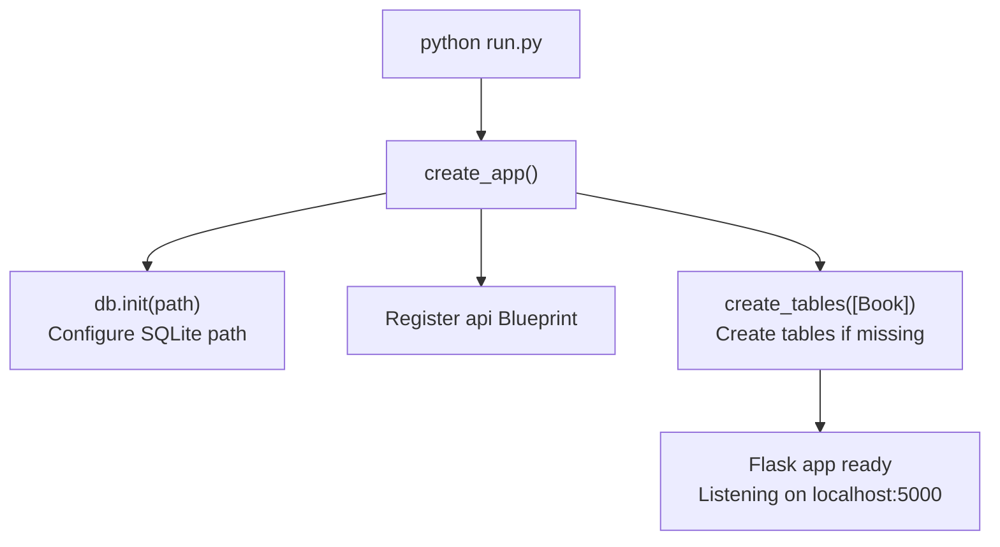
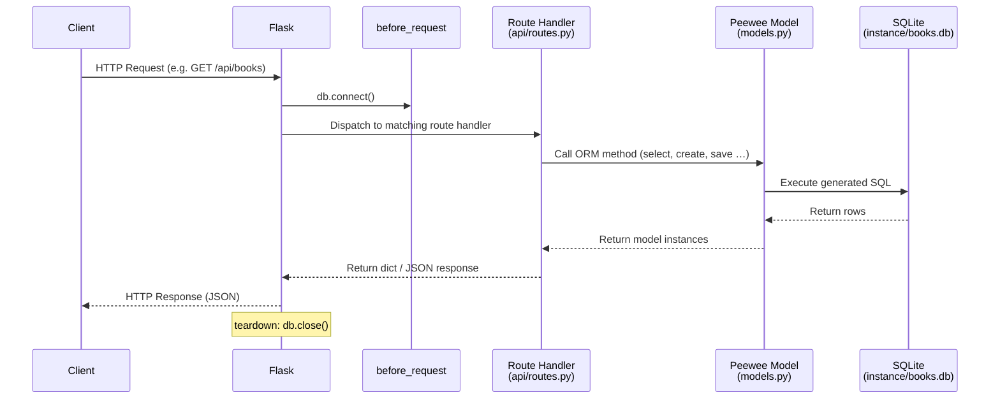

# Simple ORM Demo — Flask + Peewee

A minimal REST API that manages a collection of books, built with
[Flask](https://flask.palletsprojects.com/) and the

---

## Key Concepts

### What Is an ORM?

ORM stands for **Object-Relational Mapper**.  It lets you work with database
rows as regular Python objects instead of writing raw SQL.

| ORM concept | Python code | SQL equivalent |
|---|---|---|
| Define a table | `class Book(Model)` | `CREATE TABLE book (…)` |
| Insert a row | `Book.create(title="…")` | `INSERT INTO book …` |
| Query all rows | `Book.select()` | `SELECT * FROM book` |
| Update a row | `book.save()` | `UPDATE book SET … WHERE id = ?` |
| Delete a row | `book.delete_instance()` | `DELETE FROM book WHERE id = ?` |

### What Is Flask?

Flask is a lightweight Python web framework.  It maps URLs to Python functions
(called **views** or **route handlers**).  When a browser or tool like `curl`
sends an HTTP request, Flask finds the matching function, runs it, and returns
the result as an HTTP response.

### What Is a REST API?

A REST API uses standard HTTP methods to perform **CRUD** operations on
resources:

| Operation | HTTP Method | URL | Description |
|---|---|---|---|
| **C**reate | `POST` | `/api/books` | Add a new book |
| **R**ead all | `GET` | `/api/books` | List every book |
| **R**ead one | `GET` | `/api/books/<id>` | Get a single book |
| **U**pdate | `PUT` | `/api/books/<id>` | Modify an existing book |
| **D**elete | `DELETE` | `/api/books/<id>` | Remove a book |

### Application Factory Pattern

Instead of creating the Flask app at module level, this project uses a
**factory function** (`create_app()`).  The factory:

1. Configures the database connection.
2. Registers blueprints (groups of routes).
3. Creates database tables if they don't already exist.

This pattern is recommended by Flask because it avoids circular imports and
makes unit testing easier — you can call `create_app()` multiple times with
different configurations.

### Blueprints

A Flask **Blueprint** is a way to organize related routes into their own
module.  In this project the `api` blueprint lives in `book_app/api/` and
adds the `/api` URL prefix to every route it contains.

---

## Project Structure

```
simple_orm_demo/
├── run.py                  # Entry point — starts the dev server
├── pyproject.toml          # Project metadata and dependencies
├── instance/               # Created at runtime — holds the SQLite .db file
├── book_app/               # Main application package
│   ├── __init__.py         # Application factory (create_app)
│   ├── config.py           # Configuration variables (DATABASE_PATH)
│   ├── database.py         # Deferred SQLite database instance
│   ├── models.py           # Peewee models (BaseModel, Book)
│   └── api/                # API blueprint sub-package
│       ├── __init__.py     # Blueprint registration
│       └── routes.py       # CRUD route handlers
└── tests/                  # Test suite
    ├── conftest.py         # Shared fixtures (test client)
    └── test_books_api.py   # CRUD endpoint tests
```

### File-by-File Overview

| File | Purpose |
|---|---|
| `run.py` | Creates the app via `create_app()` and starts the Flask development server on `localhost:5000`. |
| `book_app/__init__.py` | Application factory — sets up the database, registers blueprints, and creates tables. |
| `book_app/config.py` | Configuration variables.  `DATABASE_PATH` sets the SQLite file location. |
| `book_app/database.py` | Exports a *deferred* `SqliteDatabase` object.  The real file path is set later by the factory. |
| `book_app/models.py` | Defines the `Book` ORM model.  Each class attribute (`CharField`, `BooleanField`, etc.) describes a database column. |
| `book_app/api/__init__.py` | Creates the `api` Blueprint with the `/api` URL prefix and imports the route module. |
| `book_app/api/routes.py` | Contains the five route handler functions that implement CRUD operations on books. |

---

## Getting Started

### Prerequisites

* Python 3.14+
* [uv](https://docs.astral.sh/uv/) — a fast Python package and project
  manager.  Install it with:

### Installation

```bash
# 1. Clone or download the project, then enter the directory
cd simple_orm_demo

# 2. Install dependencies (uv creates the virtual environment automatically)
uv sync
```

### Running the Server

```bash
uv run python run.py
```

The server starts at **http://localhost:5000**.  On the first run Peewee
automatically creates `instance/books.db` and the `book` table inside it.

---

## Using the API

You can test the endpoints with `curl`, [Postman](https://www.postman.com/),
or any HTTP client.  All request and response bodies use JSON.

### Create a Book

```bash
curl -X POST http://localhost:5000/api/books \
     -H "Content-Type: application/json" \
     -d '{"title": "Clean Code", "author": "Robert C. Martin"}'
```

**Response** (`201 Created`):

```json
{
  "id": 1,
  "title": "Clean Code",
  "author": "Robert C. Martin",
  "is_read": false
}
```

### List All Books

```bash
curl http://localhost:5000/api/books
```

**Response** (`200 OK`):

```json
[
  {
    "id": 1,
    "title": "Clean Code",
    "author": "Robert C. Martin",
    "is_read": false
  }
]
```

### Get a Single Book

```bash
curl http://localhost:5000/api/books/1
```

**Response** (`200 OK`):

```json
{
  "id": 1,
  "title": "Clean Code",
  "author": "Robert C. Martin",
  "is_read": false
}
```

### Update a Book

```bash
curl -X PUT http://localhost:5000/api/books/1 \
     -H "Content-Type: application/json" \
     -d '{"is_read": true}'
```

Only the fields you include are changed; the rest keep their current values.

**Response** (`200 OK`):

```json
{
  "id": 1,
  "title": "Clean Code",
  "author": "Robert C. Martin",
  "is_read": true
}
```

### Delete a Book

```bash
curl -X DELETE http://localhost:5000/api/books/1
```

**Response** (`200 OK`):

```json
{
  "message": "'Clean Code' deleted"
}
```

---

## ORM ↔ SQL Quick Reference

The table below shows how each Peewee call in the code translates to SQL.
You never write the SQL yourself — the ORM generates it for you.

| Python (Peewee) | Generated SQL |
|---|---|
| `Book.create(title="…", author="…")` | `INSERT INTO book (title, author, is_read) VALUES (?, ?, 0)` |
| `Book.select().order_by(Book.title)` | `SELECT * FROM book ORDER BY title` |
| `Book.get_or_none(Book.id == 1)` | `SELECT * FROM book WHERE id = 1 LIMIT 1` |
| `book.save()` | `UPDATE book SET title=?, author=?, is_read=? WHERE id=?` |
| `book.delete_instance()` | `DELETE FROM book WHERE id = ?` |

---

## How the Pieces Connect

There are two distinct phases: **startup** (happens once) and
**request handling** (happens for every HTTP request).

### Startup



`create_app()` runs **once** when the server starts.  It wires everything
together so Flask is ready to handle requests.

### Per-Request Flow



1. A client sends an HTTP request (e.g. `GET /api/books`).
2. Flask's `before_request` hook opens a database connection.
3. Flask matches the URL to a route handler function.
4. The handler calls Peewee model methods (`select`, `create`, `save`, etc.).
5. Peewee translates those calls into SQL and executes them on the SQLite
   database.
6. The handler converts the result to a dictionary and Flask serializes it to
   JSON for the response.
7. Flask's `teardown` hook closes the database connection.

---

## Running the Tests

```bash
uv run pytest -v
```

The tests live in `tests/` and use Flask's built-in **test client** — no
real server is started.  Each test gets its own temporary SQLite database
so tests never interfere with each other.

### How the Test Fixture Works

The `client` fixture in `tests/conftest.py` does two things:

1. Uses `monkeypatch.setattr` to replace `config.DATABASE_PATH` with a
   path inside pytest's `tmp_path` temporary directory.
2. Calls `create_app()` — which now builds the database in the temp
   directory instead of `instance/`.

After each test, pytest automatically restores the original
`DATABASE_PATH` value.

### Why `pythonpath` Is Configured in `pyproject.toml`

When pytest runs, it needs to be able to `import book_app`.  Python can
only import packages that are on its **module search path** (`sys.path`).
By default, the project root directory is *not* on that path, so pytest
would fail with `ModuleNotFoundError`.

The setting in `pyproject.toml` solves this:

```toml
[tool.pytest.ini_options]
pythonpath = ["."]
```

This tells pytest: *"before running any tests, add the project root (`.`)
to `sys.path`."*  With that single line, `import book_app` works from
anywhere inside the test suite — no need to install the package or
manipulate paths manually.

---

## Dependencies

| Package | Version | Role |
|---|---|---|
| Flask | ≥ 3.1.3 | Web framework — handles HTTP routing and responses |
| Peewee | ≥ 4.0.3 | ORM — maps Python classes to database tables |
| pytest | ≥ 8.0 | Test framework (dev dependency) |