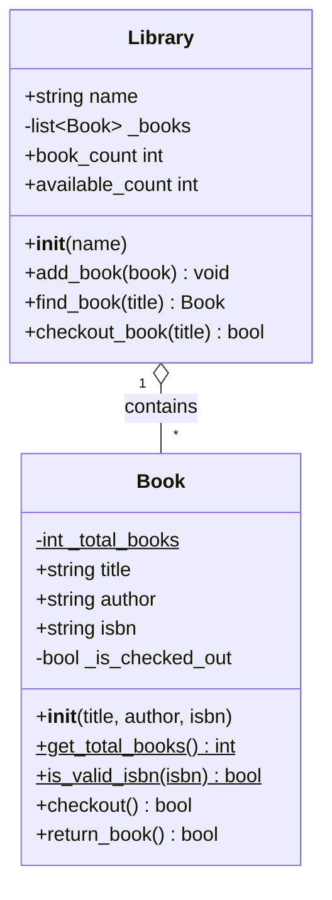

# Introduction to Object-Oriented Programming Exercise

## Overview

In this exercise, you'll create a simple library management system to practice
object-oriented programming concepts including:

- Creating classes and objects
- Using public and protected members
- Implementing methods
- Using the `@property` decorator
- Working with class attributes (class members)
- Creating `@classmethod` and `@staticmethod` decorators
- Running pytest class-based test suites

**Estimated Time**: 45 minutes

**Files Provided:**

- [`test_library.py`](./test_library.py) - A comprehensive pytest test suite
- [`library_starter.py`](./library_starter.py) - A starter template with the main() function that you
  will rename and complete

**Files You'll Create:**

- `library.py` - Your implementation of the Book and Library classes

## Scenario

You're building a system for a small library. The library needs to track books
and whether they're available for checkout.

**Your Goal**: Complete the Book and Library classes so that the provided
`main()` function runs successfully and produces the expected output.

## Project Setup

Before starting the exercise, set up your project environment properly.

### 1. Create Project Directory

```powershell
# Create and navigate to project directory
mkdir library_oo
cd library_oo
```

### 2. Initialize Python Environment with uv

Use `uv` to create a virtual environment and install dependencies:

```powershell
# Initialize a new Python project with uv
uv init

# Create virtual environment
uv venv

# Activate the virtual environment
# On Windows PowerShell:
.venv\Scripts\Activate.ps1

# On Windows CMD:
.venv\Scripts\activate.bat

# On macOS/Linux:
source .venv/bin/activate
```

### 3. Install Dependencies

Install pytest for testing:

```powershell
uv add --dev pytest
```

### 4. Configure VSCode

Create a `.vscode` folder with configuration files:

#### Debugger Configuration (`.vscode/launch.json`)

```json
{
  "version": "0.2.0",
  "configurations": [
    {
      "name": "Python: Current File",
      "type": "debugpy",
      "request": "launch",
      "program": "${file}",
      "console": "integratedTerminal",
      "justMyCode": true
    },
    {
      "name": "Python: Test with Pytest",
      "type": "debugpy",
      "request": "launch",
      "module": "pytest",
      "args": ["${file}", "-v"],
      "console": "integratedTerminal",
      "justMyCode": true
    }
  ]
}
```

#### Configure Testing in VSCode

Set up pytest testing in VSCode to enable test discovery and execution:

1. Open the Testing Panel
   - Click the Testing icon in the left sidebar (flask/beaker icon)
   - Or use Command Palette: `Ctrl+Shift+P` → "Test: Configure Python Tests"

2. Select pytest as Testing Framework
   - When prompted, select "pytest" from the list
   - If not prompted, click "Configure Python Tests" button in Testing panel

3. Configure Test Discovery
   - When asked "Where are your tests located?", select:
     - Root directory (or ".")
   - This tells VSCode that tests are in the same directory as source files
   - VSCode will discover all files matching `test_*.py` or `*_test.py`

4. Verify Test Configuration
   - The Testing panel should show a tree view
   - Once you create `library.py`, `test_library.py` will appear here
     automatically
   - Click the play button next to any test to run it
   - Click the debug icon to debug tests with breakpoints

### 5. Copy Provided Files

Copy the provided files into your project directory:

- [`test_library.py`](./test_library.py) - `pytest` test suite
- [`library_starter.py`](./library_starter.py) - Starter template with main()
  function

Rename `library_starter.py` to `library.py` to begin working:

### 6. Verify Setup

Test that everything works:

```powershell
# Verify pytest is installed
pytest --version
```

### Project Structure

After setup, your directory should look like this:

```
library_oo/
├── .venv/                  # Virtual environment (created by uv)
├── .vscode/
│   ├── settings.json      # Python and testing configuration (optional)
│   └── launch.json        # Debugger configurations
├── test_library.py        # Provided: Comprehensive test suite
└── library.py             # Your working file (copy of library_starter.py)
```

Now you're ready to begin the exercise!

## Your Goal: Complete the Main Function

The `library_starter.py` file includes a complete `main()` function that
demonstrates all the features of a library management system. **Your job is to
implement the Book and Library classes so that this main() function runs
successfully.**

### What the Main Function Does

The `main()` function performs the following operations:

#### 1. Print Header

Print a title and separator line:

```python
print("Library Management System Demo")
print("=" * 50)
```

#### 2. Test Static Methods

Call `Book.is_valid_isbn()` with these two specific examples:

- Test with `"978-0-451-52493-5"` (valid - 17 characters with hyphens)
- Test with `"123"` (invalid - only 3 characters)

Print the results showing True and False respectively.

#### 3. Display Initial Book Statistics

Print the initial book count using `Book.get_total_books()`. The output should
show 0 (no books created yet).

#### 4. Create a Library

Create a Library instance with the name `"City Public Library"`.

#### 5. Create Three Books

Create exactly **three** Book objects with these specifications:

- Book 1: Title: `"1984"`, Author: `"George Orwell"`, ISBN:
  `"978-0-451-52493-5"`
- Book 2: Title: `"To Kill a Mockingbird"`, Author: `"Harper Lee"`, ISBN:
  `"978-0-061-12008-4"`
- Book 3: Title of your choice with a valid 17-character ISBN

#### 6. Add Books to Library

Use the `add_book()` method to add all three books to your library. Each call
will print a confirmation message.

#### 7. Display Library Statistics

Print a section showing:

- Total books in library (using `book_count` property) - should be 3
- Available books (using `available_count` property) - should be 3

#### 8. Display Updated Statistics

Print the total number of books created using `Book.get_total_books()`. This
should now be 3.

#### 9. Demonstrate Checkout

Check out the book "1984" using the library's `checkout_book()` method. Then
print the updated available count - should now be 2.

#### 10. Demonstrate Return

Return the book "1984" using the book object's `return_book()` method. Then
print the updated available count - should be back to 3.

#### 11. Test Invalid ISBN (Error Handling)

Use a try-except block to attempt creating a book with ISBN `"123"`. Catch the
ValueError and print the error message.

#### 12. Print Closing Message

Print a separator line and closing message:

```python
print("\n" + "=" * 50)
print("Demo complete!")
```

### Expected Output

When your implementation is complete and you run `python library.py`, you should
see:

```
Library Management System Demo
==================================================

Testing ISBN validation...
Is '978-0-451-52493-5' valid? True
Is '123' valid? False

Initial book count: 0
Added '1984' to City Public Library.
Added 'To Kill a Mockingbird' to City Public Library.
Added 'Your Title' to City Public Library.

Library statistics:
Total books: 3
Available: 3
Total books created: 3

Checking out '1984'...
'1984' has been checked out successfully.
Available books: 2

Returning '1984'...
'1984' has been returned successfully.
Available books: 3

Testing invalid ISBN...
Error caught: Invalid ISBN format: 123

==================================================
Demo complete!
```

### Test As You Go

You can run `python library.py` at any time to see which parts work. The main()
function will fail at first because the classes don't exist yet. As you complete
each part of the exercise, more of the main() function will work.

Implement the classes step-by-step (Parts 1-4), testing with
pytest after each part. Once all pytest tests pass, your main() function should
run successfully!

## Class Structure

Below is a class diagram showing the structure you'll build in this exercise:



**Diagram Legend:**

- `+` = public member
- `-` = protected member (underscore prefix in Python)
- `$` = class method or static method (class-level) - appears underlined in the
  diagram
- Horizontal line separates **attributes** (above) from **methods** (below)
- Properties like `status`, `book_count`, `available_count` are shown without
  `()` to distinguish them from methods

## Part 1: Create the Book Class (10 minutes)

Open your `library.py` file (copied from `library_starter.py`). You'll implement
the Book and Library classes **above** the existing `main()` function.

### Step 1.1: Basic Book Class

Create a `Book` class with the following **public** attributes:

- `title` (string)
- `author` (string)
- `isbn` (string)

Create an `__init__` method that accepts these three parameters and initializes
the attributes.

#### Test your code

```python
book1 = Book("1984", "George Orwell", "978-0451524935")
print(f"{book1.title} by {book1.author}")
```

### Step 1.2: Add Protected Members

Add a **protected** attribute called `_is_checked_out` (boolean) that tracks
whether the book is currently checked out. Initialize it to `False` in the
`__init__` method.

#### Question

Why should `_is_checked_out` be protected rather than public?

### Test Your Progress

Run the initialization tests to verify Part 1:

```bash
pytest test_library.py::TestBookInitialization -v
```

All 3 tests in this class should pass once you've completed Part 1.

## Part 2: Add Checkout/Return Functionality (12 minutes)

### Step 2.1: Checkout Method

Create a method called `checkout()` that:

- Checks if the book is already checked out
- If not checked out: marks it as checked out and prints a success message
- If already checked out: prints an error message

#### Test your code

```python
book1.checkout()  # Should succeed
book1.checkout()  # Should print an error
```

### Step 2.2: Return Method

Create a method called `return_book()` that:

- Checks if the book is currently checked out
- If checked out: marks it as available and prints a success message
- If not checked out: prints an error message

### Step 2.3: Add a Property

Add a `@property` decorator to create a read-only `status` property that
returns:

- `"Available"` if the book is not checked out
- `"Checked Out"` if the book is checked out

#### Test your code

```python
book1 = Book("1984", "George Orwell", "978-0451524935")
print(book1.status)  # Should print "Available"
book1.checkout()
print(book1.status)  # Should print "Checked Out"
```

### Test Your Progress

Run the tests for Book methods and properties:

```bash
pytest test_library.py::TestBookMethods -v
pytest test_library.py::TestBookProperties -v
```

All 10 tests should pass once you've completed Part 2 (5 in TestBookMethods, 5
in TestBookProperties).

## Part 3: Class Attributes and Methods (8 minutes)

### Step 3.1: Add Class Attributes

Add a **class attribute** to the `Book` class (defined at the class level,
outside any method):

- `_total_books` (integer): Tracks the total number of Book objects created.
  Initialize to 0.

Update the `__init__` method to increment `_total_books` each time a book is
created.

##### Example

```python
class Book:
    # Class attribute
    _total_books = 0

    def __init__(self, title, author, isbn):
        # Increment class attribute
        Book._total_books += 1
        # ... rest of initialization
```

### Step 3.2: Add a Class Method

Create a **class method** called `get_total_books()` that returns the total
number of books created:

```python
@classmethod
def get_total_books(cls):
    """Return the total number of books created."""
    return cls._total_books
```

#### Test your code

```python
print(f"Total books created: {Book.get_total_books()}")  # Should be 0
book1 = Book("1984", "George Orwell", "978-0451524935")
book2 = Book("Sapiens", "Yuval Noah Harari", "978-0062316097")
print(f"Total books created: {Book.get_total_books()}")  # Should be 2
```

#### Question

Why use a class method instead of just accessing `Book._total_books` directly?

### Step 3.3: Add a Static Method

Create a **static method** called `is_valid_isbn(isbn)` that validates ISBN
format (simplified):

- Returns `True` if the ISBN has 13 or 17 characters (to account for hyphens)
- Returns `False` otherwise

```python
@staticmethod
def is_valid_isbn(isbn):
    """
    Check if an ISBN is valid (simplified check).

    Args:
        isbn (str): The ISBN to validate

    Returns:
        bool: True if valid length, False otherwise
    """
    return len(isbn) in [13, 17]
```

Update your `__init__` method to validate the ISBN before creating the book:

```python
def __init__(self, title, author, isbn, genre=None):
    if not Book.is_valid_isbn(isbn):
        raise ValueError(f"Invalid ISBN format: {isbn}")
    # ... rest of initialization
```

#### Test your code

```python
print(Book.is_valid_isbn("978-0451524935"))  # True
print(Book.is_valid_isbn("123"))  # False

try:
    bad_book = Book("Test", "Author", "123")  # Should raise ValueError
except ValueError as e:
    print(f"Error: {e}")
```

#### Question

Why use a static method for ISBN validation instead of a regular method or class
method?

### Test Your Progress

Run the tests for class attributes, class methods, and static methods:

```bash
pytest test_library.py::TestBookStaticMethods -v
pytest test_library.py::TestBookClassMethods -v
```

All 6 tests should pass once you've completed Part 3 (3 in
TestBookStaticMethods, 3 in TestBookClassMethods).

## Part 4: Create the Library Class (12 minutes)

### Step 4.1: Basic Library Class

Create a `Library` class with:

- A public attribute `name` (string)
- A protected attribute `_books` (list) initialized to an empty list

The `__init__` method should accept the library name as a parameter.

### Step 4.2: Add Book Method

Create a method called `add_book(book)` that:

- Accepts a `Book` object as a parameter
- Adds it to the `_books` list
- Prints a confirmation message

#### Test your code

```python
library = Library("City Library")
book1 = Book("1984", "George Orwell", "978-0451524935")
book2 = Book("To Kill a Mockingbird", "Harper Lee", "978-0061120084")
library.add_book(book1)
library.add_book(book2)
```

### Step 4.3: Find Book Method

Create a method called `find_book(title)` that:

- Accepts a book title as a parameter
- Searches through `_books` for a book with a matching title
- Returns the `Book` object if found
- Returns `None` if not found

### Step 4.4: Add Properties

Add two `@property` decorators to the `Library` class:

1. `book_count` - Returns the total number of books in the library
2. `available_count` - Returns the number of available (not checked out) books

### Step 4.5: Checkout Book Method

Create a method called `checkout_book(title)` that:

- Accepts a book title as a parameter
- Uses `find_book()` to locate the book
- If found, calls the book's `checkout()` method
- If not found, prints an error message and returns `False`

### Test Your Progress

Run the tests for the Library class:

```bash
pytest test_library.py::TestLibraryInitialization -v
pytest test_library.py::TestLibraryProperties -v
pytest test_library.py::TestLibraryMethods -v
```

All 13 tests should pass once you've completed Part 4 (2 in
TestLibraryInitialization, 4 in TestLibraryProperties, 7 in TestLibraryMethods).

## Part 5: Final Integration Testing (3 minutes)

Now that you've completed all parts and verified each component individually,
run the integration tests to ensure everything works together:

```bash
pytest test_library.py::TestIntegration -v
```

These 5 tests verify that the Book and Library classes work correctly together
in realistic scenarios.

### Run All Tests

Finally, run the complete test suite to confirm everything passes:

```bash
pytest test_library.py -v
```

### Success!

When you've completed all parts correctly, you should see:

```
======================== 32 passed in 0.14s ========================
```

Breakdown:

- TestBookStaticMethods: 3 tests
- TestBookClassMethods: 3 tests
- TestBookInitialization: 3 tests
- TestBookProperties: 5 tests
- TestBookMethods: 5 tests
- TestLibraryInitialization: 2 tests
- TestLibraryProperties: 4 tests
- TestLibraryMethods: 7 tests
- TestIntegration: 5 tests

### Benefits of Incremental Testing

By running tests after each part, you:

- Get immediate feedback on your implementation
- Catch errors early before they compound
- Understand which specific feature needs fixing
- Build confidence as you progress through the exercise
- See how test-driven development (TDD) works in practice

### Final Verification

Once all pytest tests pass, run your program to see the main() function in
action:

```bash
python library.py
```

Your output should match the expected output shown in the "Your Goal" section at
the beginning of this exercise.

## Learning Objectives Review

After completing this exercise, you should be able to:

- create classes with `__init__` methods
- Know the difference between public and protected members
- When to use `_` prefix for protected attributes
- How to use `@property` to create read-only and computed attributes
- The difference between instance attributes and class attributes
- When to use `@classmethod`
- When to use `@staticmethod`
- How objects can contain references to other objects (composition)
- How methods encapsulate behavior and protect data integrity
- How to use pytest test suites to validate your implementation

## Discussion Questions

1. Why is it better to use `checkout()` and `return_book()` methods instead of
   letting users directly modify `_is_checked_out`?
2. What would happen if `_books` was a public attribute? What problems could
   arise?
3. How does the `@property` decorator make the code easier to use?
4. How would you extend this system to track who checked out each book?
5. What is the difference between a class attribute and an instance attribute?
   When would you use each?
6. Why use a class method (`get_total_books()`) instead of directly accessing
   the class attribute?
7. When would you use a static method versus a class method versus an instance
   method? Give examples of each from this exercise.
8. How do class attributes get shared across all instances? What are the
   implications of modifying a class attribute?
9. Why is automated testing with pytest better than manually testing with a
   `main()` function?
