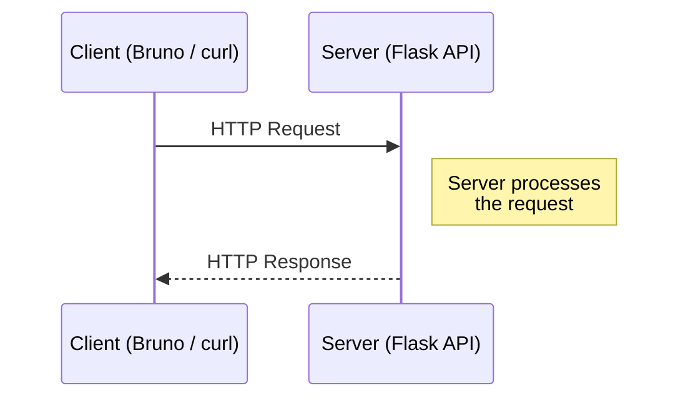
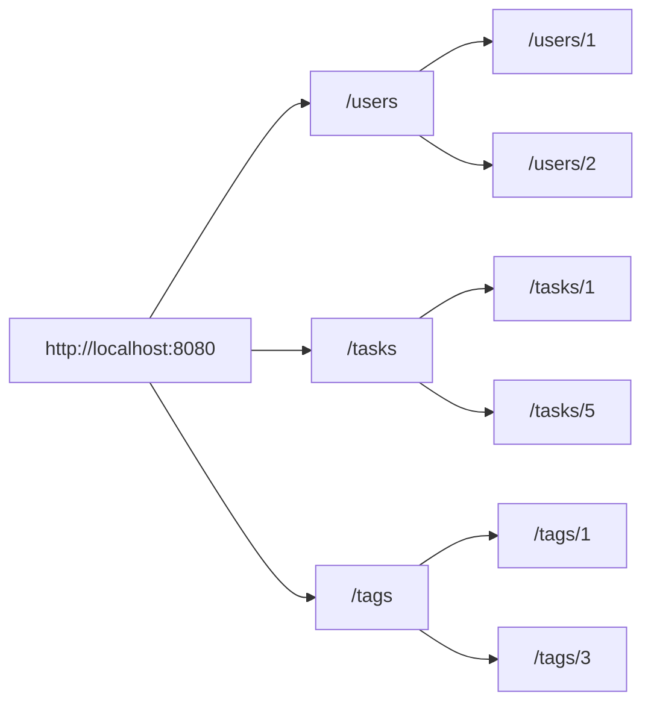
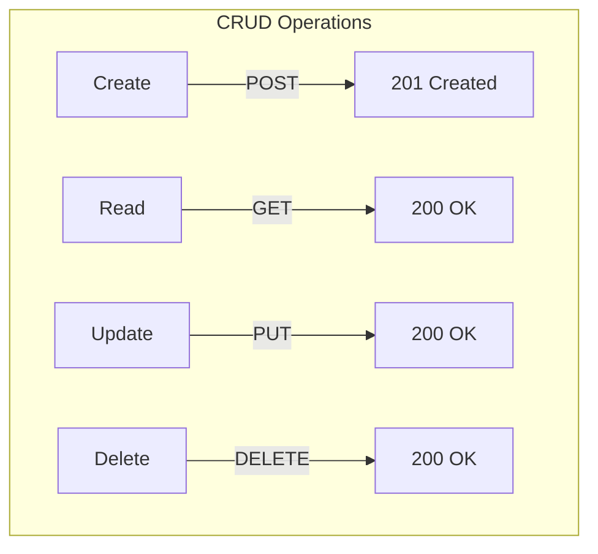
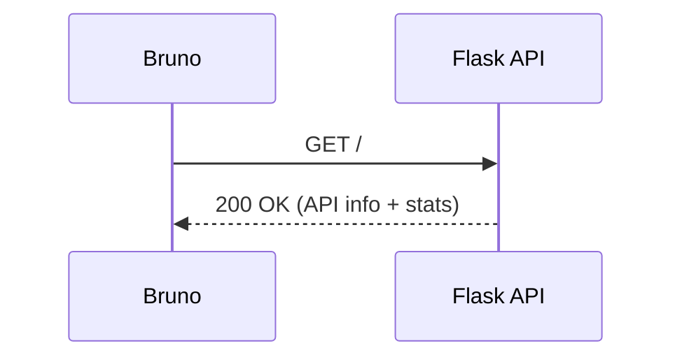
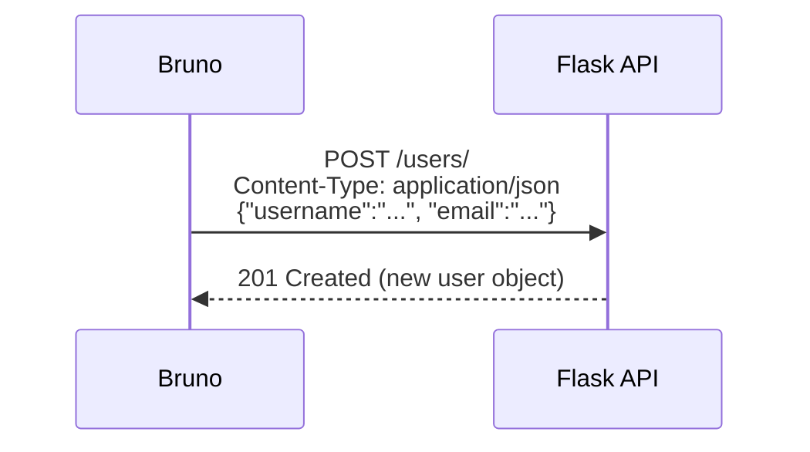
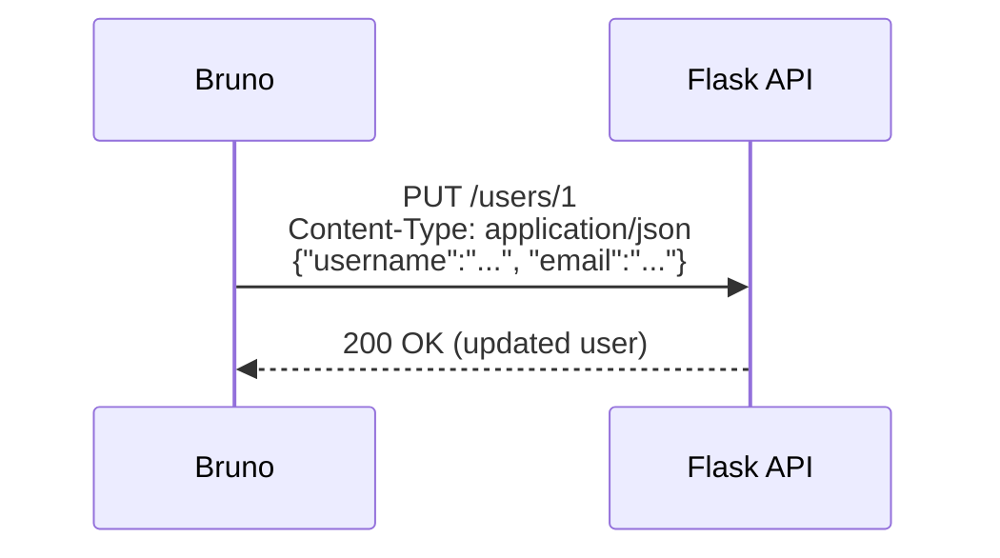
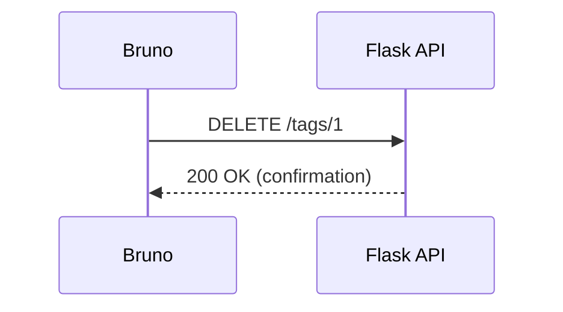
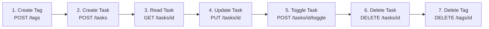

# Exercise: Exploring RESTful APIs with Bruno and cURL

## Overview

| | |
|---|---|
| **Duration** | 1 hour |
| **Tools** | VS Code, Bruno VS Code Extension, `curl`, Flask Task Manager API |
| **Prerequisites** | Python basics, VS Code familiarity, `uv` package manager |
| **Learning Objectives** | Understand REST APIs, HTTP methods, status codes, and request/response cycles |

In this exercise you will use the **Bruno API client** (VS Code extension) and
**`curl`** (command-line tool) to explore and interact with a Flask-based Task
Manager API. You will send HTTP requests, inspect responses, and perform full
CRUD (Create, Read, Update, Delete) operations — giving you hands-on experience
with how modern web applications communicate.

### What is Bruno?

Bruno is an open-source API client that runs inside VS Code. Unlike
cloud-based tools, Bruno stores your requests as plain text files that can be
version-controlled with Git. You will use the **Bruno VS Code extension** for
the primary activities in this exercise.

> **Documentation:** <https://docs.usebruno.com/introduction/what-is-bruno>

### What is `curl`?

`curl` is a command-line tool for sending HTTP requests. It is pre-installed
on Windows (PowerShell), macOS, and Linux. Throughout this exercise, you will
see **curl equivalent** commands alongside the Bruno instructions so you can
try both approaches.

> **Documentation:** <https://curl.se/docs/manpage.html>

---

## Part 1 — Theory: APIs and REST (15 minutes)

Read each question carefully and write your answers in your own words.

### Q1: What is an API?

In one or two sentences, explain what an **API** (Application Programming
Interface) is and why applications use them.

### Q2: Client–Server Model

The diagram below shows the basic request–response cycle between a client and
a server.



a) Which side **initiates** communication — the client or the server?

b) After the server sends a response, does it remember anything about the
   request? What is this property called?

### Q3: HTTP Methods

RESTful APIs use HTTP methods (verbs) to indicate the intended action on a
resource. Match each method to its purpose:

| HTTP Method | Purpose (choose one) |
|-------------|----------------------|
| `GET` | ___ |
| `POST` | ___ |
| `PUT` | ___ |
| `DELETE` | ___ |

**Options:** Create a new resource · Retrieve a resource · Remove a resource ·
Update/replace a resource

### Q4: HTTP Status Codes

Status codes tell the client what happened. For each code below, write what
category it belongs to (Success, Client Error, or Server Error) and briefly
what it means:

| Code | Category | Meaning |
|------|----------|---------|
| `200 OK` | | |
| `201 Created` | | |
| `400 Bad Request` | | |
| `404 Not Found` | | |
| `409 Conflict` | | |

### Q5: RESTful Resources

A RESTful API models data as **resources** accessed via URLs. Study the
diagram below.



a) What does the URL `/users` represent?

b) What does the URL `/users/2` represent?

c) If you wanted to create a new task, which URL and HTTP method would you
   use?

### Q6: CRUD and REST

CRUD stands for **Create, Read, Update, Delete** — the four basic operations
on data. Complete the table mapping CRUD operations to HTTP methods and
typical status codes:



| CRUD Operation | HTTP Method | Request Body? | Typical Success Code |
|----------------|-------------|---------------|----------------------|
| Create | ___ | ___ | ___ |
| Read | ___ | ___ | ___ |
| Update | ___ | ___ | ___ |
| Delete | ___ | ___ | ___ |

---

## Part 2 — Setup (5 minutes)

### Step 1: Install the Bruno VS Code Extension

1. Open VS Code.
2. Open the Extensions panel (`Ctrl+Shift+X`).
3. Search for **"Bruno"**.
4. Install **"Bruno"** (the API Client extension by Bruno).

Verify installation: open the Command Palette (`Ctrl+Shift+P`), type
`Bruno` — you should see Bruno commands listed.

> **Docs:** <https://docs.usebruno.com/introduction/what-is-bruno>

### Step 2: Start the Task Manager API

Open a terminal in the `flask_orm_api_demo` project folder and run:

```powershell
# Seed the database (first time only)
uv run python task_manager_07/manage_db.py

# Start the server
uv run python run_07.py
```

You should see output indicating the server is running at
`http://localhost:8080`. **Leave this terminal running** for the rest of the
exercise.

### Step 3: Create a Bruno Collection

1. Click the **Bruno** icon in the VS Code Activity Bar (left sidebar).
2. Click **"Create Collection"**.
3. Set:
   - **Name:** `Task Manager API`
   - **Location:** your project folder
4. Click **Create**.

Your collection now appears in the Bruno sidebar.

---

## Part 3 — Reading Data with GET Requests (15 minutes)

### Exercise 3.1: Get API Information



1. In Bruno, right-click your collection → **New Request**.
2. **Name:** `API Info`
3. **Method:** `GET`
4. **URL:** `http://localhost:8080/`
5. Click **Send** (or `Ctrl+Enter`).

**curl equivalent:**

```powershell
curl -s http://localhost:8080/ | python -m json.tool
```

**Questions:**

a) What HTTP status code did you receive?

b) What fields are in the JSON response?

c) How many users, tasks, and tags are currently in the database?

### Exercise 3.2: List All Users

1. Create a new request: **Name:** `Get All Users`, **Method:** `GET`,
   **URL:** `http://localhost:8080/users/`
2. Send the request.

**curl equivalent:**

```powershell
curl -s http://localhost:8080/users/ | python -m json.tool
```

**Questions:**

a) How many user objects are in the response array?

b) What fields does each user object contain?

c) Pick any user — what is their `username` and `email`?

### Exercise 3.3: Get a Single User

1. Create a new request: **Name:** `Get User by ID`, **Method:** `GET`,
   **URL:** `http://localhost:8080/users/1`
2. Send the request.

**curl equivalent:**

```powershell
curl -s http://localhost:8080/users/1 | python -m json.tool
```

**Questions:**

a) What additional information do you get for a single user that you did
   **not** see in the list?

b) Change the URL to `/users/999` and send. What status code and error
   message do you receive?

### Exercise 3.4: Explore Tasks and Tags

1. Create and send GET requests for:
   - `http://localhost:8080/tasks/`
   - `http://localhost:8080/tasks/1`
   - `http://localhost:8080/tags/`
   - `http://localhost:8080/tags/1`

**Questions:**

a) What fields does a task object include? Which field links a task to a
   user?

b) What fields does a tag object include when listed vs. when retrieved
   individually?

c) How are tasks and tags related to each other?

---

## Part 4 — Creating Data with POST Requests (10 minutes)

### Exercise 4.1: Create a New User



1. Create a new request: **Name:** `Create User`, **Method:** `POST`,
   **URL:** `http://localhost:8080/users/`
2. Click the **Body** tab → select **JSON**.
3. Enter:
   ```json
   {
     "username": "your_name",
     "email": "your_name@example.com"
   }
   ```
4. Send the request.

**curl equivalent:**

```powershell
curl -X POST http://localhost:8080/users/ `
  -H "Content-Type: application/json" `
  -d '{"username": "your_name", "email": "your_name@example.com"}'
```

**Questions:**

a) What status code did you get?

b) What `id` was assigned to your new user? Who assigned it — you or the
   server?

c) Now send a `GET /users/` request. Is your new user in the list?

### Exercise 4.2: Error Handling — Bad Requests

Try each of the following requests and record the status code and error
message:

| Scenario | Request | Status Code | Error Message |
|----------|---------|-------------|---------------|
| Missing body | POST `/users/` with no JSON body | | |
| Missing field | POST `/users/` with `{"username": "test"}` (no email) | | |
| Duplicate | POST `/users/` with the same username from 4.1 | | |

**Question:** Why does the API return different error codes for different
problems? Why is this useful?

### Exercise 4.3: Create a New Task

1. Create a new request: **Name:** `Create Task`, **Method:** `POST`,
   **URL:** `http://localhost:8080/tasks/`
2. Body (JSON) — use the user ID from Exercise 4.1:
   ```json
   {
     "title": "Learn about REST APIs",
     "details": "Complete the Bruno exercise in class",
     "assignee_id": YOUR_USER_ID,
     "tag_ids": [1, 3]
   }
   ```
3. Send the request.

**curl equivalent:**

```powershell
curl -X POST http://localhost:8080/tasks/ `
  -H "Content-Type: application/json" `
  -d '{"title": "Learn about REST APIs", "details": "Complete the Bruno exercise in class", "assignee_id": YOUR_USER_ID, "tag_ids": [1, 3]}'
```

**Questions:**

a) What status code was returned?

b) Look at the response — which tags were associated with the task?

c) What happens if you use a `assignee_id` that does not exist (e.g., `999`)?

---

## Part 5 — Updating and Deleting Data (10 minutes)

### Exercise 5.1: Update a User (PUT)



1. Create a new request: **Name:** `Update User`, **Method:** `PUT`,
   **URL:** `http://localhost:8080/users/YOUR_USER_ID`
2. Body (JSON):
   ```json
   {
     "username": "your_name_updated",
     "email": "new_email@example.com"
   }
   ```
3. Send the request.

**curl equivalent:**

```powershell
curl -X PUT http://localhost:8080/users/YOUR_USER_ID `
  -H "Content-Type: application/json" `
  -d '{"username": "your_name_updated", "email": "new_email@example.com"}'
```

**Questions:**

a) What status code did you get?

b) Verify the change by sending a `GET /users/YOUR_USER_ID` request. Did
   both fields update?

### Exercise 5.2: Toggle Task Completion

1. Create a new request: **Name:** `Toggle Task`, **Method:** `POST`,
   **URL:** `http://localhost:8080/tasks/YOUR_TASK_ID/toggle`
2. Send it.

**curl equivalent:**

```powershell
curl -X POST http://localhost:8080/tasks/YOUR_TASK_ID/toggle
```

**Questions:**

a) What is the value of `is_done` after toggling?

b) Send the same request again. What happens?

c) Why is this endpoint `POST` rather than `PUT`?

### Exercise 5.3: Delete a Tag



1. First, send `GET /tags/1` and note the tag name.
2. Create a new request: **Name:** `Delete Tag`, **Method:** `DELETE`,
   **URL:** `http://localhost:8080/tags/1`
3. Send the request.

**curl equivalent:**

```powershell
curl -X DELETE http://localhost:8080/tags/1
```

**Questions:**

a) What status code and message did you receive?

b) Now send `GET /tags/1`. What happens?

c) Check a task that previously had that tag. Is the tag still there?

---

## Part 6 — Putting It All Together (5 minutes)

### Exercise 6.1: Full CRUD Workflow

Using only Bruno, perform the following operations **in sequence**. Record
the status code for each step.



| Step | Action | URL | Status Code |
|------|--------|-----|-------------|
| 1 | Create a new tag named `"exercise"` | POST `/tags/` | |
| 2 | Create a task with the new tag and any valid user | POST `/tasks/` | |
| 3 | Retrieve the task you just created | GET `/tasks/<id>` | |
| 4 | Update the task title to `"Updated task"` | PUT `/tasks/<id>` | |
| 5 | Toggle the task to completed | POST `/tasks/<id>/toggle` | |
| 6 | Delete the task | DELETE `/tasks/<id>` | |
| 7 | Delete the tag | DELETE `/tags/<id>` | |

### Exercise 6.2: Reflection Questions

a) What is the difference between `POST` and `PUT`?

b) Why do `GET` and `DELETE` requests **not** have a request body, while
   `POST` and `PUT` do?

c) A classmate says: *"I can just type the URL in my browser to create a new
   user."* Is this correct? Why or why not?

d) How does using standard HTTP methods and status codes make an API easier
   to use?

e) Compare using Bruno and `curl` for sending requests. What are the
   advantages and disadvantages of each tool?

---

## Part 7 — Bonus: Repeat the Workflow with `curl` (Optional)

Repeat the CRUD workflow from Exercise 6.1 using only `curl` in the
terminal. Write the full command for each step.

| Step | curl Command |
|------|--------------|
| 1. Create tag | |
| 2. Create task | |
| 3. Read task | |
| 4. Update task | |
| 5. Toggle task | |
| 6. Delete task | |
| 7. Delete tag | |

**Hint:** Use the `-i` flag to see response headers (including the status
code), and pipe through `python -m json.tool` to pretty-print JSON.

---

## References

- [Bruno Documentation](https://docs.usebruno.com/introduction/what-is-bruno)
- [`curl` Manual](https://curl.se/docs/manpage.html)
- [HTTP Methods — MDN Web Docs](https://developer.mozilla.org/en-US/docs/Web/HTTP/Reference/Methods)
- [HTTP Status Codes — MDN Web Docs](https://developer.mozilla.org/en-US/docs/Web/HTTP/Reference/Status)
- [REST API Tutorial](https://restfulapi.net/)
- Flask Task Manager API source code (`task_manager_07/`)
