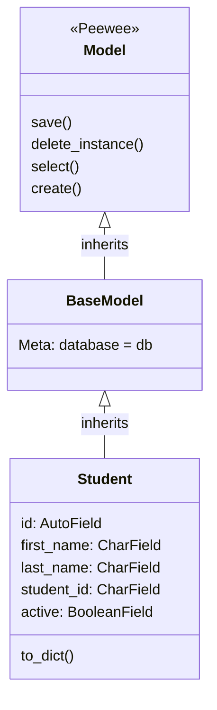
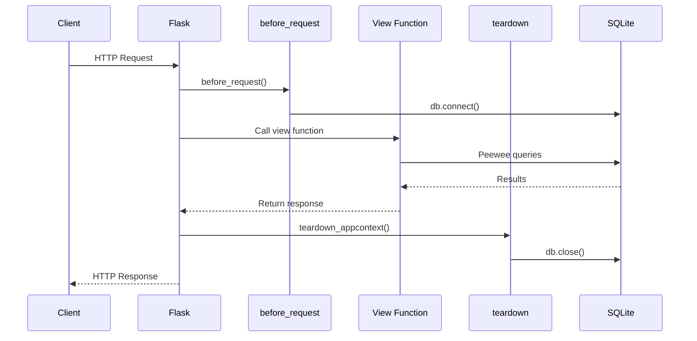
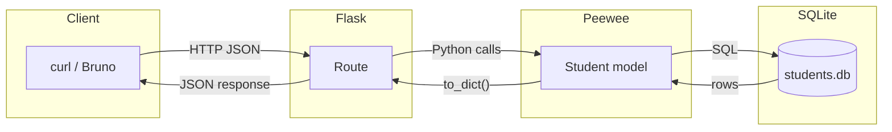

# Exercise: Flask with Peewee ORM

## Overview

### Tools

VS Code, `uv` package manager, `curl`, optionally Bruno                                                                                                                                                                      |
### Learning Objectives

1. Set up a Peewee database with deferred initialization
2. Define ORM models with typed fields
3. Connect Peewee to Flask using request hooks
4. Perform CRUD operations through ORM method calls
5. Serialize model instances to JSON |

### Description

In this exercise you add **database persistence** to a Flask API. Instead of
storing data in a Python list (as you did in the Intro Flask exercise), you will
use the Peewee ORM to store data in a SQLite database file that survives server
restarts.

You will build a small **Student Records API**

> Reference material: `flask_orm.md` (Sections 3–7) it explains every Peewee
> concept you need. The `simple_orm_demo` project is a complete working example
> you can consult at any time.

---

## The Problem Domain: Student Records

You will build an API that manages student records with these fields:

| Field        | Type    | Notes                                                  |
| ------------ | ------- | ------------------------------------------------------ |
| `id`         | integer | Auto-generated primary key                             |
| `first_name` | string  | Max 50 characters                                      |
| `last_name`  | string  | Max 50 characters                                      |
| `student_id` | string  | Max 20 characters, must be unique (e.g. `"A01234567"`) |
| `active`     | boolean | Defaults to `True`                                     |

The API will support:

| Method   | URL                  | Purpose              | Success Code     |
| -------- | -------------------- | -------------------- | ---------------- |
| `GET`    | `/api/students`      | List all students    | `200`            |
| `GET`    | `/api/students/<id>` | Get one student      | `200` (or `404`) |
| `POST`   | `/api/students`      | Create a new student | `201`            |
| `PUT`    | `/api/students/<id>` | Update a student     | `200` (or `404`) |
| `DELETE` | `/api/students/<id>` | Delete a student     | `200` (or `404`) |

---

## Setup (3 minutes)

Open a terminal and create a new project:

```powershell
mkdir student_records
cd student_records
uv init
uv add flask peewee
```

### Q0.1

Open `pyproject.toml`. Confirm that both `flask` and `peewee` appear under
`[project.dependencies]`.

---

## Part 1 — Database and Model (15 minutes)

In this part you set up the database layer **before** writing any Flask code.
This is the same order used in `simple_orm_demo` and the fleet monitor project.

### Target structure for Part 1

```text
student_records/
├── student_app/
│   ├── __init__.py          # Empty for now
│   ├── config.py            # Database path
│   ├── database.py          # Deferred database + BaseModel
│   └── models.py            # Student model
├── run.py                   # Empty for now
└── pyproject.toml
```

Create the directories:

```powershell
mkdir student_app
mkdir student_app/api
```

### Step 1: Create the database module — `student_app/database.py`

This file creates a **deferred** Peewee database and a **base model class**.

```python
from peewee import SqliteDatabase, Model

db = SqliteDatabase(None)


class BaseModel(Model):
    class Meta:
        database = db
```

### Q1.1

The database path is `None`. Why? When and where will the real path be set?

> **Hint:** See `flask_orm.md` Section 4 — "Deferred initialization".

### Q1.2

The model inheritance chain used in this exercise:



What would happen if you skipped `BaseModel` and wrote `class Student(Model):`
directly? What would you have to add to the `Student` class to make it work?

### Step 2: Create the config module — `student_app/config.py`

```python
from pathlib import Path

DATABASE_PATH = str(Path(__file__).resolve().parent.parent / "instance" / "students.db")
```

### Q1.3

This path resolves to `student_records/instance/students.db`. Why is the
database file placed outside the `student_app/` package, in a separate
`instance/` folder?

### Step 3: Define the Student model — `student_app/models.py`

Now you write the model yourself. Using the field table from the Domain section
above and the Peewee field types from `flask_orm.md` Section 5, create the
`Student` model.

The file has been started for you — fill in the missing pieces:

```python
from peewee import AutoField, BooleanField, CharField

from .database import BaseModel


class Student(BaseModel):
    class Meta:
        table_name = "student"

    # TODO: Define the five fields listed in the Domain section.
    #
    # Field mapping (see flask_orm.md Section 5):
    #   integer primary key → AutoField()
    #   string              → CharField(max_length=...)
    #   boolean             → BooleanField(default=...)
    #
    # Remember: student_id must be unique — use unique=True

    def to_dict(self):
        """Convert this model instance to a plain dictionary."""
        return {
            "id": self.id,
            "first_name": self.first_name,
            "last_name": self.last_name,
            "student_id": self.student_id,
            "active": self.active,
        }
```

### Q1.4

Why does the model need a `to_dict()` method? What happens if you try to return
a Peewee model instance directly from a Flask view function?

### Q1.5

What does `unique=True` on `student_id` do at the database level? What happens
if you try to create two students with the same `student_id`?

### Step 4: Verify your model compiles

Create a temporary test script `check_model.py` in the project root:

```python
from student_app.database import db
from student_app.models import Student

# Point the deferred database at a temporary file
db.init(":memory:")

# Create the table
db.create_tables([Student])

# Insert a test row
s = Student.create(
    first_name="Ada",
    last_name="Lovelace",
    student_id="A00000001",
)

print(s.to_dict())

# Clean up
db.close()
```

Run it:

```powershell
uv run python check_model.py
```

You should see:

```
{'id': 1, 'first_name': 'Ada', 'last_name': 'Lovelace', 'student_id': 'A00000001', 'active': True}
```

### Q1.6

The script uses `db.init(":memory:")`. What does `:memory:` mean? Why is this
useful for quick tests?

Once it works, delete `check_model.py` — it was only for verification.

---

## Part 2 — Connecting Peewee to Flask (12 minutes)

Now you wire the database into a Flask application using the **application**
**factory pattern** and **request hooks** (`before_request` /
`teardown_appcontext`).

Every request passes through the hooks you will configure:



### Target structure after Part 2

```text
student_records/
├── student_app/
│   ├── __init__.py          # Application factory
│   ├── config.py
│   ├── database.py
│   ├── models.py
│   └── api/
│       ├── __init__.py      # Blueprint definition
│       └── routes.py        # Route handlers
├── run.py                   # Entry script
└── pyproject.toml
```

### Step 1: Create the application factory — `student_app/__init__.py`

This is the most critical file. It follows the same pattern as
`simple_orm_demo`.

Fill in the four numbered `TODO` comments:

```python
from pathlib import Path

from flask import Flask

from . import config
from .database import db
from .models import Student


def create_app():
    app = Flask(__name__)

    # --- Database setup ---
    db_path = Path(config.DATABASE_PATH)
    db_path.parent.mkdir(exist_ok=True)

    # TODO 1: Initialize the deferred database with the path.
    #         Which method on db sets the real file path?
    #         (See flask_orm.md Section 4 — "Connecting Peewee to Flask")

    @app.before_request
    def before_request():
        # TODO 2: Open a database connection.
        #         Use reuse_if_open=True to avoid errors if already open.
        pass

    @app.teardown_appcontext
    def teardown(exc):
        # TODO 3: Close the database connection if it is open.
        #         Check db.is_closed() first to avoid closing an already-closed connection.
        pass

    # --- Blueprint registration ---
    from .api import api_bp
    app.register_blueprint(api_bp)

    # --- Create tables ---
    # TODO 4: Create the Student table. Use safe=True so it does not
    #         error if the table already exists.
    #         (See flask_orm.md Section 6)

    return app
```

### Q2.1

What does `@app.before_request` do? When does this function run relative to your
view function?

### Q2.2

Why does `teardown_appcontext` close the database connection even if an error
occurred? What would happen if connections were never closed?

### Q2.3

The `from .api import api_bp` is inside `create_app()` rather than at the top of
the file. Why? (Hint: See `flask_intro.md` — application factory section.)

### Step 2: Create the blueprint — `student_app/api/__init__.py`

```python
from flask import Blueprint

api_bp = Blueprint("api", __name__, url_prefix="/api")

from . import routes  # noqa: E402, F401
```

### Q2.4

This blueprint uses `url_prefix="/api"`. If a route inside the blueprint is
`@api_bp.route("/students")`, what is the full URL a client would use?

### Step 3: Create route stubs — `student_app/api/routes.py`

For now, create a single route to verify the wiring works:

```python
from flask import jsonify

from . import api_bp


@api_bp.route("/students", methods=["GET"])
def list_students():
    return jsonify([])
```

### Step 4: Create the entry script — `run.py`

```python
from student_app import create_app

app = create_app()

if __name__ == "__main__":
    app.run(host="localhost", port=5000, debug=True)
```

### Step 5: Test the wiring

Start the server:

```powershell
uv run python run.py
```

In a second terminal, test the endpoint:

```powershell
curl http://localhost:5000/api/students
```

You should get `[]` — an empty JSON array. This confirms Flask, the blueprint,
the database initialization, and the request hooks are all connected.

### Q2.5

Check the `instance/` folder in your project directory. Is there a `students.db`
file? When was it created?

---

## Part 3 — CRUD Routes (15 minutes)

Now you implement the full set of CRUD operations. Each step adds one route. The
scaffolding decreases as you go — by the end, you write a route from scratch.



### Step 1: List all students — GET `/api/students`

Replace your stub with a real implementation:

```python
from flask import jsonify, request

from . import api_bp
from ..models import Student


@api_bp.route("/students", methods=["GET"])
def list_students():
    students = Student.select().order_by(Student.last_name)
    result = []
    for s in students:
        result.append(s.to_dict())
    return jsonify(result)
```

Test it (the list will be empty until you add a POST route):

```powershell
curl http://localhost:5000/api/students
```

### Step 2: Create a student — POST `/api/students`

Add this route. Read through it carefully — notice how it validates input,
creates the database row, and returns the correct status code:

```python
@api_bp.route("/students", methods=["POST"])
def create_student():
    data = request.get_json()

    if not data:
        return {"error": "Request body must be JSON"}, 400

    first_name = data.get("first_name")
    last_name = data.get("last_name")
    student_id = data.get("student_id")

    if not first_name or not last_name or not student_id:
        return {"error": "first_name, last_name, and student_id are required"}, 400

    # Check for duplicate student_id
    if Student.get_or_none(Student.student_id == student_id):
        return {"error": f"student_id '{student_id}' already exists"}, 409

    student = Student.create(
        first_name=first_name,
        last_name=last_name,
        student_id=student_id,
    )
    return student.to_dict(), 201
```

Test it — create two students:

```powershell
curl -X POST http://localhost:5000/api/students `
  -H "Content-Type: application/json" `
  -d '{"first_name": "Ada", "last_name": "Lovelace", "student_id": "A00000001"}'

curl -X POST http://localhost:5000/api/students `
  -H "Content-Type: application/json" `
  -d '{"first_name": "Alan", "last_name": "Turing", "student_id": "A00000002"}'
```

Now list them:

```powershell
curl http://localhost:5000/api/students
```

### Q3.1

Stop the server (`Ctrl+C`), then start it again. List the students. Are they
still there? Why?

### Q3.2

Try creating a student with the same `student_id` as an existing one. What
status code do you get? Why `409` and not `400`?

### Step 3: Get a single student — GET `/api/students/<id>`

Write this route **on your own**. You need to:

1. Accept an integer `student_id` parameter from the URL
2. Use `Student.get_or_none()` to look up the student by primary key
3. Return `404` with an error message if not found
4. Return the student as a dictionary if found

```python
@api_bp.route("/students/<int:student_id>", methods=["GET"])
def get_student(student_id):
    # TODO: Look up the student by primary key (student_id is the URL
    #       parameter — the auto-generated id, not the A-number)
    # TODO: Return 404 if not found
    # TODO: Return the student as a dict
    pass
```

> **Hint:** Look at how `get_book` works in
> `simple_orm_demo/book_app/api/routes.py`.

Test it:

```powershell
curl http://localhost:5000/api/students/1
curl http://localhost:5000/api/students/999
```

### Step 4: Update a student — PUT `/api/students/<id>`

Write this route **on your own**. You need to:

1. Look up the student (return 404 if not found)
2. Parse the JSON body
3. Update only the fields that are present in the request body (`first_name`,
   `last_name`, `active`)
4. Call `student.save()` to persist the changes
5. Return the updated student as a dictionary

```python
@api_bp.route("/students/<int:student_id>", methods=["PUT"])
def update_student(student_id):
    # TODO: Implement the update logic.
    #
    # Key Peewee method: after modifying attributes on the model
    # instance, call student.save() to issue an UPDATE statement.
    #
    # Do NOT allow changing student_id — it should be immutable
    # after creation.
    pass
```

Test it:

```powershell
curl -X PUT http://localhost:5000/api/students/1 `
  -H "Content-Type: application/json" `
  -d '{"active": false}'

curl http://localhost:5000/api/students/1
```

### Q3.3

After the PUT, what is the `active` field set to? Did `first_name` and
`last_name` change?

### Step 5: Delete a student — DELETE `/api/students/<id>`

Write this route with no starter code. It should:

1. Look up the student (return 404 if not found)
2. Delete the row using the Peewee method for removing a single instance
3. Return a confirmation message

> **Hint:** The Peewee method to delete a single model instance is
> `instance.delete_instance()`. See `flask_orm.md` Section 7.

Test the full cycle:

```powershell
# Create
curl -X POST http://localhost:5000/api/students `
  -H "Content-Type: application/json" `
  -d '{"first_name": "Grace", "last_name": "Hopper", "student_id": "A00000003"}'

# Verify
curl http://localhost:5000/api/students

# Delete
curl -X DELETE http://localhost:5000/api/students/3

# Confirm deletion
curl http://localhost:5000/api/students/3
```

---

## Reflection

### Q4.1: In-memory vs. database

In the Intro Flask exercise you stored books in a Python list. In this exercise
you stored students in SQLite via Peewee. List two concrete differences you
experienced between the two approaches.

### Q4.2: The deferred database pattern

Trace the lifecycle of the `db` object from the moment `database.py` is imported
to the moment a view function queries the database. What are the three key
steps?

### Q4.3: Request hooks

What would happen if you removed the `before_request` hook? What would happen if
you removed the `teardown_appcontext` hook? (Try each one and see what error you
get.)

---

## Summary

| Concept                                  | What you practised                                        |
| ---------------------------------------- | --------------------------------------------------------- |
| `SqliteDatabase(None)`                   | Deferred database initialization                          |
| `BaseModel`                              | Sharing database config across models via inheritance     |
| `db.init(path)`                          | Setting the real database path in the application factory |
| `AutoField`, `CharField`, `BooleanField` | Mapping Python types to database columns                  |
| `unique=True`                            | Enforcing uniqueness at the database level                |
| `to_dict()`                              | Serializing ORM instances to JSON-friendly dictionaries   |
| `@app.before_request`                    | Opening a database connection per request                 |
| `@app.teardown_appcontext`               | Closing the connection after each request                 |
| `Model.create()`                         | Inserting a new row                                       |
| `Model.select()`                         | Querying all rows                                         |
| `Model.get_or_none()`                    | Querying a single row by condition                        |
| `.save()`                                | Updating an existing row                                  |
| `.delete_instance()`                     | Removing a row                                            |
| `db.create_tables([...], safe=True)`     | Creating tables without errors on re-run                  |

---

## References

- [Peewee Quickstart](http://docs.peewee-orm.com/en/latest/peewee/quickstart.html)
- [Peewee Model API](http://docs.peewee-orm.com/en/latest/peewee/api.html#Model)
- [Flask — Application Factories](https://flask.palletsprojects.com/en/stable/patterns/appfactories/)
- [flask_orm.md](../notes/flask_orm.md) — Flask with Database Persistence:
  Peewee ORM
- [flask_application_lifecycle_contexts.md](../notes/flask_application_lifecycle_contexts.md)
  — Flask Application Structure and Lifecycle
- [flask_intro.md](../notes/flask_intro.md) — Flask concepts overview
- [simple_orm_demo](../demo/simple_orm_demo/) — Complete working example
