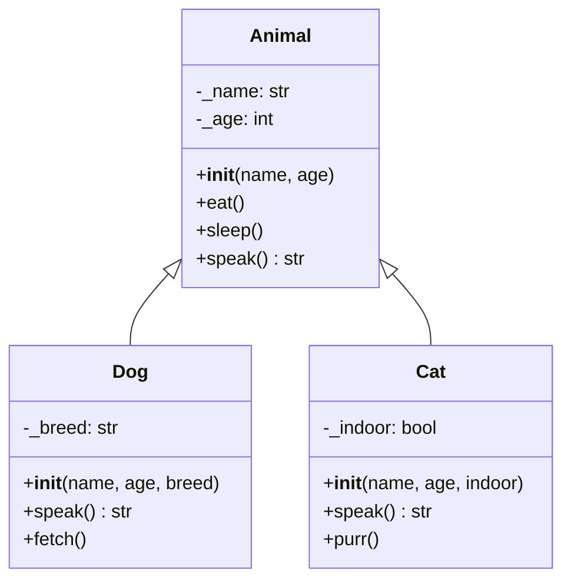
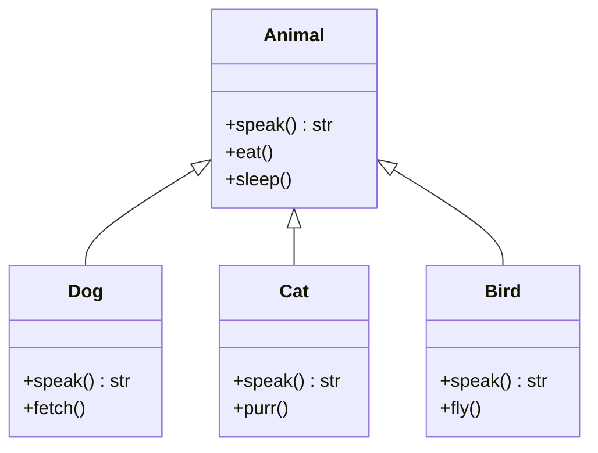
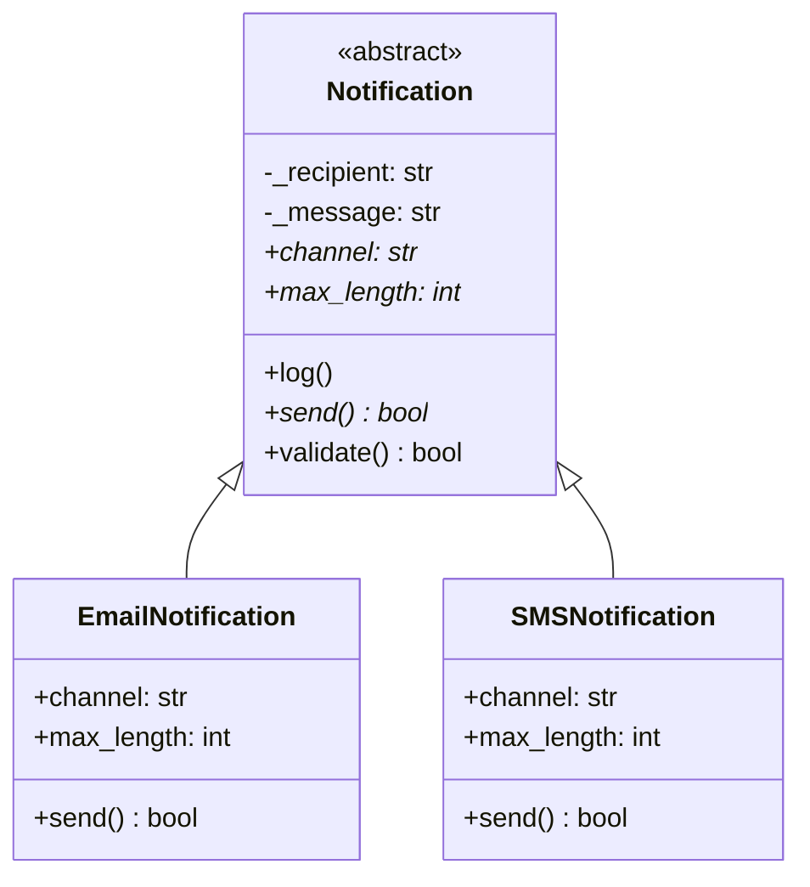

# Inheritance and Abstract Base Classes in Python

These notes build on the concepts in `oop_python_intro.md`. It covers
inheritance, method overriding, polymorphism, and abstract base classes (ABCs)

---

## 1. Inheritance

### What?

Inheritance lets a new class (the **subclass** or **child**) automatically
receive all the attributes and methods of an existing class (the **superclass**
or **parent**). The subclass can then add new behaviour or replace existing
behaviour.

Syntax:

```python
class Parent:
    ...

class Child(Parent):   # Child inherits everything from Parent
    ...
```

### Why?

Imagine you are building a system with `Dog`, `Cat`, and `Bird` classes. Without
inheritance, you would have to copy-paste the `name` and `age` attributes, as
well as the `sleep()` method, into every single class. If you later find a bug
in `sleep()`, you have to fix it in three different places!

Inheritance prevents this by keeping shared logic in one central place (the
parent class). Changes to the parent automatically flow down to the children.
This is the **DRY (Don't Repeat Yourself)** principle. It drastically reduces
code duplication.

It also lets you model **IS-A** relationships naturally. In English, we say "A
Dog _is an_ Animal" or "An Employee _is a_ Person". In code, inheritance
represents these exact hierarchical links, giving your classes a logical
structure.

### Use Case: `Animal` → `Dog`, `Cat`

Without inheritance both `Dog` and `Cat` would each have to repeat the `_name`
and `_age` attributes, plus methods like `eat()` and `sleep()`. With inheritance
those live only in `Animal`.

```python
class Animal:
    def __init__(self, name: str, age: int):
        self._name = name
        self._age = age

    def eat(self):
        print(f"{self._name} is eating.")

    def sleep(self):
        print(f"{self._name} is sleeping.")


class Dog(Animal):          # Dog IS-A Animal
    def __init__(self, name: str, age: int, breed: str):
        super().__init__(name, age)   # run Animal.__init__ first
        self._breed = breed


class Cat(Animal):          # Cat IS-A Animal
    def __init__(self, name: str, age: int, indoor: bool = True):
        super().__init__(name, age)
        self._indoor = indoor
```



---

## 2. `super().__init__()` — Calling the Parent Constructor

### What?

When you create a child class, it doesn't automatically inherit the data setup
from its parent. `super()` is a special built-in function that acts as a bridge
or link to the parent class. By calling `super().__init__(...)` inside a
subclass's `__init__`, you are manually triggering the parent's setup process.

### Why?

A subclass relies on the parent to set up its foundational data. If an
`Employee` is a `Person`, it needs a name and email. But the logic for actually
saving the name and email lives up in `Person.__init__`.

If you don't call `super().__init__()`, the parent's setup code never runs. For
`Employee` that would mean `self._name` and `self._email` would never be created
— causing your program to crash the moment you try to use them!

**Rule of thumb**: Always call `super().__init__(...)` as the _first line_ of a
subclass `__init__`.

### Use Case

```python
class Person:
    def __init__(self, name: str, email: str):
        self._name = name
        self._email = email


class Employee(Person):
    def __init__(self, name: str, email: str, employee_id: str, salary: float):
        super().__init__(name, email)    # Person sets self._name and self._email
        self._employee_id = employee_id  # Employee adds its own attributes
        self._salary = salary
```

```python
# without super().__init__()  ← WRONG
class BrokenEmployee(Person):
    def __init__(self, name: str, email: str, employee_id: str):
        self._employee_id = employee_id  # self._name never set → AttributeError later
```

---

## 3. Method Overriding

### What?

A subclass **overrides** a method by defining a method with the **same name** as
one in its parent class. When you call this method, Python walks up the class
hierarchy and always uses the most specific version it finds first (the
subclass's version).

### Why?

Inheriting methods is great, but sometimes a child class needs to do things
differently than its parent. Overriding allows a child class to customize or
completely replace inherited behaviour.

Usually, the parent defines a method that is either:

1. A blank placeholder that forcing the child to provide the details (e.g.,
   `Animal.speak()` raises `NotImplementedError`).
2. A generic implementation that a specific subclass needs to improve upon.

### Use Case: Overriding `speak()`

```python
class Animal:
    def speak(self) -> str:
        raise NotImplementedError("Subclasses must implement speak()")


class Dog(Animal):
    def speak(self) -> str:          # overrides Animal.speak()
        return "Woof!"


class Cat(Animal):
    def speak(self) -> str:          # overrides Animal.speak()
        return "Meow!"
```

```python
dog = Dog("Rex", 3, "Labrador")
cat = Cat("Whiskers", 5)

print(dog.speak())   # Woof!  ← Dog.speak() called
print(cat.speak())   # Meow! ← Cat.speak() called
```

---

## 4. Extending a Parent Method with `super()`

### What?

Sometimes you don't want to completely _replace_ (override) the parent's method.
Instead, you want to run the parent's original code and then _add your own extra
steps_. Calling `super().method_name()` lets you trigger the parent's version of
the method.

### Why?

This is the ultimate application of DRY (Don't Repeat Yourself). It avoids
duplicating the parent's complex logic inside the subclass. If
`Person.introduce()` already properly formats the name and email,
`Employee.introduce()` should rely on that! The employee class simply asks the
parent to do the heavy lifting, then tacks on the employee ID.

### Use Case: Extending `introduce()`

```python
class Person:
    def introduce(self) -> str:
        return f"Hi, I'm {self._name} (email: {self._email})"


class Employee(Person):
    def introduce(self) -> str:
        base = super().introduce()     # get the Person introduction first
        return f"{base} | Employee ID: {self._employee_id}"
```

```python
emp = Employee("Alice", "alice@example.com", "E1042", 75000.0)
print(emp.introduce())
# Hi, I'm Alice (email: alice@example.com) | Employee ID: E1042
```

The pattern is:

1. Call `super().method()` to get / run the parent's version.
2. Add the subclass-specific part.

---

## 5. Polymorphism

### What?

**Polymorphism** (from Greek: _many forms_) means that you can interact with
different classes in the exact same way, and they will each respond
appropriately. As long as two classes share the same method name (like
`speak()`), a program can call that method without worrying about which specific
class it is currently dealing with.

### Why?

Polymorphism makes your code incredibly flexible and future-proof. It allows you
to write general-purpose loops or functions that work with _any_ object, as long
as it provides the expected method.

If you add a new `Bird` class months later, your existing loops that call
`animal.speak()` will instantly work with the `Bird` without needing any code
updates! This is the true power of Object-Oriented Programming.

### Use Case: A Mixed List of Animals

```python
animals = [
    Dog("Rex", 3, "Labrador"),
    Cat("Whiskers", 5),
    Dog("Buddy", 2, "Poodle"),
]

# Same call, different behaviour — this is polymorphism
for animal in animals:
    print(f"{animal._name} says: {animal.speak()}")
```

```
Rex says: Woof!
Whiskers says: Meow!
Buddy says: Woof!
```

The same principle applies to any class hierarchy — for example, different
`Employee` subtypes can each override `calculate_bonus()`:

```python
employees = [Manager("Alice", "alice@co.com", "M01", 90000),
             SalesRep("Bob", "bob@co.com", "S02", 50000)]

for emp in employees:
    print(f"{emp._name}: bonus = ${emp.calculate_bonus():.2f}")
```



---

## 6. `isinstance()` — Checking Object Types at Runtime

### What?

`isinstance(obj, ClassName)` returns `True` if `obj` is an instance of
`ClassName` _or any subclass of it_.

```python
isinstance(obj, SomeClass)        # True / False
isinstance(obj, (ClassA, ClassB)) # True if obj is instance of either
```

### Why?

Sometimes you need to treat different subclasses differently, or you need to
confirm that an argument is the expected type before calling subclass-specific
methods on it.

### Use Case

```python
animals = [Dog("Rex", 3, "Labrador"), Cat("Whiskers", 5)]

for animal in animals:
    print(isinstance(animal, Animal))  # True  (both are Animals)
    print(isinstance(animal, Dog))     # True only for the Dog

    if isinstance(animal, Dog):
        print(f"{animal._name}'s breed: {animal._breed}")  # safe to access
```

`isinstance` is also commonly used in dunder methods to guard against comparing
incompatible types:

```python
class Person:
    def __eq__(self, other: object) -> bool:
        if not isinstance(other, Person):
            return NotImplemented   # let Python handle the comparison otherwise
        return self._email == other._email  # same email → same person
```

---

## 7. Abstract Base Classes (ABCs)

### What?

An **Abstract Base Class** is a foundational blueprint class that:

1. **Cannot be created directly.** (You cannot create a generic "Abstract
   Notification", only an Email or SMS Notification).
2. Declares one or more **abstract methods** that every child class _must_ write
   code for.

Python's `abc` module provides the tools to enforce these rules:

```python
from abc import ABC, abstractmethod
```

- Inherit your parent class from `ABC` to make it abstract.
- Add the `@abstractmethod` decorator above any method the child is forced to
  implement.

### Why?

When working on large projects, you need to guarantee that certain subclasses
behave correctly. An ABC acts as an **enforceable strict contract**. It tells
other developers: _"If you want to create a new Notification type, you
absolutely MUST provide your own custom `send()` method."_

Without an ABC, a developer might forget to write `send()`. The code would load
fine, but crash later when `send()` is finally called. ABCs prevent this by
completely refusing to create an object if it violates the contract. You find
the error immediately instead of later in production.

### Use Case: `Notification` as an ABC

```python
from abc import ABC, abstractmethod

class Notification(ABC):               # ← inherits from ABC
    def __init__(self, recipient: str, message: str):
        self._recipient = recipient
        self._message = message

    # Concrete method — shared by all subclasses, no override required
    def log(self):
        print(f"[LOG] Sending '{self._message}' to {self._recipient}")

    @abstractmethod                    # ← subclasses MUST implement this
    def send(self) -> bool:
        pass
```

Trying to instantiate `Notification` directly raises a `TypeError`:

```python
n = Notification("user@example.com", "Hello!")
# TypeError: Can't instantiate abstract class Notification
# with abstract method send
```

A concrete subclass that implements all abstract methods works fine:

```python
class EmailNotification(Notification):
    def send(self) -> bool:
        print(f"Sending email to {self._recipient}: {self._message}")
        return True


class SMSNotification(Notification):
    def send(self) -> bool:
        print(f"Sending SMS to {self._recipient}: {self._message}")
        return True
```

### Abstract Properties

`@property @abstractmethod` (applied in that order) makes a property abstract.
Every subclass must define it as a `@property`.

```python
class Notification(ABC):
    @property
    @abstractmethod
    def channel(self) -> str:
        """The delivery channel label, e.g. 'Email' or 'SMS'."""

    @property
    @abstractmethod
    def max_length(self) -> int:
        """Maximum allowed message length for this channel."""

    def validate(self) -> bool:
        # validate() is concrete, but it uses the two abstract properties.
        # This guarantees validation rules are enforced regardless of subclass.
        if len(self._message) > self.max_length:
            raise ValueError(
                f"{self.channel} messages cannot exceed {self.max_length} chars"
            )
        return True
```

Implementing the abstract properties in `SMSNotification`:

```python
class SMSNotification(Notification):
    @property
    def channel(self) -> str:
        return "SMS"

    @property
    def max_length(self) -> int:
        return 160

    def send(self) -> bool:
        self.validate()
        print(f"Sending SMS to {self._recipient}: {self._message}")
        return True
```

### Abstract Methods with a Concrete Body

An abstract method _can_ have a body. Making it abstract forces every subclass
to declare an override, while the body provides shared logic that subclasses can
access via `super()`.

```python
class Report(ABC):
    def __init__(self, title: str):
        self._title = title

    @abstractmethod
    def generate(self):
        # Shared base logic — subclasses call super().generate() to use it
        print(f"=== {self._title} ===")
        print("Report generated\n")
```

```python
class SalesReport(Report):
    def __init__(self, title: str, total_sales: float):
        super().__init__(title)
        self._total_sales = total_sales

    def generate(self):
        super().generate()                          # print the header first
        print(f"Total Sales: ${self._total_sales:,.2f}")  # then add specific content


class InventoryReport(Report):
    def __init__(self, title: str, item_count: int):
        super().__init__(title)
        self._item_count = item_count

    def generate(self):
        super().generate()
        print(f"Items in stock: {self._item_count}")
```

This pattern ensures every subclass must acknowledge the `generate` contract,
yet the shared header is printed once and reused by all.



---

## 8. Multiple Inheritance and Mixins

### What?

Python supports **multiple inheritance** — a class can list more than one
parent:

```python
class Child(ParentA, ParentB):
    ...
```

A **mixin** is a small class designed to be mixed into other classes to add a
specific, focused behaviour. Mixins are typically not meant to be instantiated
on their own.

### Why?

Mixins let you attach "plug-and-play" behaviour (e.g., "this object can be
logged") to any class without drastically changing your main class hierarchy or
copying code.

### Method Resolution Order (MRO) Explained

When a class has multiple parents, what happens if both parents have a method
with the exact same name? Python needs strict rules to avoid confusion and
figure out which method to run. It does this using **Method Resolution Order
(MRO)**.

MRO is simply the "search path" Python walks through when looking for a method
or attribute. It follows a consistent order:

1. First, search the **current class** (the child).
2. Next, search the **parents**, from **left to right** exactly as they are
   listed in the class definition parentheses!
3. Python keeps going up the family tree until reaching the base `object`.

Because of MRO, the order in which you list parents heavily matters!

### Use Case: `LoggableMixin`

A `LoggableMixin` adds a `log()` helper to any class that needs it, without
forcing all classes in the hierarchy to inherit from a common logging base:

```python
class LoggableMixin:
    """Mixin: adds a log() helper to any class."""
    def log(self, message: str):
        print(f"[{self.__class__.__name__}] {message}")
```

```python
class Service:
    def process(self, data: str) -> str:
        return data.upper()


class LoggableService(LoggableMixin, Service):   # ← Mixin listed BEFORE Service
    def process(self, data: str) -> str:
        self.log(f"Processing: {data}")
        result = super().process(data)
        self.log(f"Done: {result}")
        return result
```

When Python sees `super().process(data)` inside `LoggableService`, how does it
know where to look? It checks the **MRO** to find the next class in sequence.

The MRO for `LoggableService(LoggableMixin, Service)` goes left to right:

1. `LoggableService`
2. `LoggableMixin` (Left parent)
3. `Service` (Right parent)
4. `object` (Base class for everything in Python)

Because `LoggableMixin` does not have a `process()` method of its own, the
`super()` call bypasses it entirely and correctly routes to `Service.process()`.

Similarly, when `self.log()` is called, Python checks `LoggableService` (not
there), then checks `LoggableMixin` and perfectly finds the method!

```python
svc = LoggableService()
svc.process("hello")
# [LoggableService] Processing: hello
# [LoggableService] Done: HELLO

isinstance(svc, LoggableMixin)  # True
isinstance(svc, Service)        # True
```

You can inspect the MRO with:

```python
print(LoggableService.__mro__)
# (<class 'LoggableService'>, <class 'LoggableMixin'>,
#  <class 'Service'>, <class 'object'>)
```

---

## Summary

| Concept              | Syntax                                    | Key Point                                      |
| -------------------- | ----------------------------------------- | ---------------------------------------------- |
| Inheritance          | `class Sub(Parent):`                      | Sub receives all parent attributes and methods |
| Parent constructor   | `super().__init__(...)`                   | Always call as the first line of `__init__`    |
| Method override      | Define same method name in subclass       | Python picks the most specific version         |
| Extend via `super()` | `result = super().method()` then add more | Re-use parent logic, add subclass logic        |
| Polymorphism         | Same call, different classes              | Code works with any subclass uniformly         |
| `isinstance()`       | `isinstance(obj, Class)`                  | True for the class and any of its subclasses   |
| Abstract class       | `class Foo(ABC):`                         | Cannot be instantiated                         |
| Abstract method      | `@abstractmethod`                         | Subclasses must implement; may have a body     |
| Abstract property    | `@property` + `@abstractmethod`           | Subclasses must implement as a property        |
| Mixin                | Small class adding one focused behaviour  | List before concrete class for correct MRO     |
