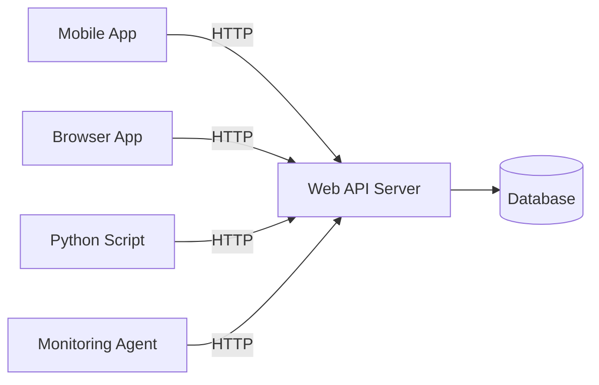
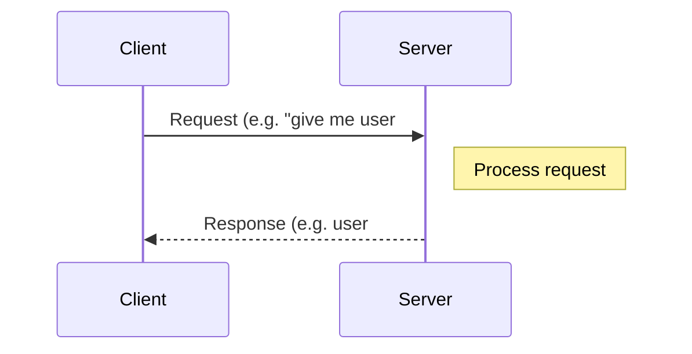
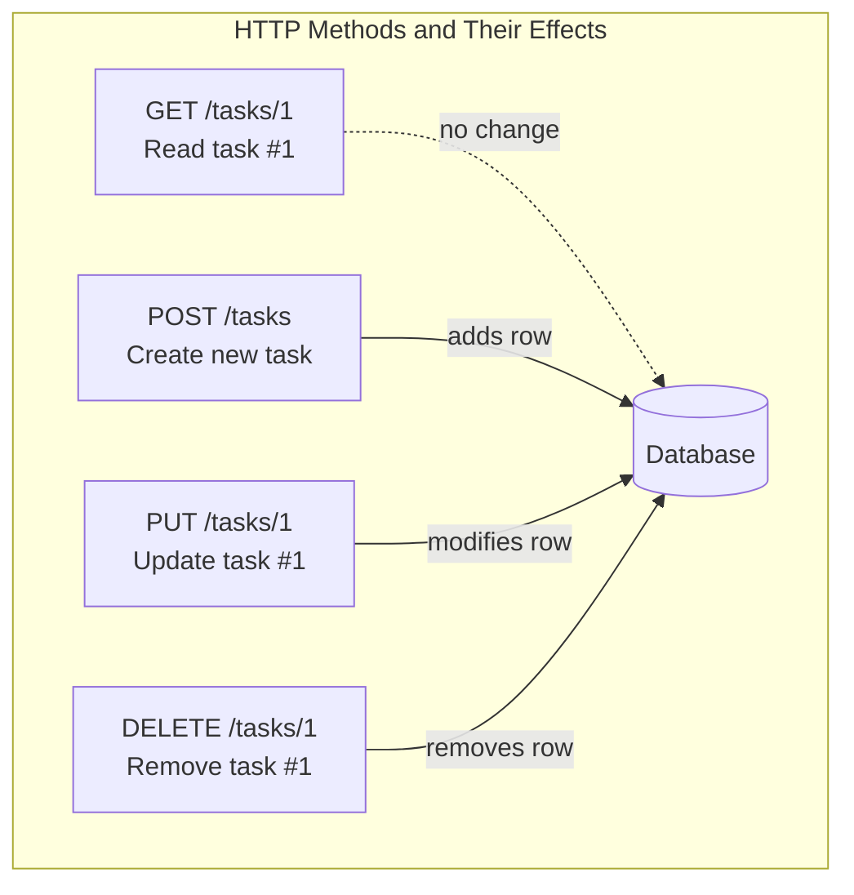
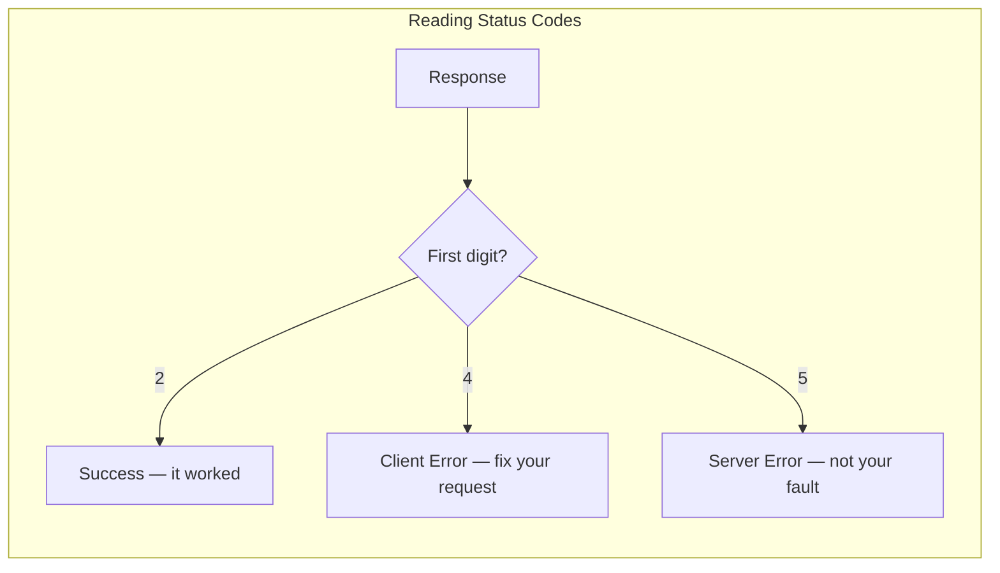
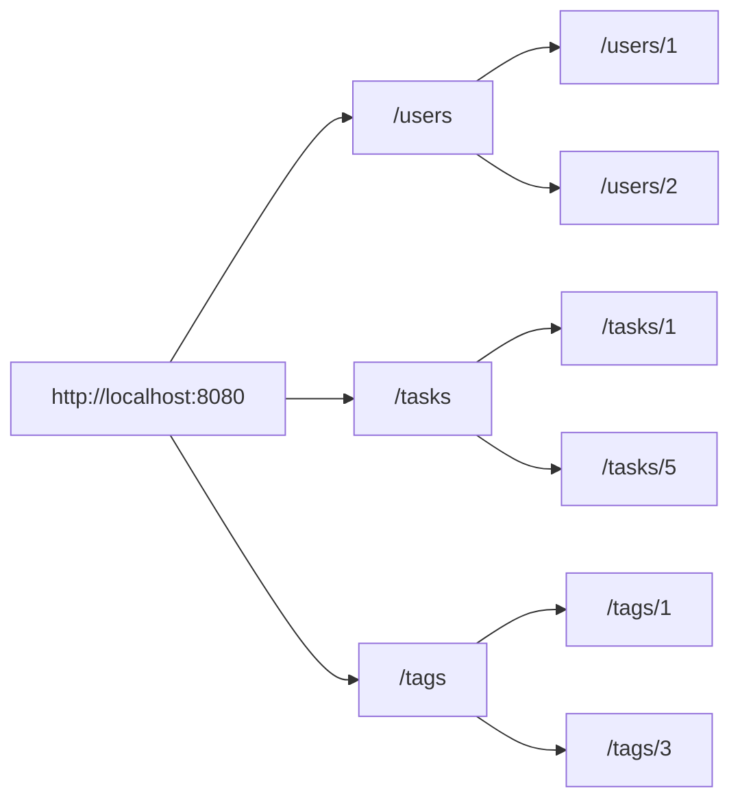
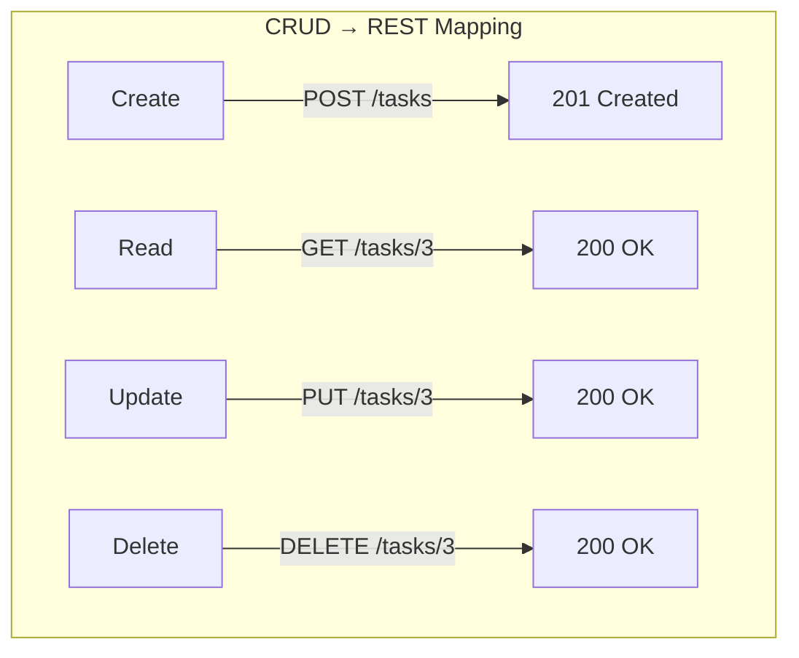
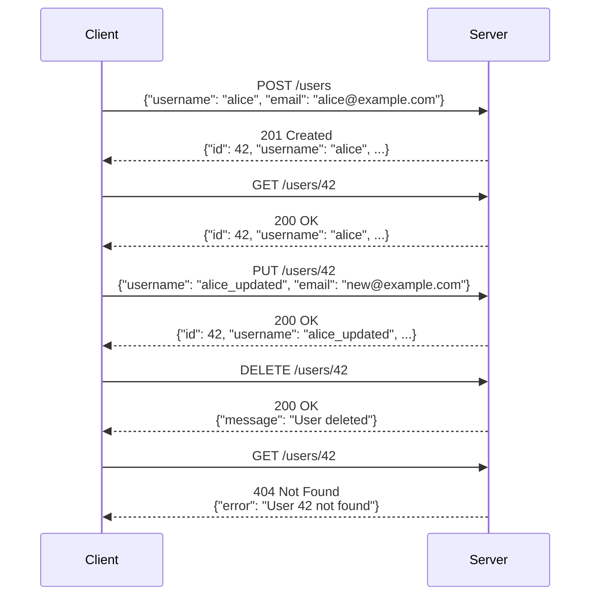
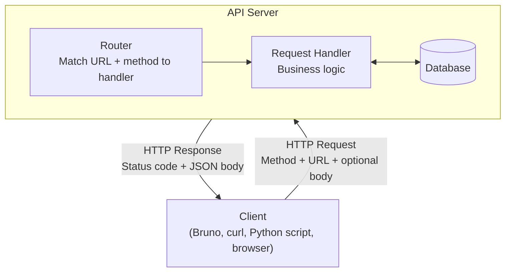
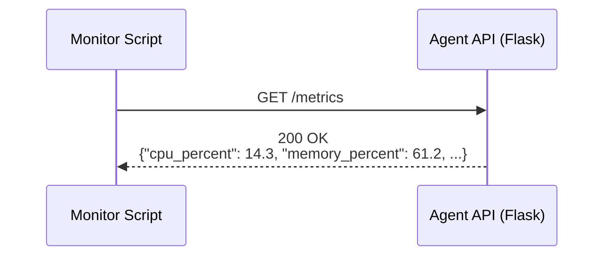

# HTTP and RESTful APIs

How applications communicate over the web. This guide covers
the concepts and vocabulary you need before building or consuming a web API with
Python and Flask.

---

## 1. What is an API?

An **API** (Application Programming Interface) is a contract between two pieces
of software that defines how they can talk to each other. You already use APIs
every time you call a Python function — the function name, its parameters, and
its return value form an interface.

A **web API** extends this idea over a network. Instead of calling a function
directly, a program sends a message over HTTP to a server, and the server sends
a message back.

### Why web APIs matter

- **Mobile apps** use APIs to fetch data from a remote server.
- **Single-page web apps** (Gmail, Google Maps) load data in the background
  through APIs.
- **Monitoring tools** poll APIs to collect system metrics (CPU, memory, disk
  usage) from remote servers.
- **Automation scripts** create, update, or delete records without a graphical
  interface.



---

## 2. The Client–Server Model

Web communication follows a **client–server** model:

1. The **client** sends a request (a browser, a Python script, an API testing
   tool).
2. The **server** processes the request and sends back a response.
3. Communication is **always initiated by the client** — the server only
   responds.



### Statelessness

HTTP is **stateless** — the server does not remember anything about previous
requests. Every request must contain all the information the server needs to
process it. If you send `GET /users/3` twice, the server treats each request as
completely independent.

This simplifies server design: the server does not need to track which client is
"logged in" or which step of a workflow they are on. Each request stands alone.

---

## 3. HTTP: The Language of the Web

**HTTP** (Hypertext Transfer Protocol) is the protocol that clients and servers
use to exchange messages. Every URL you visit in a browser, every API call from
a Python script, and every image that loads on a web page travels over HTTP.

### 3.1 HTTP Request Structure

An HTTP request has four parts:

```
Request Line      ← method + path + version
Headers           ← metadata (key: value pairs)
                  ← blank line
Body (optional)   ← data sent to the server
```

**Example — creating a new user:**

```http
POST /users HTTP/1.1
Host: localhost:8080
Content-Type: application/json

{
  "username": "alice",
  "email": "alice@example.com"
}
```

| Part | What it contains |
|------|------------------|
| **Request line** | The HTTP method (`POST`), the path (`/users`), and the protocol version |
| **Headers** | `Host` tells the server which site; `Content-Type` tells it the body format |
| **Body** | The actual data — here a JSON object with two fields |

### 3.2 HTTP Response Structure

An HTTP response also has four parts:

```
Status Line       ← version + status code + reason
Headers           ← metadata
                  ← blank line
Body              ← data returned by the server
```

**Example — the server confirms the user was created:**

```http
HTTP/1.1 201 Created
Content-Type: application/json

{
  "id": 42,
  "username": "alice",
  "email": "alice@example.com"
}
```

| Part | What it contains |
|------|------------------|
| **Status line** | Protocol version, a numeric status code (`201`), and a human-readable reason (`Created`) |
| **Headers** | `Content-Type` tells the client the body is JSON |
| **Body** | The created resource, now including the server-assigned `id` |

### 3.3 Common Request Headers

| Header | Purpose | Example |
|--------|---------|---------|
| `Host` | Which server/site the request is for | `localhost:8080` |
| `Content-Type` | Format of the request body | `application/json` |
| `Accept` | What response formats the client can handle | `application/json` |
| `User-Agent` | Identifies the client software | `python-requests/2.31` |

---

## 4. HTTP Methods

HTTP defines several **methods** (also called **verbs**) that indicate what the
client wants to do. The four you will use most:

| Method | Purpose | Has Body? | Safe? | Idempotent? |
|--------|---------|-----------|-------|-------------|
| **GET** | Retrieve data | No | Yes | Yes |
| **POST** | Create a new resource | Yes | No | No |
| **PUT** | Replace/update a resource | Yes | No | Yes |
| **DELETE** | Remove a resource | No | No | Yes |

- **Safe** means the request does not change anything on the server. `GET` only
  reads data.
- **Idempotent** means sending the same request multiple times has the same
  effect as sending it once. Deleting user #5 twice still results in user #5
  being gone.



### When to use each method

| I want to... | Method | Target URL | Example |
|--------------|--------|------------|---------|
| List all tasks | GET | `/tasks` | `GET /tasks` |
| View one task | GET | `/tasks/3` | `GET /tasks/3` |
| Add a new task | POST | `/tasks` | `POST /tasks` with JSON body |
| Update a task | PUT | `/tasks/3` | `PUT /tasks/3` with JSON body |
| Delete a task | DELETE | `/tasks/3` | `DELETE /tasks/3` |

> **Common misconception:** A browser's address bar only sends GET requests. You
> cannot create or delete data by typing a URL — you need a tool like Bruno, or
> you must write code.

---

## 5. HTTP Status Codes

Every HTTP response includes a three-digit **status code** that tells the
client what happened.

### Status code categories

| Range | Category | Meaning |
|-------|----------|---------|
| **2xx** | Success | The request worked |
| **3xx** | Redirection | The resource moved; follow the new URL |
| **4xx** | Client Error | Something is wrong with the request |
| **5xx** | Server Error | The server failed to process a valid request |

### Codes you will encounter most

| Code | Name | When you see it |
|------|------|-----------------|
| `200` | OK | Request succeeded (data returned) |
| `201` | Created | A new resource was created successfully |
| `204` | No Content | Success, but nothing to return (e.g. after delete) |
| `400` | Bad Request | The request is malformed or missing required fields |
| `404` | Not Found | The resource does not exist |
| `405` | Method Not Allowed | The URL exists but does not support that HTTP method |
| `409` | Conflict | The request conflicts with existing data (e.g. duplicate username) |
| `500` | Internal Server Error | Something crashed on the server |



---

## 6. JSON: The Data Format for APIs

**JSON** (JavaScript Object Notation) is the standard format for sending and
receiving data through web APIs. If you know Python dictionaries and lists, you
already understand JSON — the syntax is nearly identical.

### Python ↔ JSON comparison

| Python | JSON | Notes |
|--------|------|-------|
| `dict` | object `{}` | Keys **must** be double-quoted strings in JSON |
| `list` | array `[]` | Same syntax |
| `str` | string `""` | JSON always uses **double quotes** |
| `int`, `float` | number | Same syntax |
| `True` / `False` | `true` / `false` | Lowercase in JSON |
| `None` | `null` | Different keyword |

### Example JSON response from a task API

```json
{
  "id": 1,
  "title": "Complete Python assignment",
  "is_done": false,
  "assignee": "Sarah Chen",
  "tags": ["homework", "python", "urgent"]
}
```

### Content-Type header

When a client sends JSON in the request body, it must include the header:

```
Content-Type: application/json
```

This tells the server how to interpret the body. When the server responds with
JSON, it sets the same header so the client knows how to parse the response.

---

## 7. URLs and Resources

A **URL** (Uniform Resource Locator) identifies a specific resource on a server.

### URL anatomy

```
http://localhost:8080/users/3?include_email=true
└─┬──┘ └────┬─────┘└──┬────┘ └───────┬────────┘
scheme     host      path        query string
```

| Part | Purpose | Example |
|------|---------|---------|
| **Scheme** | Protocol | `http` or `https` |
| **Host** | Server address (can include port) | `localhost:8080` |
| **Path** | Identifies the resource | `/users/3` |
| **Query string** | Optional parameters (key=value pairs after `?`) | `include_email=true` |

### Collections vs. individual resources

| URL | Represents |
|-----|------------|
| `/users` | The **collection** of all users |
| `/users/3` | A **single** user (ID 3) |
| `/tasks` | The collection of all tasks |
| `/tasks/7` | A single task (ID 7) |



---

## 8. REST: A Design Pattern for APIs

**REST** (Representational State Transfer) is a set of conventions for
designing web APIs. It is not a technology or a library — it is a style guide
that most modern APIs follow.

### REST principles (the ones that matter now)

1. **Resources are nouns** — URLs represent things (users, tasks, tags), not
   actions. Use `/tasks`, not `/getTasks` or `/createTask`.
2. **HTTP methods are verbs** — the method tells the server _what to do_ with
   the resource. The URL tells it _which_ resource.
3. **Standard status codes** — use the codes HTTP already defines rather than
   inventing your own error system.
4. **Stateless** — every request is self-contained.
5. **JSON responses** — data is returned in a standard, machine-readable format.

### CRUD and REST

Most data applications perform four basic operations, known as **CRUD**:

| CRUD Operation | HTTP Method | URL Pattern | Request Body? | Typical Status Code |
|----------------|-------------|-------------|---------------|---------------------|
| **C**reate | POST | `/tasks` | Yes (new data) | `201 Created` |
| **R**ead | GET | `/tasks` or `/tasks/3` | No | `200 OK` |
| **U**pdate | PUT | `/tasks/3` | Yes (updated data) | `200 OK` |
| **D**elete | DELETE | `/tasks/3` | No | `200 OK` or `204 No Content` |



### A complete conversation

The diagram below shows the full lifecycle of creating, reading, and deleting a
resource:



---

## 9. Error Handling in APIs

A well-designed API uses status codes **and** a JSON body to explain errors.
This helps the client (or the developer reading the response) understand what
went wrong and how to fix it.

| Scenario | Status Code | Example Response Body |
|----------|-------------|----------------------|
| Missing request body | `400` | `{"error": "Request body must be JSON"}` |
| Missing required field | `400` | `{"error": "Username and email are required"}` |
| Resource not found | `404` | `{"error": "User 42 not found"}` |
| Duplicate value | `409` | `{"error": "Username already exists"}` |
| Server crash | `500` | `{"error": "Internal server error"}` |

**Key idea:** The status code tells the client the _category_ of the problem
(4xx = client error, 5xx = server error), while the response body provides the
_details_.

---

## 10. Tools for Working with APIs

You do not need a browser to interact with an API. Several tools let you craft
and send HTTP requests with full control over the method, headers, and body.

### Bruno (VS Code Extension)

Bruno is an open-source API client that runs inside VS Code. It stores requests
as plain text files — making them easy to share and version-control with Git.

**Install:**

```powershell
code --install-extension bruno-api-client.bruno
```

**Workflow:**

1. Open the Bruno sidebar in VS Code.
2. Create a **Collection** (a folder of related requests).
3. Add requests — set the method, URL, headers, and body.
4. Click **Send** to execute and inspect the response.

> **Docs:** <https://docs.usebruno.com/introduction/what-is-bruno>

### `curl` (Command-Line Tool)

`curl` is a command-line tool for transferring data with URLs. It is
pre-installed on Windows (PowerShell), macOS, and Linux — no setup required.
Because `curl` runs in the terminal, it is the fastest way to fire off a quick
request and is a universal skill that works on any machine.

```powershell
# GET — retrieve data
curl http://localhost:8080/tasks

# GET — pretty-print JSON (pipe through python)
curl -s http://localhost:8080/tasks | python -m json.tool

# POST — create data (-H sets a header, -d sends a body)
curl -X POST http://localhost:8080/users `
  -H "Content-Type: application/json" `
  -d '{"username": "alice", "email": "alice@example.com"}'

# PUT — update data
curl -X PUT http://localhost:8080/tasks/5 `
  -H "Content-Type: application/json" `
  -d '{"title": "Updated title", "assignee_id": 1, "details": "..."}'

# DELETE — remove data
curl -X DELETE http://localhost:8080/tasks/5
```

Useful `curl` flags:

| Flag | Purpose | Example |
|------|---------|---------|
| `-X` | Set the HTTP method | `-X POST` |
| `-H` | Add a request header | `-H "Content-Type: application/json"` |
| `-d` | Send a request body (implies POST if no `-X`) | `-d '{"key": "value"}'` |
| `-s` | Silent mode — hide progress bar | `-s` |
| `-i` | Include response headers in the output | `-i` |
| `-v` | Verbose — show full request and response | `-v` |

> **Docs:** <https://curl.se/docs/manpage.html>

### Python `requests` Library

The `requests` library lets you make HTTP calls from Python code. This is how
you build programs that **consume** APIs — for example, a monitoring agent that
polls a server for metrics.

Install: `uv add requests`

```python
import requests

# GET — retrieve data
response = requests.get("http://localhost:8080/tasks")
print(response.status_code)  # 200
tasks = response.json()      # parse JSON body into a Python list

# POST — create data
new_task = {"title": "Review notes", "assignee_id": 1}
response = requests.post("http://localhost:8080/tasks", json=new_task)
print(response.status_code)  # 201
created = response.json()    # the server's response as a dict
```

Key attributes of a `response` object:

| Attribute / Method | What it gives you |
|--------------------|-------------------|
| `response.status_code` | The numeric status code (e.g. `200`) |
| `response.json()` | The response body parsed as a Python dict or list |
| `response.text` | The response body as a raw string |
| `response.headers` | A dict-like object of response headers |

```python
# PUT — update data
updated = {"title": "Updated title", "assignee_id": 1, "details": "..."}
response = requests.put("http://localhost:8080/tasks/5", json=updated)

# DELETE — remove data
response = requests.delete("http://localhost:8080/tasks/5")
print(response.status_code)  # 200
```

### Python `httpx` Library

`httpx` is a modern alternative to `requests` with a nearly identical interface.
It supports both synchronous and asynchronous usage.

Install: `uv add httpx`

```python
import httpx

response = httpx.get("http://localhost:8080/users")
users = response.json()

response = httpx.post("http://localhost:8080/users", json={"username": "bob", "email": "bob@example.com"})
print(response.status_code)  # 201
```

---

## 11. Putting It All Together

The diagram below shows how all the concepts connect. A client sends an HTTP
request using a specific method and URL. The server routes the request to the
appropriate handler, interacts with a database, and returns a JSON response with
a status code.



### Real-world example: Server monitoring

In a server monitoring system, an **agent** runs on each machine and exposes
system metrics through an API endpoint:



The monitor script uses the `requests` or `httpx` library to poll the agent
at regular intervals. If the request fails (connection refused, timeout), the
monitor marks the server as offline. This is the same pattern used by
production monitoring systems like Prometheus and Datadog.

---

## Summary

| Concept | Key Point |
|---------|-----------|
| API | A contract for how two programs communicate |
| Client–Server | Client sends request, server sends response |
| HTTP | The protocol that carries web messages |
| Request | Method + URL + headers + optional body |
| Response | Status code + headers + body |
| HTTP Methods | GET (read), POST (create), PUT (update), DELETE (remove) |
| Status Codes | 2xx success, 4xx client error, 5xx server error |
| JSON | Standard data format for APIs (similar to Python dicts) |
| URL path | Identifies the resource (`/users/3`) |
| REST | Design conventions: noun URLs, standard methods, standard codes |
| CRUD | Create → POST, Read → GET, Update → PUT, Delete → DELETE |
| Flask | Maps URLs + methods to Python functions; returns JSON responses |

---

## References

- [HTTP Overview — MDN Web Docs](https://developer.mozilla.org/en-US/docs/Web/HTTP/Overview)
- [HTTP Methods — MDN Web Docs](https://developer.mozilla.org/en-US/docs/Web/HTTP/Reference/Methods)
- [HTTP Status Codes — MDN Web Docs](https://developer.mozilla.org/en-US/docs/Web/HTTP/Reference/Status)
- [REST API Tutorial](https://restfulapi.net/)
- [JSON Introduction — MDN Web Docs](https://developer.mozilla.org/en-US/docs/Learn_web_development/Core/Scripting/JSON)
- [Bruno Documentation](https://docs.usebruno.com/introduction/what-is-bruno)
- [`curl` Manual](https://curl.se/docs/manpage.html)
- [Python `requests` Library](https://docs.python-requests.org/)
- [Python `httpx` Library](https://www.python-httpx.org/)
- [Flask Quickstart](https://flask.palletsprojects.com/en/stable/quickstart/)
- [HTTP Methods (RFC 7231)](https://tools.ietf.org/html/rfc7231#section-4)

