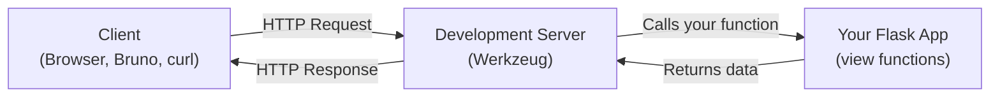
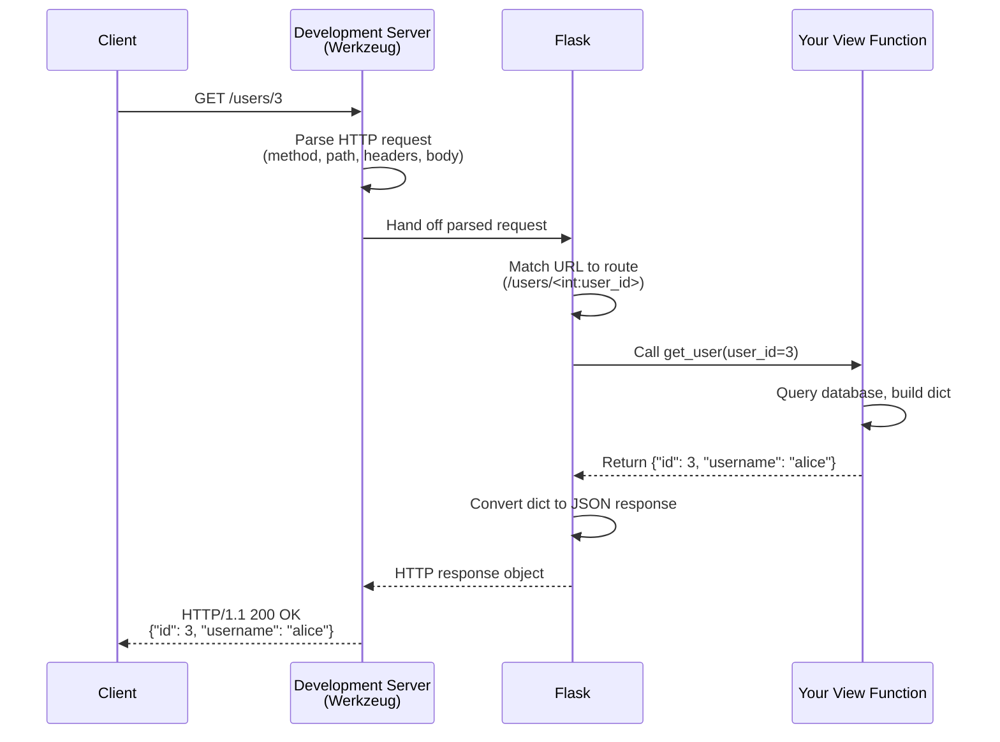
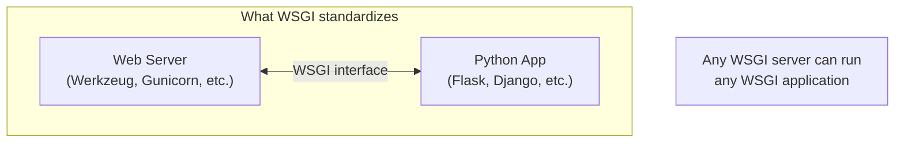
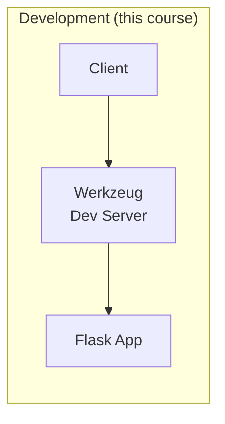
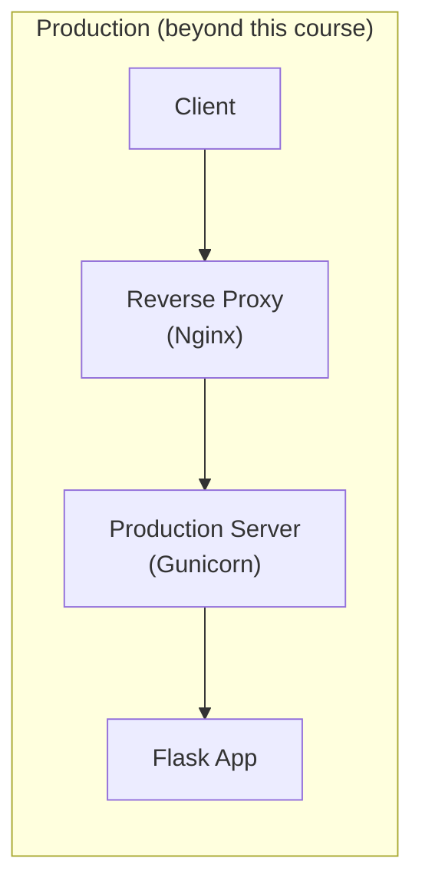

# How Flask Runs Your Application: WSGI

When you run a Flask application, several layers of software work together to
turn an HTTP request from a client into a Python function call in your code —
and then turn your return value back into an HTTP response. This guide explains
what those layers are and how they fit together.

---

## 1. The Big Picture

When you type `uv run flask --app app run` or `uv run python run.py`, Flask
starts a **development web server** on your machine. That server listens for
HTTP requests and passes them to your Flask application code.



**Key idea:** You write Python functions. The server handles everything else —
listening on a port, parsing HTTP messages, and sending responses back over the
network.

---

## 2. What Happens When a Request Arrives

Here is the step-by-step flow when a client sends `GET /users/3` to your
running Flask application:



### What each layer does

| Layer | Responsibility | You write this? |
|-------|---------------|-----------------|
| **Client** | Sends HTTP requests, displays responses | No (Bruno, curl, browser) |
| **Development server** | Listens on a port, parses raw HTTP, sends responses | No (provided by Werkzeug) |
| **Flask framework** | Matches URLs to functions, handles JSON conversion, manages errors | No (provided by Flask) |
| **View functions** | Business logic — query database, process data, return results | **Yes** |

As a beginner, you only write the bottom layer: **view functions**. Flask and
the development server handle everything above.

---

## 3. The Development Server (Werkzeug)

When you start your Flask app, you are actually starting **Werkzeug** — a
development web server bundled with Flask. It is the same server whether you
start with:

```bash
uv run flask --app app run --debug
```

or:

```bash
uv run python run.py
```

### What the development server gives you

- **Auto-reload**: When you save a Python file, the server restarts
  automatically — no need to stop and re-run.
- **Error pages**: If your code crashes, the server shows a detailed error page
  in the browser with the traceback.
- **Request logging**: Every incoming request is printed to the terminal so you
  can see what is happening.

### What the development server is NOT

The development server is built for convenience, not performance or security:

- It handles **one request at a time** (single-threaded).
- It is **not secure** — never expose it to the public internet.
- It is **not fast** — it is designed for local testing only.

This is perfectly fine for learning and development. Production deployment
(which is beyond this course) uses a different kind of server.

---

## 4. WSGI: The Standard Behind the Scenes

You may see the term **WSGI** (Web Server Gateway Interface) in Flask's
documentation and error messages. WSGI is a Python standard (defined in
[PEP 3333](https://peps.python.org/pep-3333/)) that specifies how a web
server communicates with a Python application.

You do **not** need to understand WSGI to write Flask applications. Flask
implements WSGI internally so that you can focus on writing view functions
instead of dealing with low-level HTTP parsing.



**Why it matters (conceptually):** Because Flask follows the WSGI standard,
your application is not locked to a single server. During development you use
Werkzeug; in production, the same Flask code runs on servers like Gunicorn or
Waitress without any changes to your application.

---

## 5. Development vs. Production

In this course, you will always use the development server. But it helps to
know that production deployment adds additional layers:





| Aspect | Development | Production |
|--------|-------------|------------|
| Server | Werkzeug (built-in) | Gunicorn, Waitress, etc. |
| Concurrency | One request at a time | Many simultaneous requests |
| Auto-reload | Yes | No (stability matters more) |
| Debug errors | Detailed pages in browser | Logged to files, generic error to user |
| Start command | `uv run flask run --debug` | `gunicorn -w 4 "run:app"` |

Your Flask application code is **identical** in both environments — only the
server that runs it changes.

---

## Summary

| Concept | Key Point |
|---------|-----------|
| Development server | Werkzeug — listens for HTTP, auto-reloads, shows errors |
| Your code | View functions — the only layer you write |
| Flask | Matches URLs to your functions, converts dicts to JSON |
| WSGI | The standard that connects servers to Python apps (you don't interact with it directly) |
| Production | Same Flask code, different (faster, more robust) server |

---

## References

- [Flask Quickstart — A Minimal Application](https://flask.palletsprojects.com/en/stable/quickstart/)
- [Flask Development Server](https://flask.palletsprojects.com/en/stable/server/)
- [Werkzeug Documentation](https://werkzeug.palletsprojects.com/)
- [PEP 3333 — Python WSGI Specification](https://peps.python.org/pep-3333/) (for reference only)