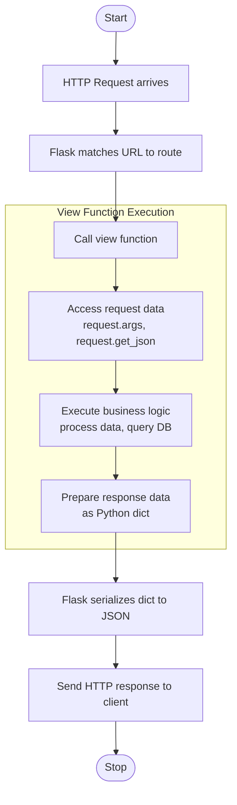
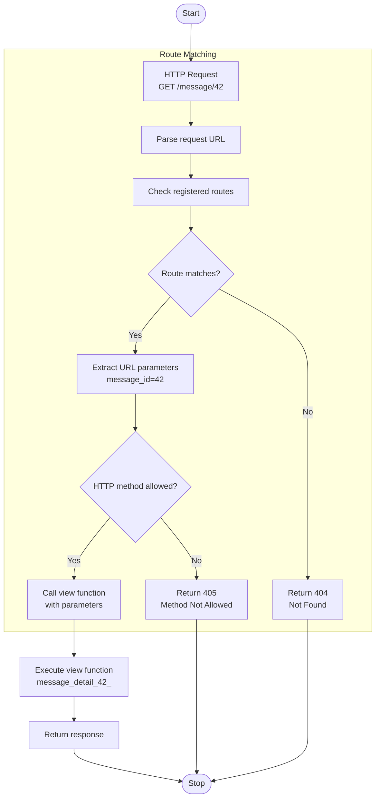
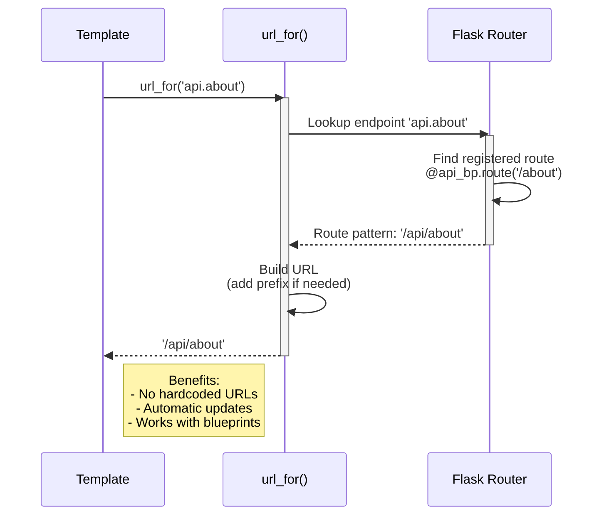
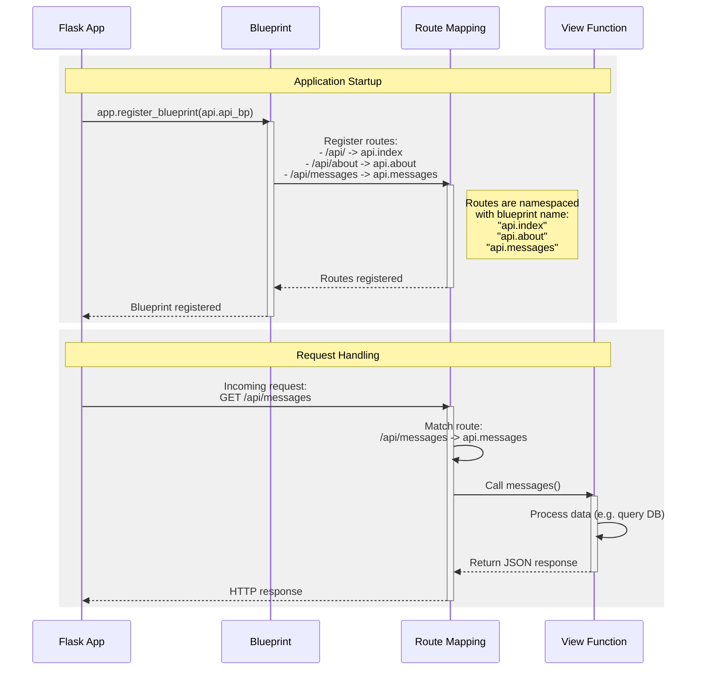
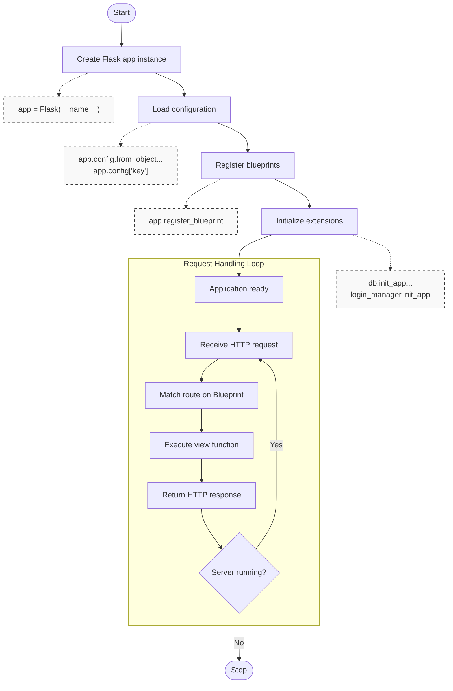
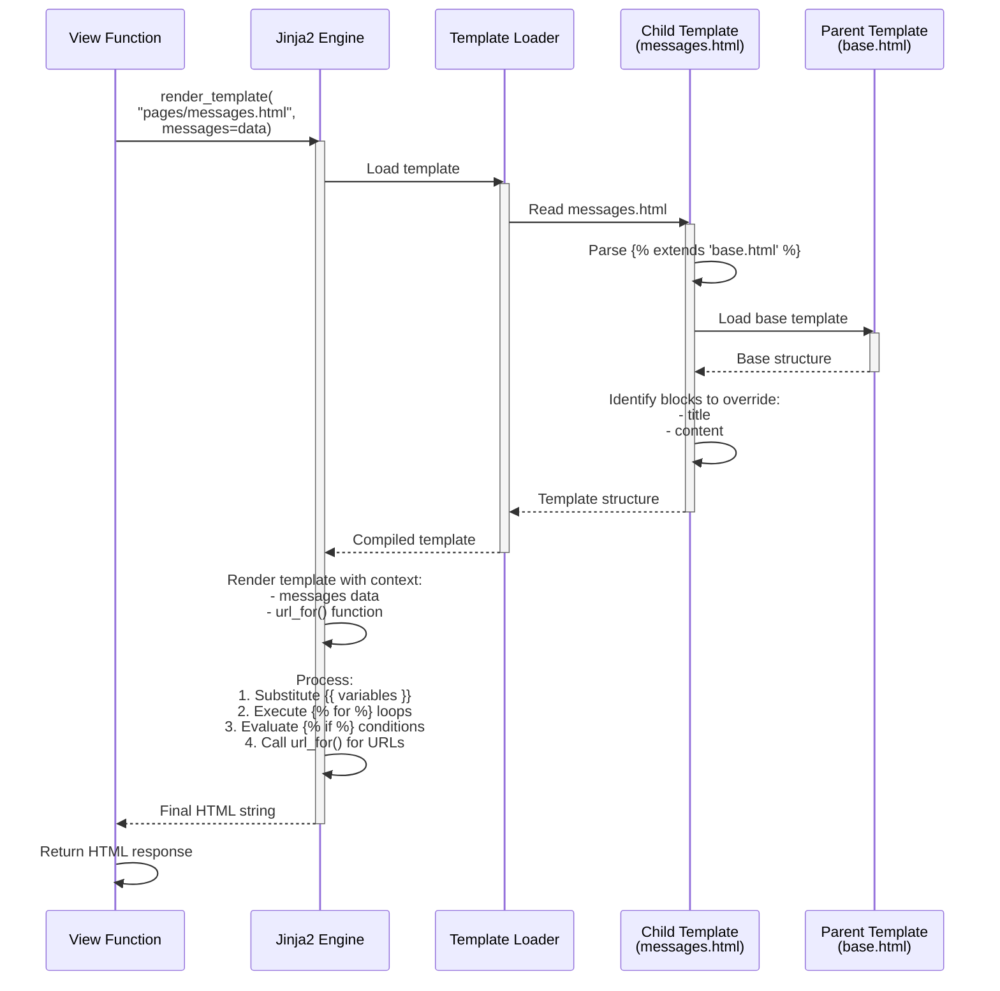
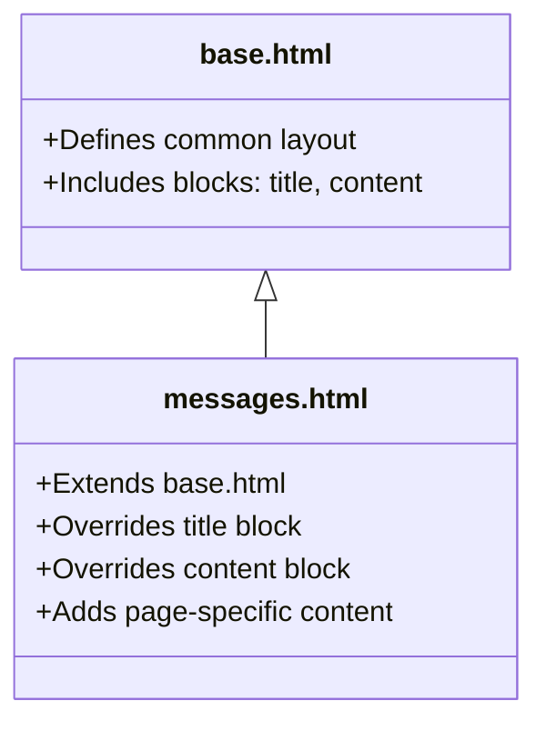
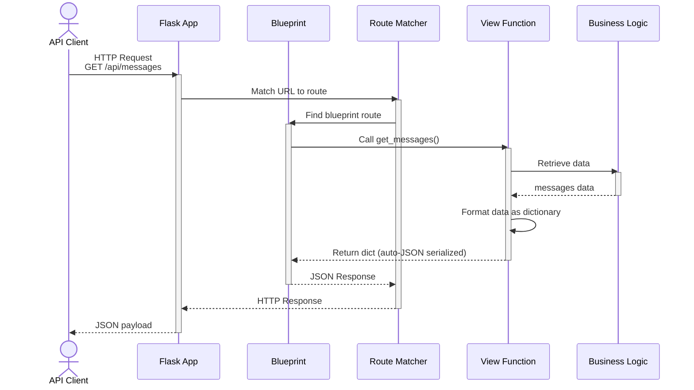

# Flask Overview

## Why Flask

- Numerous libraries in Python for creating web platforms / APIs
- We will use [`Flask`](http://flask.pocoo.org/)
- Simple and easy to use
- Excellent documentation with a lengthy
  [tutorial for Flask](https://blog.miguelgrinberg.com/post/the-flask-mega-tutorial-part-i-hello-world)

## What is Flask

- `Flask` is a microframework: it does most of the heavy job of dealing with
  HTTP requests / responses and calling python code to service these events.
- It implements WSGI (Web Server Gateway Interface), an interface that defines a
  standard for communication between web servers and Python web applications.
- It builds on the HTTP protocol you have already studied — every concept from
  that guide (methods, status codes, JSON, REST) applies directly here.
- It can be used for building web platforms, particularly JSON-based REST APIs.
- It has built-in support for automatic JSON serialization / deserialization
  when returning Python dictionaries from routes.
- It is very easy to use, and has a development server: you can easily run and
  test your code on your computer.
- It is based on and leverages `Werkzeug`

# Flask Concepts

## Overview

1.  **Application**: The central object that manages configuration,
    initialization, and the overall web service lifecycle.
1.  **Models**: Python classes that define the application's data structure.
    When backed by an ORM, models map directly to database tables (covered in
    [Flask with Database Persistence]
1.  **Views**: Python functions that contain business logic, handle HTTP
    requests, and generate structured responses (such as JSON).
1.  **Routes**: URL patterns mapped to specific view functions to determine
    which code executes for a given request.
1.  **Blueprints**: Modular components used to organize related routes, views,
    and resources into reusable application features.
1.  **Templates**: (Optional for this course) Jinja2-powered HTML files that
    allow for dynamic content generation when rendering traditional web pages.

## Project Layouts

Understanding how these concepts map to actual files in a project is crucial.
Here are two common ways to organize a Flask project.

### 1. The Simplest Possible App (Monolithic)

For very small scripts or initial learning, all concepts can be placed in a
single file.

```text
simple_app/
├── app.py              # Application, Models, Routes, and Views
└── pyproject.toml      # Project dependencies and uv configuration
```

#### Concept Mapping

- `app.py`: Acts as the **Application** entry point. It contains the Peewee
  **Models**, registers the **Routes** using decorators, and defines the
  **Views** (functions) directly underneath them to return responses.

### 2. A Modular App (Using Blueprints)

As backend APIs grow, you'll want to separate concerns into different files and
folders using Blueprints.

```text
modular_app/
├── app/
│   ├── __init__.py       # Application factory
│   ├── models.py         # Models (Peewee classes to map Python classes to SQL tables)
│   ├── api/              # Blueprint: 'api'
│   │   ├── __init__.py   # Blueprint initialization
│   │   └── routes.py     # Routes and Views for the API
│   └── web/              # Blueprint: 'web'
│       ├── __init__.py   # Blueprint initialization
│       ├── routes.py     # Routes and Views for web pages
│       └── templates/    # Templates (Jinja2 HTML files)
│           └── index.html
├── run.py                # Entry script to start the app
└── pyproject.toml        # Project dependencies and uv configuration
```

#### Concept Mapping

- `run.py`: The entry script that imports the app from the application factory
  and runs it.
- `app/__init__.py`: The **Application** factory where the main Flask app object
  is created, configured, and where **Blueprints** are registered.
- `app/models.py`: Central location for all Database ORM **Models**, isolating
  the database layout from the routing layer.
- **Blueprints (`app/api/` and `app/web/`)**: A blueprint is a modular package
  of your application. Instead of being a single file, a blueprint physically
  maps to an entire directory encompassing all files required for a specific
  feature. The files that constitute the Blueprint package:
  - `__init__.py` (inside the Blueprint directory): This is where the
    **Blueprint** instance is defined and instantiated (e.g.,
    `api_bp = Blueprint('api', ...)`).
  - `routes.py`: Contains the **Routes** and **Views** that belong exclusively
    to this blueprint's domain.
  - `templates/` _(Optional)_: As seen in `app/web/`, a blueprint can uniquely
    encapsulate its own HTML **Templates** and static files instead of relying
    on an app-wide global directory.

## 1. Application

### Description

The Flask application is the central object that represents your web
application. It's an instance of the `Flask` class and serves as the entry point
for handling HTTP requests. The application object manages configuration,
registers routes and blueprints, and coordinates the request/response cycle.

### Official Documentation

- [Application Object](https://flask.palletsprojects.com/en/stable/api/#flask.Flask)
- [Application Setup](https://flask.palletsprojects.com/en/stable/tutorial/factory/)
- [Application Context](https://flask.palletsprojects.com/en/stable/appcontext/)

### Key Responsibilities

- Initialize the application with configuration
- Register blueprints and routes
- Handle the request/response cycle
- Manage application context and configuration
- Provide access to app-wide resources

### Simple Flask Application Example

```python
# Import the Flask class from the flask module
from flask import Flask

# Create an instance of the Flask class
# __name__ is a special Python variable that contains the name of the current module
# Flask uses this to know where to look for templates, static files, etc.
app = Flask(__name__)

# Define a route using the @app.route decorator
# This tells Flask: "when someone visits '/api/status', run the status() function"
@app.route('/api/status')
def status():
    """
    This is a view function - it handles requests to the /api/status endpoint
    (the combination of this URL and the GET method).
    Returning a Python dictionary automatically converts the response to JSON format.
    """
    return {"status": "success", "message": "API is running"}

# Define another route for retrieving data
@app.route('/api/data')
def get_data():
    """View function that returns a JSON list."""
    return {
        "items": [
            {"id": 1, "name": "Item One"},
            {"id": 2, "name": "Item Two"}
        ]
    }

# This checks if we're running this file directly (not importing it)
if __name__ == '__main__':
    # Start the Flask development server
    # debug=True enables:
    #   - Auto-reload when code changes
    #   - Detailed error messages in the browser
    # Note: Never use debug=True in production!
    app.run(debug=True)
```

### Understanding the Route Decorator

In the example above, you see `@app.route('/api/status')`. This decorator
connects a URL to a view function. Breaking it down:

- `app`: The Flask application instance (`app = Flask(__name__)`).
- `.route(...)`: A method on the `app` object that registers a URL rule.
- `('/api/status')`: The URL path pattern. When an incoming request matches this
  string, Flask calls the decorated function below it.

### Running a Flask Application

There are two primary ways to start the Flask development server:

#### 1. Using Python Directly (the `app.run()` method) - Not Recommended

If your file includes the `if __name__ == '__main__':` block as shown above, you
can run it as a regular Python script via `uv`:

1. Save the code in a file (e.g., `app.py`)
2. Run: `uv run python app.py`
3. Open your browser or API client to: `http://127.0.0.1:5000/api/status`

_Note: This approach is simple but less flexible as your application grows._

#### 2. Using the Flask CLI with `uv` - Recommended

The modern and standard way to run a Flask app is using the `flask` command-line
tool, driven by `uv` to ensure it executes in your project's managed virtual
environment.

```bash
# Basic run
uv run flask --app app run

# Run with auto-reloading and detailed errors enabled
uv run flask --app app run --debug
```

**What the `uv run flask run` command does:**

- `uv run`: Ensures that the `flask` command runs inside the isolated project
  environment managed by your `pyproject.toml`, automatically installing
  dependencies if they are missing.
- `--app app`: Tells Flask which module contains your application. It will
  automatically look for a global variable named `app` or a factory function
  named `create_app()`. (If your file is named `app.py` or `wsgi.py`, Flask
  finds it automatically and you can actually omit this flag!).
- `run`: Instructs Flask to start the built-in Werkzeug development web server.
- `--debug`: Enables development mode. This gives two massive benefits: the
  server will automatically reload when you save code changes, and it will
  provide an interactive traceback if your application encounters a runtime
  error. _(Never use `--debug` in production!)_

#### 3. Using an Entry Script (`run.py`) - Modular Applications

When your project grows and you adopt the modular layout with an application
factory, you typically use a top-level `run.py` file. This script acts as the
primary entry point, importing the application factory from your `app` directory
and starting the development server.

**Example `run.py`:**

```python
# run.py
from app import create_app

# Create the Flask application instance by calling the factory
app = create_app()

# This checks if we're running this file directly via Python
if __name__ == '__main__':
    # Start the development server
    app.run(debug=True)
```

**Running in Development:** To execute this script during development, run the
following command from your project root:

```bash
uv run python run.py
```

_Note: Even with a modular layout, you can still use the modern Flask CLI
instead of `run.py` by pointing the `--app` flag to your app directory (e.g.,
`uv run flask --app app run --debug`)._

_Note: For production deployment, WSGI servers like
[Gunicorn](https://gunicorn.org/) use the `app` object from `run.py` directly
(e.g., `uv run gunicorn -w 4 "run:app"`) instead of the development server._

**What happens when you request the status API:**

1. Flask receives an HTTP request for `/api/status`
2. Flask matches `/api/status` to the `status()` function
3. `status()` executes and returns a Python dictionary
4. Flask automatically serializes the dictionary to JSON and sends it back to
   the client
5. Your client receives the JSON response

### Accessing the Application from Routes: `current_app`

In a modular application with blueprints, your route handlers live in separate
modules that do **not** have direct access to the `app` variable created inside
`create_app()`. Flask solves this with `current_app`, a context proxy imported
from `flask` that always points to the application handling the current request.

A common pattern is to store shared resources in `app.config` during application
setup, then retrieve them with `current_app.config` inside route handlers:

```python
# app/__init__.py — Application factory
from flask import Flask
from .api import api_bp

def create_app():
    app = Flask(__name__)

    # Store a shared resource accessible to all routes
    app.config["APP_NAME"] = "My Service"

    app.register_blueprint(api_bp)
    return app
```

```python
# app/api/routes.py — Route handlers access the resource via current_app
from flask import current_app
from . import api_bp

@api_bp.route("/info")
def info():
    name = current_app.config["APP_NAME"]
    return {"app_name": name}
```

`app.config` is a dictionary. Besides simple strings and numbers, you can store
any Python object — database connections, service instances, or other shared
resources that your routes need.

> **Important:** `current_app` is only available while Flask is handling a
> request. Accessing it at module import time (outside a view function) raises a
> `RuntimeError`.

---

## 2. Views

### Description

Views are Python functions or callables that handle HTTP requests and return
responses. They contain the business logic of your application and are
responsible for processing data, interacting with databases, and generating
responses.

Inside any view, Flask provides access to the incoming HTTP data through the
`request` object (imported from `flask`). Common uses include:

- `request.args` - query string parameters (e.g., `?page=2`)
- `request.get_json()` - parsed JSON body from POST/PUT requests
- `request.method` - the HTTP method (`"GET"`, `"POST"`, etc.)

### Returning HTTP Status Codes

You already know what status codes mean from the
[HTTP review](../../web_http_general/notes/http_review.md#5-http-status-codes).
In Flask, you return a status code as the second value in a return tuple
(defaults to `200` if omitted):

```python
return {"status": "created", "id": new_id}, 201
return {"error": "User not found"}, 404
return {"error": "Missing required field: username"}, 400
```

Flask also provides `abort()` to immediately stop request processing and return
an error:

```python
from flask import abort

@app.route('/api/users/<int:user_id>')
def get_user(user_id):
    user = find_user(user_id)
    if user is None:
        abort(404)  # Immediately returns a 404 response
    return {"id": user.id, "name": user.name}
```

### Official Documentation

- [Views](https://flask.palletsprojects.com/en/stable/views)

### Types of Views

1. **Function-based views**: Simple functions decorated with routes
2. **Class-based views**: Object-oriented view handlers that inherit from
   `flask.views.View` or `flask.views.MethodView`. They help scale applications
   by solving common structural issues:
   - **Promotes Reusability**: Class based views allow developers to share
     common behaviors across multiple endpoints using standard Object-Oriented
     inheritance.
   - **Custom Setup & Dispatching (`View`)**: Inheriting directly from `View`
     allows you to override the core `dispatch_request()` method. This is
     perfect when you want a family of views to always execute specific setup
     logic (like fetching a user, validating API tokens, or wrapping data in a
     standard JSON envelope) before returning a response.
   - **Method Routing (`MethodView`)**: Inheriting from `MethodView` avoids deep
     and messy `if request.method == 'POST':` branching inside a single function
     by automatically dispatching requests to matching class methods like
     `def get(self):` or `def post(self):`.

### Example: Simple Function-based View

```python
from flask import request, jsonify

@app.route('/api/messages')
def get_messages():
    """View function that handles GET /api/messages and returns JSON"""
    # Sample data (often fetched from a database)
    messages_data = [
        {"id": 1, "text": "Hello World!"},
        {"id": 2, "text": "Learning Flask is fun."}
    ]

    # Process request (optional filtering, sorting, etc.)
    # if 'user' in request.args:
    #     messages_data = filter_by_user(messages_data, request.args['user'])

    # Return response as JSON. Dictionaries and lists are converted automatically
    # Alternatively, you can explicitly use flask.jsonify(messages_data)
    return {"messages": messages_data, "count": len(messages_data)}
```

### Example: Class-based View (MethodView)

For REST APIs, defining a different function for each HTTP method is very
helpful. Flask provides `MethodView` to dispatch requests to different class
methods based on the request method (e.g., `GET`, `POST`, `DELETE`).

```python
from flask.views import MethodView
from flask import request

class UserAPI(MethodView):
    def get(self, user_id):
        if user_id is None:
            # return a list of users
            pass
        else:
            # expose a single user
            pass

    def post(self):
        # create a new user using request.json
        pass

    def delete(self, user_id):
        # delete a single user
        pass

    def put(self, user_id):
        # update a single user
        pass

# You must explicitly attach the view to the app (or blueprint) using `.add_url_rule`
# Calling `.as_view("name")` configures the view function and names it for url_for
user_view = UserAPI.as_view('user_api')
app.add_url_rule('/users/', defaults={'user_id': None}, view_func=user_view, methods=['GET',])
# Note: If using Blueprints, this works identically.
# You would just use your blueprint instance instead of `app`:
# my_blueprint.add_url_rule('/users/', ...)
app.add_url_rule('/users/', view_func=user_view, methods=['POST',])
app.add_url_rule('/users/<int:user_id>', view_func=user_view, methods=['GET', 'PUT', 'DELETE'])
```

### Diagram: View Execution Flow



---

## 3. Routes

### Description

Routes define the URL patterns and map them to view functions. In the
[Bruno exercise](../../web_http_general/exercises/bruno_rest_api_exercise.md),
you sent requests to URLs like `/users/` and `/tasks/3` — routes are the
server-side mechanism that determines which Python function handles each of
those URLs. Routes can include dynamic segments, support multiple HTTP methods,
and use URL converters.

### What is an Endpoint?

An **endpoint** is a specific URL and HTTP method combination that a client can
call to perform an operation. For example, `GET /users` and `POST /users` are
two different endpoints even though they share the same URL path — one retrieves
data, the other creates a resource.

In Flask's internal terminology, "endpoint" also refers to the **name** that
identifies a view function (the string passed to `url_for()`). When you write
`@app.route("/books")` over a function called `list_books`, Flask registers an
endpoint named `"list_books"`. With blueprints the name is prefixed:
`"books.list_books"`.

For day-to-day development, think of an endpoint as the answer to the question:
_"What URL and method does a client use to do this?"_

### Official Documentation

- [Routing](https://flask.palletsprojects.com/en/stable/quickstart/#routing)
- [URL Route Registrations](https://flask.palletsprojects.com/en/stable/api/#url-route-registrations)
- [URL Building](https://flask.palletsprojects.com/en/stable/quickstart/#url-building)

### Route Types

1. **Static routes**: Fixed URLs like `/api/status` or `/api/config`
2. **Dynamic routes**: Capture values from URLs with variables like
   `/api/users/<username>`
3. **HTTP methods**: Specify which
   [HTTP methods](../../web_http_general/notes/http_review.md#4-http-methods) a
   route accepts (GET, POST, PUT, DELETE) to map CRUD operations
4. **URL converters**: Type conversion for route parameters (int, float, path,
   uuid)

### Example: Route Registration

```python
from flask import Blueprint, request

api_bp = Blueprint("api", __name__, url_prefix="/api")

# Static REST route
@api_bp.route("/status")
def status():
    return {"status": "ok"}

# Dynamic REST route with parameter
@api_bp.route("/messages/<int:message_id>")
def get_message(message_id):
    # Fetch from database, etc...
    return {"id": message_id, "content": "Sample content"}

# Route with multiple HTTP methods for standard REST operations
@api_bp.route("/messages", methods=["GET", "POST"])
def messages():
    if request.method == "POST":
        # Handle JSON payload submission
        data = request.get_json()
        return {"status": "created", "data": data}, 201

    # Otherwise GET
    return {"messages": []}
```

The full list of URL converters (`int`, `float`, `path`, `uuid`) is available in
Flask's
[documentation](https://flask.palletsprojects.com/en/stable/quickstart/#variable-rules).

### Diagram: Route Matching Process



### Diagram: URL Building with url_for()



---

## 4. Blueprints

### Description

Blueprints are Flask's mechanism for organizing your application into modular,
reusable components. They encapsulate related views, templates, static files,
and other resources. Blueprints help structure larger applications and promote
code reusability.

### Purpose

Blueprints solve several key problems encountered when building growing web
applications:

1. **The "Monolithic File" Problem**: Writing all routes, configurations, and
   logic in a single `app.py` file quickly becomes unmaintainable. Blueprints
   allow you to split your application into separate, logical files and
   directories.
2. **Namespace Collisions**: As applications grow, you might have overlapping
   route names (e.g., a "users" route for a web interface and a "users" route
   for a JSON API). Blueprints isolate namespaces and URL prefixes.
3. **Team Collaboration**: By breaking an application into distinct blueprints,
   different developers or teams can work on separate features (like
   "authentication" vs. "product catalog") without causing merge conflicts in a
   single main script.

**Example organized project layout using Blueprints:**

```text
my_flask_project/
├── __init__.py           # Contains the application factory (create_app)
├── auth/                 # Authentication Blueprint
│   ├── __init__.py
│   └── routes.py         # Routes: /login, /logout, /register
├── api/                  # REST API Blueprint
│   ├── __init__.py
│   └── routes.py         # Routes: /api/users, /api/status
└── dashboard/            # Dashboard GUI Blueprint
    ├── __init__.py
    └── routes.py         # Routes: /dashboard, /settings
```

In this structure, instead of one massive file, the `auth`, `api`, and
`dashboard` directories represent decoupled blueprints that are cleanly imported
and registered in the main `__init__.py` file.

### Official Documentation

- [Blueprints](https://flask.palletsprojects.com/en/stable/blueprints/)
- [Modular Applications with Blueprints](https://flask.palletsprojects.com/en/stable/tutorial/views/)
- [Blueprint API](https://flask.palletsprojects.com/en/stable/api/#blueprint-objects)

### Key Characteristics

1. **Not standalone applications**: Must be registered with a Flask app
2. **Encapsulate functionality**: Group related views, templates, and resources
3. **Reusable**: Can be registered multiple times with different URL prefixes
4. **Namespace routes**: Prevent naming conflicts between modules
5. **Scalability**: Add features without modifying the core application
6. **Team collaboration**: Different developers can work on different blueprints
7. **Testing**: Blueprints can be tested in isolation

### Example: Blueprint Structure

```python
# api.py
from flask import Blueprint

# Create blueprint
api_bp = Blueprint(
    "api",                       # Blueprint name
    __name__,                    # Import name
    url_prefix="/api"            # All routes will start with /api
)

# Register routes with blueprint
@api_bp.route("/")
def index():
    return {"status": "ok", "api_version": "1.0"}

@api_bp.route("/about")
def about():
    return {"description": "This is a RESTful API built with Flask Blueprints."}

@api_bp.route("/messages")
def messages():
    # Sample static data
    messages_data = [
        {"id": 1, "text": "Blueprint routing is cool!"}
    ]
    return {"messages": messages_data, "count": len(messages_data)}
```

```python
# __init__.py
from flask import Flask
from . import api

def create_app():
    app = Flask(__name__)

    # Register blueprint
    app.register_blueprint(api.api_bp)

    return app
```

### Diagram: Blueprint Registration and Request Handling



### Application Factory Pattern With Blueprints

The application factory pattern paired with blueprints is the recommended
approach for creating scalable Flask applications. Instead of creating a core
application object globally, you create it inside a function. This provides a
central and controlled environment to register blueprints and extensions.

```python
from flask import Flask

def create_app(config=None):
    """Application factory function"""
    app = Flask(__name__) # passes name of imported module

    # Import modules that contain blueprints for specific domain features
    # (e.g., 'api' containing routes for our web application API)
    from . import api_routes

    # Register the blueprint defined inside the imported module
    # This mounts all routes from the blueprint onto the main application
    app.register_blueprint(api_routes.api_bp)

    return app
```

### Diagram: Application Lifecycle with Blueprints



### Blueprint as a Package (Separate `__init__.py` and `routes.py`)

The earlier blueprint example placed the blueprint instance and its routes in a
single file for simplicity. In a real project the blueprint lives in its own
directory (a Python package) — `__init__.py` defines the blueprint instance
while `routes.py` holds the view functions.

Before looking at the code, you need to understand **relative imports** — the
mechanism that wires these files together inside a package.

### Relative Imports: Connecting Files Inside a Package

When a Flask project is organized into packages (directories with `__init__.py`
files), the files inside those packages need to import from each other. Python
provides **relative imports** for this — imports that use a dot (`.`) to mean
"look inside the current package" rather than naming the full path from the
project root.

#### The two forms

| Syntax                     | Meaning                                                                   | Example                   |
| -------------------------- | ------------------------------------------------------------------------- | ------------------------- |
| `from . import name`       | Import `name` from the **current package** (the same directory)           | `from . import routes`    |
| `from .module import name` | Import `name` from a **module or sub-package** inside the current package | `from .api import api_bp` |

The dot (`.`) always means "start from the directory this file lives in." Think
of it like a relative file path: just as `./routes.py` means "the `routes.py`
next to me," `from . import routes` means "import the `routes` module that sits
in the same package as me."

#### Why not just use absolute imports?

You might wonder why you can't write `from api import routes` or
`from api.routes import api_bp` instead. Inside a package, Python requires
relative imports (or fully-qualified absolute imports starting from the
top-level package name) to unambiguously locate sibling modules. Using a bare
name like `from api import routes` will fail with a `ModuleNotFoundError`
because Python looks for a top-level `api` module on the system path rather than
the `api/` directory sitting next to your file.

Relative imports make your package self-contained: each file says "import from
my neighbour" without hard-coding the outermost package name, so the package
works no matter how it is installed or launched.

#### How relative imports connect the three files

In the modular layout below, three files form the application. Here is how
relative imports link them:

```text
app/
├── __init__.py          ← from .api import api_bp
└── api/
    ├── __init__.py      ← from . import routes
    └── routes.py        ← from . import api_bp
```

1. **`app/__init__.py`** (the application factory) needs the blueprint from the
   `api` sub-package:

   ```python
   from .api import api_bp
   ```

   The dot means "inside this package (`app/`)" → go into the `api` sub-package
   → import its `api_bp` object.

2. **`app/api/__init__.py`** (the blueprint definition) needs to pull in the
   routes module so the `@api_bp.route()` decorators execute:

   ```python
   from . import routes
   ```

   The dot means "inside this package (`app/api/`)" → import the `routes` module
   sitting right next to me.

3. **`app/api/routes.py`** (the route handlers) needs the blueprint object to
   decorate its view functions:
   ```python
   from . import api_bp
   ```
   The dot means "inside this package (`app/api/`)" → import `api_bp` from the
   package's `__init__.py` (the file that defines the package's public
   interface).

> **Rule of thumb:** Any time one file inside a package needs something from
> another file in the same package, use a relative import starting with a dot.

### Putting It Together: Blueprint as a Package

With relative imports understood, here is the complete pattern. The key detail
is the **import order** inside `__init__.py`: the routes module must be imported
**after** the blueprint variable is defined, because the route decorators
reference it.

```python
# app/api/__init__.py
from flask import Blueprint

# 1. Create the blueprint instance first
api_bp = Blueprint("api", __name__, url_prefix="/api")

# 2. Relative import: pull in the routes module from the same package
#    so the @api_bp.route() decorators execute and register themselves
from . import routes  # noqa: E402, F401
```

```python
# app/api/routes.py
from flask import current_app

# Relative import: grab api_bp from this package's __init__.py
from . import api_bp

@api_bp.route("/status")
def status():
    return {"status": "ok"}

@api_bp.route("/info")
def info():
    return {"app": current_app.config["APP_NAME"]}
```

The application factory imports from the blueprint sub-package using a relative
import and registers it:

```python
# app/__init__.py
from flask import Flask

# Relative import: reach into the api sub-package and grab its blueprint
from .api import api_bp

def create_app():
    app = Flask(__name__)
    app.config["APP_NAME"] = "My Service"
    app.register_blueprint(api_bp)
    return app
```

This pattern — define the blueprint, then import the routes module at the bottom
of `__init__.py` — avoids circular imports and is the standard way to structure
Flask blueprints as packages.

---

## 5. Models

Models represent the data layer of your application. In the project layouts
above, `models.py` is where you define the Python classes that describe your
data. Flask itself does not include a database layer, but it integrates
seamlessly with Object-Relational Mappers (ORMs) that let you work with database
tables as Python classes.

Model definition, database setup, CRUD operations, and relationships are covered
in detail in [Flask with Database Persistence: Peewee ORM](flask_orm.md).

---

## 6. Templates (Optional)

### Description

- You could render the whole HTML page in the view `return` statement, but this
  is impractical.
- A better way is to use the `render_template` method. It allows to create an
  HTML template. The template can contain variables and basic logic, and will be
  interpolated at runtime.
- Basic invocation: `render_template('my_template.html', variable1=value1)`.
- Flask will look for `my_template.html` in the `templates` folder of the
  application or blueprint.
- In that template, all references to `{{ variable1 }}` will be replaced by
  `value1`.
- Templates are HTML files with the Jinja2 templating sections
- The Jinja2 templating engine to generates dynamic content.
- They allow the use template inheritance for reusable layouts, and embed Python
  expressions to render data.

#### Simple Flask App with a template

- `templates/base.html`:

```html
<html>
  <body>
    <!-- The value will change depending on the variable sent to the template -->
    Hello, {{ username }}! Here are some numbers from 1 to 5:
    <ul>
      
      <li>{{ x }}</li>
      
    </ul>
  </body>
</html>
```

- `app.py`

```python
from flask import Flask, render_template

app = Flask(__name__)
@app.route('/')
def homepage():
    return render_template('base.html', username="John Doe")

if __name__ == "__main__":
    app.run()
```

#### Use dictionary unpacking to make your `render_template` calls easier to read

```python
render_template("index.html", var1=value1, var2=value2)

# The following is better and easier to manage
context = {"var1": value1, "var2": value2}
render_template("index.html", **context)
```

### Official Documentation

- [Templates](https://flask.palletsprojects.com/en/stable/tutorial/templates/)
- [Jinja2 Documentation](https://jinja.palletsprojects.com/en/stable/)
- [Template Inheritance](https://jinja.palletsprojects.com/en/stable/templates/#template-inheritance)

### Jinja2 Features

1. **Variables**: `{{ variable }}`
2. **Control structures**: ``, ``, ``
3. **Template inheritance**: ``, ``
4. **Filters**: `{{ name|upper }}`, `{{ date|formatdate }}`
5. **Macros**: Reusable template functions

### Example: Template Inheritance

**Base Template (base.html)**

```html
<!DOCTYPE html>
<html lang="en">
  <head>
    <title> - Message Board</title>
  </head>
  <body>
    <nav>
      <a href="{{ url_for('pages.home') }}">Home</a>
      <a href="{{ url_for('pages.messages') }}">Messages</a>
    </nav>

    <main></main>
  </body>
</html>
```

**Child Template (messages.html)**

```html
 Messages 
<h2>All Messages</h2>

<article>
  <h3>{{ message.title }}</h3>
  <p>By {{ message.author }}</p>
  <p>{{ message.content }}</p>
</article>
 
```

### Diagram: Template Rendering Process



### Diagram: Template Inheritance Structure



## 7. Testing Flask Applications

See [Testing Flask Applications with pytest]()

---

## Summary

Flask applications are built on these core concepts:

- **Application**: Central object managing the entire web application
- **Models**: Python classes that define data structure (see
  [Flask with Database Persistence](flask_orm.md) for ORM integration)
- **Views**: Functions that handle requests and generate responses (often
  returning JSON)
- **Routes**: URL patterns that map to view functions
- **Blueprints**: Modular components for organizing application functionality
- **Templates (Optional)**: Jinja2-powered HTML files for dynamic content
  generation
- **Testing**: Verifying routes and responses with the built-in test client (see
  [Testing Flask Applications with pytest])

Understanding these concepts and how they interact is essential for building
maintainable Flask applications.

### Full Request/Response Cycle



---

## Additional Resources

1. [Python Web Applications: the basics of WSGI](https://www.sitepoint.com/python-web-applications-the-basics-of-wsgi/)
1. [Werkzeug: workstuff - `WSGI` Application Library](https://werkzeug.palletsprojects.com/en/stable/)
1. [Flask Tutorial in Visual Studio Code](https://code.visualstudio.com/docs/python/tutorial-flask)
1. [Flask Official Documentation](https://flask.palletsprojects.com/)
1. [Flask Tutorial](https://flask.palletsprojects.com/en/stable/tutorial/)
1. [Flask Patterns](https://flask.palletsprojects.com/en/stable/patterns/)
1. [Flask Blueprints](https://realpython.com/flask-blueprint/)
1. [Flask Application Context](https://flask.palletsprojects.com/en/stable/appcontext/) -
   used to access application wide data 
1. [Flask Mega-Tutorial](https://blog.miguelgrinberg.com/post/announcing-the-flask-mega-tutorial-2024-edition)
1. [Jinja2 Template Designer Documentation](https://jinja.palletsprojects.com/en/stable/templates/)
1. [jinja templates](https://realpython.com/primer-on-jinja-templating/)
1. [Real Python Flask Tutorials](https://realpython.com/tutorials/flask/)
1. [Corey Schafer - Flask Tutorials](https://youtu.be/529LYDgRTgQ?si=jt5FyCVKTY99QvuX)

```

```
