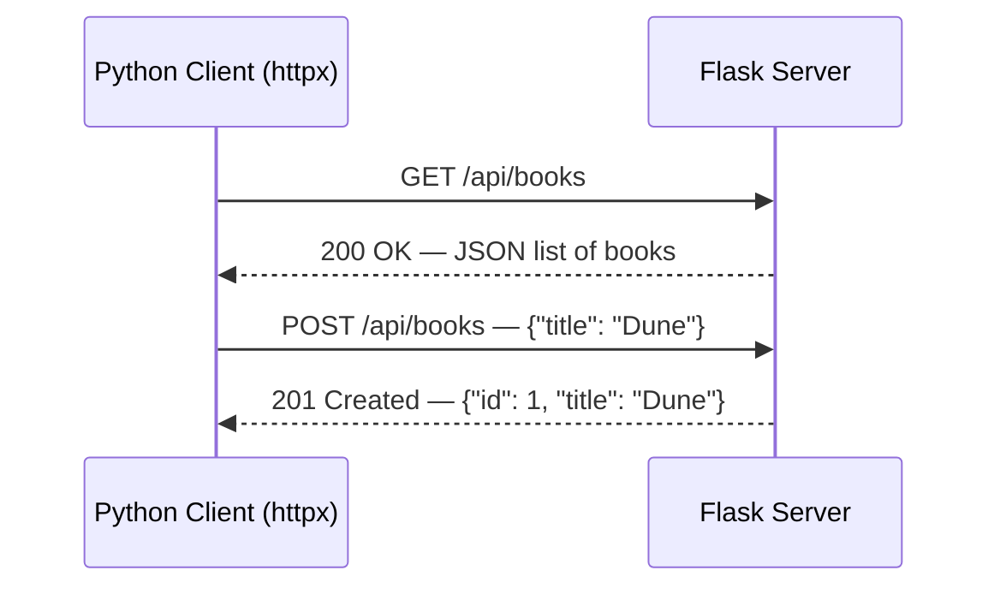
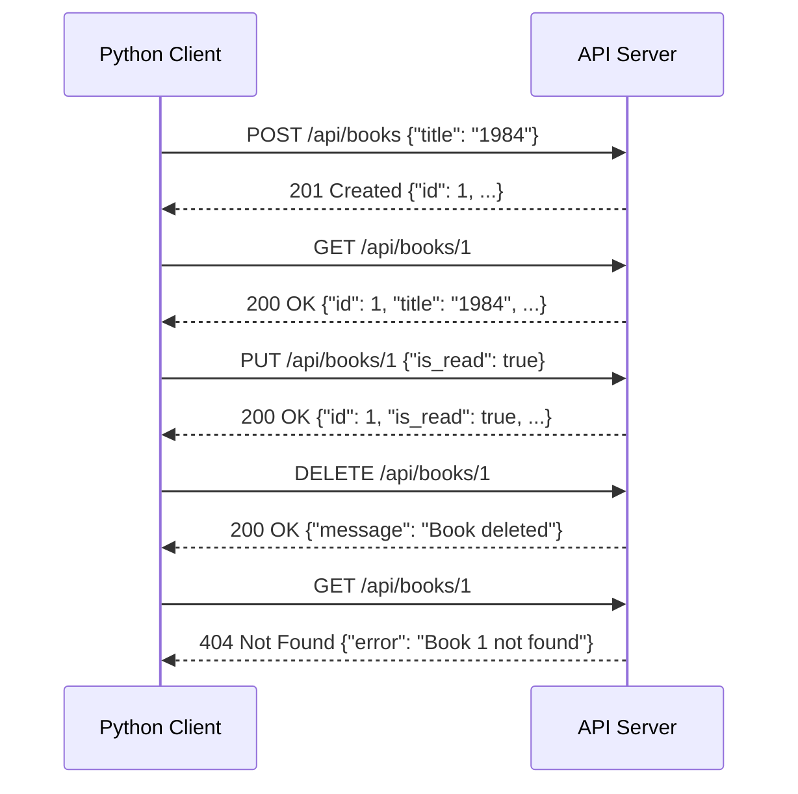
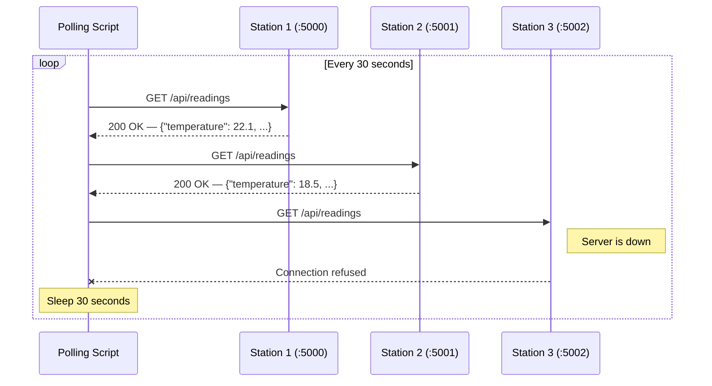

# Python HTTP Clients with `httpx`

How to write Python programs that **consume** web APIs. This guide covers the
`httpx` library — from simple one-off requests to structured client classes that
you can reuse across a project.

## 1. Servers vs. Clients — Two Sides of a Conversation

Previously, you wrote Python code that **receives** HTTP requests and
**returns** responses. That code is the _server_.

An HTTP _client_ does the opposite: it **sends** requests and **reads**
responses. So far you have used Bruno and `curl` as clients. Now you will write
clients in Python — which means your programs can talk to any REST API
automatically, without a human clicking buttons.



### Why write a client in Python?

| Use case | Example |
|----------|---------|
| **Automation** | A script that registers new records in a remote database |
| **Data collection** | A program that polls sensors every 30 seconds and stores readings |
| **Testing** | A script that exercises every endpoint of your API |
| **Integration** | One service fetching data from another service |

---

## 2. The `httpx` Library

### Why not use the standard library?

Python ships with `urllib.request` — so why install a third-party package?
Compare a simple GET request:

```python
# Standard library — urllib
import urllib.request
import json

req = urllib.request.Request("http://localhost:5000/api/books")
with urllib.request.urlopen(req) as resp:
    body = resp.read().decode("utf-8")
    books = json.loads(body)
```

```python
# httpx
import httpx

books = httpx.get("http://localhost:5000/api/books").json()
```

`urllib` works, but it was designed as a simpler lower-level and more verbose http access method. For every
request you must manually encode the body, set headers, read bytes, decode to a
string, and parse JSON yourself. `httpx` handles all of that in one call, and provides additional features.

| Concern | `urllib.request` | `httpx` |
|---------|-----------------|---------|
| Send JSON body | Manually `json.dumps()` + encode to bytes + set header | `json={"key": "value"}` |
| Parse JSON response | `json.loads(resp.read().decode())` | `response.json()` |
| Connection reuse | Manual | Built-in via `httpx.Client` |
| Timeouts | Verbose configuration | `timeout=10.0` |
| Error classes | Generic `urllib.error.HTTPError` | Specific `HTTPStatusError`, `ConnectError`, `TimeoutException` |
| Readability | Low — lots of boilerplate | High — one-liner for common tasks |

> **Rule of thumb:** Use `httpx` for any project that talks to a REST API.
> Reserve `urllib` for constrained environments where you cannot install
> third-party packages, or where you need custom behaviour.

### Overview

**httpx** is a modern, full-featured HTTP client for Python. Its API is nearly
identical to the popular `requests` library, but it also supports async
operations (which we will not need in this course).

### Installing httpx

```powershell
uv add httpx
```

This adds `httpx` to your project's `pyproject.toml` and installs it into the
virtual environment — the same workflow you used when adding Flask.

### Importing httpx

```python
import httpx
```

That single import gives you everything: functions for quick one-off requests
and the `Client` class for more structured usage.

---

## 3. Your First Request

The simplest way to call an API is with the top-level convenience functions.
Assume a Flask server is running on `http://localhost:5000` with a `/api/books`
endpoint.

```python
import httpx

response = httpx.get("http://localhost:5000/api/books")

print(response.status_code)   # 200
print(response.json())        # [{"id": 1, "title": "Dune", ...}, ...]
```

That is the entire round trip: `httpx.get()` sends the request, waits for the
server to respond, and returns a `Response` object.

---

## 4. The Response Object

Every `httpx` call returns a `Response`. This object contains everything the
server sent back — status code, headers, and body.

### Key attributes and methods

| Attribute / Method | What it gives you | Example value |
|--------------------|-------------------|---------------|
| `response.status_code` | Numeric HTTP status code | `200`, `201`, `404` |
| `response.json()` | Body parsed as a Python dict or list | `{"id": 1, "title": "Dune"}` |
| `response.text` | Body as a raw string | `'{"id": 1, "title": "Dune"}'` |
| `response.headers` | Response headers (dict-like) | `{'content-type': 'application/json'}` |
| `response.is_success` | `True` if status is 2xx | `True` |
| `response.raise_for_status()` | Raises an exception if status is 4xx or 5xx | — |

### Reading JSON responses

Most REST APIs return JSON. Call `.json()` to convert the response body into a
Python dictionary or list:

```python
response = httpx.get("http://localhost:5000/api/books")
books = response.json()        # Python list of dicts

for book in books:
    print(book["title"])
```

If the response body is not valid JSON, `.json()` will raise an exception —
this should not happen with a well-designed API.

### Checking status codes

You can inspect the status code before processing the response:

```python
response = httpx.get("http://localhost:5000/api/books/99")

if response.status_code == 200:
    book = response.json()
    print(book["title"])
elif response.status_code == 404:
    print("Book not found")
```

Or use `is_success` for a simpler check:

```python
if response.is_success:
    data = response.json()
```

---

## 5. HTTP Methods with httpx

httpx provides a function for each HTTP method. These map directly to the CRUD
operations you already know from `http_review.md`:

| CRUD | HTTP Method | httpx function | Typical status code |
|------|------------|----------------|---------------------|
| **C**reate | POST | `httpx.post()` | `201 Created` |
| **R**ead | GET | `httpx.get()` | `200 OK` |
| **U**pdate | PUT | `httpx.put()` | `200 OK` |
| **D**elete | DELETE | `httpx.delete()` | `200 OK` or `204 No Content` |

### GET — retrieve data

```python
# List all books
response = httpx.get("http://localhost:5000/api/books")
books = response.json()

# Get a single book by ID
response = httpx.get("http://localhost:5000/api/books/1")
book = response.json()
```

### POST — create data

Pass the `json` parameter to send a JSON body automatically. httpx will
serialize the dict to JSON **and** set the `Content-Type: application/json`
header for you:

```python
new_book = {"title": "Neuromancer", "author": "William Gibson"}
response = httpx.post("http://localhost:5000/api/books", json=new_book)
created = response.json()     # {"id": 2, "title": "Neuromancer", ...}
print(response.status_code)   # 201
```

> **Key point:** Use `json=` (not `data=`) when sending JSON. The `json`
> parameter handles serialization and headers. The `data` parameter sends
> form-encoded data, which is not what a JSON API expects.

### PUT — update data

```python
updates = {"title": "Neuromancer", "author": "William Gibson", "is_read": True}
response = httpx.put("http://localhost:5000/api/books/2", json=updates)
updated = response.json()
```

### DELETE — remove data

```python
response = httpx.delete("http://localhost:5000/api/books/2")
print(response.status_code)   # 200
```

### Complete CRUD example

```python
import httpx

BASE = "http://localhost:5000/api/books"

# Create
r = httpx.post(BASE, json={"title": "1984", "author": "George Orwell"})
book_id = r.json()["id"]
print(f"Created book {book_id}")       # Created book 1

# Read
r = httpx.get(f"{BASE}/{book_id}")
print(r.json()["title"])               # 1984

# Update
r = httpx.put(f"{BASE}/{book_id}", json={"is_read": True})
print(r.json()["is_read"])             # True

# Delete
r = httpx.delete(f"{BASE}/{book_id}")
print(r.json()["message"])             # Book deleted

# Confirm deletion
r = httpx.get(f"{BASE}/{book_id}")
print(r.status_code)                   # 404
```



---

## 6. Error Handling

Things go wrong. The server might be down, the network might be slow, or you
might request a resource that does not exist. A robust client handles these
situations gracefully.

### Two kinds of errors

| Kind | What happened | Example |
|------|---------------|---------|
| **HTTP error** | The server responded, but with a 4xx or 5xx status code | `404 Not Found`, `500 Internal Server Error` |
| **Connection error** | The request never reached the server | Server not running, wrong port, network down |

### Handling HTTP errors with `raise_for_status()`

`raise_for_status()` does nothing if the status code is 2xx. If the status code
is 4xx or 5xx, it raises an `httpx.HTTPStatusError`:

```python
import httpx

response = httpx.get("http://localhost:5000/api/books/999")
response.raise_for_status()    # raises HTTPStatusError (404)
```

Catch the exception to handle it:

```python
import httpx

try:
    response = httpx.get("http://localhost:5000/api/books/999")
    response.raise_for_status()
    book = response.json()
except httpx.HTTPStatusError as e:
    print(f"HTTP error: {e.response.status_code}")
    print(e.response.json())   # {"error": "Book 999 not found"}
```

Inside the except block, `e.response` is the full Response object — you can
read its `.status_code`, `.json()`, and `.text` just like a normal response.

### Handling connection errors

If the server is not running, the request will fail immediately with a
connection error:

```python
import httpx

try:
    response = httpx.get("http://localhost:9999/api/books")
    data = response.json()
except httpx.ConnectError:
    print("Could not connect — is the server running?")
```

### Handling timeouts

If the server takes too long to respond, httpx raises a timeout error:

```python
import httpx

try:
    response = httpx.get("http://localhost:5000/api/books", timeout=5.0)
    data = response.json()
except httpx.TimeoutException:
    print("Request timed out")
```

### Catching all httpx errors at once

All httpx exceptions inherit from a common base class. If you want a single
catch-all:

```python
try:
    response = httpx.get("http://localhost:5000/api/books")
    response.raise_for_status()
    data = response.json()
except httpx.HTTPStatusError as e:
    print(f"Server returned an error: {e.response.status_code}")
except httpx.ConnectError:
    print("Could not connect to the server")
except httpx.TimeoutException:
    print("The request timed out")
```

### httpx exception hierarchy

```
httpx.HTTPError                    (base for all)
├── httpx.HTTPStatusError          (4xx / 5xx response)
├── httpx.ConnectError             (server unreachable)
├── httpx.TimeoutException         (request timed out)
│   ├── httpx.ConnectTimeout       (connection phase)
│   ├── httpx.ReadTimeout          (reading response)
│   └── httpx.WriteTimeout         (sending request)
└── httpx.RequestError             (base for transport errors)
```

> **Tip:** For most student projects, catching `httpx.HTTPStatusError` and
> `httpx.ConnectError` covers the common cases.

---

## 7. The `httpx.Client` — Persistent Connections

The top-level functions (`httpx.get()`, `httpx.post()`, etc.) open a new
connection for every request. This is fine for one-off scripts, but it becomes
inefficient when you need to make many requests to the same server.

`httpx.Client` solves this by keeping the connection open across multiple
requests — the same way a browser reuses connections as you click around a
website.

### Creating a client

```python
import httpx

client = httpx.Client(base_url="http://localhost:5000", timeout=10.0)
```

| Parameter | Purpose | Default |
|-----------|---------|---------|
| `base_url` | Prepended to every request URL — so you write `/api/books` instead of the full URL | None |
| `timeout` | Maximum seconds to wait for a response | 5.0 |
| `follow_redirects` | Automatically follow 3xx redirects | `False` |

### Using the client

Once created, the client has the same methods — `.get()`, `.post()`, `.put()`,
`.delete()` — but URLs are relative to the `base_url`:

```python
client = httpx.Client(base_url="http://localhost:5000", timeout=10.0)

# These are equivalent:
#   httpx.get("http://localhost:5000/api/books")
#   client.get("/api/books")

response = client.get("/api/books")
books = response.json()

response = client.get("/api/books/1")
book = response.json()

response = client.post("/api/books", json={"title": "Snow Crash", "author": "Neal Stephenson"})
created = response.json()
```

### Why use a Client?

| Feature | Top-level functions | `httpx.Client` |
|---------|--------------------|-----------------| 
| New connection per request | Yes | No — reuses connections |
| `base_url` support | No — full URL every time | Yes — write relative paths |
| Shared timeout | No — pass each time | Yes — set once |
| Shared headers | No | Yes — set once |
| Performance | Slower for multiple requests | Faster (connection reuse) |

### Closing the client

When you are done, close the client to release the connection:

```python
client.close()
```

Or use it as a context manager that closes automatically:

```python
with httpx.Client(base_url="http://localhost:5000", timeout=10.0) as client:
    books = client.get("/api/books").json()
    # ... more requests ...
# client is automatically closed here
```

For short scripts and class-based clients, storing the client as an instance
variable (and calling `.close()` when done) is the most common pattern.

---

## 8. Timeouts

By default, httpx waits **5 seconds** for a response. You can customize this
when making individual requests or when creating a Client.

### Per-request timeout

```python
response = httpx.get("http://localhost:5000/api/books", timeout=15.0)
```

### Client-wide timeout

```python
client = httpx.Client(base_url="http://localhost:5000", timeout=10.0)
```

Every request through this client will use a 10-second timeout unless
overridden:

```python
# Uses the client's 10-second timeout
response = client.get("/api/books")

# Overrides to 30 seconds for a slow endpoint
response = client.get("/api/slow-report", timeout=30.0)
```

### Disabling timeouts

Pass `None` to wait indefinitely (not recommended for production code):

```python
response = httpx.get("http://localhost:5000/api/books", timeout=None)
```

---

## 9. Building an API Client Class

When your program makes many calls to the same API, wrapping those calls in a
class keeps your code organized and reusable. The class manages the `httpx.Client`
instance and exposes one method per API action.

### Pattern

```python
import httpx


class BookAPI:
    """Client for the Book API."""

    def __init__(self, base_url="http://localhost:5000"):
        self.client = httpx.Client(
            base_url=base_url,
            timeout=10.0,
        )

    def get_books(self):
        """Fetch all books. Returns a list of dicts."""
        response = self.client.get("/api/books")
        response.raise_for_status()
        return response.json()

    def get_book(self, book_id):
        """Fetch a single book by ID. Returns a dict."""
        response = self.client.get(f"/api/books/{book_id}")
        response.raise_for_status()
        return response.json()

    def create_book(self, title, author):
        """Create a new book. Returns the created book dict."""
        response = self.client.post(
            "/api/books", json={"title": title, "author": author}
        )
        response.raise_for_status()
        return response.json()

    def close(self):
        """Close the underlying HTTP connection."""
        self.client.close()
```

### Using the client class

```python
api = BookAPI("http://localhost:5000")

# Create a book
book = api.create_book("Fahrenheit 451", "Ray Bradbury")
print(book)    # {"id": 1, "title": "Fahrenheit 451", ...}

# List all books
books = api.get_books()
for b in books:
    print(f"{b['id']}: {b['title']}")

api.close()
```

### Why this pattern works

| Benefit | Explanation |
|---------|-------------|
| **Reusable** | Import `BookAPI` anywhere — the caller does not need to know about httpx, URLs, or headers |
| **Single source of truth** | The base URL and timeout are defined in one place |
| **Testable** | Swap the base URL to point at a test server |
| **Readable** | `api.get_books()` is clearer than `httpx.get("http://localhost:5000/api/books")` |

---

## 10. Query Parameters

Some endpoints accept optional parameters in the URL query string. Rather than
building the URL string manually, pass a `params` dict:

```python
# Without params — manual string building (fragile)
response = httpx.get("http://localhost:5000/api/books?author=Orwell&limit=5")

# With params — let httpx build the query string (preferred)
response = httpx.get(
    "http://localhost:5000/api/books",
    params={"author": "Orwell", "limit": 5},
)
```

Both produce the same request, but the `params` approach handles special
characters and avoids string-formatting mistakes.

This works with the Client too:

```python
client = httpx.Client(base_url="http://localhost:5000", timeout=10.0)
response = client.get("/api/books", params={"limit": 10})
```

---

## 11. Polling — Collecting Data on a Schedule

A common pattern is to call an API **repeatedly** at regular intervals to
collect data. This is called **polling**. Monitoring tools, dashboards, and
data-collection scripts all use this pattern.

### Basic polling loop

```python
import time
import httpx


def poll_weather_station(station_url, interval=30):
    """Poll a weather station API every `interval` seconds."""
    client = httpx.Client(base_url=station_url, timeout=10.0)

    while True:
        try:
            response = client.get("/api/readings")
            response.raise_for_status()
            data = response.json()
            print(f"Temperature: {data['temperature']}°C, "
                  f"Humidity: {data['humidity']}%")
        except httpx.ConnectError:
            print(f"Cannot reach {station_url} — skipping")
        except httpx.TimeoutException:
            print(f"Timeout reaching {station_url} — skipping")
        except httpx.HTTPStatusError as e:
            print(f"Error: {e.response.status_code}")

        time.sleep(interval)
```

### Key design points

1. **Create the Client once** before the loop — do not create a new connection
   every iteration.
2. **Catch connection and timeout errors** inside the loop so a single failure
   does not crash the entire program. The next iteration will try again.
3. **`time.sleep(interval)`** pauses between polls. The interval is typically
   measured in seconds.

### Polling multiple servers

When collecting data from several sources, iterate over a list of URLs:

```python
import time
import httpx

STATIONS = [
    "http://localhost:5000",
    "http://localhost:5001",
    "http://localhost:5002",
]


def poll_all_stations(stations, interval=30):
    """Poll a list of weather stations and print their latest readings."""
    # Create one client per station for connection reuse
    clients = {url: httpx.Client(base_url=url, timeout=10.0) for url in stations}

    while True:
        for url, client in clients.items():
            try:
                response = client.get("/api/readings")
                response.raise_for_status()
                data = response.json()
                print(f"[{url}] temp={data['temperature']}°C")
            except httpx.ConnectError:
                print(f"[{url}] offline")
            except httpx.TimeoutException:
                print(f"[{url}] timeout")
            except httpx.HTTPStatusError as e:
                print(f"[{url}] HTTP {e.response.status_code}")

        time.sleep(interval)
```



### Polling with data storage

In practice, you do not just print the data — you store it. Here is a pattern
that separates collection from storage:

```python
import time
import httpx


def collect_reading(client):
    """Fetch the latest reading from one station.

    Returns the parsed JSON dict, or None if the request failed.
    """
    try:
        response = client.get("/api/readings")
        response.raise_for_status()
        return response.json()
    except (httpx.ConnectError, httpx.TimeoutException):
        return None
    except httpx.HTTPStatusError:
        return None


def store_reading(station_url, reading):
    """Process or store a reading (placeholder for database logic)."""
    print(f"Storing reading from {station_url}: {reading}")


def run_poller(stations, interval=30):
    """Main polling loop."""
    clients = {url: httpx.Client(base_url=url, timeout=10.0) for url in stations}

    while True:
        for url, client in clients.items():
            reading = collect_reading(client)
            if reading is not None:
                store_reading(url, reading)
            else:
                print(f"[{url}] no data — station unreachable or errored")

        time.sleep(interval)
```

This separation makes the code easier to test: you can test `collect_reading()`
independently from `store_reading()`.

---

## 12. Practical Tips

### Print the response for debugging

When something is not working, print the full response to see what the server
sent:

```python
response = httpx.get("http://localhost:5000/api/books")
print(f"Status: {response.status_code}")
print(f"Headers: {response.headers}")
print(f"Body: {response.text}")
```

### Use f-strings for dynamic URLs

```python
book_id = 42
response = client.get(f"/api/books/{book_id}")
```

### Do not hardcode URLs in multiple places

Store the base URL in a variable or pass it to a Client / class constructor:

```python
# Bad — repeated everywhere
httpx.get("http://localhost:5000/api/books")
httpx.get("http://localhost:5000/api/books/1")

# Good — defined once
BASE = "http://localhost:5000"
client = httpx.Client(base_url=BASE, timeout=10.0)
client.get("/api/books")
client.get("/api/books/1")
```

### `json=` vs. `data=`

| Parameter | Sends | Content-Type header |
|-----------|-------|---------------------|
| `json={"title": "Dune"}` | JSON body (`{"title": "Dune"}`) | `application/json` (automatic) |
| `data={"title": "Dune"}` | Form-encoded body (`title=Dune`) | `application/x-www-form-urlencoded` |

For REST APIs that expect JSON, always use `json=`.

---

## 13. httpx vs. requests

You may encounter the `requests` library in online tutorials. `httpx` is its
modern replacement. The table below highlights the key differences:

| Feature | `requests` | `httpx` |
|---------|-----------|---------|
| API surface | `.get()`, `.post()`, `.json()`, etc. | Nearly identical |
| `base_url` on Client/Session | Not built-in | Built-in |
| Async support | No | Yes (`httpx.AsyncClient`) |
| Timeout default | No timeout (waits forever) | 5 seconds |
| Status | Maintained, widely used | Actively developed, recommended for new projects |

If you see `requests` code online, you can usually replace `requests` with
`httpx` and it will work — the methods and response attributes are the same.

---

## Summary

| Concept | Key Point |
|---------|-----------|
| `httpx.get()` / `.post()` / etc. | One-off HTTP requests — good for simple scripts |
| `response.status_code` | Numeric status code (200, 404, 500, ...) |
| `response.json()` | Parse the response body as a Python dict or list |
| `response.raise_for_status()` | Raise an exception if the status is 4xx or 5xx |
| `json=` parameter | Send a Python dict as a JSON request body |
| `httpx.Client` | Persistent connection — set `base_url` and `timeout` once |
| `httpx.ConnectError` | Server is unreachable |
| `httpx.TimeoutException` | Server did not respond in time |
| `httpx.HTTPStatusError` | Server returned a 4xx or 5xx status code |
| API client class | Wrap `httpx.Client` in a class with one method per endpoint |
| Polling | Call an API on a schedule using a loop and `time.sleep()` |

---

## References

- [httpx — Official Documentation](https://www.python-httpx.org/)
- [httpx — Quickstart Guide](https://www.python-httpx.org/quickstart/)
- [httpx — Advanced Usage (Clients)](https://www.python-httpx.org/advanced/clients/)
- [httpx — Exceptions](https://www.python-httpx.org/exceptions/)
- [HTTP Review](http_review.md) — HTTP methods, status codes, JSON, and REST conventions
- [Flask Intro](../../flask_orm/notes/flask_intro.md) — Building the server side
