# Flask with Database Persistence: Peewee ORM

> Prerequisites:
>
> 1. [flask_intro.md] - Application, Views, Routes, Blueprints
> 1. [wsgi_overview.md] - How Flask runs your application

## Introduction

This is an overview of using PeeweeORM with Flask to create database-enabled
JSON APIs.

## 1. Architecture Overview

A database-backed Flask API is made up of four distinct technologies arranged in
layers. Each layer has a specific job and communicates only with the layers
directly above and below it.

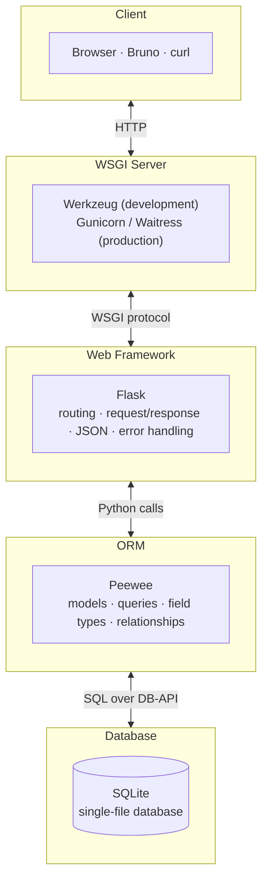

### Purpose of each technology

| Layer             | Technology     | Purpose                                                                                                                                                                                                                                                      |
| ----------------- | -------------- | ------------------------------------------------------------------------------------------------------------------------------------------------------------------------------------------------------------------------------------------------------------ |
| **WSGI Server**   | Werkzeug (dev) | Listens on a network port, parses raw HTTP requests into Python data structures, and sends HTTP responses back over the network. Implements the WSGI standard ([PEP 3333](https://peps.python.org/pep-3333/)), so any WSGI-compatible framework can plug in. |
| **Web Framework** | Flask          | Routes incoming requests to the correct Python function based on the URL and HTTP method. Parses JSON request bodies, converts return values to JSON responses, and manages the application lifecycle (startup, per-request hooks, error handling).          |
| **ORM**           | Peewee         | Maps database tables to Python classes and rows to Python objects. Translates Python method calls into safe, parameterized SQL. Manages relationships between tables and converts query results back into Python objects.                                    |
| **Database**      | SQLite         | Stores data persistently on disk in a single file. Executes SQL statements, enforces constraints (unique, foreign key, not-null), and handles concurrent reads. Data survives server restarts.                                                               |

### What each layer provides

**WSGI Server (Werkzeug/gnicorn)** — the network boundary

- Binds to `localhost:5000` and listens for TCP connections
- Parses raw HTTP text into structured request data (method, path, headers,
  body)
- Serializes Python response objects back into HTTP text
- Provides auto-reload and debug error pages during development
- In production, a server like Gunicorn replaces Werkzeug — your Flask code does
  not change

**Flask** — request routing and application logic

- Matches URL patterns to view functions (`@app.route("/users/<int:user_id>")`)
- Provides `request` and `jsonify` for reading input and producing output
- Runs lifecycle hooks (`before_request`, `teardown_appcontext`) that manage the
  database connection
- Registers Blueprints to organize routes into separate modules
- Returns appropriate HTTP status codes (200, 201, 404, 409, etc.)

**Peewee ORM** — data access

- Defines the database schema as Python classes (models with typed fields)
- Generates safe SQL for CRUD operations: `Model.create()`, `Model.select()`,
  `.save()`, `.delete_instance()`
- Manages relationships (foreign keys, backrefs, junction tables)
- Converts database rows into Python objects and Python objects into rows
- Uses parameterized queries to prevent SQL injection

**SQLite** — persistent storage

- Stores all data in a single `.db` file (no separate server process)
- Enforces data integrity through constraints (primary keys, unique, foreign
  keys)
- Supports standard SQL for querying and filtering
- Included in Python's standard library — nothing extra to install

### How a request flows through all four layers

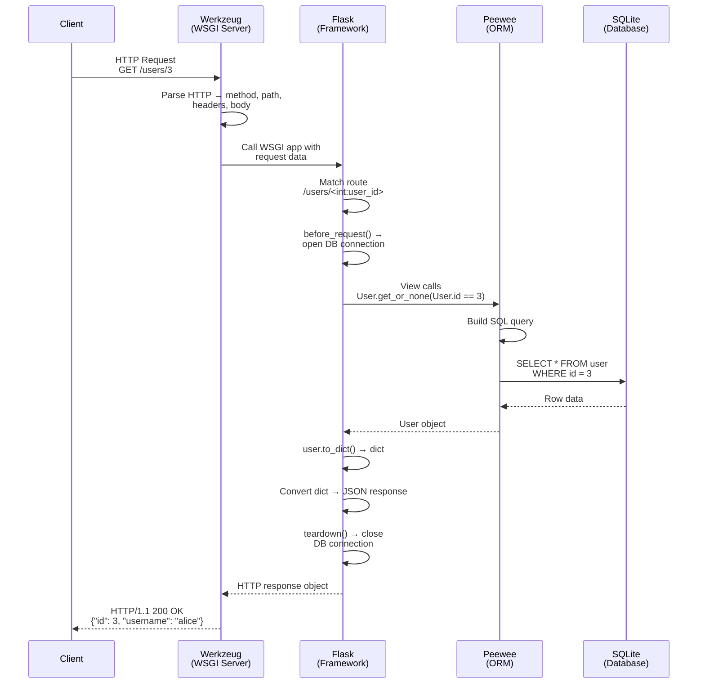

### What you write vs. what the tools provide

As a developer building a Flask + Peewee application, you only write code in two
of the four layers — the framework layer (view functions and configuration) and
the ORM layer (model definitions). The WSGI server and the database engine are
provided for you.

| What you write                                                                  | What is provided                                                   |
| ------------------------------------------------------------------------------- | ------------------------------------------------------------------ |
| **View functions** — handle requests, validate input, return responses          | **Werkzeug** — HTTP parsing, network I/O, auto-reload              |
| **Models** — define tables, fields, relationships                               | **SQLite** — SQL execution, data storage, constraint enforcement   |
| **Application factory** — configure Flask, register blueprints, set up DB hooks | **Flask** — routing, JSON conversion, lifecycle management         |
| **`to_dict()` methods** — control JSON serialization                            | **Peewee** — SQL generation, parameterized queries, object mapping |

---

## 2. Why Database Persistence?

The Flask APIs you built in [flask_intro.md] stored data in Python data
structures — lists and dictionaries held in memory. This works but it has a
serious limitation that every time the server restarts, all data disappears.

In a real application data is expected to survive restarts, crashes, and
deployments. A **database** solves this by writing data to disk so it persists
independently of the running process.

| Approach                            | Data survives restart? | Handles concurrent users? | Can search/filter efficiently? |
| ----------------------------------- | ---------------------- | ------------------------- | ------------------------------ |
| Python list/dict in memory          | No                     | No                        | Not well                       |
| Plain text / JSON file              | Yes                    | Not safely                | No                             |
| Database (SQLite, PostgreSQL, etc.) | Yes                    | Yes                       | Yes                            |

For this course we use **SQLite** — a database engine that stores everything in
a single file. Python includes SQLite support in the standard library, so there
is nothing extra to install.

---

## 3. What is an ORM and Why Use One?

You _could_ write raw SQL strings in your Python code to talk to the database.
That works, but it introduces several problems as your project grows:

- **Context switching** — you constantly jump between Python syntax and SQL
  syntax, which slows you down and increases mistakes
- **Repetitive boilerplate** — opening connections, building query strings,
  converting rows to objects, closing connections — the same pattern over and
  over
- **No structure** — your data's shape is described in SQL `CREATE TABLE`
  statements separate from the Python code that uses it, so the two can drift
  apart

An **ORM** (Object-Relational Mapper) addresses these problems by letting you
work with database tables as Python classes and rows as Python objects. Instead
of writing raw SQL you write Python code, and the ORM generates safe, correct
SQL for you.

| Without ORM (raw SQL)                                             | With ORM (Peewee)                                |
| ----------------------------------------------------------------- | ------------------------------------------------ |
| `SELECT * FROM user WHERE id = 3;`                                | `User.get_by_id(3)`                              |
| `INSERT INTO user (username, email) VALUES ('alice', 'a@b.com');` | `User.create(username="alice", email="a@b.com")` |
| `UPDATE user SET email = 'new@b.com' WHERE id = 3;`               | `user.email = "new@b.com"` then `user.save()`    |
| `DELETE FROM user WHERE id = 3;`                                  | `user.delete_instance()`                         |

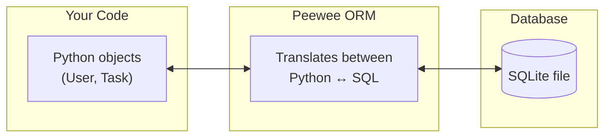

### Benefits of using an ORM

- **One language** — define your data, query it, and process results all in
  Python
- **Safety** — the ORM uses parameterized queries, preventing SQL injection
- **Less boilerplate** — connection management, type conversion, and result
  mapping are handled for you
- **Readable code** — `User.get_by_id(3)` is easier for your team to understand
  than a raw SQL string

### Why Peewee?

- **Lightweight** — small API, easy to learn alongside Flask
- **No Flask extension required** — works with plain Python; you wire it into
  Flask yourself, which teaches you how the pieces connect
- **Pythonic** — models are regular Python classes, queries read like English
- **SQLite included** — Python ships with SQLite, so there is nothing extra to
  install for development

### Key ORM terminology

| Term          | Meaning                                                              |
| ------------- | -------------------------------------------------------------------- |
| **Model**     | A Python class that maps to one database table                       |
| **Field**     | A class attribute that maps to one table column                      |
| **Instance**  | One Python object = one row in the table                             |
| **Query**     | A Python expression that Peewee converts to SQL                      |
| **Migration** | Updating the database schema when models change (beyond this course) |

---

## 4. Database Setup

Peewee needs two things before you can define models:

1. A **database instance** — tells Peewee which database engine and file to use
2. A **base model class** — so you do not repeat the database reference in every
   model

### Installation

```bash
uv add peewee
```

### `database.py` — create the database instance

```python
from peewee import SqliteDatabase

# None means "don't connect yet" — the path is set later in Flask create_app()
db = SqliteDatabase(None)
```

Using `None` as the initial path is called **deferred initialization**. The
actual file path is provided when the Flask application factory calls
`db.init(path)`, so the database location can change depending on context
(development, testing, etc.).

> **In-memory databases:** Peewee also accepts the special path `":memory:"`
> — `db.init(":memory:")` creates a SQLite database that lives entirely in
> RAM. It is never written to disk, and it disappears the moment the connection
> closes. This is useful for quick verification scripts and automated tests
> where you want a fast, disposable database without leaving files behind.

### Base model class

Every Peewee model needs a nested `class Meta` that tells Peewee which database
to use. Without a shared base class you would repeat that configuration in every
model:

```python
# Bad -  Without BaseModel — repeating Meta in every class
class User(Model):
    class Meta:
        database = db   # duplicated

class Task(Model):
    class Meta:
        database = db   # duplicated again
```

A **`BaseModel`** removes this duplication. It inherits from Peewee's `Model`
and defines `Meta` once; every application model then inherits from `BaseModel`:

```python
# Good - With BaseModel — define Meta once
from peewee import Model
from .database import db


class BaseModel(Model):
    """Base class for all models in this application.

    Subclasses automatically use the shared database connection
    defined in database.py.
    """

    class Meta:
        database = db
```

```python
# User and Task inherit database from BaseModel
class User(BaseModel):
    ...

class Task(BaseModel):
    ...
```

This is standard **Python inheritance**. `BaseModel` is the parent class, and
every model that inherits from it automatically gets the `Meta` configuration
(which database to use) without repeating it.

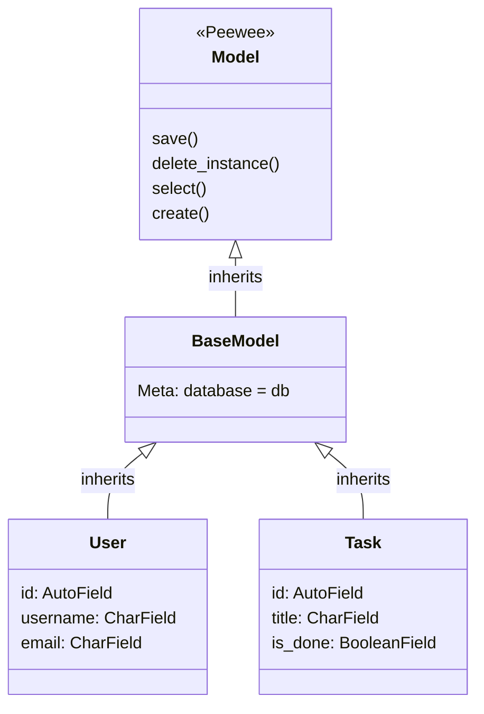

> **Why not skip `BaseModel` and put `database = db` in every model?** It works,
> but it violates the DRY principle (Don't Repeat Yourself). If you later change
> the database — for example switching from SQLite to PostgreSQL — you would
> need to update every model. With `BaseModel` you change it in one place.

### Connecting Peewee to Flask

Peewee is not a Flask extension — you connect it manually using Flask's request
hooks. This happens inside the **application factory** (`create_app()`):

```python
from pathlib import Path
from flask import Flask
from .database import db


def create_app():
    app = Flask(__name__)

    # Set the database path (instance/ folder, next to the package)
    parent_dir = Path(__file__).resolve().parent.parent
    db.init(str(parent_dir / "instance" / "app.db"))

    # Ensure the instance/ directory exists
    Path(parent_dir / "instance").mkdir(exist_ok=True)

    # Open a database connection before each request
    @app.before_request
    def before_request():
        db.connect(reuse_if_open=True)

    # Close the connection after each request
    @app.teardown_appcontext
    def teardown(exc):
        if not db.is_closed():
            db.close()

    return app
```

| Hook                       | When it runs                                           | Purpose                    |
| -------------------------- | ------------------------------------------------------ | -------------------------- |
| `@app.before_request`      | Before Flask calls your view function                  | Open a database connection |
| `@app.teardown_appcontext` | After the response is sent (even if an error occurred) | Close the connection       |

#### Why the `instance/` folder?

The database file is placed in an `instance/` directory **outside** the
application package rather than inside it. This separation exists for two
reasons:

1. **Generated data does not belong in source code.** The `.db` file is created
   at runtime and contains user data that changes with every request. Source
   code in your package (`app/`) is version-controlled and should not include
   files that differ on every machine. Keeping them separate makes it easy to
   add `instance/` to `.gitignore`.
2. **Flask convention.** Flask itself uses an `instance/` folder for
   instance-specific files (configuration overrides, secret keys, databases).
   Following this convention means other Flask developers immediately know where
   to find runtime data.

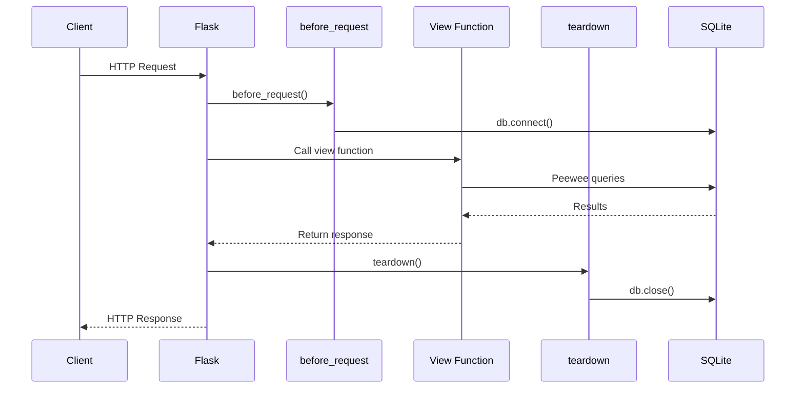
---

## 5. Defining Models

A model is a Python class where each class attribute is a **field** that maps to
a database column.

### Common Peewee field types

| Peewee Field              | Python Type    | SQLite Type             | Typical Use                   |
| ------------------------- | -------------- | ----------------------- | ----------------------------- |
| `AutoField()`             | `int`          | INTEGER PRIMARY KEY     | Auto-incrementing ID          |
| `CharField(max_length=N)` | `str`          | VARCHAR(N)              | Short text (names, emails)    |
| `TextField()`             | `str`          | TEXT                    | Long text (descriptions)      |
| `BooleanField()`          | `bool`         | INTEGER (0/1)           | True/False flags              |
| `IntegerField()`          | `int`          | INTEGER                 | Counts, sizes                 |
| `BigIntegerField()`       | `int`          | BIGINT                  | Large numbers (byte counts)   |
| `FloatField()`            | `float`        | REAL                    | Percentages, measurements     |
| `DateTimeField()`         | `datetime`     | TEXT                    | Timestamps                    |
| `ForeignKeyField(Model)`  | `int` (stored) | INTEGER + FK constraint | Relationship to another table |

### Column constraints

| Constraint             | Purpose                                            | Example                                 |
| ---------------------- | -------------------------------------------------- | --------------------------------------- |
| `primary_key=True`     | Unique row identifier (automatic with `AutoField`) | `id = AutoField()`                      |
| `unique=True`          | No duplicate values allowed                        | `CharField(max_length=50, unique=True)` |
| `null=False` (default) | Column cannot be empty                             | `CharField(max_length=200)`             |
| `default=value`        | Value used when none is provided                   | `BooleanField(default=False)`           |

### Example: User model

```python
import datetime
from peewee import AutoField, CharField, DateTimeField
from .database import db


class BaseModel(Model):
    class Meta:
        database = db


class User(BaseModel):
    """Maps to the 'user' table in the database."""

    class Meta:
        table_name = "user"

    id = AutoField()
    username = CharField(max_length=50, unique=True)
    email = CharField(max_length=100, unique=True)
    created_at = DateTimeField(default=datetime.datetime.now)

    def __repr__(self):
        return f"<User {self.id}: {self.username}>"

    def to_dict(self):
        """Convert to dictionary for JSON serialization."""
        return {
            "id": self.id,
            "username": self.username,
            "email": self.email,
            "created_at": self.created_at.isoformat(),
        }
```

**What each piece does:**

| Code                                           | Purpose                                                                                               |
| ---------------------------------------------- | ----------------------------------------------------------------------------------------------------- |
| `class Meta: table_name = "user"`              | Sets the database table name (Peewee defaults to class name lowercase)                                |
| `id = AutoField()`                             | Auto-incrementing integer primary key                                                                 |
| `CharField(max_length=50, unique=True)`        | Short string column; no two users can share the same username                                         |
| `DateTimeField(default=datetime.datetime.now)` | Automatically set to the current time when a row is created (note: pass the function, not the result) |
| `to_dict()`                                    | Converts the model instance to a plain dictionary so Flask can serialize it to JSON                   |

### Example: Task model with a foreign key

```python
from peewee import AutoField, BooleanField, CharField, ForeignKeyField, TextField

class Task(BaseModel):
    """Maps to the 'task' table. Each task belongs to one user."""

    class Meta:
        table_name = "task"

    id = AutoField()
    title = CharField(max_length=200)
    details = TextField()
    is_done = BooleanField(default=False)
    created_at = DateTimeField(default=datetime.datetime.now)
    assignee = ForeignKeyField(
        User, backref="tasks", column_name="assignee_id", on_delete="CASCADE"
    )

    def __repr__(self):
        status = "✓" if self.is_done else "○"
        return f"<Task {self.id}: {self.title} ({status})>"

    def to_dict(self):
        return {
            "id": self.id,
            "title": self.title,
            "details": self.details,
            "is_done": self.is_done,
            "created_at": self.created_at.isoformat(),
            "assignee": self.assignee.username,
            "assignee_id": self.assignee_id,
        }
```

### Understanding `ForeignKeyField`

`ForeignKeyField` creates a relationship between two tables — the most common
pattern in relational databases.

```python
assignee = ForeignKeyField(
    User,                       # The model this field points to
    backref="tasks",            # Reverse accessor: user.tasks gives all tasks
    column_name="assignee_id",  # Database column name (stores the integer ID)
    on_delete="CASCADE",        # Delete tasks when the user is deleted
)
```

### How relationships add attributes to your classes

When you write the single line above, Peewee silently creates **three**
**attributes** — two on the class that defines the field and one on the class it
points to. Understanding this is key to working with relationships.

#### Attributes added to `Task` (the class that defines the field)

You wrote one field (`assignee`), but at runtime Peewee gives each `Task`
instance **two** attributes:

| Attribute          | Type          | What it does                                           | Database query?                       |
| ------------------ | ------------- | ------------------------------------------------------ | ------------------------------------- |
| `task.assignee`    | `User` object | Follows the foreign key and returns the related `User` | Yes — fetches the row on first access |
| `task.assignee_id` | `int`         | The raw integer ID stored in the `assignee_id` column  | No — already loaded                   |

```python
task = Task.get_by_id(1)

# These look similar but behave differently:
task.assignee_id         # 3  (just the integer — fast, no extra query)
task.assignee            # <User 3: alice>  (full User object — triggers a SELECT)
task.assignee.username   # "alice"  (attribute of the User object)
```

Peewee generates `assignee_id` automatically by appending `_id` to the field
name. This is useful when you only need the ID (for example in `to_dict()`) and
want to avoid an extra database query.

#### Attribute added to `User` (the referenced class, via `backref`)

The `backref="tasks"` parameter tells Peewee to add a **reverse accessor** to
the `User` class. You never write this attribute yourself — Peewee injects it:

| Attribute    | Type                                       | What it does                                              |
| ------------ | ------------------------------------------ | --------------------------------------------------------- |
| `user.tasks` | `SelectQuery` (iterable of `Task` objects) | Returns all tasks where `assignee_id` points to this user |

```python
user = User.get_by_id(3)

# .tasks does not exist anywhere in the User class definition —
# Peewee created it because Task.assignee has backref="tasks"
for task in user.tasks:
    print(task.title)
```

> **Key insight:** You defined `assignee` in the `Task` class, but both `Task`
> _and_ `User` gained new attributes. The ORM uses Python's descriptor protocol
> to inject these at class-creation time — the same mechanism Python uses for
> `@property`.

#### Visual summary

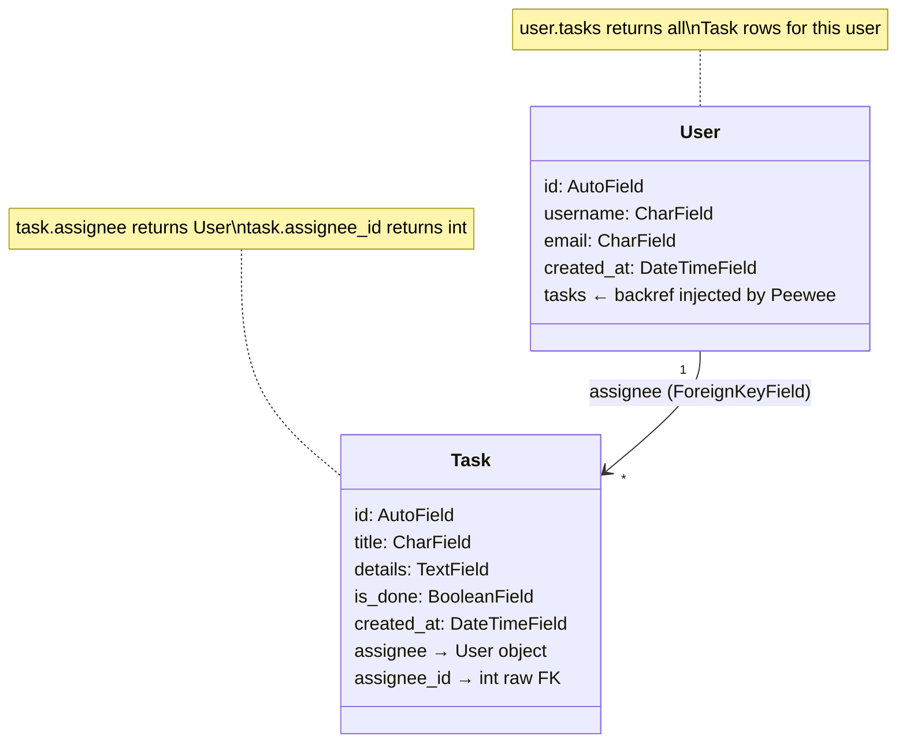

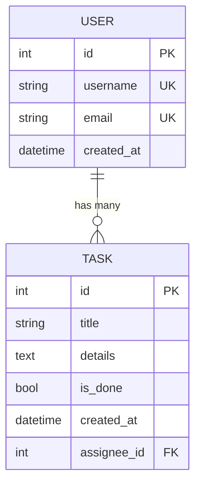

---

## 6. Creating Database Tables

Before your application can read or write data, the tables must exist in the
SQLite file. Peewee creates them with `db.create_tables()`:

```python
db.create_tables([User, Tag, Task, TaskTag], safe=True)
```

`safe=True` adds `IF NOT EXISTS` — the call is harmless if the tables are
already there.

**Order matters:** tables that are referenced by foreign keys must be listed
before (or at least exist before) the tables that reference them. In the list
above, `User` and `Tag` are created first because `Task` references `User` and
`TaskTag` references both `Task` and `Tag`.

### Setup scripts

The demo applications use a `manage_db.py` script to drop, recreate, and seed
the database:

```python
# Typical manage_db.py pattern
from .app import create_app
from .database import db
from .models import User, Tag, Task, TaskTag

def setup_database():
    app = create_app()

    with app.app_context():
        db.connect(reuse_if_open=True)

        # Fresh start — drop then create
        db.drop_tables([TaskTag, Task, Tag, User], safe=True)
        db.create_tables([User, Tag, Task, TaskTag])

        # Seed with initial data
        User.create(username="alice", email="alice@example.com")
        User.create(username="bob", email="bob@example.com")

        Tag.create(name="urgent")
        Tag.create(name="work")

        task = Task.create(title="Read documentation", details="", assignee=1)
        TaskTag.create(task=task, tag=1)

        db.close()

if __name__ == "__main__":
    setup_database()
```

Run the script once before starting the server:

```powershell
uv run python -m your_package.manage_db
```

### Database lifecycle: first run vs. subsequent runs

If you have never worked with a database before, it can be confusing to
understand what happens on disk when your application starts. Here is the key
idea: **the SQLite database is just a file**. Peewee creates it the first time
and reuses it every time after that.

#### First run — empty database

The very first time you start your Flask app (or run `manage_db.py`), the `.db`
file does not exist yet. Here is what happens step by step:

1. `db.init("instance/app.db")` — tells Peewee _where_ the file will live, but
   does not create it yet.
2. `db.connect()` — SQLite sees that the file does not exist and **creates an
   empty file** on disk. At this point the file exists but contains no tables.
3. `db.create_tables([User, Task, ...], safe=True)` — Peewee generates
   `CREATE TABLE IF NOT EXISTS` SQL for each model and sends it to SQLite. The
   tables (and their columns, constraints, and indexes) now exist inside the
   file, but they contain **zero rows**.
4. Your app is now ready to accept requests. Every `POST` or `create()` call
   adds rows to these empty tables.

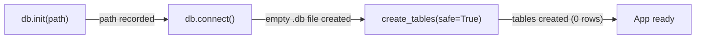

#### Subsequent runs — existing database

Every time you restart the server after the first run, the `.db` file **already
exists on disk** with tables and data from previous sessions:

1. `db.init("instance/app.db")` — points Peewee at the existing file.
2. `db.connect()` — SQLite opens the existing file. All tables and rows are
   still there.
3. `db.create_tables([...], safe=True)` — Peewee issues
   `CREATE TABLE IF NOT EXISTS` for each model. Because the tables already
   exist, **every statement is a no-op** — nothing is created, nothing is
   deleted. Your data is untouched.
4. Your app is ready. All data from prior runs is available immediately.

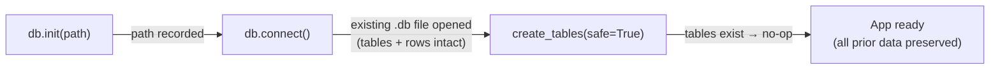

#### `manage_db.py` — intentional reset

The `manage_db.py` script from the previous section is **destructive by**
**design**: it calls `db.drop_tables()` to delete all tables (and their data),
then `db.create_tables()` without `safe=True` to recreate empty tables, and
finally inserts seed data. Use it only when you want a fresh start:

| Action                                                         | Effect on data                                       |
| -------------------------------------------------------------- | ---------------------------------------------------- |
| Start the server (factory calls `create_tables(safe=True)`)    | **Preserves** all existing data                      |
| Run `manage_db.py` (`drop_tables` then `create_tables` + seed) | **Destroys** all data and replaces it with seed rows |

> **Key takeaway:** `create_tables(safe=True)` is safe to call on every
> application startup — it creates tables when they are missing and does nothing
> when they already exist. This is why the application factory includes it: it
> handles both the first run and every run after that with a single line of
> code.

---

## 7. Creating Records (INSERT)

Peewee provides two ways to create a new row:

### `Model.create()` — insert and return in one step

```python
user = User.create(username="alice", email="alice@example.com")
# user.id is already set (auto-generated by the database)
```

### Instantiate then `.save()` - two steps

```python
user = User(username="alice", email="alice@example.com")
user.save()
# user.id is now set
```

Both approaches insert a row and make the auto-generated `id` available
immediately.

### Example: POST endpoint that creates a user

```python
from flask import Blueprint, request

users_bp = Blueprint("users", __name__, url_prefix="/users")


@users_bp.route("/", methods=["POST"])
def create_user():
    data = request.get_json()

    if not data:
        return {"error": "Request body must be JSON"}, 400

    username = data.get("username")
    email = data.get("email")

    if not username or not email:
        return {"error": "username and email are required"}, 400

    # Check for duplicates
    if User.get_or_none(User.username == username) is not None:
        return {"error": "Username already exists"}, 409

    new_user = User.create(username=username, email=email)
    return new_user.to_dict(), 201
```

**Key points:**

- `request.get_json()` parses the JSON body from the client
- Validate required fields before touching the database
- Check for unique constraint violations _before_ creating (avoids database
  errors)
- Return the created object with status `201 Created`

---

## 8. Reading Records (SELECT)

### Common query patterns

| What you want                  | Peewee code                                  | SQL equivalent                                        |
| ------------------------------ | -------------------------------------------- | ----------------------------------------------------- |
| All rows                       | `User.select()`                              | `SELECT * FROM user`                                  |
| All rows sorted                | `User.select().order_by(User.username)`      | `SELECT * FROM user ORDER BY username`                |
| One row by primary key         | `User.get_by_id(3)`                          | `SELECT * FROM user WHERE id = 3`                     |
| One row by condition (or None) | `User.get_or_none(User.username == "alice")` | `SELECT * FROM user WHERE username = 'alice' LIMIT 1` |
| Filtered rows                  | `Task.select().where(Task.is_done == False)` | `SELECT * FROM task WHERE is_done = 0`                |
| Count                          | `User.select(fn.COUNT(User.id)).scalar()`    | `SELECT COUNT(id) FROM user`                          |

> **Important:** `User.select()` returns an iterable of `User` objects, not a
> list. You can loop over it, but if you need a real list use
> `list(User.select())`.

### Example: GET endpoints for reading data

```python
from flask import Blueprint, jsonify

users_bp = Blueprint("users", __name__, url_prefix="/users")


@users_bp.route("/", methods=["GET"])
def list_users():
    all_users = User.select().order_by(User.username)

    result = []
    for user in all_users:
        result.append(user.to_dict())

    return jsonify(result)


@users_bp.route("/<int:user_id>", methods=["GET"])
def get_user(user_id):
    user = User.get_or_none(User.id == user_id)

    if user is None:
        return {"error": f"User {user_id} not found"}, 404

    return user.to_dict()
```

### Diagram: query execution flow

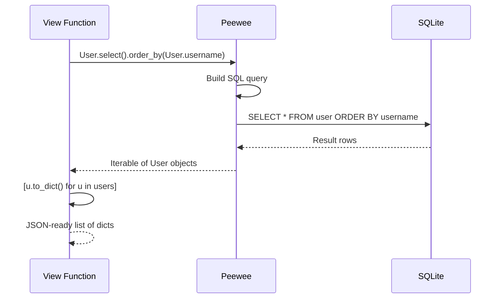

### Counting with aggregate functions

Peewee uses `fn` (imported from `peewee`) for SQL functions:

```python
from peewee import fn

total_users = User.select(fn.COUNT(User.id)).scalar()
completed = Task.select(fn.COUNT(Task.id)).where(Task.is_done == True).scalar()
```

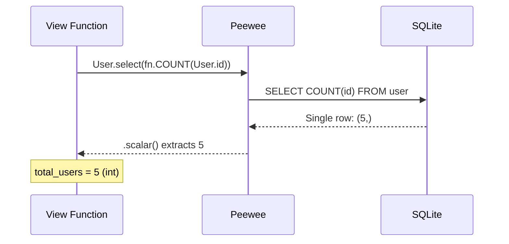

#### Why `.scalar()` is needed

A normal Peewee query like `User.select()` returns an iterable of **model
objects** — one `User` instance per row. But an aggregate query like
`SELECT COUNT(id) FROM user` does not return user rows. It returns a **single
row with a single computed value** (for example, the integer `5`).

Without `.scalar()`, Peewee would still try to wrap that result in a `User`
object, which is not what you want — you just need the number. Calling
`.scalar()` tells Peewee: "skip the model wrapping and give me the raw value
from the first column of the first row."

| Query style                               | What the database returns  | What Peewee gives you                   |
| ----------------------------------------- | -------------------------- | --------------------------------------- |
| `User.select()`                           | Multiple rows of user data | Iterable of `User` objects              |
| `User.select(fn.COUNT(User.id))`          | One row: `(5,)`            | Iterable of `User` objects (not useful) |
| `User.select(fn.COUNT(User.id)).scalar()` | One row: `(5,)`            | `5` (a plain `int`)                     |

Use `.scalar()` whenever you need a single value from an aggregate function —
counts, sums, averages, or any SQL expression that returns one result.

---

## 9. Updating Records (UPDATE)

To update a record: fetch it, change its attributes, then call `.save()`.

```python
user = User.get_by_id(3)
user.email = "new_email@example.com"
user.save()
```

### Example: PUT endpoint that updates a user

```python
@users_bp.route("/<int:user_id>", methods=["PUT"])
def update_user(user_id):
    user = User.get_or_none(User.id == user_id)

    if user is None:
        return {"error": f"User {user_id} not found"}, 404

    data = request.get_json()

    if not data:
        return {"error": "Request body must be JSON"}, 400

    new_username = data.get("username")
    new_email = data.get("email")

    if not new_username or not new_email:
        return {"error": "username and email are required"}, 400

    # Check uniqueness only if the value changed
    if new_username != user.username:
        if User.get_or_none(User.username == new_username) is not None:
            return {"error": "Username already exists"}, 409

    if new_email != user.email:
        if User.get_or_none(User.email == new_email) is not None:
            return {"error": "Email already exists"}, 409

    user.username = new_username
    user.email = new_email
    user.save()

    return user.to_dict()
```

### Example: toggling a boolean field

```python
@tasks_bp.route("/<int:task_id>/toggle", methods=["POST"])
def toggle_task(task_id):
    task = Task.get_or_none(Task.id == task_id)

    if task is None:
        return {"error": f"Task {task_id} not found"}, 404

    task.is_done = not task.is_done
    task.save()

    return task.to_dict()
```

---

## 10. Deleting Records (DELETE)

Use `.delete_instance()` on a model object to remove it from the database:

```python
user = User.get_by_id(3)
user.delete_instance()
```

If the model has `on_delete="CASCADE"` on its foreign-key relationships, related
rows are deleted automatically. Deleting a user with `recursive=True` ensures
Peewee walks all back-references:

```python
user.delete_instance(recursive=True)
```

### Example: DELETE endpoint

```python
@users_bp.route("/<int:user_id>", methods=["DELETE"])
def delete_user(user_id):
    user = User.get_or_none(User.id == user_id)

    if user is None:
        return {"error": f"User {user_id} not found"}, 404

    username = user.username
    user.delete_instance(recursive=True)

    return {"message": f"User '{username}' deleted successfully"}
```

---

## 11. Relationships

### One-to-many

You have already seen this: one `User` has many `Task` rows, linked by
`ForeignKeyField`.

```python
# Create a task for user 1
Task.create(title="Write report", details="", assignee=1)

# Get all tasks for a user (via backref)
user = User.get_by_id(1)
for task in user.tasks:
    print(task.title)
```

### Many-to-many (through model)

When a task can have many tags **and** a tag can belong to many tasks, you need
a **junction table** (also called an association or through table).

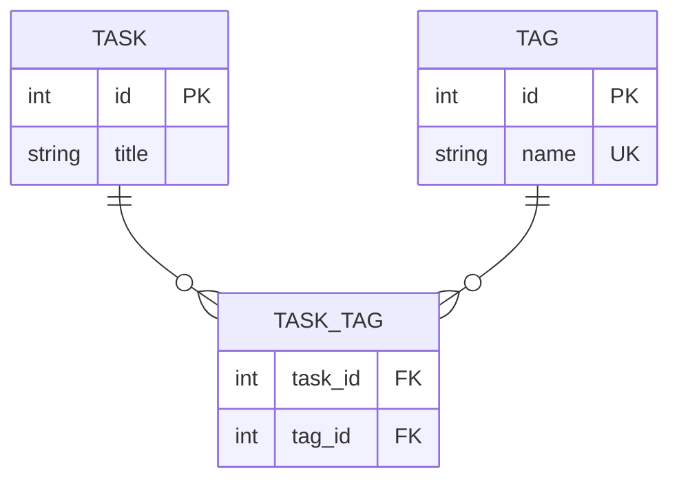

#### Tag model

```python
from peewee import AutoField, CharField

class Tag(BaseModel):
    class Meta:
        table_name = "tag"

    id = AutoField()
    name = CharField(max_length=50, unique=True)

    def __repr__(self):
        return f"<Tag {self.id}: {self.name}>"
```

#### TaskTag through model

```python
from peewee import ForeignKeyField

class TaskTag(BaseModel):
    """Junction table linking Task and Tag (many-to-many)."""

    class Meta:
        table_name = "task_tag"
        indexes = ((("task", "tag"), True),)  # unique pair

    task = ForeignKeyField(Task, backref="task_tags", on_delete="CASCADE")
    tag = ForeignKeyField(Tag, backref="task_tags", on_delete="CASCADE")
```

The same attribute-injection rules from §5 apply here. Each `ForeignKeyField`
creates attributes on both sides:

| Field definition in `TaskTag`                       | Attributes added to `TaskTag`                               | Attribute injected into referenced model            |
| --------------------------------------------------- | ----------------------------------------------------------- | --------------------------------------------------- |
| `task = ForeignKeyField(Task, backref="task_tags")` | `task_tag.task` → `Task` object, `task_tag.task_id` → `int` | `task.task_tags` → all `TaskTag` rows for that task |
| `tag = ForeignKeyField(Tag, backref="task_tags")`   | `task_tag.tag` → `Tag` object, `task_tag.tag_id` → `int`    | `tag.task_tags` → all `TaskTag` rows for that tag   |

Notice that `Task` and `Tag` never mention `TaskTag` in their own class
definitions — the `backref` parameter causes Peewee to inject `task_tags` into
both classes automatically.

#### Querying through the junction table

```python
# Get all tags for a task
tags = Tag.select().join(TaskTag).where(TaskTag.task == task)

# Get all tasks that have a specific tag
tasks = Task.select().join(TaskTag).where(TaskTag.tag == tag)

# Add a tag to a task
TaskTag.create(task=task, tag=tag)

# Remove all tags from a task then add new ones
TaskTag.delete().where(TaskTag.task == task).execute()
for tag_id in new_tag_ids:
    TaskTag.create(task=task, tag=tag_id)
```

This "delete all, re-insert" pattern is how the `task_manager_07` demo handles
tag updates — it is simple and reliable for small datasets.

---

## 12. Minimal Single-Table Example — Start to Finish

Before looking at a full multi-model project, work through the
**`simple_orm_demo`** project — the smallest possible complete Flask + Peewee
application: one model, one blueprint, and full CRUD.

> The project README contains setup instructions, curl test commands, mermaid
> diagrams showing startup and per-request flow, an ORM ↔ SQL quick-reference
> table, and guidance on running the test suite.

### Project structure

```text
simple_orm_demo/
├── run.py                  # Entry point — starts the dev server
├── pyproject.toml          # Project metadata and dependencies
├── instance/               # Created at runtime — holds the SQLite .db file
├── book_app/               # Main application package
│   ├── __init__.py         # Application factory (create_app)
│   ├── config.py           # Configuration variables (DATABASE_PATH)
│   ├── database.py         # Deferred SQLite database instance
│   ├── models.py           # Peewee models (BaseModel, Book)
│   └── api/                # API blueprint sub-package
│       ├── __init__.py     # Blueprint registration
│       └── routes.py       # CRUD route handlers
└── tests/                  # Test suite
    ├── conftest.py         # Shared fixtures (test client)
    └── test_books_api.py   # CRUD endpoint tests
```

### Quick start

```powershell
cd simple_orm_demo
uv sync                          # install dependencies
uv run python run.py             # start the server on localhost:5000
```

### Key concepts to notice when reading the source

**Relative imports** — every module inside `book_app/` imports its siblings with
dot notation:

| Import                      | Meaning                                                         |
| --------------------------- | --------------------------------------------------------------- |
| `from .database import db`  | Single dot — same package (`book_app/`)                         |
| `from . import api_bp`      | Single dot — grab `api_bp` from the sub-package's `__init__.py` |
| `from ..models import Book` | Double dot — go up one level (`book_app/api/` → `book_app/`)    |

**`jsonify` for lists** — Flask auto-serializes dictionaries but **not** plain
lists. The `list_books()` handler wraps its result in `jsonify()` because it
returns a list. The other handlers return plain dictionaries, which Flask
serializes automatically.

**Application factory (`create_app`)** — wires together database path,
connection hooks, blueprint registration, and table creation. Study the comments
in `book_app/__init__.py` for a step-by-step walkthrough.

**`run.py` uses an absolute import** — because it sits _outside_ the package, it
cannot use relative imports. It simply calls `create_app()` and starts the
development server.

### How the files connect

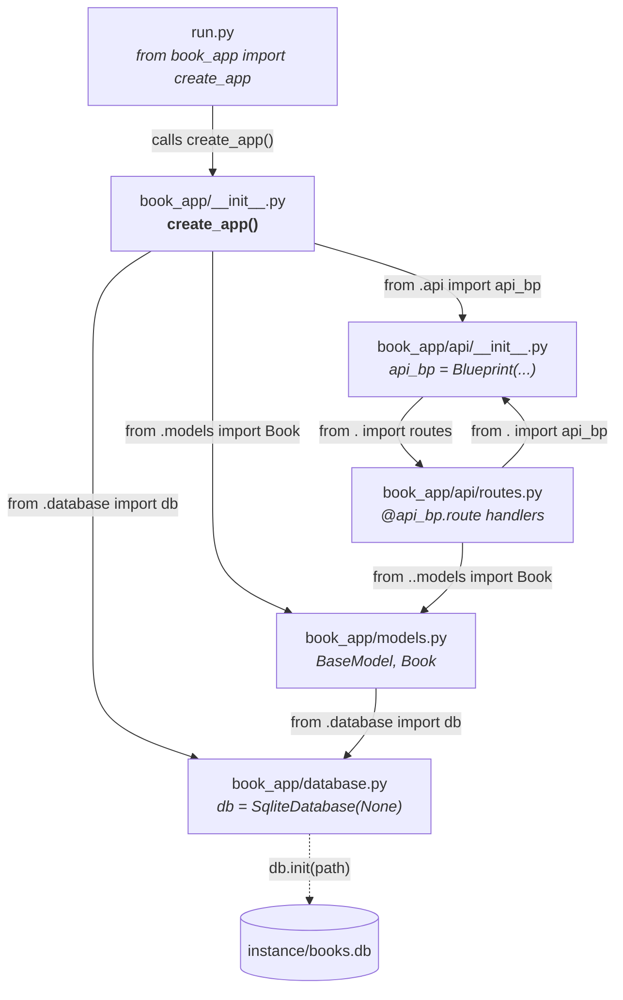

---

## 13. Putting It All Together

The **`flask_orm_api_demo`** project is a progressive series of Flask
applications that builds from a minimal "Hello World" API to a full CRUD service
with a relational database and a TUI client. The final version,
`task_manager_07`, uses every concept from this guide.

> **Demo location:**
> [`subjects/flask_orm/demo/flask_orm_api_demo/`](../demo/flask_orm_api_demo/)
>
> The project README contains:
>
> - A step-by-step learning path (00 → 07) with setup and run instructions
> - VS Code debug configurations — set breakpoints and step through every layer
>   of the request lifecycle
> - An **Architecture Deep Dive** section covering the application factory,
>   entry script, end-to-end request lifecycle (mermaid diagram), CRUD summary
>   table, and a cross-reference mapping each ORM concept to the file where it
>   appears in `task_manager_07`
> - curl examples for every endpoint

### What to study in `task_manager_07`

| File(s)           | What it demonstrates                                                                          |
| ----------------- | --------------------------------------------------------------------------------------------- |
| `app.py`          | Application factory — database init, connection hooks, blueprint registration, table creation |
| `database.py`     | Deferred `SqliteDatabase(None)` initialized later by the factory                              |
| `models.py`       | `BaseModel`, column types, `ForeignKeyField`, many-to-many through model, `to_dict()`         |
| `routes/users.py` | Full CRUD: `create`, `get_or_none`, `save`, `delete_instance(recursive=True)`                 |
| `routes/tasks.py` | CRUD with junction-table management (TaskTag)                                                 |
| `routes/tags.py`  | CRUD on a simple model                                                                        |
| `routes/home.py`  | `fn.COUNT` aggregate query with `.scalar()`                                                   |
| `run_07.py`       | Entry script — absolute import of `create_app()`                                              |

---

## CRUD Summary

| Operation    | Peewee Code                                 | HTTP Method | Status Code  |
| ------------ | ------------------------------------------- | ----------- | ------------ |
| **Create**   | `Model.create(field=value)`                 | POST        | 201 Created  |
| **Read all** | `Model.select()`                            | GET         | 200 OK       |
| **Read one** | `Model.get_or_none(Model.id == pk)`         | GET         | 200 OK / 404 |
| **Update**   | modify attributes → `instance.save()`       | PUT         | 200 OK       |
| **Delete**   | `instance.delete_instance()`                | DELETE      | 200 OK       |
| **Count**    | `Model.select(fn.COUNT(Model.id)).scalar()` | —           | —            |
| **Filter**   | `Model.select().where(condition)`           | —           | —            |
| **Sort**     | `Model.select().order_by(Model.field)`      | —           | —            |

---

## References

- [Peewee Documentation](https://docs.peewee-orm.com/en/latest/)
- [Peewee Quickstart](https://docs.peewee-orm.com/en/latest/peewee/quickstart.html)
- [Peewee Models and Fields](https://docs.peewee-orm.com/en/latest/peewee/models.html)
- [Peewee Querying](https://docs.peewee-orm.com/en/latest/peewee/querying.html)
- [Peewee Relationships and Joins](https://docs.peewee-orm.com/en/latest/peewee/relationships.html)
- [Flask Quickstart](https://flask.palletsprojects.com/en/stable/quickstart/)
- [Flask `@app.before_request`](https://flask.palletsprojects.com/en/stable/api/#flask.Flask.before_request)
- [Flask Application Globals](https://flask.palletsprojects.com/en/stable/api/#application-globals)
- [flask_intro.md](flask_intro.md) — Flask concepts overview
- [wsgi_overview.md](../../web_http_general/notes/wsgi_overview.md) — How Flask
  runs your application
