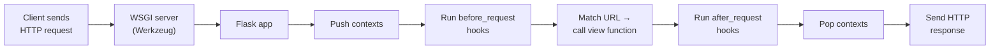
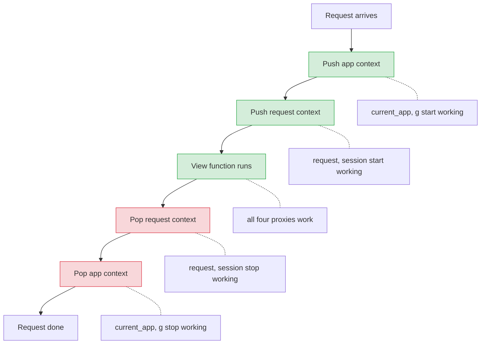
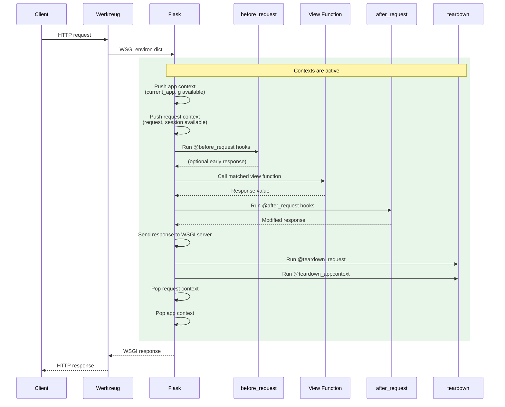
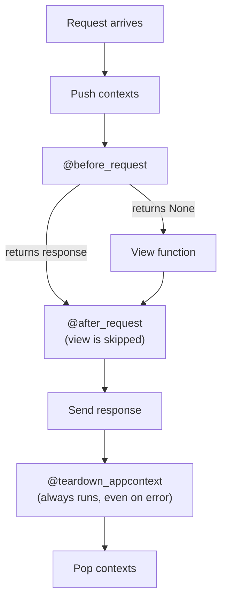
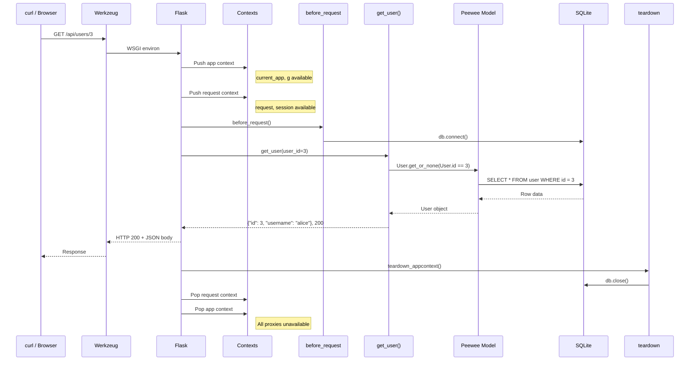

# Background: Flask Application Structure and Lifecycle

## Why This Matters

When you write a Flask view function, you use objects like `request` and
`current_app` without ever creating them yourself. They just "appear" and work.
Understanding **how** they appear — and when they stop working — will save you
from a class of confusing `RuntimeError` messages and help you write database
setup scripts, tests, and CLI commands with confidence.

---

## 1. The Two Phases of a Flask Application

A Flask application has two distinct phases:

### Setup phase (runs once)

This is the code that executes when you call `create_app()`. It runs **before**
any HTTP request is handled:

- Create the `Flask` object
- Load configuration
- Register blueprints
- Initialize extensions and database connections
- Create database tables

```python
def create_app():
    app = Flask(__name__)                # 1. Create the app
    app.config["SECRET_KEY"] = "dev"     # 2. Configure it
    db.init(str(db_path))               # 3. Set up database
    app.register_blueprint(api_bp)       # 4. Register routes
    db.create_tables([User], safe=True)  # 5. Create tables
    return app
```

> **Rule:** All setup must be complete before the first request arrives. Do not
> register routes or modify app configuration inside view functions.

### Serving phase (runs repeatedly)

Once the app is ready, the WSGI server (Werkzeug in development) listens for
HTTP requests. Each request triggers a sequence of steps — this is the **request
lifecycle**, described in detail in Section 3 below.

---

## 2. From HTTP Request to Python Function

Before diving into contexts, here is the high-level path a request takes. Each
step in this chain is something Flask handles automatically:



Steps D and H — **pushing and popping contexts** — are the mechanism that makes
`request`, `current_app`, `g`, and `session` available inside your code.

### What does "pushing" and "popping" mean?

Think of a stack of trays in a cafeteria. You can only use the tray on top.

- **Pushing** a context means Flask places a new environment on top of the
  stack. While it sits there, the proxy objects (`current_app`, `request`, etc.)
  point to real data and work normally.
- **Popping** a context means Flask removes that environment from the stack. The
  proxies no longer point to anything — using them now raises a `RuntimeError`.

Flask pushes contexts when a request arrives and pops them when it is finished:



When you write `with app.app_context():` in a script or test, you are doing this
push/pop manually — the `with` block pushes on entry and pops on exit.

---

## 3. The Request Lifecycle — Step by Step

When Flask receives an HTTP request, the following happens in order. You do not
need to memorize every step, but knowing the general flow helps you understand
where your code runs and what is available at each point.



### Key takeaways

| Step                   | What happens                                              | What is available                          |
| ---------------------- | --------------------------------------------------------- | ------------------------------------------ |
| Push app context       | Flask activates `current_app` and `g`                     | `current_app`, `g`                         |
| Push request context   | Flask activates `request` and `session`                   | All four proxies                           |
| `before_request` hooks | Your code runs before the view (e.g., open DB connection) | All four proxies                           |
| View function          | Your route handler executes                               | All four proxies                           |
| `after_request` hooks  | Your code can modify the response                         | All four proxies                           |
| `teardown_appcontext`  | Cleanup runs even if an error occurred (e.g., close DB)   | `current_app`, `g` (response already sent) |
| Pop contexts           | Proxies become unavailable                                | Nothing                                    |

---

## 4. Contexts Explained

### The problem contexts solve

In a simple script, you might create one `app` object and pass it everywhere.
But in a real Flask application with blueprints, your view functions live in
separate files that do not have direct access to the `app` variable. You also
cannot just import it — that would cause circular imports with the factory
pattern.

Flask solves this with **contexts**: temporary environments that make certain
objects available as importable proxies for the duration of a request.

### Two context layers

Flask maintains two contexts that are pushed and popped together for each
request:

```text
┌─────────────────────────────────────────────┐
│  Application Context                        │
│  ┌───────────────────────────────────────┐  │
│  │  Request Context                      │  │
│  │                                       │  │
│  │  request   — the incoming HTTP data   │  │
│  │  session   — per-user session data    │  │
│  └───────────────────────────────────────┘  │
│                                             │
│  current_app — the Flask application        │
│  g           — per-request scratch space    │
└─────────────────────────────────────────────┘
```

| Context                 | Proxy objects        | Lifetime                                              | Purpose                                                                    |
| ----------------------- | -------------------- | ----------------------------------------------------- | -------------------------------------------------------------------------- |
| **Application context** | `current_app`, `g`   | Created when a request starts, destroyed when it ends | Access the app and store per-request data without importing `app` directly |
| **Request context**     | `request`, `session` | Same as app context during a request                  | Access the incoming HTTP request data                                      |

> **Key insight:** Pushing a request context **automatically** pushes an
> application context. You almost never need to push them separately.

---

## 5. The Four Proxy Objects

These are the objects Flask makes available inside view functions, hooks, and
error handlers. They are called **proxies** because they point to different
underlying objects depending on which request is being handled.

### `current_app` — the application

`current_app` points to the Flask application handling the current request. Use
it to access configuration and app-level resources from inside view functions
and blueprints.

```python
from flask import current_app

@api_bp.route("/info")
def info():
    db_path = current_app.config["DATABASE_PATH"]
    return {"database": db_path}
```

This was introduced in [flask_intro.md](flask_intro.md) — the new detail here is
that `current_app` works because Flask pushes an application context before your
view runs, and pops it after.

### `request` — the incoming HTTP data

`request` contains everything about the current HTTP request: method, URL,
headers, query parameters, and body.

```python
from flask import request

@api_bp.route("/users", methods=["POST"])
def create_user():
    data = request.get_json()        # parsed JSON body
    page = request.args.get("page")  # query string ?page=2
    method = request.method          # "POST"
    return {"received": data}, 201
```

### `session` — per-user data across requests

`session` is a dictionary that persists across requests for the same user
(stored as a signed cookie). It is available during a request but its contents
survive between requests.

```python
from flask import session

@app.route("/login", methods=["POST"])
def login():
    session["username"] = request.get_json()["username"]
    return {"message": "logged in"}

@app.route("/profile")
def profile():
    username = session.get("username", "anonymous")
    return {"user": username}
```

> Sessions are beyond the scope of this course but are mentioned here for
> completeness. The important concept is that `session` is a request-context
> proxy, just like `request`.

### `g` — per-request scratch space

`g` (short for "global") is a simple namespace object where you can store data
that needs to be shared between functions **during a single request**. It is
created fresh for every request and thrown away when the request ends.

```python
from flask import g

def get_current_user():
    """Look up the user once per request and cache on g."""
    if "user" not in g:
        token = request.headers.get("Authorization")
        g.user = look_up_user(token)  # expensive operation
    return g.user

@api_bp.route("/dashboard")
def dashboard():
    user = get_current_user()  # first call queries the DB
    tasks = get_tasks(user)    # get_current_user() returns cached g.user
    return {"user": user.name, "tasks": tasks}
```

**What `g` is NOT:**

- `g` is **not** a way to store data between requests. It is reset for every
  request.
- `g` is **not** shared between users or threads. Each request gets its own `g`.
- To store data across requests, use a database or `session`.

### Common use of `g`: database connections

A very common pattern is to open a database connection at the start of a request
and store it on `g`, then close it in a teardown handler. This ensures every
function during the request reuses the same connection without passing it around
explicitly.

```python
from flask import g
import sqlite3

def get_db():
    if "db" not in g:
        g.db = sqlite3.connect("app.db")
    return g.db

@app.teardown_appcontext
def close_db(exception):
    db = g.pop("db", None)
    if db is not None:
        db.close()
```

> **Note:** In the Peewee ORM pattern used in this course, database connection
> management is handled through `before_request` and `teardown_appcontext` hooks
> rather than `g`, but the underlying concept is the same — hooks guarantee that
> resources are cleaned up after every request.

---

## 6. What Happens Outside a Request

### The error you will eventually see

If you try to use `current_app`, `request`, or `g` outside of a request — for
example, in a setup script or at module import time — you get:

```text
RuntimeError: Working outside of application context.
```

or:

```text
RuntimeError: Working outside of request context.
```

This happens because no context has been pushed, so the proxy objects have
nothing to point to.

### When does this come up?

| Situation              | Example                                            | Solution                                                 |
| ---------------------- | -------------------------------------------------- | -------------------------------------------------------- |
| Database setup scripts | `manage_db.py` that creates/seeds tables           | Push a context manually with `with app.app_context():`   |
| Testing with pytest    | Fixtures that need the app                         | Use `app.app_context()` or Flask's test client           |
| Interactive shell      | Experimenting in the Python REPL                   | `flask shell` pushes a context automatically             |
| Module-level code      | `db_path = current_app.config[...]` at import time | Move the code into a function that runs during a request |

### Manually pushing a context

When you need the application context outside of a request (scripts, tests), use
`app.app_context()` as a context manager:

```python
# manage_db.py — a standalone script that seeds the database
from my_app import create_app
from my_app.models import User

app = create_app()

with app.app_context():
    # current_app and g are now available inside this block
    User.create(username="alice", email="alice@example.com")
    print("Database seeded.")
# Context is popped here — current_app and g are no longer available
```

### pytest example

```python
# tests/conftest.py
import pytest
from my_app import create_app

@pytest.fixture
def app():
    app = create_app()
    yield app

@pytest.fixture
def client(app):
    """Flask's test client automatically pushes contexts."""
    return app.test_client()
```

Flask's `test_client()` pushes both the application and request contexts
automatically for each simulated request, so view functions, `request`,
`current_app`, and `g` all work normally inside tests.

---

## 7. Hooks: Running Code Before and After Requests

Flask provides decorators that let you run code at specific points in the
request lifecycle. You have already seen these in the database connection
pattern from [flask_orm.md](flask_orm.md) — here is the full picture:

| Decorator                  | When it runs                                               | Common use                                     |
| -------------------------- | ---------------------------------------------------------- | ---------------------------------------------- |
| `@app.before_request`      | Before every request, after contexts are pushed            | Open database connection, check authentication |
| `@app.after_request`       | After the view returns, before the response is sent        | Add headers, log response                      |
| `@app.teardown_appcontext` | After the response is sent, when contexts are being popped | Close database connection, release resources   |

### Execution order



### Key difference: `after_request` vs. `teardown_appcontext`

- **`after_request`** receives the response object and can modify it. It does
  **not** run if an unhandled exception occurred.
- **`teardown_appcontext`** always runs, even if the request crashed. It
  receives the exception (or `None`) as a parameter. This is why database
  connections are closed here — you never want to leak a connection, even when
  an error occurs.

```python
@app.before_request
def open_db():
    db.connect(reuse_if_open=True)

@app.teardown_appcontext
def close_db(exception):
    if not db.is_closed():
        db.close()
```

---

## 8. Putting It All Together — A Complete Request

Here is a concrete example tracing a `GET /api/users/3` request through a Flask
app that uses Peewee for database access:



---

## Summary

| Concept                   | What it is                                             | When you need to know about it                              |
| ------------------------- | ------------------------------------------------------ | ----------------------------------------------------------- |
| **Setup phase**           | Code that runs once when `create_app()` is called      | Configuring the app, registering blueprints                 |
| **Serving phase**         | The loop that handles incoming requests                | Understanding request flow                                  |
| **Application context**   | Makes `current_app` and `g` available                  | Accessing config from blueprints; writing scripts and tests |
| **Request context**       | Makes `request` and `session` available                | Reading request data in view functions                      |
| **`current_app`**         | Proxy to the active Flask application                  | Accessing `app.config` from any module                      |
| **`request`**             | Proxy to the current HTTP request                      | Reading JSON body, query params, headers                    |
| **`g`**                   | Per-request scratch space, reset after each request    | Caching expensive lookups within a single request           |
| **`session`**             | Per-user data persisted across requests (cookie)       | Authentication, user preferences                            |
| **`before_request`**      | Hook that runs before the view                         | Opening database connections                                |
| **`teardown_appcontext`** | Hook that always runs after the request, even on error | Closing database connections                                |
| **Manual context push**   | `with app.app_context():`                              | Setup scripts, tests, CLI commands                          |

---

## References

- [Flask Documentation: Application Structure and Lifecycle](https://flask.palletsprojects.com/en/stable/lifecycle/)
- [Flask Documentation: The Application Context](https://flask.palletsprojects.com/en/stable/appcontext/)
- [Flask Documentation: The Request Context](https://flask.palletsprojects.com/en/stable/reqcontext/)
