# Building Terminal User Interfaces with Textual

## Why Textual

- Graphical interfaces are useful for visualizing data and navigating an
  application
- **Textual** runs entirely in the terminal — no windowing system, no
  OS-specific libraries
- It provides interactive applications with mouse support, color, and layout —
  all in a terminal or via web
- Traditional GUI frameworks (Tkinter, PyQt) require complex setup and
  platform-specific dependencies
- Excellent fit for system-administration dashboards, monitoring tools, and
  data-display applications
- Pure Python — installs with `uv add textual` and runs on Windows, macOS, and
  Linux

## What is Textual

- Textual is a **TUI (Text User Interface)** framework for Python
- It brings modern UI patterns — widgets, layout, CSS styling, event handling —
  to the terminal
- Applications are built by subclassing `App`, composing widgets, and responding
  to events
- Widgets come with sensible default styles; and **Textual CSS** is
  available for customization
- Textual is asynchronous under the hood (built on `asyncio`), but **most**
  **handlers can be regular synchronous methods**. When you need to dynamically
  add or remove widgets, you will use `async`/`await` — covered at the end of
  this guide

## User Interfaces and Event-Driven Programming

Most of the programs you wrote early in this course follow a **sequential**
pattern: the program starts, executes statements from top to bottom, perhaps
calls some functions, and then exits. The programmer decides the order of
operations. Even when your program reads user input with `input()`, execution
pauses at that one line, collects a value, and continues downward.

However, you have already encountered a different model — **Flask**. A Flask app
does not run top to bottom. It starts a server, waits for HTTP requests, and
dispatches each request to the matching route handler. That is event-driven
programming. Programs with a user interface — whether graphical (GUI) or
terminal-based (TUI) — work the same way.

### What is a User Interface?

A user interface is the layer between a human and a program. It presents
information visually and accepts input through interactions like typing,
clicking, or pressing keys.

| Interface Style          | How It Works                                                     | Example                                                |
| ------------------------ | ---------------------------------------------------------------- | ------------------------------------------------------ |
| Command-line (`input()`) | Program asks one question at a time, waits for typed text        | A quiz program that prints questions and reads answers |
| Graphical (GUI)          | Program displays a window with buttons, text fields, menus       | A desktop calculator with clickable buttons            |
| Terminal (TUI)           | Program takes over the terminal with styled text, tables, panels | A dashboard showing live server status in the terminal |

A TUI looks and behaves like a GUI — it has widgets, layout, colors, mouse
support — but it renders everything using terminal text characters rather than
pixel-based graphics.

### Procedural vs Event-Driven Programs

In a **procedural** program, your code controls the flow:

```python
# Sequential program — the programmer controls the order
name = input("Enter your name: ")
age = input("Enter your age: ")
print(f"Hello {name}, you are {age} years old.")
# Program ends
```

The program runs uninterupted by the user. The user has no choice about what happens
next — they answer the questions in the order the programmer wrote them.

In an **event-driven** program, after the initial application setup, the _user_
controls the flow:

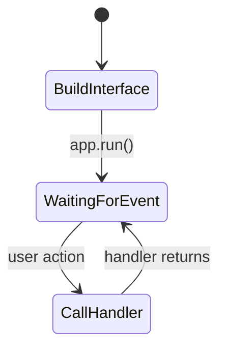

The program draws its interface and then **waits**. The user might click a
button, press a key, or select a table row — in any order they choose. Each user
action triggers an **event**, and the program responds by calling the
**handler** function you associated with that event.

This should feel familiar — it is exactly what Web Applications and Flask does.
Flask's `app.run()` starts a loop that waits for HTTP requests. When a request
arrives, Flask matches the URL to a route and calls your handler function.
Textual's `app.run()` starts a loop that waits for key presses, mouse clicks,
and widget events. When one occurs, Textual matches it to a handler and calls
your method.

### The Event Loop

The engine that makes this work is the **event loop** — a loop that runs
continuously, watching for events and dispatching them to your handler
functions:

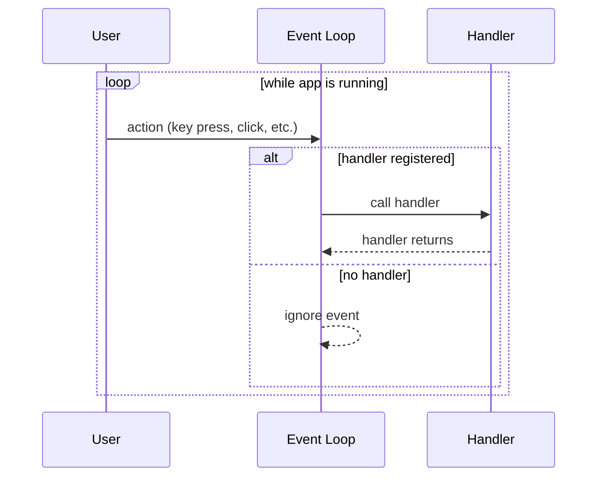

**You _will not_ write this loop yourself.** The framework provides it. In
Textual, calling `app.run()` starts the event loop. Your job is to:

1. **Build the interface** — define widgets in `compose()`
2. **Write handler functions** — methods that respond to specific events
3. **Connect events to handlers** — through naming conventions, key bindings, or
   decorators

### Comparing Flask and Textual

| Concept              | Flask                                 | Textual                                     |
| -------------------- | ------------------------------------- | ------------------------------------------- |
| Central object       | `app = Flask(__name__)`               | `class MyApp(App)`                          |
| Define the interface | HTML templates (Jinja2)               | `compose()` yields widgets                  |
| Register handlers    | `@app.route("/path")` decorator       | `on_*` methods, `BINDINGS`, `@on` decorator |
| Handler functions    | View functions that return responses  | `action_*` and `on_*` methods               |
| Start the event loop | `app.run()` — waits for HTTP requests | `app.run()` — waits for user input          |
| Styling              | CSS files in `static/`                | Textual CSS Files(`.tcss` files)            |
| State management     | Session, database, global variables   | Instance attributes, reactive attributes    |

```python
# Flask — event-driven over HTTP
@app.route("/greet")
def greet():
    return "Hello!"       # Handler for the /greet event (HTTP request)

app.run()                  # Start the event loop (HTTP server)
```

```python
# Textual — event-driven over the terminal
class MyApp(App):
    BINDINGS = [("g", "greet", "Greet")]   # Connect "g" key to greet action

    def action_greet(self) -> None:
        self.notify("Hello!")              # Handler for the "g" key event

MyApp().run()                              # Start the event loop (TUI)
```

The pattern is the same: **register a handler, start the loop, let the framework
call your function when the event occurs.**

### Anatomy of a TUI Program

Every Textual application follows a consistent structure that maps directly to
the event-driven model:

| Step                          | Event-Driven Concept                   | Textual Implementation                                        |
| ----------------------------- | -------------------------------------- | ------------------------------------------------------------- |
| 1. Create the interface       | Build widgets and arrange them         | Override `compose()` and yield widgets                        |
| 2. Define behavior            | Write functions that respond to events | Define `on_*` handler methods and `action_*` methods          |
| 3. Connect events to behavior | Associate user actions with handlers   | Use `BINDINGS` for keys; naming conventions for widget events |
| 4. Start the event loop       | Run the program and wait for input     | Call `app.run()`                                              |

```python
from textual.app import App, ComposeResult
from textual.widgets import Header, Footer, Static


class GreetApp(App):
    # Step 3: Connect the "q" key to the built-in quit action
    BINDINGS = [("q", "quit", "Quit")]

    # Step 1: Build the interface
    def compose(self) -> ComposeResult:
        yield Header()
        yield Static("Hello! Press 'q' to quit.")
        yield Footer()

    # Step 2: Define behavior (on_mount runs when the app is ready)
    def on_mount(self) -> None:
        self.title = "My First TUI"


# Step 4: Start the event loop
if __name__ == "__main__":
    app = GreetApp()
    app.run()
```

### Why This Matters

Understanding event-driven programming is essential because:

- **You do not control the order of execution** — the user does. Your program
  must be ready to handle any event at any time.
- **Your code lives in handler functions**, not in a top-to-bottom script. Each
  handler should do one job and return so the event loop can process the next
  event.
- **The event loop is always running.** If a handler takes too long (e.g., a
  slow network call), the entire interface freezes until it finishes. We will
  see how to handle this later with timers.
- **State must be stored in attributes**, not in local variables that disappear
  after a function ends. This is where object-oriented programming becomes
  essential — your `App` and `Widget` subclasses hold the state that persists
  between events.

### A Note on `yield` in Textual

Textual uses `yield` inside `compose()` to hand widgets to the framework. For
now, treat each `yield` line as saying _"add this widget to the screen."_ A
detailed explanation follows in the
[Understanding `yield` in `compose()`](#understanding-yield-in-compose) section
after you have seen it used in several examples.

### Architecture Overview

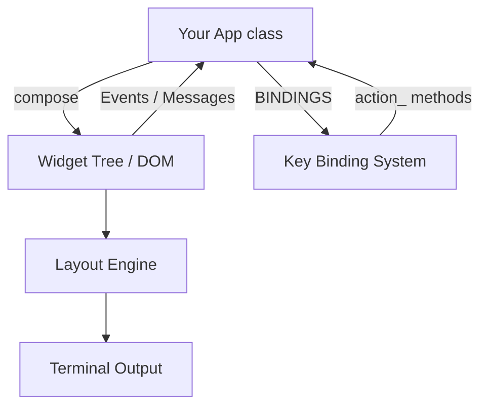

# Developing a Textual Application — Overview

Building a Textual app follows a repeatable workflow. The sections that follow
cover each concept in detail.

## 1. Setup and Environment

Create a project folder with a virtual environment and install Textual:

```bash
uv init                          # creates pyproject.toml
uv add textual                   # runtime dependency
uv add textual-dev --dev         # development tools (optional, recommended)
```

> `textual-dev` provides the `textual` command-line tool for live CSS editing
> and a debug console — covered in Step 5 below.

## 2. Scaffold the Application

Every Textual app starts the same way:

1. **Subclass `App`** — your class inherits the event loop, screen management,
   and key-binding system.
2. **Override `compose()`** — `yield` the widgets that make up your interface.
   Textual calls this method once to build the initial widget tree (the DOM).
3. **Instantiate and call `.run()`** — this enters "application mode" where
   Textual takes full control of the terminal.

```python
from textual.app import App, ComposeResult
from textual.widgets import Header, Footer, Static


class MyApp(App):
    def compose(self) -> ComposeResult:
        yield Header()
        yield Static("Hello, Textual!")
        yield Footer()


if __name__ == "__main__":
    app = MyApp()
    app.run()
```

Run it with:

```bash
uv run app.py
```

## 3. Design the Layout

Choose how widgets are arranged on screen by wrapping them in **containers**:

| Container          | Behaviour                                       |
| ------------------ | ----------------------------------------------- |
| `Vertical`         | Stack children top to bottom (the default)      |
| `Horizontal`       | Place children side by side                     |
| `VerticalScroll`   | Like `Vertical` with a scroll bar               |
| `HorizontalScroll` | Like `Horizontal` with a scroll bar             |
| `Grid`             | Two-dimensional row/column layout               |

Containers nest freely — a `Horizontal` inside a `Vertical` gives you a
two-column row, for example.

## 4. Style the Interface

Textual supports two styling approaches:

- **Python code** — set attributes on `widget.styles` (quick inline changes)
- **Textual CSS (TCSS)** — an external `.tcss` file linked via `CSS_PATH` on
  your `App` class (recommended for anything beyond trivial styling)

TCSS uses selectors modelled on web CSS:

```css
/* By widget class name */
Static { background: blue; }

/* By unique widget ID (set with id= in the constructor) */
#status { color: green; }

/* By TCSS class (set with classes= in the constructor) */
.highlight { text-style: bold; }
```

## 5. Add Interactivity

Make the app respond to user input:

- **Events** — write `on_<event_name>` methods (e.g., `on_button_pressed`,
  `on_data_table_row_selected`) or use the `@on()` decorator.
- **Key bindings** — define `BINDINGS` on the class and implement
  `action_<name>` methods.
- **Reactive attributes** — declare class-level `reactive()` values. Textual
  automatically calls `watch_<name>` when a reactive value changes and
  `validate_<name>` before it is stored.
- **Timers** — use `set_interval()` or `set_timer()` to run callbacks on a
  schedule.

## 6. Use the Development Tools

The `textual-dev` package provides a powerful debugging workflow.

### The Textual Console

Because a Textual app takes over the terminal, you cannot see regular `print()`
output or log messages while it is running. The **Textual console** solves this
by opening a separate terminal that receives all output from your app.

1. **Open the Textual console** in one terminal:

   ```bash
   textual console
   ```

2. **Run your app in dev mode** in another terminal:

   ```bash
   textual run --dev app.py
   ```

When running in dev mode, Textual **redirects `print()` to the console** — any
`print()` call in your code appears in the console window instead of disrupting
the TUI. The console also displays a live **event log** showing every event
Textual processes (key presses, mouse clicks, mounts, timers), which is
invaluable for understanding event flow and debugging handler issues.

### TCSS Live-Reloading

With `--dev`, **TCSS live-reloading** is enabled — edit your `.tcss` file, save
it, and the running app updates immediately. This makes iterative styling fast
and easy.

### Running in the VS Code Debugger

You can also run and debug your Textual app directly in the VS Code integrated
terminal using the standard Python debugger. Set breakpoints in your handler
methods, then launch your app with the VS Code debugger — it runs in the VS Code
terminal just like `uv run app.py`. This lets you step through event handlers,
inspect variables, and diagnose issues using the full VS Code debugging
experience.

> **Tip:** You can also serve your app in a browser with `textual serve app.py`
> and view it at `http://localhost:8000`.

For the full development tools reference, see the
[Textual Devtools Guide](https://textual.textualize.io/guide/devtools/).

## Development Workflow Summary

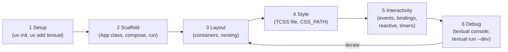

The detailed concept sections below walk through each of these steps.

## Further Reading

- [Real Python — Python Textual: Build Beautiful UIs in the Terminal](https://realpython.com/python-textual/) —
  end-to-end tutorial covering widgets, containers, TCSS, events, and devtools
- [Official Textual Tutorial](https://textual.textualize.io/tutorial/)
- [Textual Devtools Guide](https://textual.textualize.io/guide/devtools/)

# Textual Concepts

## 1. The App Class

### Why

Every Textual application needs a central coordinator — something that owns the
screen, manages widgets, handles key bindings, and runs the event loop. The
`App` class is that coordinator.

### Description

You create a Textual application by subclassing `textual.app.App`. Your subclass
defines:

- **`compose()`** — yields the widgets that make up your interface
- **`BINDINGS`** — a list of key-to-action mappings
- **`on_mount()`** — setup code that runs after the app is ready

### Minimal Application

```python
from textual.app import App, ComposeResult
from textual.widgets import Header, Footer, Static


class HelloApp(App):
    """A minimal Textual application."""

    def compose(self) -> ComposeResult:
        yield Header()
        yield Static("Hello, Textual!")
        yield Footer()


if __name__ == "__main__":
    app = HelloApp()
    app.run()
```

#### How it works

1. `HelloApp` subclasses `App`
2. `compose()` is a generator that yields widgets — Textual adds them to the
   screen
3. `Header()` and `Footer()` are built-in widgets that display the app title and
   key bindings
4. `Static("Hello, Textual!")` displays a simple text string
5. `app.run()` starts the event loop, takes over the terminal, and displays the
   UI

### Running a Textual App

```bash
# From the terminal, run your script with uv
uv run my_app.py
```

Press `Ctrl+Q` to quit (this is a default binding on `App`).

### Key App Class Attributes

| Attribute   | Type   | Purpose                                                   |
| ----------- | ------ | --------------------------------------------------------- |
| `BINDINGS`  | `list` | Maps keys to action methods                               |
| `CSS_PATH`  | `str`  | Path to an external `.tcss` stylesheet (optional styling) |
| `TITLE`     | `str`  | Text shown in the Header widget                           |
| `SUB_TITLE` | `str`  | Secondary text shown in the Header                        |

## 2. Widgets

### Why

An application is made of components — a header, a data table, a status bar,
buttons. In Textual, each component is a **widget**. Widgets handle their own
rendering, events, and styling. You build your UI by combining widgets.

### Description

Textual ships with a library of
[built-in widgets](https://textual.textualize.io/widget_gallery/). You can also
create custom widgets by subclassing `Widget` or `Static`.

### Common Built-in Widgets

| Widget      | Import            | Purpose                                        |
| ----------- | ----------------- | ---------------------------------------------- |
| `Header`    | `textual.widgets` | Displays app title at the top of the screen    |
| `Footer`    | `textual.widgets` | Shows key bindings at the bottom of the screen |
| `Static`    | `textual.widgets` | Displays text or Rich renderables              |
| `Button`    | `textual.widgets` | Clickable button that emits `Pressed` messages |
| `DataTable` | `textual.widgets` | Tabular data display with cursor navigation    |
| `Label`     | `textual.widgets` | Simple text label                              |
| `Input`     | `textual.widgets` | Text input field                               |
| `RichLog`   | `textual.widgets` | Scrollable log of Rich renderables             |

### Composing Widgets

The `compose()` method is a generator. You yield widgets in the order you want
them to appear:

```python
from textual.app import App, ComposeResult
from textual.widgets import Header, Footer, Static, Button


class MyApp(App):

    def compose(self) -> ComposeResult:
        yield Header()
        yield Static("Welcome to the app")
        yield Button("Click Me", id="btn-click")
        yield Footer()
```

#### Key points

- Widgets are added to a **DOM (Document Object Model)** — a tree structure like
  HTML
- You can assign an `id` to any widget (for CSS targeting and DOM queries)
- You can assign CSS `classes` to widgets: `Static("text", classes="highlight")`

### Creating a Custom Widget

You create custom widgets by subclassing `Static` or `Widget`:

- **Subclass `Static`** when your widget displays a single piece of text or a
  Rich renderable. `Static` already implements `render()` and provides an
  `update()` method so you can change the displayed content at any time. Think
  of it as a label you can update.
- **Subclass `Widget`** when your widget is more complex — it contains child
  widgets (using `compose()`) or needs full control over rendering (by
  overriding `render()` yourself).

#### Example — subclassing `Static`

```python
from textual.widgets import Static


class StatusLine(Static):
    """A status bar that starts with a default message."""

    def on_mount(self) -> None:
        self.update("Ready")
```

Because `StatusLine` extends `Static`, you can later call
`self.query_one(StatusLine).update("Processing...")` from anywhere in the app.

#### Example — subclassing `Widget`

```python
from textual.app import ComposeResult
from textual.widget import Widget
from textual.widgets import Label


class StatusPanel(Widget):
    """A custom widget that shows a labeled status."""

    def __init__(self, label: str, value: str) -> None:
        super().__init__()
        self.label_text = label
        self.value_text = value

    def compose(self) -> ComposeResult:
        yield Label(f"{self.label_text}: {self.value_text}")
```

#### Key points

- Subclass `Static` for simple text display; subclass `Widget` for composite or
  custom-rendered widgets
- Custom widgets use `compose()` to yield child widgets, or `render()` to return
  a Rich renderable
- Always call `super().__init__()` in your constructor

## 3. Composing with Containers

### Why

Real applications need structured layouts — sidebars, panels arranged
horizontally, grids. Containers let you group widgets and control how they are
arranged on screen.

### Description

Textual provides container widgets in `textual.containers` that control layout
direction:

| Container        | Layout        | Purpose                                        |
| ---------------- | ------------- | ---------------------------------------------- |
| `Vertical`       | Top to bottom | Stack widgets vertically (this is the default) |
| `Horizontal`     | Left to right | Arrange widgets side by side                   |
| `VerticalScroll` | Top to bottom | Vertical with automatic scrolling              |
| `Grid`           | Grid          | CSS grid layout                                |

### Using Containers

```python
from textual.app import App, ComposeResult
from textual.containers import Horizontal, Vertical
from textual.widgets import Header, Footer, Static


class LayoutApp(App):

    def compose(self) -> ComposeResult:
        yield Header()
        with Horizontal():
            yield Static("Left panel", id="left")
            yield Static("Right panel", id="right")
        yield Footer()
```

This produces a layout like:

```
┌──────────────────────────────────────┐
│ Header                               │
├──────────────────┬───────────────────┤
│ Left panel       │ Right panel       │
├──────────────────┴───────────────────┤
│ Footer                               │
└──────────────────────────────────────┘
```

#### Key points

- Use Python's `with` statement as a context manager to nest widgets inside
  containers
- `with Horizontal():` means the widgets yielded inside will be arranged left to
  right
- You can nest containers: a `Vertical` inside a `Horizontal`, etc.

### Nesting Example

```python
def compose(self) -> ComposeResult:
    yield Header()
    with Horizontal():
        with Vertical(id="sidebar"):
            yield Static("Menu Item 1")
            yield Static("Menu Item 2")
        with Vertical(id="main"):
            yield Static("Main content area")
    yield Footer()
```

This produces a layout like:

```
┌──────────────────────────────────────┐
│ Header                               │
├───────────┬──────────────────────────┤
│ Menu      │                          │
│ Item 1    │ Main content area        │
│           │                          │
│ Menu      │                          │
│ Item 2    │                          │
├───────────┴──────────────────────────┤
│ Footer                               │
└──────────────────────────────────────┘
```

## Understanding `yield` in `compose()`

By now you have seen `yield` used in every `compose()` method. Here is what it
means and why Textual uses it.

### `return` vs `yield`

- **`return`** gives back one value and the function is done
- **`yield`** gives back one value and the function _pauses_, ready to give back
  more

```python
# A regular function — returns once
def get_greeting():
    return "Hello"

result = get_greeting()
print(result)  # "Hello"

# A generator function — yields multiple values, one at a time
def get_greetings():
    yield "Hello"
    yield "Bonjour"
    yield "Hola"

for greeting in get_greetings():
    print(greeting)
# "Hello"
# "Bonjour"
# "Hola"
```

In Textual, `compose()` uses `yield` to hand widgets to the framework one at a
time:

```python
def compose(self) -> ComposeResult:
    yield Header()       # "Here's a Header for the screen"
    yield DataTable()    # "Here's a DataTable too"
    yield Footer()       # "And a Footer — that's everything"
```

### Why `yield` Instead of `return`?

A `compose()` method needs to hand back _multiple_ widgets. With `return`, you
would have to build a list and return it all at once:

```python
# Hypothetical — NOT how Textual works
def compose(self):
    widgets = []
    widgets.append(Header())
    widgets.append(DataTable())
    widgets.append(Footer())
    return widgets
```

With `yield`, each widget is handed to the framework immediately as it is
created, and the next line runs only when the framework is ready for the next
widget. This keeps `compose()` flat, readable, and avoids building an
intermediate list:

```python
# Actual Textual pattern
def compose(self) -> ComposeResult:
    yield Header()
    yield DataTable()
    yield Footer()
```

The `yield` approach also enables the `with` syntax for nesting widgets inside
containers:

```python
def compose(self) -> ComposeResult:
    yield Header()
    with Horizontal():
        yield Static("Left")
        yield Static("Right")
    yield Footer()
```

This context-manager nesting would not be possible if `compose()` simply
returned a list.

You do not need to understand generators deeply. Whenever you see `yield` inside
`compose()`, read it as _"add this widget to the screen."_

### In-Depth

[How to Use Generators and `yield` in Python](https://realpython.com/introduction-to-python-generators/)

## 4. Styling

### Description

Textual widgets come with sensible default styles out of the box. `Header`,
`Footer`, `DataTable`, `Button`, and other built-in widgets look good without
any custom styling. For most applications, the default appearance is all you
need.

When you do need to customize appearance — colors, borders, dimensions, layout —
Textual provides a CSS system modeled after web CSS. You write styles in `.tcss`
files and reference them with the `CSS_PATH` class variable, or inline them with
the `CSS` class variable. This is beyond the scope of this introduction. Details
are available in the
[Textual CSS Guide](https://textual.textualize.io/guide/CSS/).

#### Key Points

- **Widgets have IDs and classes** — you can assign `id="my-table"` and
  `classes="highlight"` when creating widgets. These are used by DOM queries
  (`query_one("#my-table")`) and can also be targeted by CSS rules if you add
  custom styling later.
- **The DOM** — Textual maintains a tree of widgets (like an HTML page’s DOM).
  Your `compose()` method builds this tree. `query_one()` and `query()` search
  it.

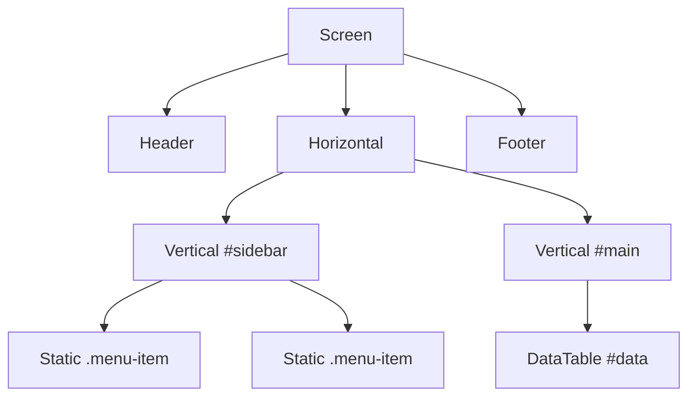

## 5. Events and Messages

### Why

Interactive applications need to respond to user actions — key presses, button
clicks, data selection. Textual uses an **event-driven** model: widgets emit
**messages** and your app defines **handlers** to respond.

### Description

When something happens (a button is clicked, a key is pressed, a timer fires),
Textual creates a message object and sends it to the appropriate widget.
Messages **bubble** up the DOM tree — if a widget doesn't handle a message, its
parent gets a chance.

### Handling Events

There are two ways to handle events:

**1. The `on_` naming convention:**

Name your method `on_<widget>_<event>` and Textual will call it automatically:

```python
from textual.app import App, ComposeResult
from textual.widgets import Button, Header, Footer, Static


class EventApp(App):

    def compose(self) -> ComposeResult:
        yield Header()
        yield Button("Press me", id="greet")
        yield Static("", id="output")
        yield Footer()

    def on_button_pressed(self, event: Button.Pressed) -> None:
        """Called when any button is pressed."""
        self.query_one("#output", Static).update("Button was pressed!")
```

**How the naming works:**

- `Button.Pressed` → snake_case of class names → `on_button_pressed`
- `DataTable.RowSelected` → `on_data_table_row_selected`
- The pattern is: `on_` + widget class (snake*case) + `*` + event name
  (snake_case)

**2. The `@on` decorator:**

For more control, use the `@on` decorator with optional CSS selectors:

```python
from textual import on
from textual.app import App, ComposeResult
from textual.widgets import Button, Static


class DecoratorApp(App):

    def compose(self) -> ComposeResult:
        yield Button("Save", id="save")
        yield Button("Cancel", id="cancel")
        yield Static("", id="output")

    @on(Button.Pressed, "#save")
    def handle_save(self, event: Button.Pressed) -> None:
        self.query_one("#output", Static).update("Saved!")

    @on(Button.Pressed, "#cancel")
    def handle_cancel(self, event: Button.Pressed) -> None:
        self.query_one("#output", Static).update("Cancelled!")
```

**Key points:**

- The `@on` decorator lets you bind a handler to a specific widget using CSS
  selectors
- This avoids large `if/elif` chains when you have multiple widgets emitting the
  same event type
- Messages bubble up the DOM — you can handle child events in parent widgets

### The Message Object

Every handler receives a **message object** as its parameter. This object
carries context about the event — which widget sent it, what data is associated
with it, and metadata that lets you decide how to respond.

```python
def on_button_pressed(self, event: Button.Pressed) -> None:
    # event is a Button.Pressed message object
```

The type annotation (e.g., `Button.Pressed`, `DataTable.RowSelected`) is not
just documentation — it tells you exactly which message class you are working
with and gives you access to its attributes.

#### Common Message Attributes

Every message has a `.control` attribute that refers to the widget that sent the
message. Beyond that, each message type carries its own event-specific data:

| Message Type              | Key Attributes                                              |
| ------------------------- | ----------------------------------------------------------- |
| `Button.Pressed`          | `.control` — the `Button` that was pressed                  |
| `DataTable.RowSelected`   | `.row_key` — key of the selected row; `.control` — the table |
| `DataTable.CellSelected`  | `.cell_key` — key of the selected cell; `.value` — cell value |
| `Input.Changed`           | `.value` — the current text; `.control` — the `Input` widget |
| `Input.Submitted`         | `.value` — the submitted text                               |
| `Key`                     | `.key` — the key name (e.g., `"r"`, `"escape"`)            |

#### Using Message Attributes

The message object is how you get details about _what happened_:

```python
def on_data_table_row_selected(self, event: DataTable.RowSelected) -> None:
    """Use the message to find out WHICH row the user selected."""
    row_key = event.row_key                          # from the message
    table = event.control                            # the DataTable itself
    row_data = table.get_row(row_key)
    self.notify(f"Selected: {row_data[0]}")
```

```python
def on_button_pressed(self, event: Button.Pressed) -> None:
    """Use .control to identify WHICH button was pressed."""
    if event.control.id == "save":
        self.notify("Saved!")
    elif event.control.id == "cancel":
        self.notify("Cancelled!")
```

#### Discovering Attributes

When working with an unfamiliar message type, you can inspect it in the Textual
console:

```python
def on_button_pressed(self, event: Button.Pressed) -> None:
    print(event)       # prints a readable summary to the Textual console
    print(dir(event))  # lists all attributes and methods
```

Run the app with `textual run --dev app.py` and the output appears in the
console opened by `textual console`. You can also check the
[Textual Events Reference](https://textual.textualize.io/events/) for a
complete list of message classes and their attributes.

### Common Events

| Event                       | Source       | When                             |
| --------------------------- | ------------ | -------------------------------- |
| `Button.Pressed`            | Button       | User clicks a button             |
| `DataTable.RowSelected`     | DataTable    | User selects a row (Enter key)   |
| `DataTable.CellHighlighted` | DataTable    | Cursor moves to a new cell       |
| `Input.Changed`             | Input        | Text in an input field changes   |
| `Input.Submitted`           | Input        | User presses Enter in an input   |
| `Mount`                     | Any widget   | Widget has been added to the DOM |
| `Key`                       | App / Widget | A key is pressed                 |

## 6. Key Bindings and Actions

### Why

Users expect keyboard shortcuts — press `Q` to quit, `R` to refresh, `D` to
delete. Bindings connect keys to **actions**, and actions are methods on your
app or widget prefixed with `action_`.

### Description

You define bindings in the `BINDINGS` class variable. Each binding is a tuple of
`(key, action_name, description)`. The description appears in the `Footer`
widget.

### Defining Bindings

```python
from textual.app import App, ComposeResult
from textual.widgets import Header, Footer, Static


class BindingApp(App):

    BINDINGS = [
        ("q", "quit", "Quit"),
        ("d", "toggle_dark", "Toggle Dark Mode"),
        ("r", "refresh_data", "Refresh"),
    ]

    def compose(self) -> ComposeResult:
        yield Header()
        yield Static("Press 'r' to refresh, 'd' for dark mode, 'q' to quit")
        yield Footer()

    def action_refresh_data(self) -> None:
        """Custom action triggered by pressing 'r'."""
        self.notify("Data refreshed!")
```

**How it works:**

1. The binding `("r", "refresh_data", "Refresh")` means: when the user presses
   `r`, call `action_refresh_data()`
2. The `action_` prefix is added automatically — you write `"refresh_data"` in
   the binding, Textual calls `action_refresh_data()`
3. `"Quit"` and `"Toggle Dark Mode"` descriptions appear in the Footer
4. `action_quit` and `action_toggle_dark` are built-in actions on `App`

### Actions with Parameters

Actions can accept parameters using string syntax:

```python
BINDINGS = [
    ("1", "set_status('online')", "Set Online"),
    ("2", "set_status('offline')", "Set Offline"),
]

def action_set_status(self, status: str) -> None:
    self.query_one("#status", Static).update(f"Status: {status}")
```

### Bindings Are a Specialized Form of Key-Event Handling

In the [Events and Messages](#5-events-and-messages) section you learned the
general pattern: a user action produces an event, Textual finds a matching
handler, and your method runs. Key presses are no different — every key press
produces a `Key` event that you can handle with an `on_key` method, just like
any other event:

```python
from textual.app import App, ComposeResult
from textual.events import Key
from textual.widgets import Header, Footer, Static


class KeyEventApp(App):
    """Handle key presses using the general event-handling pattern."""

    def compose(self) -> ComposeResult:
        yield Header()
        yield Static("Press 'r' to refresh, 'q' to quit", id="output")
        yield Footer()

    def on_key(self, event: Key) -> None:
        """General key handler — runs for EVERY key press."""
        if event.key == "r":
            self.query_one("#output", Static).update("Data refreshed!")
        elif event.key == "q":
            self.exit()
```

This works, but notice the `if/elif` chain. As the number of keys grows, this
handler becomes long and hard to maintain — the same problem you would have if
Flask made you handle every URL in a single function.

`BINDINGS` solve this by letting you **declaratively** map each key to its own
dedicated handler method, just as Flask's `@app.route` maps each URL to its own
function:

```python
class BindingApp(App):
    """Handle key presses using BINDINGS — the declarative shortcut."""

    BINDINGS = [
        ("r", "refresh_data", "Refresh"),
        ("q", "quit", "Quit"),
    ]

    def compose(self) -> ComposeResult:
        yield Header()
        yield Static("Press 'r' to refresh, 'q' to quit", id="output")
        yield Footer()

    def action_refresh_data(self) -> None:
        self.query_one("#output", Static).update("Data refreshed!")
```

Under the hood, both approaches respond to the same `Key` event. `BINDINGS`
simply tells Textual: "when this key is pressed, call this `action_*` method for
me" — so you don't have to write the dispatch logic yourself.

#### Side-by-Side Comparison

| Aspect                 | General `on_key` handler                          | `BINDINGS` + `action_*` methods                    |
| ---------------------- | ------------------------------------------------- | -------------------------------------------------- |
| Event source           | `Key` event (every key press)                     | `Key` event (same underlying mechanism)            |
| How you register       | Define an `on_key` method                         | Add a tuple to the `BINDINGS` list                 |
| Dispatch               | You write `if/elif` to check which key            | Textual dispatches to the right `action_*` method  |
| One handler per key?   | No — one handler for all keys                     | Yes — each key maps to its own action method       |
| Shown in Footer?       | No                                                | Yes — the description string appears automatically |
| Best for               | Uncommon keys, dynamic key handling, key combos   | Standard keyboard shortcuts with named actions     |

#### Key Takeaway

`BINDINGS` are not a separate system — they are a **specialized, declarative**
**layer** on top of the same key-event mechanism. They give you cleaner code
(one method per key), automatic Footer integration, and no manual dispatch
logic. Use `BINDINGS` for standard keyboard shortcuts; fall back to `on_key`
only when you need dynamic or unusual key handling.

### The Footer Widget and Bindings

The `Footer` widget automatically reads `BINDINGS` and displays them. This is
why you should always include a `Footer` in apps that use key bindings — it
gives the user a visual reference for available keys.

### Toast Notifications with `self.notify()`

`self.notify()` shows a small, non-blocking message that appears briefly and
then auto-dismisses — commonly called a **toast** (the term originated in
Android development).

```python
def action_refresh_data(self) -> None:
    # ... refresh logic ...
    self.notify("Data refreshed!")
```

You can set a `severity` to change the toast's appearance:

| Severity | Usage | Example |
|----------|-------|---------|
| `"information"` (default) | Routine confirmation | `self.notify("Loaded 5 hosts")` |
| `"warning"` | Something unexpected but not fatal | `self.notify("Value clamped to 30", severity="warning")` |
| `"error"` | An operation failed | `self.notify("Server unreachable", severity="error")` |

```python
def _refresh_hosts(self) -> None:
    data = self._api_get("/servers")
    if data is None:
        self.notify("Failed to reach server", severity="error")
        return
    self.notify(f"Loaded {len(data)} host(s)")
```

Toasts are ideal for action feedback because they don't interrupt the user's
workflow — unlike a modal dialog, the user never has to click "OK".

## 7. DOM Queries

### Why

You often need to find a widget after it has been composed — to update its
content, read its value, or change its style. DOM queries let you locate widgets
by type, ID, or CSS class.

### Description

Textual provides `query()` and `query_one()` methods on any widget (including
`App` and `Screen`):

```python
# Find one widget by ID (raises NoMatches if not found)
table = self.query_one("#my-table", DataTable)

# Find one widget by type
header = self.query_one(Header)

# Find all widgets matching a selector
buttons = self.query(Button)

# Find all widgets with a CSS class
highlights = self.query(".highlight")
```

**Key points:**

- `query_one(selector, type)` returns a single widget — raises `NoMatches` if
  not found
- Passing the expected type as the second argument gives you proper type hints
- `query(selector)` returns a collection you can iterate over
- Selectors use the same syntax as CSS: `"#id"`, `".class"`, `"WidgetType"`

## 8. The DataTable Widget

### Why

Tabular data is one of the most common ways to display structured information —
server status, database records, log entries. The `DataTable` widget provides a
full-featured table with keyboard navigation, sorting, and styling.

### Description

`DataTable` is a scrollable, navigable table widget. You add columns and rows
programmatically, and the widget handles rendering, scrolling, and cursor
movement.

### Official Documentation

- [DataTable Widget](https://textual.textualize.io/widgets/data_table/)

### Basic Usage

```python
from textual.app import App, ComposeResult
from textual.widgets import DataTable, Header, Footer


class TableApp(App):

    def compose(self) -> ComposeResult:
        yield Header()
        yield DataTable()
        yield Footer()

    def on_mount(self) -> None:
        """Populate the table after the app is mounted."""
        table = self.query_one(DataTable)
        table.add_columns("Name", "Role", "Status")
        table.add_rows([
            ("Alice", "Developer", "Active"),
            ("Bob", "Designer", "Away"),
            ("Charlie", "Manager", "Active"),
        ])
```

**How it works:**

1. Yield a `DataTable` in `compose()` — it starts empty
2. In `on_mount()` (runs after widgets are added to the DOM), use
   `add_columns()` and `add_rows()` to populate it
3. The table automatically handles keyboard navigation (arrow keys, Page
   Up/Down)

### Adding Data

```python
# Add columns — returns column keys
table.add_columns("Name", "Age", "City")

# Add multiple rows at once
table.add_rows([
    ("Alice", 30, "Vancouver"),
    ("Bob", 25, "Toronto"),
])

# Add a single row — returns a row key
row_key = table.add_row("Charlie", 35, "Montreal")
```

### Using Keys

Keys uniquely identify rows and columns, independent of their visual position.
This is essential when rows might be sorted or deleted:

```python
# Add a row with an explicit key
table.add_row("Alice", 30, "Vancouver", key="alice")

# Later, update a cell using the key
table.update_cell("alice", "status", "Offline")

# Remove a row by key
table.remove_row("alice")
```

### Updating Cell Data

```python
# Update by row key and column key
table.update_cell(row_key, column_key, new_value)

# Update by coordinate (row_index, column_index)
from textual.coordinate import Coordinate
table.update_cell_at(Coordinate(0, 2), "New Value")
```

### Clearing and Rebuilding

A common pattern is to clear the table and repopulate it with fresh data:

```python
def refresh_table(self, data: list) -> None:
    table = self.query_one(DataTable)
    table.clear()  # Removes all rows, keeps columns
    for row in data:
        table.add_row(*row)
```

Pass `columns=True` to `clear()` to also remove columns.

### Styling Cells with Rich Text

Cells can contain [Rich Text](https://rich.readthedocs.io/en/stable/text.html)
objects for color and formatting:

```python
from rich.text import Text

# Create a colored cell value
status = Text("Online", style="bold green")
table.add_row("web-server-01", status, "99.9%")

# Color-code based on a threshold
def color_value(value: float, threshold: float) -> Text:
    """Return a colored Text object based on the value."""
    if value > threshold:
        return Text(f"{value:.1f}%", style="bold red")
    return Text(f"{value:.1f}%", style="green")

cpu_usage = 85.3
table.add_row("server-01", color_value(cpu_usage, 80.0))
```

### DataTable Appearance

| Property        | How to Set                   | Effect                                 |
| --------------- | ---------------------------- | -------------------------------------- |
| `zebra_stripes` | `table.zebra_stripes = True` | Alternating row colors                 |
| `cursor_type`   | `table.cursor_type = "row"`  | Highlight entire rows instead of cells |
| `show_header`   | `table.show_header = True`   | Show/hide column headers               |
| `show_cursor`   | `table.show_cursor = True`   | Show/hide the navigation cursor        |

### DataTable Events

| Event             | When                                                 |
| ----------------- | ---------------------------------------------------- |
| `CellHighlighted` | Cursor moves to a new cell                           |
| `CellSelected`    | User presses Enter on a cell                         |
| `RowHighlighted`  | Cursor moves to a new row (when `cursor_type="row"`) |
| `RowSelected`     | User presses Enter on a row                          |

```python
def on_data_table_row_selected(self, event: DataTable.RowSelected) -> None:
    """Handle a row being selected in the table."""
    row_key = event.row_key
    row_data = self.query_one(DataTable).get_row(row_key)
    self.notify(f"Selected: {row_data}")
```

## 9. Reactive Attributes

### Instance Attributes — What You Already Know

You have been storing state on objects using instance attributes set in
`__init__`:

```python
class Dashboard(App):

    def __init__(self):
        super().__init__()
        self.servers = []       # a list you update during the app's lifetime
        self.poll_count = 0     # a simple counter
```

These work exactly the same way inside a Textual `App` or `Widget`. You can read
and write them from any method — `on_mount()`, action methods, event handlers,
timer callbacks, and so on. **Use regular instance attributes for** **any data
that does not need to automatically trigger a UI update** (e.g., a list of
records fetched from an API, configuration values, internal counters).

### Why Reactive?

Sometimes a change in data _should_ automatically update the screen — for
example, a status label that says "online" or "offline." You could manually find
the widget and call `.update()` every time you change the value, but that is
tedious and error-prone. Reactive attributes automate this: change a value, and
Textual automatically refreshes the widget, calls watchers, and validates
values.

### Description

Import `reactive` from `textual.reactive` and declare attributes at the class
level:

```python
from textual.reactive import reactive
from textual.widget import Widget


class ServerStatus(Widget):
    """Widget that re-renders when status changes."""

    status = reactive("unknown")

    def render(self) -> str:
        return f"Server status: {self.status}"
```

When you set `self.status = "online"`, Textual automatically calls `render()`
again and updates the display.

### Watch Methods

You can define a `watch_` method to run code when a reactive attribute changes:

```python
class Dashboard(App):

    server_count = reactive(0)

    def watch_server_count(self, old_value: int, new_value: int) -> None:
        """Called whenever server_count changes."""
        self.query_one("#counter", Static).update(f"Servers: {new_value}")
```

#### Key points

- `watch_<attribute>` methods are called automatically when the attribute
  changes
- They can accept one argument (new value) or two arguments (old value, new
  value)
- Watch methods are useful for updating other widgets in response to a change

### Validation

You can define a `validate_` method to constrain values:

```python
class PollSettings(Widget):

    interval = reactive(5)

    def validate_interval(self, value: int) -> int:
        """Ensure interval is between 1 and 60 seconds."""
        return max(1, min(60, value))
```

## 10. Timers and Periodic Updates

### Why

Many applications need to perform tasks at regular intervals — polling an API,
updating a clock, checking system status. Textual provides `set_interval()` and
`set_timer()` for this.

### Description

```python
class DashboardApp(App):

    def on_mount(self) -> None:
        """Set up a timer to refresh data every 10 seconds."""
        self.set_interval(10, self.refresh_data)

    def refresh_data(self) -> None:
        """Fetch fresh data and update the table."""
        # ... fetch data ...
        table = self.query_one(DataTable)
        table.clear()
        # ... repopulate table ...
```

#### Key methods

| Method                            | Purpose                                      |
| --------------------------------- | -------------------------------------------- |
| `set_interval(seconds, callback)` | Call `callback` every `seconds` seconds      |
| `set_timer(seconds, callback)`    | Call `callback` once after `seconds` seconds |

Both methods return a `Timer` object. Call `timer.stop()` to cancel.

## 11. Mounting Widgets Dynamically

### Why

Some widgets need to be added or removed at runtime — a notification appearing,
a detail panel opening, a row of status widgets expanding. Textual supports
dynamic widget manipulation.

### Description

Use `mount()` to add widgets and `remove()` to take them away:

```python
def action_add_panel(self) -> None:
    """Dynamically add a widget."""
    panel = Static("New panel", id="dynamic-panel")
    self.mount(panel)

def action_remove_panel(self) -> None:
    """Remove a widget by querying for it."""
    panel = self.query_one("#dynamic-panel")
    panel.remove()
```

#### Key points

- `mount()` can take a `before` or `after` parameter to control placement
- Use `query_one()` to find the widget before removing it

# Putting It All Together

## demo_inventory_app

The demo application in
[demo_inventory_app]
combines the major concepts — App, widgets, key bindings, DataTable, events, and
timers — into a small working application.

### Running the demo

```bash
cd demo_inventory_app
uv sync        # install dependencies
uv run app.py  # launch the app
```

### What it demonstrates

- `App` subclass with `BINDINGS` and `compose()`
- `DataTable` with columns, rows, row cursor, and zebra stripes
- Rich `Text` objects for color-coded status values
- Event handling with `on_data_table_row_selected`
- Actions for key bindings: refresh, add, delete
- DOM queries with `query_one()`
- `coordinate_to_cell_key()` for deleting the currently highlighted row

## tui_monitor

The **tui_monitor** demo in `demo/tui_monitor/` builds on the same concepts and
adds `async`/`await` for dynamic widget-tree management. It is a master-detail
dashboard that reads live system metrics (CPU, memory, disks, network) using the
`Monitor` class.

### Running the demo

```bash
cd demo/tui_monitor
uv sync
uv run app.py
```

### What it demonstrates

- Everything from demo_inventory_app, plus:
- **Custom widgets** — subclassing `Static` (DetailPanel) and `Widget`
  (MetricBar with `compose()` / child widgets)
- **Containers** — `Horizontal`, `Vertical`, `VerticalScroll` for a two-column
  master-detail layout
- **Dynamic widget mounting and removal** — `mount()` / `remove_children()` /
  `remove()` with `async`/`await`
- **The async chain rule** — every method in the chain from event handler down
  to widget-tree operation is `async def` with `await`
- **Reentrance guard** — prevents the timer from starting a second rebuild
  while the first is still running
- **Reactive attributes** with `validate_` and `watch_` methods (refresh
  interval)
- **Timers** — `set_interval()` with an `async` callback to refresh live data

# Understanding `async` and `await` in Textual

Up to this point every handler has been a regular synchronous method (`def`).
That works fine for updating text, toggling styles, or adding rows to a
`DataTable`. But two common situations require you to step into the world of
`async` and `await`:

1. **Slow I/O** — calling an HTTP API, reading a large file, or querying a
   database
2. **Modifying the widget tree** — using `mount()`, `remove_children()`, or
   `remove()` when you need to guarantee the operation finishes before the next
   line runs

The **tui_monitor** demo in `demo/tui_monitor/` relies heavily on the second
pattern. This section gives you the background to read and understand that code.

## What is `async`?

Python's `async` and `await` keywords let you write functions that can **pause**
**and resume** without blocking the event loop. When an async function hits an
`await`, it yields control back to the event loop so other work (screen
repaints, timer callbacks, key events) can proceed. When the awaited operation
finishes, execution picks up right where it left off.

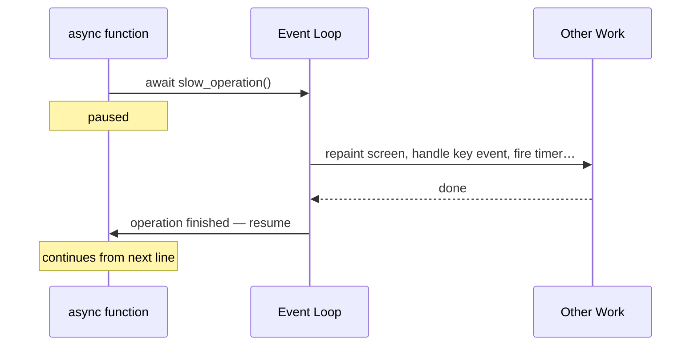

Two rules:

1. If a method body contains `await`, it **must** be declared `async def`.
2. If you call an `async def` method, you **must** `await` it (otherwise the
   work is scheduled but never waited for).

Textual natively supports `async def` for event handlers, action methods,
timer callbacks, and `on_mount`. No extra setup is needed.

## Use Case 1 — Slow I/O

If a handler calls something that waits on a network or disk for more than
~0.1 seconds, the event loop is blocked and the UI freezes. The fix is to use
the **async version** of the library call:

```python
# Synchronous — blocks the event loop while waiting
import httpx

def action_poll(self) -> None:
    response = httpx.get("https://api.example.com/status")  # UI freezes here
    self.query_one("#status", Static).update(response.text)
```

```python
# Asynchronous — lets the event loop keep running
import httpx

async def action_poll(self) -> None:
    async with httpx.AsyncClient() as client:
        response = await client.get("https://api.example.com/status")  # UI stays responsive
    self.query_one("#status", Static).update(response.text)
```

The only differences are:

1. `def` becomes `async def`
2. The blocking call is replaced by its async equivalent with `await`

## Use Case 2 — Modifying the Widget Tree

`mount()`, `remove_children()`, and `remove()` are **asynchronous**. They
return an *awaitable* object rather than completing immediately. If you call
them without `await`, Python schedules the work but immediately executes the
next line — before the old widgets are actually gone.

### Why This Matters

Consider a method that replaces the contents of a detail panel:

```python
# BUG — does NOT await the removals and mounts
def show_cpu(self) -> None:
    area = self.query_one("#detail-area", VerticalScroll)
    area.remove_children()                          # scheduled, not done yet
    area.mount(DetailPanel("CPU info", id="info"))  # old "info" still exists → DuplicateIds!
```

Because `remove_children()` was not awaited, the old widgets with `id="info"`
are still in the DOM when `mount()` tries to add new ones with the same id.
Textual raises a **DuplicateIds** error.

Here is exactly what happens at runtime:

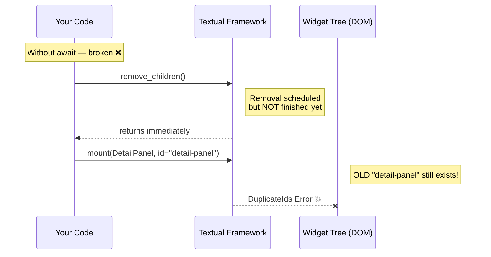

### The Fix — `await` Every Widget-Tree Change

```python
# CORRECT — awaits each operation so ordering is guaranteed
async def show_cpu(self) -> None:
    area = self.query_one("#detail-area", VerticalScroll)
    await area.remove_children()                          # done — old widgets gone
    await area.mount(DetailPanel("CPU info", id="info"))  # safe — no conflict
```

Adding `await` tells Python: "pause here until this operation finishes, then
continue to the next line." The event loop handles the pause — the UI stays
responsive while the work completes.

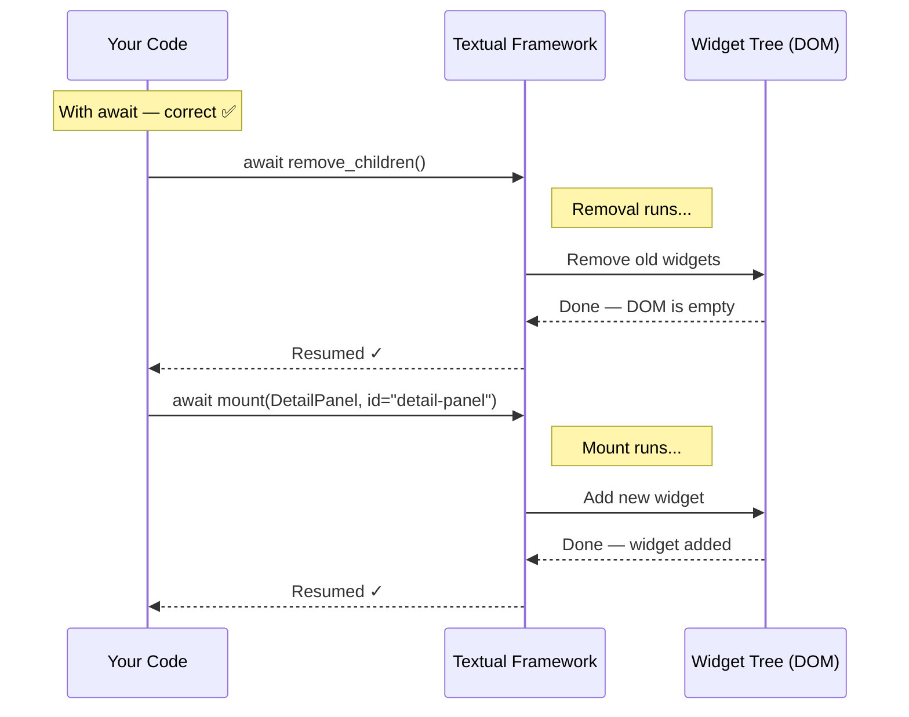

### The Async Chain Rule

Because `show_cpu` contains `await`, it must be `async def`. And any method
that calls `show_cpu` must also `await` it, which means that caller must be
`async def` too. This creates an **async chain** from the top-level handler
all the way down:

```python
# Event handler — Textual awaits this automatically
async def on_data_table_row_selected(self, event) -> None:
    await self.show_selected_detail()   # must await (it's async)

async def show_selected_detail(self) -> None:
    await self.show_cpu()               # must await (it's async)

async def show_cpu(self) -> None:
    area = self.query_one("#detail-area", VerticalScroll)
    await area.remove_children()        # must await (modifies widget tree)
    await area.mount(...)               # must await (modifies widget tree)
```

This chain is easier to see as a diagram:

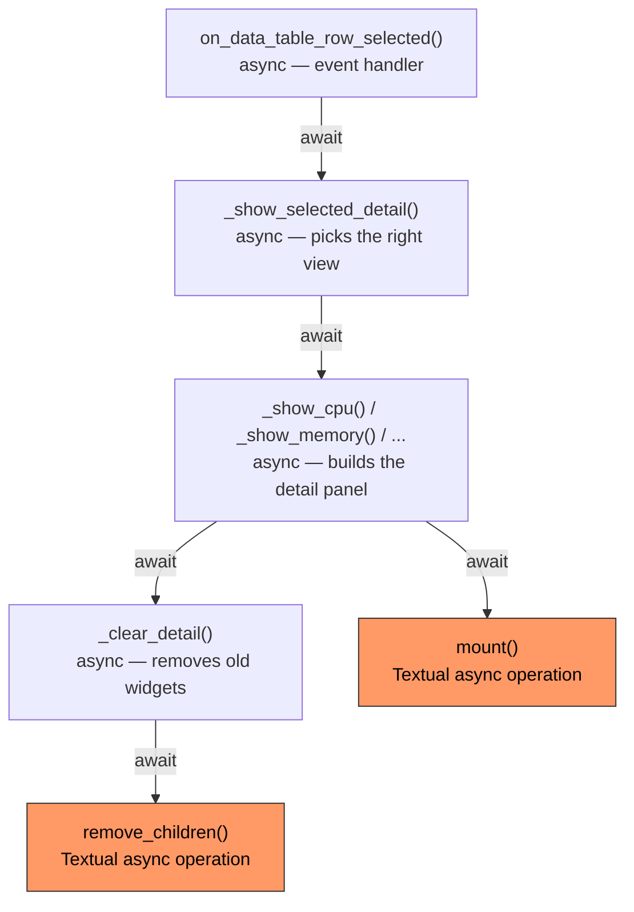

> **Rule of thumb:** once one function in a call chain uses `await`, every
> caller above it must be `async def` and must `await` the call.

### What About the Event Loop?

You do **not** write the event loop yourself — Textual provides it. When you
declare a handler as `async def`, Textual's event loop knows how to await it.
During an `await`, the event loop is free to process other events (redraw the
screen, handle other key presses, fire timers). This is why the UI stays
responsive:

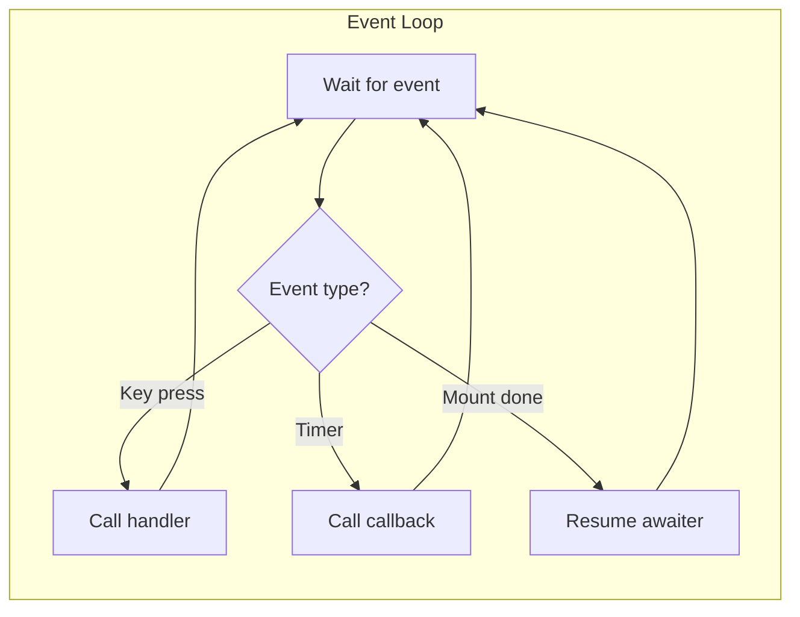

### Where Sync and Async Are Allowed

| Context              | Sync OK?  | Async OK? | Notes                                           |
| -------------------- | --------- | --------- | ----------------------------------------------- |
| Event handlers       | ✅        | ✅        | `on_button_pressed` can be `def` or `async def` |
| Action methods       | ✅        | ✅        | `action_refresh` can be `def` or `async def`    |
| Timer callbacks      | ✅        | ✅        | `set_interval` accepts sync or async callables   |
| `compose()`          | ✅        | ❌        | Must be a regular generator (uses `yield`)       |
| `on_mount()`         | ✅        | ✅        | Can be sync or async                             |

## Reentrance: When Timers Overlap with `await`

When a timer callback is `async def` and contains `await`, there is a subtle
hazard. Imagine a 3-second timer that fires `refresh_detail()` while the
previous call is *still awaiting* `remove_children()`:

```
Timer tick 1 → refresh_detail() → await remove_children() …still running…
Timer tick 2 → refresh_detail() → await remove_children() ← OVERLAP!
```

Both calls try to mount widgets with the same IDs — `DuplicateIds` again.

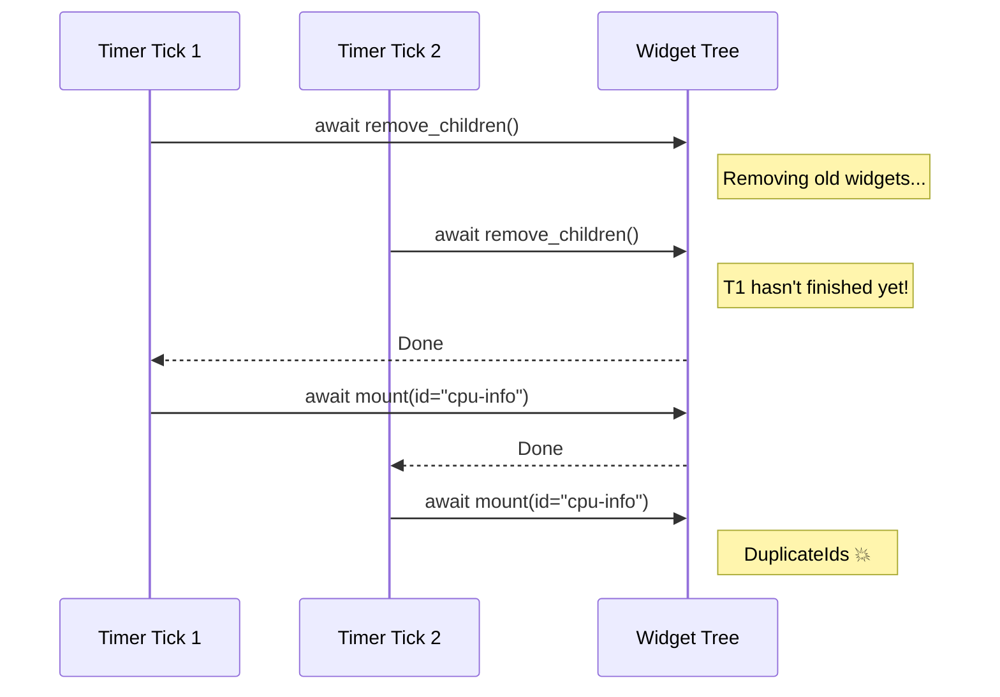

### The Fix — A Reentrance Guard

A simple boolean flag prevents a second call from starting while the first is
still in progress:

```python
class MyApp(App):
    def __init__(self):
        super().__init__()
        self._refreshing = False          # guard flag

    async def refresh_detail(self) -> None:
        if self._refreshing:              # already running — skip this tick
            return
        self._refreshing = True
        try:
            await self._clear_detail()
            await self._mount_new_widgets()
        finally:
            self._refreshing = False      # always release the guard
```

`try / finally` ensures the flag is reset even if an exception occurs, so the
app never gets permanently stuck.

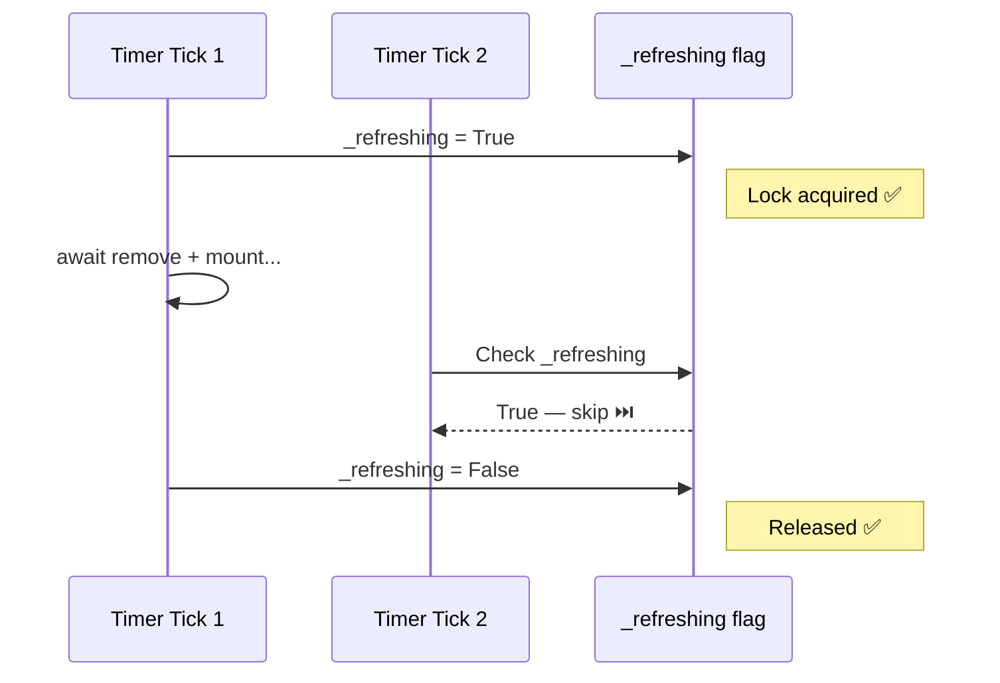

## When to Use `async` — Summary

| Situation                                     | Use sync `def` | Use `async def` |
| --------------------------------------------- | -------------- | --------------- |
| Updating widget text (`.update()`)            | ✓              |                 |
| Adding/removing rows in a `DataTable`         | ✓              |                 |
| Calling an HTTP API or database               |                | ✓               |
| `mount()` / `remove_children()` / `remove()`  |                | ✓               |
| Any method that calls another `async def`     |                | ✓               |
| Timer callback that rebuilds widget tree      |                | ✓ + guard       |

### General Rule

If the method body calls `mount()`, `remove_children()`, `remove()`, or any
other awaitable, make it `async def` and `await` the call. Every caller up the
chain must also be `async def` and `await` the call.

## Further Reading

- [Textual Workers Guide](https://textual.textualize.io/guide/workers/) —
  for running truly long-running tasks in background threads
- [Python `asyncio` documentation](https://docs.python.org/3/library/asyncio.html) —
  the underlying async framework

# Quick Reference

## Installing Textual

```bash
uv add textual
```

For development, also install the dev tools:

```bash
uv add textual-dev
```

## Project File Structure

A typical Textual application looks like this:

```
my_app/
├── app.py          # App subclass and main entry point
├── widgets.py      # Custom widget classes (optional)
└── ...
```

## Common Patterns Summary

| Pattern              | Code                                                 |
| -------------------- | ---------------------------------------------------- |
| Create app           | `class MyApp(App):`                                  |
| Compose widgets      | `def compose(self) -> ComposeResult: yield Widget()` |
| Bind a key           | `BINDINGS = [("r", "refresh", "Refresh")]`           |
| Define an action     | `def action_refresh(self) -> None:`                  |
| Handle an event      | `def on_button_pressed(self, event):`                |
| Query a widget       | `self.query_one("#id", WidgetType)`                  |
| Update a static      | `self.query_one("#msg", Static).update("new text")`  |
| Set a timer          | `self.set_interval(10, self.callback)`               |
| Reactive attribute   | `count = reactive(0)`                                |
| Watch a reactive     | `def watch_count(self, new_val):`                    |
| Mount a widget       | `await container.mount(Widget(id="w"))`              |
| Remove all children  | `await container.remove_children()`                  |
| Async action         | `async def action_refresh(self) -> None:`            |
| Async event handler  | `async def on_data_table_row_selected(self, e):`     |

## Further Reading

- [Official Textual Documentation](https://textual.textualize.io/)
- [Textual Tutorial](https://textual.textualize.io/tutorial/)
- [Widget Gallery](https://textual.textualize.io/widget_gallery/)
- [Textual CSS Reference](https://textual.textualize.io/guide/CSS/)
- [Rich Library Documentation](https://rich.readthedocs.io/en/stable/)
