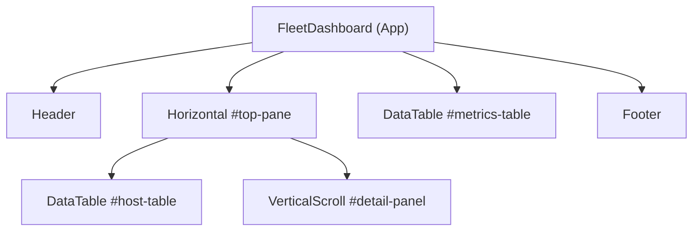
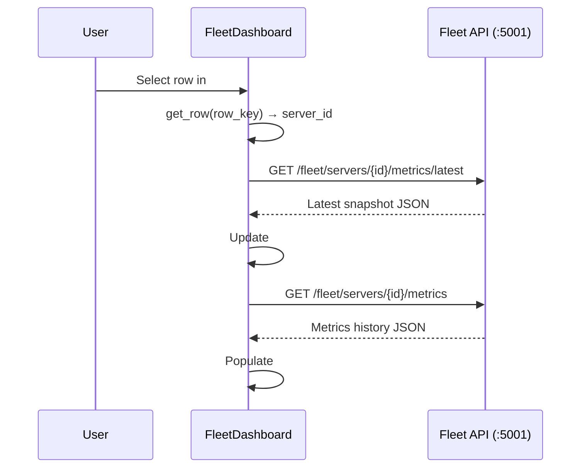

# Part 3 — Fleet Dashboard Specification

## Overview

In this part you build a **terminal user interface (TUI)** that queries the
aggregation server's REST API and displays a live, colour-coded view of the
fleet. The dashboard lets users browse hosts, inspect the latest metrics for
each host, and view the full metrics history — all without leaving the terminal.

You have already used the `httpx` library to make HTTP requests in Python (from
the HTTP client exercises) and the seen how the Textual framework tis used o build a TUI application
(from the System Monitor demo). This part combines those two skills: you call
the same fleet API endpoints you built in Part 2, and render the results in a
Textual dashboard.

### Prerequisites

| Prerequisite | Where you learned it |
|---|---|
| `httpx` — GET/POST requests, `.json()`, `raise_for_status()`, error handling | HTTP Client exercises |
| Textual — App, compose, DataTable, containers, TCSS, key bindings, events | gui_textual.md guide and System Monitor demo |
| Fleet API endpoints | Part 2 of this project |

### What is provided

| File / Folder | Purpose |
|---|---|
| `mock_server/` | A mock aggregation server with fake fleet data so you can develop and test your dashboard without running the real aggregation server, database, or agent. |
| `dashboard.tcss` | The Textual CSS stylesheet for the dashboard layout. |
| `pyproject.toml` | Project dependencies — `textual`, `httpx`, and `flask` (for the mock server). |

### What you build

You create a single file — `app.py` — containing the `FleetDashboard`
application class and any helper functions you need.

```
dashboard/
├── app.py               # YOU CREATE THIS
├── dashboard.tcss       # PROVIDED — stylesheet
├── pyproject.toml       # PROVIDED — dependencies
└── mock_server/         # PROVIDED — testing server
    ├── __init__.py
    └── server.py
```

---

## Development workflow

You develop against the **mock server** — a lightweight Flask app that serves
three fictitious hosts with pre-built metrics histories. This means you can
build and test your dashboard without running the real aggregation server,
database, or agent.

### Starting the mock server

In one terminal from the dashboard project root directory:

```powershell
cd dashboard
uv run flask --app mock_server.server run --port 5001
```

### Running your dashboard

In a second terminal:

```powershell
cd dashboard
uv run app.py
```

When you are satisfied that your dashboard works against the mock server, you
can test it against your real Part 2 aggregation server by starting that server
on port 5001 instead.

### Registering your own agent

The dashboard displays servers that have already been registered with the
aggregation server. There is no built-in UI for adding servers — that would
require Textual features (modal screens, input widgets) that are out of scope
for this project.

To register your Part 1 agent so it appears in the dashboard, POST to the
aggregation server's registration endpoint while it is running:

```powershell
curl -X POST http://localhost:5001/fleet/servers `
     -H "Content-Type: application/json" `
     -d '{"hostname": "my-laptop", "agent_url": "http://127.0.0.1:5000"}'
```

After registering, press `p` in the dashboard to poll, then `r` to refresh.
Your agent's real system metrics will appear alongside the mock hosts.

---

## API endpoints used

Your dashboard calls these endpoints on the aggregation server
(`http://localhost:5001`). All are documented fully in the Part 2 specification
— the summary below shows only what the dashboard needs.

| Method | URL | Returns |
|---|---|---|
| `GET` | `/fleet/servers` | JSON array of server objects |
| `GET` | `/fleet/servers/<id>/metrics` | JSON array of metric snapshots (newest first) |
| `GET` | `/fleet/servers/<id>/metrics/latest` | Single most-recent snapshot object |
| `POST` | `/fleet/poll` | `{"polled", "online", "offline", "results"}` |

### Server object

```json
{
    "id": 1,
    "hostname": "web-01.bcit.ca",
    "agent_url": "http://10.0.0.11:5000",
    "status": "online",
    "created_at": "2026-03-30T10:00:00"
}
```

### Metrics snapshot object

```json
{
    "id": 1,
    "server_id": 1,
    "timestamp": "2026-03-30T10:01:00",
    "cpu_count": 4,
    "cpu_percent": 12.5,
    "memory_total": 17179869184,
    "memory_used": 8589934592,
    "memory_percent": 50.0,
    "os_type": "Linux",
    "os_version": "5.15.0"
}
```

---

## Dashboard layout

Your dashboard uses the same three-section layout as the System Monitor demo:

```
┌─────────────────────────────────────────────────────────────┐
│ Header                                                      │
├──────────────────────────┬──────────────────────────────────┤
│ Host List (DataTable)    │ Host Detail (Static panel)       │
│  select a host →         │  hostname, status, latest metrics│
├──────────────────────────┴──────────────────────────────────┤
│ Metrics History (DataTable) for selected host               │
├─────────────────────────────────────────────────────────────┤
│ Footer (key bindings)                                       │
└─────────────────────────────────────────────────────────────┘
```

The layout is defined in the provided `dashboard.tcss` file. Your `compose()`
method must produce a widget tree that matches these CSS selectors:

| CSS ID | Widget Type | Location |
|---|---|---|
| `#top-pane` | `Horizontal` | Contains the host table and detail panel side by side |
| `#host-table` | `DataTable` | Left side of `#top-pane` — lists all servers |
| `#detail-panel` | `VerticalScroll` | Right side of `#top-pane` — shows detail for selected host |
| `#metrics-table` | `DataTable` | Below `#top-pane` — metrics history for selected host |

You also need a `Header` (at the top) and `Footer` (at the bottom).

### Widget tree

Your `compose()` method must produce this exact nesting:



---

## Functional requirements

### 1. App class setup

Create a class `FleetDashboard` that subclasses `App`.

| Attribute | Value |
|---|---|
| `TITLE` | `"Fleet Monitor Dashboard"` |
| `CSS_PATH` | `"dashboard.tcss"` |
| `BINDINGS` | See [Key bindings](#3-key-bindings) below |

Store the base URL for the fleet API in a module-level constant:

```python
FLEET_API_BASE = "http://localhost:5001/fleet"
```

### 2. Host table (`#host-table`)

On mount, configure the host table with `cursor_type = "row"` and
`zebra_stripes = True`, then add these columns and populate it with data from
`GET /fleet/servers`:

| Column | Source |
|---|---|
| ID | `server["id"]` |
| Hostname | `server["hostname"]` |
| Status | `server["status"]` — colour-coded (see below) |
| Agent URL | `server["agent_url"]` |

Use the server's `id` (as a string) as the row `key` so you can look up rows
later.

#### Colour-coding the Status column

Use Rich `Text` objects to colour the status:

| Status | Style |
|---|---|
| `"online"` | `bold green` |
| `"offline"` | `bold red` |
| `"unknown"` | `yellow` |

### 3. Key bindings

| Key | Action | Behaviour |
|---|---|---|
| `r` | `refresh` | Refresh the host list from the API. If a host was selected, reload its detail and metrics. |
| `p` | `poll` | `POST /fleet/poll`, then refresh. |
| `q` | `quit` | Exit the application. |

### 4. Detail panel (`#detail-panel`)

When the user highlights or selects a row in the host table, display the
selected host's detail in the panel on the right. Use the event's `row_key`
with `get_row()` to extract the server ID from the first column.

The detail panel should show:

- **Server info** from the cached server list: hostname, ID, agent URL, status,
  registration date
- **Latest snapshot** from `GET /fleet/servers/<id>/metrics/latest`: timestamp,
  CPU count, CPU %, memory used/total, memory %, OS type and version

If the server has no metrics yet, display a message like "No metrics recorded
yet."

Use Rich markup (e.g. `[bold underline]`, `[b]`) to make the detail text
readable.

### 5. Metrics history table (`#metrics-table`)

When a host is selected, populate this table with all snapshots from
`GET /fleet/servers/<id>/metrics`. Clear the table before loading new data.

| Column | Source | Notes |
|---|---|---|
| Timestamp | `snap["timestamp"]` | |
| CPU % | `snap["cpu_percent"]` | Colour-coded |
| Mem % | `snap["memory_percent"]` | Colour-coded |
| Mem Used | `snap["memory_used"]` | Format as human-readable bytes |
| Mem Total | `snap["memory_total"]` | Format as human-readable bytes |
| CPUs | `snap["cpu_count"]` | |
| OS | `snap["os_type"]` | |
| OS Version | `snap["os_version"]` | |

#### Colour-coding percentages

| Condition | Style |
|---|---|
| ≥ 90% | `bold red` |
| ≥ 70% | `yellow` |
| < 70% | `green` |

#### Formatting bytes

Write a helper function that converts a raw byte count to a human-readable
string (e.g. `17179869184` → `"16.0 GB"`). Divide by 1024 repeatedly, choosing
the appropriate unit from B, KB, MB, GB, TB.

### 6. Error handling

If an API request fails (network error, timeout, non-2xx status), your
dashboard should handle it gracefully — do not crash. Use `self.notify()` with
`severity="error"` to show a brief error message to the user. For example:

```python
self.notify("Failed to reach aggregation server", severity="error")
```

Wrap your `httpx` calls in `try`/`except` blocks that catch `httpx.HTTPError`.

### 7. Event handlers

Implement these two Textual event handlers:

| Handler | Trigger | Behaviour |
|---|---|---|
| `on_data_table_row_selected` | User presses Enter on a row | Load detail and metrics for the selected host |
| `on_data_table_row_highlighted` | Cursor moves to a new row | Same — load detail and metrics |

In both handlers, check that the event came from `#host-table` (not
`#metrics-table`) by inspecting `event.control.id`.

### Interaction flow

This sequence shows what happens when a user selects a host:



---

## Suggested build order

Work incrementally — get each step working before moving to the next.

1. **Skeleton** — Create the `FleetDashboard` class with `TITLE`, `CSS_PATH`,
   `BINDINGS`, and a `compose()` method that yields the correct widget tree.
   Run the app and verify the empty layout appears.

2. **API helper** — Write a `_api_get()` method that makes a GET request and
   returns the parsed JSON (or `None` on error). Test it by calling
   `GET /fleet/status` from `on_mount()`.

3. **Host table** — In `on_mount()`, call `GET /fleet/servers` and populate the
   host table. Verify the three mock hosts appear with colour-coded status.

4. **Detail panel** — Implement `on_data_table_row_highlighted` (or
   `on_data_table_row_selected`). Use `get_row()` to extract the server ID,
   call `GET /fleet/servers/<id>/metrics/latest`, and update the detail panel.

5. **Metrics history** — When a host is selected, call
   `GET /fleet/servers/<id>/metrics` and populate the bottom table with
   colour-coded percentages and formatted byte values.

6. **Key bindings** — Implement `action_refresh` and `action_poll`. Test by
   pressing `r` and `p`.

7. **Polish** — Handle edge cases (server has no metrics, API is down), add
   `self.notify()` for user feedback.
