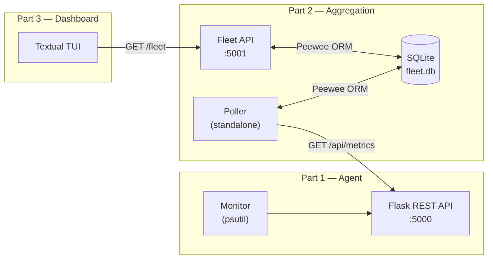
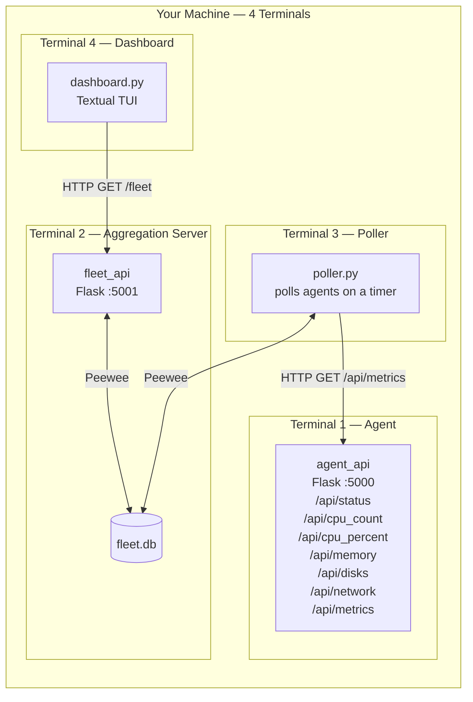
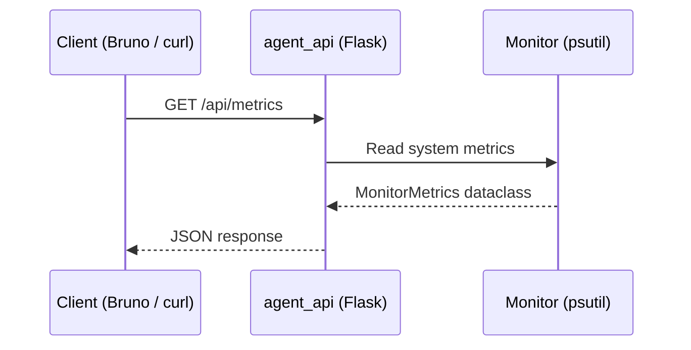
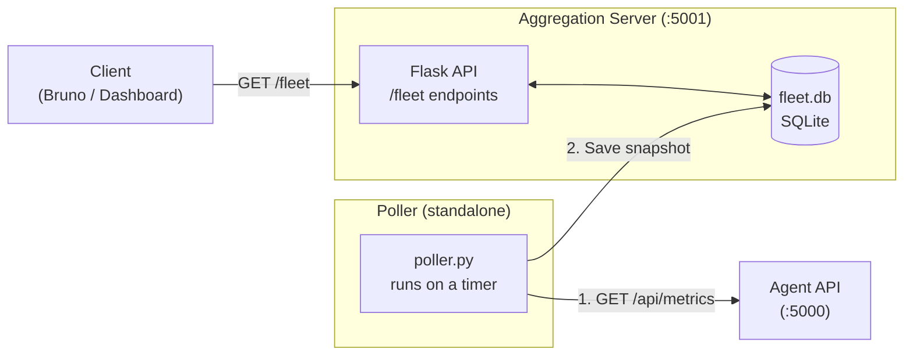
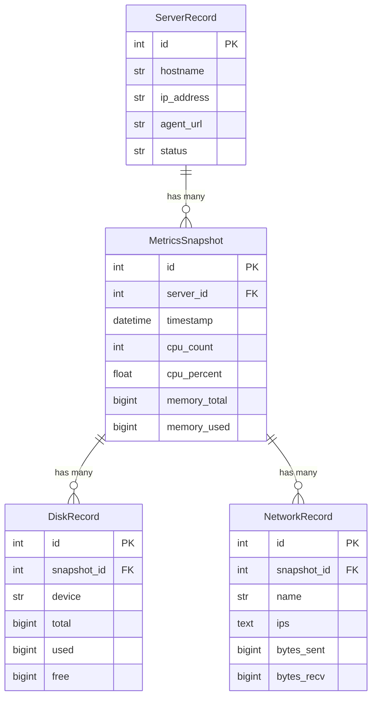
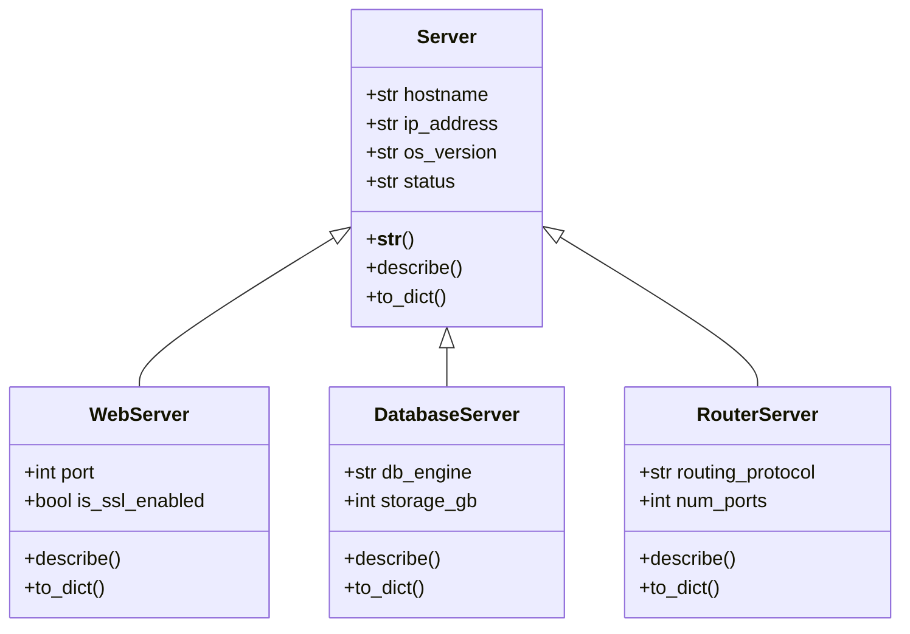
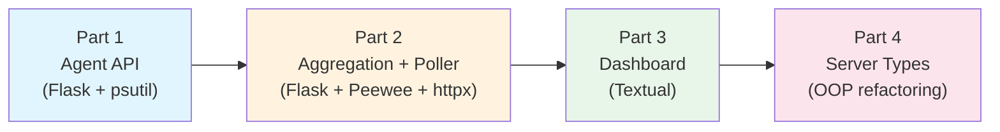

# Server Fleet Status Monitor — Project Overview

## What you're building

You will build a **distributed server monitoring system** — the same kind of
tool that IT operations teams use every day to watch over fleets of servers in
data centres and the cloud. Products like Prometheus, Datadog, Zabbix, and
Netdata all follow the pattern you'll implement here.

The system has four main components, each built in a separate part of the
project:

1. **Agent** — collects real metrics (CPU, memory, disk, network) from the
   machine it runs on and serves them over a REST API
2. **Aggregation Server + Poller** — stores a history of metrics from all
   servers in a database and provides a fleet-wide REST API
3. **Dashboard** — a terminal UI that displays a live, colour-coded fleet view
4. **Server Type Refactoring** — an OOP class hierarchy that categorizes servers
   (web, database, router) and propagates that information through every layer

You develop the system **bottom-up**, starting from a single server's
perspective and expanding outward — the same order real monitoring systems are
designed.

### Simplifications vs. production

This project focuses on application design — not infrastructure security. To
keep the scope manageable, several concerns that a production system would
require are intentionally omitted:

| Concern                | This project                        | Production                                 |
| ---------------------- | ----------------------------------- | ------------------------------------------ |
| **Transport**          | Plain HTTP on localhost             | HTTPS (TLS) via nginx / Caddy              |
| **Authentication**     | None — all endpoints are open       | API keys, OAuth, or mutual TLS (mTLS)      |
| **Authorization**      | None — any client can read or write | Role-based access control                  |
| **Web server**         | Flask's built-in dev server         | gunicorn or uvicorn behind a reverse proxy |
| **Database**           | SQLite single file                  | PostgreSQL on a dedicated host             |
| **Configuration**      | Hardcoded constants                 | Environment variables / secrets manager    |
| **Process management** | Manual (`uv run flask run`)         | systemd, Docker, or Kubernetes             |

In production, every agent-to-server and dashboard-to-server connection would be
encrypted (HTTPS) and authenticated (e.g. each agent carries an API key that the
aggregation server validates). Our project skips this so you can concentrate on
the Python, Flask, ORM, and TUI skills that are the learning objectives.

### How the pieces fit together



All components run on **your machine** (localhost) in separate terminal windows.

### Full system at runtime



---

## Part 1 — Agent

**Goal:** Build a Flask REST API that exposes real system metrics as JSON.

You receive a complete `monitor` package (provided by the instructor) that uses
`psutil` to read CPU, memory, disk, and network data from the operating system.
Your job is to wrap it in a Flask web application so any HTTP client can request
those metrics.

### What you'll learn

- Flask **application factory** pattern (`create_app()`)
- Flask **Blueprints** for organizing routes under a URL prefix
- Storing a shared resource in `app.config` and accessing it with `current_app`
- Writing route handlers that return JSON
- Running existing **pytest** tests to verify your implementation

### How it works



### Technologies

| Technology             | Purpose                                               |
| ---------------------- | ----------------------------------------------------- |
| **Flask**              | Web framework for the REST API                        |
| **psutil**             | System metrics collection (provided)                  |
| **Python dataclasses** | Structured metric data with `to_dict()` / `to_json()` |
| **pytest**             | Automated test suite (provided)                       |

---

## Part 2 — Aggregation Server + Poller

**Goal:** Build a second Flask application that stores metrics from all servers
in a database, plus a standalone poller script that periodically collects new
data from each agent.

The aggregation server is the central hub. It keeps a **history** of metrics
snapshots — each poll cycle inserts new records rather than overwriting old
data. This means you can later ask "what did CPU usage look like an hour ago?"

The poller runs as a separate process that loops on a timer: it reads the list
of registered servers from the database, calls each agent's `/api/metrics`
endpoint, and saves the results.

### What you'll learn

- A second Flask application using the same factory + Blueprint patterns from
  Part 1
- **Peewee ORM** — defining models, creating tables, querying and persisting
  data in SQLite
- Database schema design — separating **server identity** (stable info) from
  **metrics snapshots** (one per poll)
- **One-to-many relationships** with `ForeignKeyField` and `backref`
- Calculating derived values (percentages) at serialization time instead of
  storing them
- Building a **standalone script** that accesses the database directly (no Flask
  required)
- Making HTTP requests with `httpx` and handling failures gracefully

### How it works



### Database overview



### Technologies

| Technology | Purpose                                       |
| ---------- | --------------------------------------------- |
| **Flask**  | REST API for fleet data                       |
| **Peewee** | ORM for defining models and querying SQLite   |
| **SQLite** | Lightweight relational database (single file) |
| **httpx**  | HTTP client for polling agents                |

---

## Part 3 — Fleet Dashboard

**Goal:** Build a terminal user interface (TUI) that queries the aggregation
server and displays a live, colour-coded view of the entire fleet.

The dashboard reads from the aggregation server's `GET /fleet` endpoint and
renders the data in a table. Keyboard shortcuts let you trigger a poll or
refresh the display without leaving the terminal.

### What you'll learn

- Building a TUI application with **Textual**
- Populating a `DataTable` widget from a REST API response
- Handling keyboard input with **key bindings** and actions
- Colour-coding cells based on metric thresholds (e.g. CPU usage)

### Dashboard layout

```
┌──────────────────────────────────────────────────────────────────┐
│  Fleet Monitor                                        Header    │
├──────────────────────────────────────────────────────────────────┤
│  Host           │ Status │ CPU % │ Mem % │ Disks │ NICs │ Seen  │
│  web-01.bcit.ca │ online │  14.3 │  48.0 │     1 │    2 │ 14:22 │
│  db-01.bcit.ca  │ online │   8.7 │  74.5 │     2 │    1 │ 14:22 │
├──────────────────────────────────────────────────────────────────┤
│  P: Poll now   R: Refresh   Q: Quit                  Footer    │
└──────────────────────────────────────────────────────────────────┘
```

### Technologies

| Technology  | Purpose                                     |
| ----------- | ------------------------------------------- |
| **Textual** | Terminal UI framework (based on Rich)       |
| **httpx**   | HTTP client to query the aggregation server |

---

## Part 4 — Server Type Refactoring

**Goal:** Design a Python class hierarchy that models different kinds of servers
(web server, database server, router) and refactor every prior component to
support server types.

This part is about **refactoring** — you go back into code you've already
written and extend it. You'll add a `server_type` column to the database, update
the registration API, modify the poller, and add a Type column to the dashboard.

### What you'll learn

- Designing an OOP class hierarchy with **inheritance** and `super()`
- Overriding methods (`describe()`, `to_dict()`) in subclasses
- Adding columns to an existing database schema
- **Refactoring** working code to accommodate new requirements — the most common
  real-world engineering task

### Class hierarchy



### Technologies

| Technology     | Purpose                                   |
| -------------- | ----------------------------------------- |
| **Python OOP** | Inheritance, `super()`, method overriding |
| **Peewee**     | Schema migration (adding a column)        |
| **Flask**      | Updating API endpoints                    |
| **Textual**    | Updating dashboard display                |

---

## Technology summary

The project uses the following technologies across all four parts:

| Technology             | Parts | Role                               |
| ---------------------- | ----- | ---------------------------------- |
| **Python 3.14+**       | All   | Core language                      |
| **Flask**              | 1, 2  | REST API framework                 |
| **psutil**             | 1     | System metrics collection          |
| **Peewee**             | 2, 4  | ORM for SQLite database            |
| **SQLite**             | 2     | Lightweight relational database    |
| **httpx**              | 2, 3  | HTTP client                        |
| **Textual**            | 3     | Terminal UI framework              |
| **pytest**             | 1     | Automated testing                  |
| **Python dataclasses** | 1     | Structured data with serialization |
| **Python OOP**         | 4     | Class hierarchy and inheritance    |

---

## How the project progresses



Each part builds on the previous one. By the end you'll have a complete
monitoring pipeline: data collection → storage → visualization — with a clean
OOP model tying it all together.

---

## Grading

| Part                                 | Weight | Focus                                           |
| ------------------------------------ | ------ | ----------------------------------------------- |
| Part 1 — Agent                       | 30 %   | Building a REST API                             |
| Part 2 — Aggregation Server + Poller | 30 %   | ORM data persistence and API consumption        |
| Part 3 — Dashboard                   | 30 %   | Consuming a REST API from a TUI                 |
| Part 4 — Server Type Refactoring     | 10 %   | OOP inheritance and cross-component refactoring |

The **key learning outcomes** of this project are REST API creation, REST API
consumption, and ORM-based data persistence. Parts 1 and 2 cover these core
skills and together represent the majority of the grade.

The dashboard (Part 3) is important but secondary — it demonstrates that you can
consume the APIs you built, but the TUI framework itself is not a primary
learning objective.

Part 4 is a **differentiator**. It is not expected that all students will
complete it. Students who do will demonstrate the ability to refactor working
code across multiple components to accommodate new requirements — a valuable
real-world skill.

The detailed grading rubric for each part is provided in its respective
specification document.
