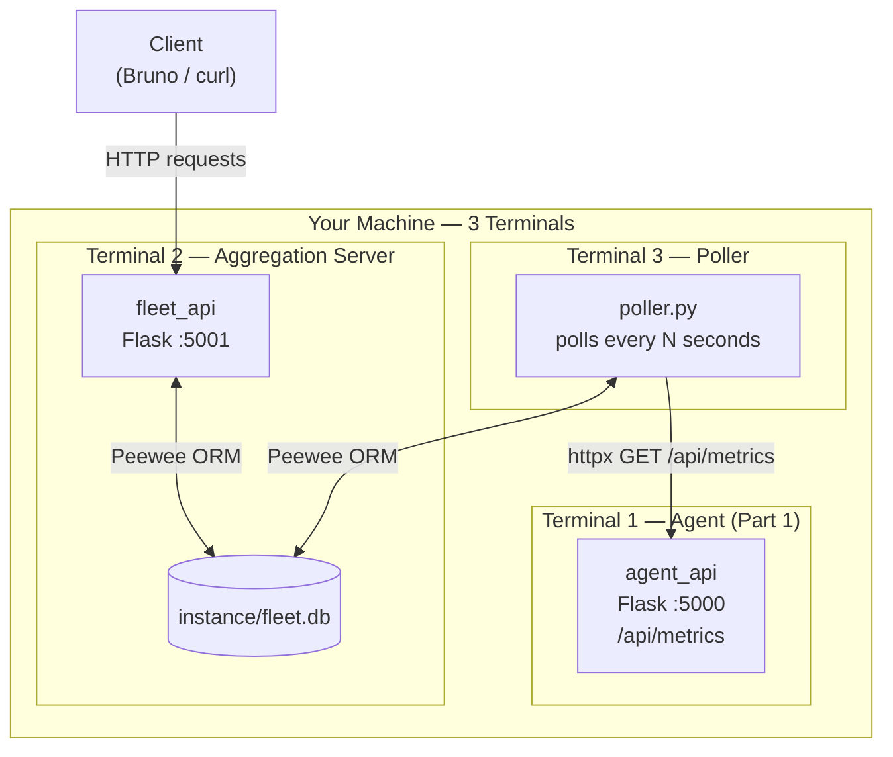
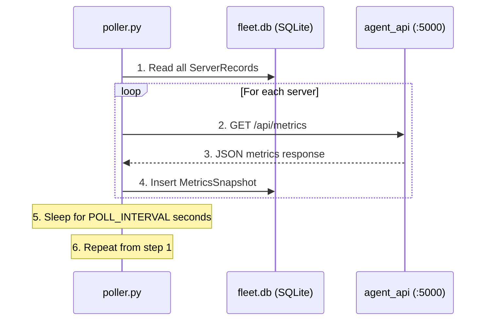
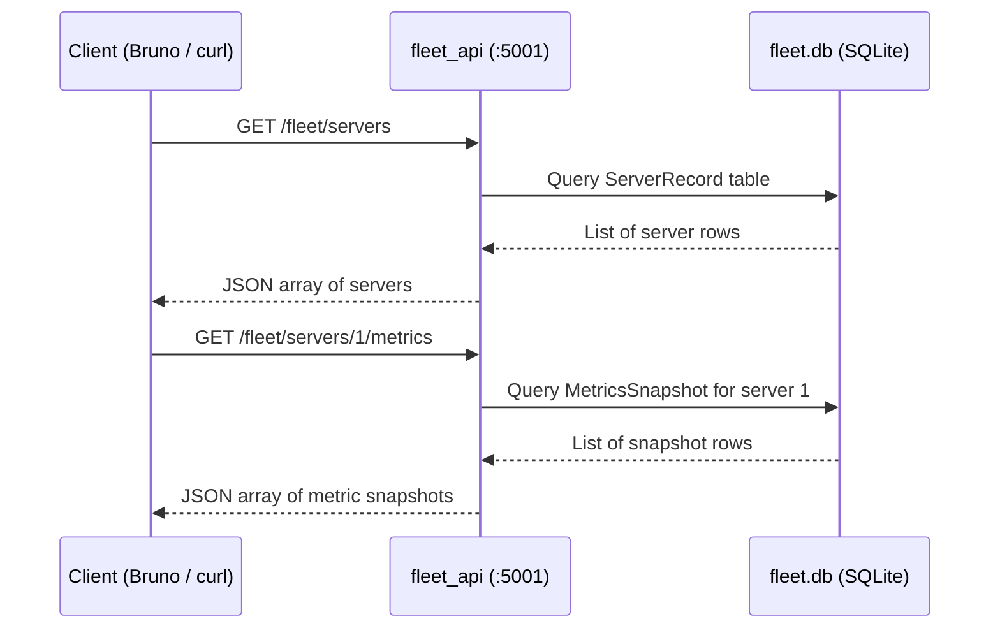
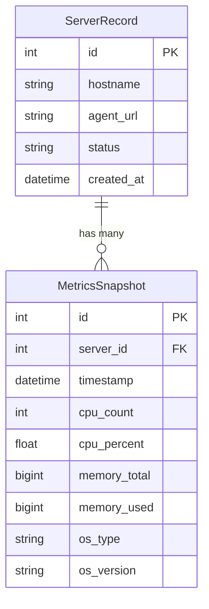
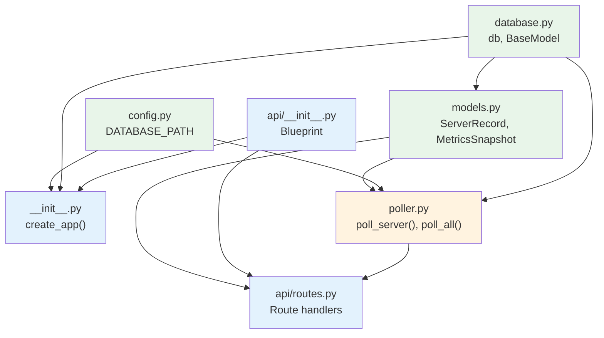
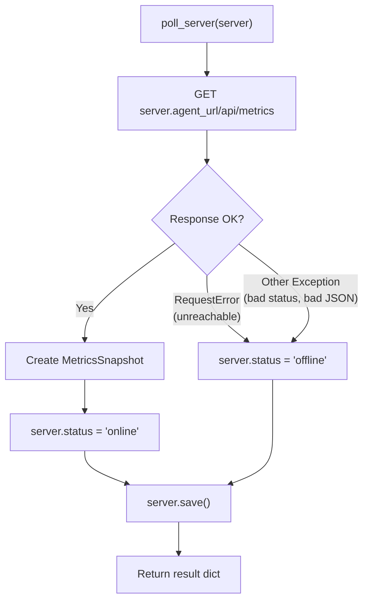

# Part 2 — Aggregation Server & Poller Specification

## Overview

In this part you build a **second Flask application** that acts as the central
hub for your fleet monitoring system, plus a **standalone poller script** that
periodically collects metrics from agents. You already built the agent in Part 1
— now you build the service that tracks those agents over time.

Your job is to create the `fleet_api/` package and the standalone `poller.py`
script so that the provided tests pass and the endpoints return the expected
JSON.

### Housekeeping — adding Part 2 files to your repository

Part 2 builds on top of your Part 1 project. The instructor-provided files for
Part 2 are distributed as a **file download**. You need to:

1. **Download** the Part 2 starter files from the course notes
2. **Copy the files** into the correct locations in your existing Part 1
   project directory. The section below tells you exactly where each file goes.
3. **Install the new dependencies.** Part 2 requires two packages that Part 1
   did not — **Peewee** (the ORM) and **httpx** (the HTTP client). 
4. **Verify your environment** by running the Part 1 tests — they should still
   pass:

   ```powershell
   uv run pytest tests/test_monitor.py tests/test_agent_api.py -v
   ```

### What is provided (downloaded files)

You will receive the following files to add to your project:

| File                      | Where to place it   | Purpose |
| ------------------------- | ------------------- | ------- |
| `conftest.py`             | `tests/conftest.py` | **Replace** your existing conftest — the new version includes fixtures for both the agent and aggregation server tests. **Do not modify.** |
| `test_fleet_api.py`       | `tests/test_fleet_api.py` | Tests for every `/fleet/*` endpoint. Your implementation must pass these. **Do not modify.** |
| `test_poller.py`          | `tests/test_poller.py` | Tests for the poller script. **Do not modify.** |
| `run_server.py`           | `run_server.py` (project root) | Entry script — imports `create_app()` and starts the Flask development server on port 5001. **Do not modify.** |

### What you already have (from Part 1)

| File / Folder  | Notes |
| -------------- | ----- |
| `monitor/`     | Provided in Part 1. Unchanged. **Do not modify.** |
| `agent_api/`   | Your Part 1 code. Unchanged. **Do not modify.** |
| `run_agent.py` | Part 1 entry script. Unchanged. **Do not modify.** |

### What you build

You create the `fleet_api/` package and the standalone `poller.py` script.
Here is the full project tree after you add your files to the Part 1 project:

```
server_fleet_monitor/
├── run_agent.py                 # Part 1 — entry script
├── run_server.py                # DOWNLOADED — Part 2 entry script
├── poller.py                    # YOU CREATE THIS
├── pyproject.toml               # Updated by you (uv add peewee httpx)
├── monitor/                     # Part 1 — do not modify
│   ├── __init__.py
│   ├── base.py
│   └── metric_models.py
├── agent_api/                   # Your Part 1 code — do not modify
│   ├── __init__.py
│   └── api/
│       ├── __init__.py
│       └── routes.py
├── fleet_api/                   # YOU CREATE THIS
│   ├── __init__.py
│   ├── config.py
│   ├── database.py
│   ├── models.py
│   └── api/
│       ├── __init__.py
│       └── routes.py
├── instance/
│   └── fleet.db                 # Created automatically at runtime
└── tests/
    ├── __init__.py
    ├── conftest.py              # DOWNLOADED — updated for Part 2
    ├── test_monitor.py          # Part 1 — do not modify
    ├── test_agent_api.py        # Part 1 — do not modify
    ├── test_fleet_api.py        # DOWNLOADED — do not modify
    └── test_poller.py           # DOWNLOADED — do not modify
```

---

## Architecture

The aggregation server and poller both access the same SQLite database but from
different processes. The server runs as a Flask web application; the poller runs
as a standalone Python script on a timer.



**Start order** (each in its own terminal):

1. `uv run flask --app run_agent run --debug` — agent on `:5000`
2. `uv run flask --app run_server run --debug --port 5001` — aggregation on `:5001`
3. `uv run python poller.py` — poller

---

## Understanding the data flow

This is the sequence for a single poll cycle:



And this is how a client queries the aggregation server:



---

## Database schema

The database has two tables. This is deliberately simple — you track server
identity separately from metrics history so you can query them independently.



### Why two tables?

- **`ServerRecord`** stores stable information about each server: where it is
  and how to reach it. This changes rarely.
- **`MetricsSnapshot`** stores one row per poll cycle per server. Over time this
  table grows — that's intentional. It provides the historical data that makes
  monitoring useful.

### Design notes

- **No disk / network tables.** The agent returns disk and network data, but
  we store only CPU and memory metrics to keep the schema simple.
- **Raw bytes, not percentages.** `memory_total` and `memory_used` are stored
  as raw values. `memory_percent` is computed in `to_dict()` at serialization
  time — this avoids redundant data in the database.

---

## API specification

The aggregation server exposes a REST API under the `/fleet` prefix. All
routes are GET or POST — no PUT or DELETE is required for this part.

### Endpoints

| Method | URL                              | Purpose                                | Success Code |
| ------ | -------------------------------- | -------------------------------------- | ------------ |
| `GET`  | `/fleet/status`                  | Health check                           | `200`        |
| `GET`  | `/fleet/servers`                 | List all registered servers            | `200`        |
| `GET`  | `/fleet/servers/<id>`            | Get one server by ID                   | `200` / `404` |
| `POST` | `/fleet/servers`                 | Register a new server                  | `201`        |
| `GET`  | `/fleet/servers/<id>/metrics`    | Get metric history for one server      | `200` / `404` |
| `GET`  | `/fleet/servers/<id>/metrics/latest` | Get the most recent snapshot       | `200` / `404` |
| `POST` | `/fleet/poll`                    | Poll all registered servers now        | `200`        |
| `POST` | `/fleet/servers/<id>/poll`       | Poll a single server now               | `200` / `404` |

### Endpoint details

#### `GET /fleet/status`

Returns a simple health check.

```json
{
    "status": "ok"
}
```

#### `GET /fleet/servers`

Returns all registered servers.

```json
[
    {
        "id": 1,
        "hostname": "web-01.bcit.ca",
        "agent_url": "http://127.0.0.1:5000",
        "status": "online",
        "created_at": "2026-03-30T10:00:00"
    }
]
```

#### `GET /fleet/servers/<id>`

Returns a single server. Returns `404` with `{"error": "Server not found"}` if
the ID does not exist.

```json
{
    "id": 1,
    "hostname": "web-01.bcit.ca",
    "agent_url": "http://127.0.0.1:5000",
    "status": "online",
    "created_at": "2026-03-30T10:00:00"
}
```

#### `POST /fleet/servers`

Registers a new server. Expects a JSON body with `hostname` and `agent_url`:

```json
{
    "hostname": "web-01.bcit.ca",
    "agent_url": "http://127.0.0.1:5000"
}
```

The `agent_url` is the base URL of the agent's REST API — the scheme, host, and
port (e.g. `http://192.168.1.10:5000`). The poller appends `/api/metrics` to
this URL when polling.

Returns the created server with status `201`:

```json
{
    "id": 1,
    "hostname": "web-01.bcit.ca",
    "agent_url": "http://127.0.0.1:5000",
    "status": "unknown",
    "created_at": "2026-03-30T10:00:00"
}
```

Returns `400` with `{"error": "Missing required field: <field>"}` if any
required field is absent.

#### `GET /fleet/servers/<id>/metrics`

Returns all metric snapshots for a server, ordered by timestamp (newest first).
Returns `404` with `{"error": "Server not found"}` if the server ID does not
exist.

```json
[
    {
        "id": 1,
        "server_id": 1,
        "timestamp": "2026-03-30T10:01:00",
        "cpu_count": 4,
        "cpu_percent": 12.5,
        "memory_total": 8000,
        "memory_used": 4000,
        "memory_percent": 50.0,
        "os_type": "Linux",
        "os_version": "5.15.0"
    }
]
```

> **Note:** `memory_percent` is **computed** from `memory_total` and
> `memory_used` at serialization time — it is not stored in the database.

#### `GET /fleet/servers/<id>/metrics/latest`

Returns only the most recent snapshot for a server. Returns `404` with
`{"error": "Server not found"}` if the server does not exist. Returns `404`
with `{"error": "No metrics recorded yet"}` if the server exists but has no
snapshots.

```json
{
    "id": 3,
    "server_id": 1,
    "timestamp": "2026-03-30T10:02:00",
    "cpu_count": 4,
    "cpu_percent": 14.3,
    "memory_total": 8000,
    "memory_used": 4200,
    "memory_percent": 52.5,
    "os_type": "Linux",
    "os_version": "5.15.0"
}
```

#### `POST /fleet/poll`

Triggers an immediate poll of **all** registered servers. This is the same
operation that the poller script performs on its timer, but triggered on demand
via an HTTP request. Returns a summary of results:

```json
{
    "polled": 2,
    "online": 1,
    "offline": 1,
    "results": [
        {"server_id": 1, "hostname": "web-01.bcit.ca", "status": "online"},
        {"server_id": 2, "hostname": "db-01.bcit.ca", "status": "offline"}
    ]
}
```

#### `POST /fleet/servers/<id>/poll`

Triggers an immediate poll of a **single** server. Returns `404` with
`{"error": "Server not found"}` if the ID does not exist.

On success, returns the poll result for that server:

```json
{
    "server_id": 1,
    "hostname": "web-01.bcit.ca",
    "status": "online"
}
```

If the agent is unreachable the status will be `"offline"` and the response code
is still `200` — the poll itself succeeded, even though the agent did not
respond.

---

## What you need to create

The diagram below shows how your files import from each other. Build them
roughly in this order — each file depends only on files above or beside it:



<small>Green = data layer, Blue = Flask layer, Orange = standalone script</small>

### File 1: `fleet_api/config.py`

Store the database file in an `instance/` directory at the project root (same
pattern as the Simple ORM Exercise).

```python
from pathlib import Path

DATABASE_PATH = str(Path(__file__).resolve().parent.parent / "instance" / "fleet.db")
```

### File 2: `fleet_api/database.py`

The deferred database and `BaseModel` — identical to the Simple ORM Exercise:

```python
from peewee import Model, SqliteDatabase

db = SqliteDatabase(None)


class BaseModel(Model):
    class Meta:
        database = db
```

### File 3: `fleet_api/models.py`

Define two Peewee models: `ServerRecord` and `MetricsSnapshot`.

#### `ServerRecord`

| Field        | Peewee field type       | Notes |
| ------------ | ----------------------- | ----- |
| `id`         | `AutoField`             | Primary key |
| `hostname`   | `CharField(max_length=255)` | Server hostname |
| `agent_url`  | `CharField(max_length=255)` | Base URL of the agent API (e.g. `http://192.168.1.10:5000`) |
| `status`     | `CharField(max_length=20, default="unknown")` | `"unknown"`, `"online"`, or `"offline"` |
| `created_at` | `DateTimeField(default=datetime.datetime.now)` | Auto-set on creation |

Each `ServerRecord` needs a `to_dict()` method that returns a dictionary
matching the JSON structure shown in the API specification. Format `created_at`
as an ISO 8601 string using `.isoformat()`.

#### `MetricsSnapshot`

| Field          | Peewee field type       | Notes |
| -------------- | ----------------------- | ----- |
| `id`           | `AutoField`             | Primary key |
| `server`       | `ForeignKeyField(ServerRecord, backref="snapshots")` | Links to the server |
| `timestamp`    | `DateTimeField(default=datetime.datetime.now)` | When the snapshot was taken |
| `cpu_count`    | `IntegerField()`        | From agent's `cpu_count` |
| `cpu_percent`  | `FloatField()`          | From agent's `cpu_percent` |
| `memory_total` | `BigIntegerField()`     | From agent's `memory.total` |
| `memory_used`  | `BigIntegerField()`     | From agent's `memory.used` |
| `os_type`      | `CharField(max_length=50)` | From agent's `os_type` |
| `os_version`   | `CharField(max_length=50)` | From agent's `os_version` |

Each `MetricsSnapshot` needs a `to_dict()` method that:

1. Returns a dictionary matching the JSON structure from the API specification
2. Includes a **computed** `memory_percent` — divide `memory_used` by
   `memory_total`, multiply by 100, round to one decimal place (return `0.0`
   if `memory_total` is zero)
3. Formats `timestamp` as an ISO 8601 string using `.isoformat()`
4. Includes `server_id` (the raw foreign key integer), not the full server
   object — use `self.server_id` to avoid an extra database query

#### One-to-many relationship

The `backref="snapshots"` parameter on the `ForeignKeyField` means you can
write `server_instance.snapshots` to get all snapshots for a server. Peewee
creates this accessor automatically (see `flask_orm.md` Section 7).

### File 4: `fleet_api/__init__.py`

The application factory — same structure as the Simple ORM Exercise:

1. Create the Flask application
2. Ensure the instance folder exists
3. Initialize the deferred database with the path from `config.py`
4. Register `before_request` (open connection) and `teardown_appcontext`
   (close connection) hooks
5. Create the database tables
6. Register the API Blueprint

> **Important — testable factory:** The factory must accept an optional
> `db_path` parameter so tests can redirect the database to a temporary file:
>
> ```python
> def create_app(db_path=None):
>     ...
>     db.init(db_path or DATABASE_PATH)
> ```

### File 5: `fleet_api/api/__init__.py`

Define the Blueprint with the `/fleet` URL prefix and import routes at the
bottom of the file (same pattern as Part 1).

### File 6: `fleet_api/api/routes.py`

Implement every endpoint from the API specification above. The tests tell you
exactly what URLs, methods, status codes, and JSON structures are expected.

**Peewee methods you will use:**

| Task | Peewee call |
| ---- | ----------- |
| Insert a record | `Model.create(field=value, ...)` |
| Look up one record (or `None`) | `Model.get_or_none(Model.id == value)` |
| List all records | `Model.select()` |
| Sort results | `.order_by(Field.desc())` |

**Other notes:**

- Use `request.get_json()` to parse JSON from POST requests
- Return a list of dicts for collection endpoints — Flask serializes lists to
  JSON arrays automatically
- For the poll endpoints, `from poller import poll_server, poll_all` — do not
  duplicate the polling logic

### File 7: `poller.py`

This is a **plain Python script**, not a Flask application — it runs a polling
loop on a timer. It also exports reusable functions that the Flask routes import
for on-demand polling.

| Function | Purpose |
| -------- | ------- |
| `poll_server(server)` | Polls one `ServerRecord`. Returns `{"server_id", "hostname", "status"}`. |
| `poll_all()` | Calls `poll_server()` for every registered server. Returns a summary dict. |
| `main()` | Initializes the database and runs `poll_all()` on a timer. |

#### Poller configuration

```python
POLL_INTERVAL = 30  # seconds between poll cycles
```

#### Poller structure

```python
import time

import httpx

from fleet_api.config import DATABASE_PATH
from fleet_api.database import db
from fleet_api.models import MetricsSnapshot, ServerRecord

POLL_INTERVAL = 30


def poll_server(server):
    """Poll a single server and record a metrics snapshot.

    Args:
        server: A ServerRecord instance to poll.

    Returns:
        dict: Result with keys "server_id", "hostname", and "status".
    """
    # TODO: Implement this function
    # - GET {server.agent_url}/api/metrics
    # - On success: create MetricsSnapshot, set server.status = "online"
    # - On failure: set server.status = "offline"
    # - Return {"server_id": ..., "hostname": ..., "status": ...}


def poll_all():
    """Poll all registered servers.

    Returns:
        dict: Summary with keys "polled", "online", "offline", "results".
    """
    # TODO: Implement this function
    # - Query all ServerRecords
    # - Call poll_server() for each
    # - Return summary dict


def main():
    """Initialize the database and run the poll loop."""
    db.init(DATABASE_PATH)

    print(f"Poller started. Polling every {POLL_INTERVAL} seconds.")
    print("Press Ctrl+C to stop.\n")

    try:
        while True:
            db.connect(reuse_if_open=True)
            poll_all()
            if not db.is_closed():
                db.close()
            time.sleep(POLL_INTERVAL)
    except KeyboardInterrupt:
        print("\nPoller stopped.")


if __name__ == "__main__":
    main()
```

#### Handling agent responses

When a poll succeeds, the agent returns JSON like this (from Part 1):

```json
{
    "timestamp": "2026-03-30T10:01:00",
    "os_type": "Linux",
    "os_version": "5.15.0",
    "cpu_count": 4,
    "cpu_percent": 12.5,
    "memory": {
        "total": 8000,
        "used": 4000,
        "percent": 50.0
    },
    "disks": [...],
    "network": [...]
}
```

Extract the relevant fields and create a `MetricsSnapshot`. Memory data is
nested — use `data["memory"]["total"]` and `data["memory"]["used"]`.

#### Error handling

Wrap each HTTP request in a `try` / `except`. Two categories of failure:

1. **Connection / timeout** — agent unreachable (`httpx.RequestError`)
2. **HTTP error** — agent responded with 4xx/5xx. `response.raise_for_status()`
   raises `httpx.HTTPStatusError`, which does **not** inherit from
   `RequestError` — catch it with a general `except Exception`.

Call `raise_for_status()` **before** reading the JSON body:

```python
try:
    response = httpx.get(url, timeout=5.0)
    response.raise_for_status()
    data = response.json()
    # ... create MetricsSnapshot and update status to "online"
except httpx.RequestError as exc:
    print(f"  ✗ {server.hostname} — {exc}")
    # ... update status to "offline"
except Exception as exc:
    print(f"  ✗ {server.hostname} — {exc}")
    # ... update status to "offline"
```

The complete `poll_server()` flow:



---

## Key design concepts

### Deferred database initialization

`SqliteDatabase(None)` creates a database object with no file path.
`db.init(path)` binds it later. This lets the Flask app, the poller, and the
tests each provide a different path to the same `db` object.

> **Hint — using Peewee without Flask:** In `create_app()`, Flask's hooks
> call `db.connect()` and `db.close()` for you. The poller has no Flask — so
> `main()` must call `db.init()`, `db.connect()`, and `db.close()` itself,
> using the same methods you already know from the hooks.

---

## Running and testing the system

### Step 1: Verify setup and Part 1 still works

Confirm that you have placed all downloaded files in the correct locations,
installed the new dependencies (`uv add peewee httpx`), and that the Part 1
tests still pass:

```powershell
uv run pytest tests/test_monitor.py tests/test_agent_api.py -v
```

### Step 2: Run the aggregation server tests

```powershell
uv run pytest tests/test_fleet_api.py -v
```

Work through test failures one at a time. Each test exercises one endpoint —
the test name tells you which one.

### Step 3: Run the poller tests

```powershell
uv run pytest tests/test_poller.py -v
```

### Step 4: Manual integration testing

Once all tests pass, run the full system manually to see it in action:

**Terminal 1 — Start the agent:**

```powershell
uv run flask --app run_agent run --debug
```

**Terminal 2 — Start the aggregation server:**

```powershell
uv run flask --app run_server run --debug --port 5001
```

**Terminal 3 — Register your agent:**

Use `curl` (or Bruno) to register the local agent with the aggregation server:

```powershell
curl -X POST http://localhost:5001/fleet/servers `
    -H "Content-Type: application/json" `
    -d '{"hostname": "my-laptop", "agent_url": "http://127.0.0.1:5000"}'
```

Verify it was registered:

```powershell
curl http://localhost:5001/fleet/servers
```

**Terminal 3 — Start the poller:**

```powershell
uv run python poller.py
```

After the poller runs at least one cycle, query the metrics:

```powershell
curl http://localhost:5001/fleet/servers/1/metrics/latest
```

You should see real metrics from your machine — CPU usage, memory, etc. — stored
in the database and served through the aggregation API.

---

## Checklist

Before submitting, verify:

- [ ] Downloaded files are in the correct locations (`run_server.py`,
      `tests/conftest.py`, `tests/test_fleet_api.py`, `tests/test_poller.py`)
- [ ] New dependencies installed: `uv add peewee httpx`
- [ ] Part 1 tests still pass: `uv run pytest tests/test_monitor.py tests/test_agent_api.py -v`
- [ ] All tests pass: `uv run pytest -v`
- [ ] The aggregation server starts without errors on port 5001
- [ ] The poller script runs and polls registered agents
- [ ] `POST /fleet/servers` creates a new server record
- [ ] `GET /fleet/servers` lists all registered servers
- [ ] `GET /fleet/servers/<id>` returns a single server (or 404)
- [ ] `GET /fleet/servers/<id>/metrics` returns metric history (newest first)
- [ ] `GET /fleet/servers/<id>/metrics/latest` returns the most recent snapshot
- [ ] `POST /fleet/poll` triggers a poll of all servers and returns a summary
- [ ] `POST /fleet/servers/<id>/poll` triggers a poll of one server (or 404)
- [ ] `memory_percent` is computed in `to_dict()`, not stored in the database
- [ ] The poller sets server status to `"online"` or `"offline"` after each poll
- [ ] The poller handles unreachable agents gracefully (no crash)
- [ ] The Flask poll routes reuse `poll_server` / `poll_all` from `poller.py`
